# Owners.app — Verified Owners Platform

## Product & Design Document

> **📚 This mega document has been split.** The primary working set now lives in
> [`docs/`](docs/) (see the [README](README.md) for the documentation map). This file is
> preserved as the original consolidated seed for reference and historical context.

> **Seed document.** This is a consolidated product/design *seed* document intended to
> orient and seed future implementation work by AI software-engineering fleets
> (e.g., Claude Opus and GitHub Copilot in fleet mode). It captures product strategy,
> UX, trust/safety, AI, commerce, architecture, and delivery plans at a design level.
> It is **not** a final specification: schemas, APIs, and pseudocode are illustrative
> and adaptable, and every commercial/affiliate tactic herein is a **hypothesis pending
> program-specific legal and commercial validation** (see
> [Legal and Compliance](#legal-and-compliance)).
>
> **How to read this document.** Parts I–II define *what* we build and *for whom*;
> Parts III–V define the *trust, intelligence, and commercial* systems that make it
> defensible and compliant; Parts VI–VII define *how* we build, sequence, and de-risk it.
> Cross-references use stable in-document anchors.

---

## Table of Contents

**Part I — Foundation & Strategy**

- [Executive Summary](#executive-summary)
- [Product Vision](#product-vision)
- [Problem Statement](#problem-statement)
- [Goals and Non-Goals](#goals-and-non-goals)
- [Personas and Jobs to Be Done](#personas-and-jobs-to-be-done)
- [Core Product Principles](#core-product-principles)
- [Market Wedge and Strategy](#market-wedge-and-strategy)
- [Network Effects](#network-effects)

**Part II — Experience & Surfaces**

- [User Journeys](#user-journeys)
- [Browser Extension](#browser-extension)
- [Community Website](#community-website)

**Part III — Trust, Incentives & Safety**

- [Ownership Verification](#ownership-verification)
- [Trust and Reputation](#trust-and-reputation)
- [Incentive System](#incentive-system)
- [Fraud Prevention and Moderation](#fraud-prevention-and-moderation)

**Part IV — Knowledge & Intelligence**

- [Product Knowledge Graph](#product-knowledge-graph)
- [AI Layer](#ai-layer)

**Part V — Commerce, Privacy & Legal**

- [Commerce Layer](#commerce-layer)
- [Privacy and Security](#privacy-and-security)
- [Legal and Compliance](#legal-and-compliance)

**Part VI — Architecture & Engineering**

- [Architecture Overview](#architecture-overview)
- [Backend Services](#backend-services)
- [Database Design](#database-design)
- [APIs](#apis)
- [Event Model](#event-model)
- [Deployment and Operations](#deployment-and-operations)

**Part VII — Delivery, Risk & Backlog**

- [Roadmap](#roadmap)
- [Risk Register](#risk-register)
- [Open Questions](#open-questions)
- [Implementation Backlog](#implementation-backlog)

---

## Executive Summary

**Owners.app (the "Verified Owners Platform")** is a browser extension and community platform that
lets shoppers ask **verified product owners** real, real-time questions at the moment of purchase
intent — and rewards those owners and other contributors from **compliant** affiliate/partner
revenue. The defensible long-term asset is not the extension or the Q&A feed; it is a structured,
continuously-refreshed **Product Ownership Knowledge Graph (POKG)**: a graph linking real people who
demonstrably own products to the questions, answers, longevity signals, and lived-experience facts
they contribute.

The strategic insight is a separation of concerns most "review" products conflate:

1. **Discovery layer (the wedge):** a browser extension that activates on retail product pages
   (initially a small set of high-consideration categories) and surfaces "Ask a verified owner."
   This is *how we acquire demand cheaply at the point of intent* — it is **not** the product.
2. **Trust layer:** ownership verification, contributor reputation, and fraud controls that make
   answers credibly more trustworthy than anonymous reviews
   (see: [Trust, Reputation & Incentives](#trust-and-reputation)).
3. **Knowledge layer:** the POKG plus AI retrieval/summarization that turns one-to-one conversations
   into reusable, searchable, durable knowledge
   (see: [AI Search & Knowledge](#ai-layer)).
4. **Monetization layer:** compliant affiliate/partner/commerce revenue that funds contributor
   rewards without distorting answer integrity
   (see: [Commerce, Privacy & Legal](#commerce-layer)).

**Why now:** review trust is collapsing (incentivized, AI-generated, and fake reviews are
endemic), generative AI makes both the *problem* (synthetic content) and the *solution* (verified
provenance + retrieval over real ownership data) more acute and more feasible, and affiliate/retail
media infrastructure is mature enough to fund a two-sided incentive model.

**What must be true** (elaborated in [§13](#core-assumptions--things-that-must-be-true)):
shoppers will ask questions at the point of intent; enough verified owners will answer for
meaningful coverage; ownership can be verified cheaply and fraud-resistantly; and at least one
compliant monetization path yields positive contribution margin per engaged shopper.

**One-line investment thesis:** *Own the verified-ownership graph of the physical world's products,
entered through a near-zero-CAC browser extension at the point of purchase intent, and monetized
through compliant commerce — a data asset that compounds and that incumbents (retailers, review
sites, and LLMs) cannot easily replicate because they lack verified, person-level ownership
provenance.*

---

## Product Vision

### One-sentence positioning

> **Owners.app turns "I wish I could ask someone who actually owns this" into a real answer from a
> verified owner — right where you're about to buy.**

### One-paragraph positioning

> For high-consideration shoppers who don't trust star ratings and anonymous reviews, Owners.app is
> a browser extension and community that connects them — at the exact moment of purchase intent — to
> **verified owners** of the specific product (or close alternatives) who answer their real
> questions in real time. Unlike review sites, marketplaces, and AI shopping assistants that
> aggregate unverifiable text, Owners.app is built on **proven ownership and lived experience**,
> creating a trustworthy, conversational, and continuously-growing **Product Ownership Knowledge
> Graph**. Contributors are recognized and rewarded from compliant commerce revenue, aligning the
> incentive to be *helpful and honest* with the incentive to *earn* — without letting either corrupt
> the other.

### Vision narrative (the 3-horizon story)

- **Horizon 1 — Discovery wedge:** Win a few high-consideration categories where "ask an owner"
  beats "read 4,000 reviews." Prove that verified-owner Q&A meaningfully changes purchase
  confidence and conversion.
- **Horizon 2 — Knowledge compounding:** Convert conversations into a searchable knowledge graph.
  Most shoppers get instant answers from *prior* verified-owner content; only novel questions route
  to live owners. AI does retrieval and summarization, never fabrication of ownership.
- **Horizon 3 — The trust substrate:** The POKG becomes the canonical, queryable source of
  *verified lived-experience truth* about products — licensable to partners, embeddable in other
  surfaces, and a structural moat against synthetic content.

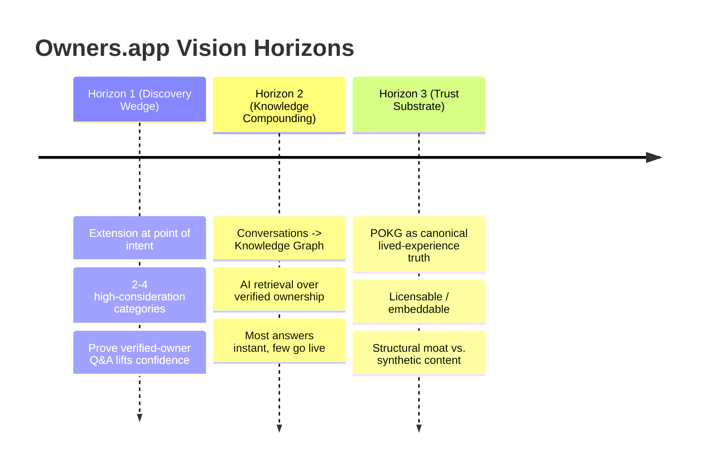

---

## Problem Statement

Shoppers making **high-consideration purchases** (durable goods, gear, appliances, tools, baby/pet,
hobbyist equipment, etc.) face a *trust and specificity gap*:

- They have **specific, contextual questions** ("Will this fit a 2014 Tacoma?", "Does the app still
  work after the latest firmware?", "Is it loud enough to wake a light sleeper?") that generic
  content cannot answer.
- The information that *would* answer them lives in the heads of people who **actually own and use
  the product** — but that knowledge is fragmented across forums, comment sections, video
  descriptions, and private group chats, or simply never written down.
- The most accessible signals — **star ratings and reviews** — are increasingly **untrustworthy,
  unverifiable, stale, and gameable**.

The result: decision paralysis, returns, regret, and a reliance on whichever voice is loudest or
most incentivized rather than most *experienced*.

### Why traditional reviews are insufficient

| Failure mode | What goes wrong | Consequence for the shopper |
|---|---|---|
| **Unverifiable authorship** | Reviewer may never have owned/used the product. | Can't weight the opinion; trust is a coin flip. |
| **Incentivized & fake content** | Seeded, paid, vote-manipulated, or AI-generated reviews. | Ratings are inflated; bad products look fine. |
| **Static & one-directional** | A review is frozen at the time of writing; you can't ask follow-ups. | Your *specific* question stays unanswered. |
| **Survivorship & recency bias** | Reviews cluster at purchase time, not after long-term use. | Longevity/durability questions go dark. |
| **Aggregate hides the relevant case** | A 4.3★ average buries the one review from someone in your exact situation. | High effort to find the answer that matters to *you*. |
| **No accountability or reputation** | Anonymous reviewers have nothing at stake. | No reason to be accurate, no recourse if wrong. |
| **AI synthetic flooding** | Generative text makes plausible fake reviews trivially cheap. | The signal-to-noise ratio is collapsing. |

> Reviews optimize for *broad coverage of opinions*. High-consideration shoppers need *verified,
> specific, current, and accountable* answers. These are different problems.

### Why real-time verified owner conversations are better

- **Provenance:** The answer comes from someone with a verified relationship to the product (or a
  near-identical variant), so the shopper can weight it appropriately
  (verification mechanics: see [Ownership Verification](#ownership-verification)).
- **Specificity:** A conversation can resolve the shopper's *exact* edge case rather than forcing
  them to pattern-match generic prose.
- **Currency:** Live owners reflect the product *as it is now* (post-firmware, post-redesign,
  after 18 months of wear), not as it was at launch.
- **Bidirectionality:** Follow-up questions converge on the real decision driver fast.
- **Accountability & reputation:** Contributors build durable reputation; good answers are rewarded
  and surfaced, bad actors lose standing
  (see: [Reputation & Incentives](#trust-and-reputation) and
  [Fraud & Abuse Defenses](#fraud-prevention-and-moderation)).
- **Reusability:** Each answered question enriches the knowledge graph, so the *next* shopper often
  gets the answer instantly (see: [AI Search & Knowledge](#ai-layer)).

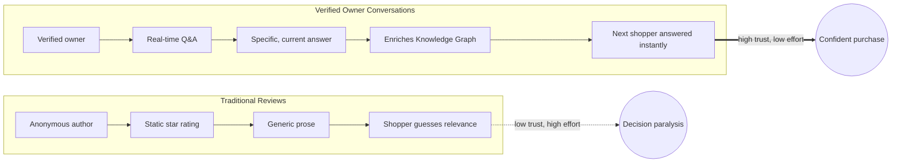

---

## Goals and Non-Goals

### Goals (what success requires us to do)

- **G1.** Capture high-intent shopper questions at the point of purchase with negligible friction.
- **G2.** Verify product ownership cheaply, privately, and fraud-resistantly at meaningful scale.
- **G3.** Build a contributor base of verified owners motivated to answer well and repeatedly.
- **G4.** Convert conversations into a structured, queryable **Product Ownership Knowledge Graph**.
- **G5.** Deliver instant, trustworthy answers to most shoppers via AI retrieval over the graph.
- **G6.** Establish at least one **compliant** monetization path with positive contribution margin
  per engaged shopper that funds contributor rewards.
- **G7.** Maintain answer integrity and trust as the brand's core, measurable asset.

### Non-Goals (explicitly out of scope, at least initially)

- **N1.** Becoming a general-purpose review site or replacing star ratings everywhere.
- **N2.** Being a marketplace / reseller / inventory holder (we are not selling the products).
- **N3.** A general social network or messaging app; conversations are purpose-bound to product help.
- **N4.** A pay-per-answer expert marketplace where shoppers pay owners directly (initially) — the
  default model is commerce-funded rewards, not shopper-paid consultations.
- **N5.** A generic AI shopping chatbot that invents opinions; our AI is grounded in verified
  ownership, not free-floating generation.
- **N6.** Broad multi-category coverage on day one; we deliberately start narrow (see [§9](#market-wedge--expansion-path)).
- **N7.** Owning checkout/payments for the underlying products (we route to retailers/partners).

> **Note on non-goals:** several "non-goals" are *time-bound*, not permanent (e.g., N4 paid
> consultations could become an opt-in tier later). They are excluded now to protect focus and
> incentive integrity.

---

## Personas and Jobs to Be Done

### Demand side — Shoppers

| Persona | Context | Primary JTBD | Anxiety we remove |
|---|---|---|---|
| **High-Consideration Hank** | About to spend meaningful money on a durable/technical product. | "Help me confirm this specific product fits my specific situation before I commit." | Buyer's remorse, returns, wrong fit. |
| **Edge-Case Erin** | Has an unusual constraint (compatibility, size, environment, accessibility). | "Tell me whether it works for *my* edge case, which generic reviews ignore." | Wasting money on something that won't work for her. |
| **Skeptical Sam** | Distrusts ratings; suspects fake reviews. | "Give me a source I can actually believe." | Being manipulated by incentivized content. |
| **Longevity Lena** | Cares about durability/repairability/total cost of ownership. | "Tell me what this is like after 1–3 years, not at unboxing." | Buying something that fails early. |

**Shopper JTBD (canonical):** *"When I'm about to make a high-consideration purchase, I want a
trustworthy, specific answer from someone who actually owns it, so I can decide with confidence and
without regret."*

### Supply side — Contributors / Verified Owners

| Persona | Motivation | Primary JTBD | What would make them quit |
|---|---|---|---|
| **Helpful Helen** | Intrinsic: enjoys helping, identity as the "go-to" expert. | "Let me share what I know and be recognized for it." | Feeling used, spammed, or unrecognized. |
| **Reward-Seeking Raj** | Extrinsic: wants to earn from knowledge he already has. | "Let me monetize my real ownership experience fairly." | Opaque/unfair rewards; feeling like a salesperson. |
| **Enthusiast Ellie** | Community/status: hobbyist who lives in the category. | "Connect me with people who care about this as much as I do." | Low-quality questions, toxic interactions. |
| **Pro/Prosumer Pat** | Professional user (tradesperson, creator) with deep, current usage. | "Let my professional experience reach buyers credibly." | Reputation diluted by spam; no differentiation from amateurs. |

**Contributor JTBD (canonical):** *"When someone needs help with a product I truly own and
understand, I want to answer credibly, build a reputation, and be fairly rewarded — without
becoming a shill."*

### Partner side (secondary persona, detailed later)

- **Brands/Retailers/Affiliate partners:** want qualified, high-intent shoppers and authentic
  advocacy — but must not be allowed to buy favorable answers
  (mechanics and guardrails: see [Commerce, Privacy & Legal](#commerce-layer)).

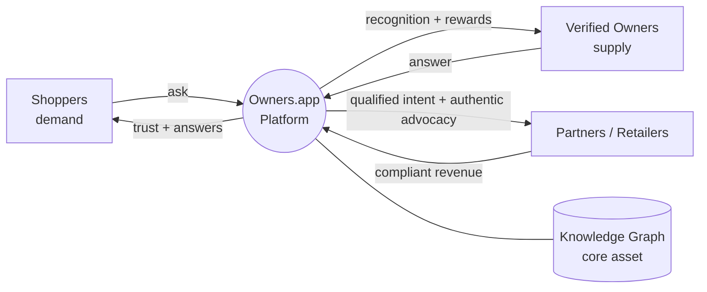

> This is a **multi-sided marketplace with a data flywheel**: more verified answers → more shopper
> trust → more shopper questions → more reasons for owners to participate → a richer graph → cheaper
> instant answers → better margins → bigger rewards → more owners. Cold-start strategy is the hard
> part (see: [§9](#market-wedge--expansion-path) and [Roadmap & Operations](#roadmap)).

### Detailed Personas: representative scenarios

> Concrete scenarios that the rest of the document (UX, trust, AI) should satisfy.

- **Scenario A (instant graph answer):** Erin is on a retailer page for a roof rack. The extension
  recognizes the product and shows a verified-owner answer already in the graph: "Yes, fits a 2014
  Tacoma with the OE crossbars; you'll need the X adapter." She buys with confidence; no live human
  was needed. *(Tests: product recognition, graph retrieval, provenance display.)*
- **Scenario B (routed live question):** Hank asks a novel question ("Does the companion app still
  push firmware after the 2026 update?"). No graph answer exists; the platform routes it to verified
  owners who opted into live answering for this product. Raj answers in minutes and earns reputation
  (and, if applicable, a compliant reward). The Q&A is added to the graph. *(Tests: routing, live
  notification, reward attribution, graph write-back.)*
- **Scenario C (fraud attempt):** A brand tries to seed fake "owners" to praise a product. Ownership
  verification + anomaly detection flag the accounts; reputation gating prevents their answers from
  surfacing. *(Tests: verification robustness, fraud defenses — see
  [Fraud & Abuse Defenses](#fraud-prevention-and-moderation).)*

### Persona-to-Surface Mapping (UX View)

| Persona | Primary JTBD | Key surface | Success signal |
| --- | --- | --- | --- |
| **Shopper "Sam"** | "Before I buy, get a real answer from someone who owns this." | Extension sidebar on retailer PDP | Asks a question, receives a trusted answer, buys (or skips) with confidence |
| **Verified Owner "Olivia"** | "Help others and earn a share when my knowledge drives a purchase." | Owner dashboard + chat | Answers questions, earns reputation, receives compliant payout |
| **Long-term Owner "Leo"** | "Share how this product held up after 18 months." | Ownership updates / review prompts | Posts a durability update that gets surfaced on the PDP |
| **Researcher "Riya"** | "Compare 3 options across real ownership experience." | AI Research Assistant | Gets a synthesized, cited comparison grounded in owner answers |
| **Moderator "Mara"** | "Keep answers honest, on-topic, and safe." | Moderation surfaces | Resolves flags quickly with full context |
| **Brand rep "Bram"** (optional) | "Officially answer and correct misinformation." | Verified brand seat | Posts labeled official answers |

---

## Core Product Principles

These are durable decision rules. When in doubt, apply them in order.

1. **Verification before volume.** A smaller corpus of *verified* lived-experience answers beats a
   large corpus of unverifiable ones. Never trade provenance for raw quantity.
2. **Helpfulness is the product; monetization funds it.** Commerce revenue exists to reward
   contributors and sustain the platform — it must **never** bias which answers are surfaced or how
   owners answer (see: [Incentive Integrity](#incentive-system)).
3. **Conversations become knowledge.** Every interaction should leave the graph richer; ephemeral
   one-to-one help that isn't captured is a missed compounding opportunity.
4. **AI retrieves and summarizes; it does not impersonate ownership.** Generated content must be
   clearly labeled and grounded in verified contributions — never fabricate an "owner."
5. **Reputation must be earned and losable.** Standing reflects demonstrated, verified helpfulness;
   it can be lost through low quality or abuse (see: [Reputation & Incentives](#trust-and-reputation)).
6. **Default to the shopper's interest.** When the shopper's interest and a partner's interest
   conflict, the shopper wins. This is a brand-survival rule, not a nicety.
7. **Privacy and consent are non-negotiable.** Ownership verification and browsing context are
   sensitive; collect the minimum, be explicit, and never sell shopper identity
   (see: [Privacy & Data Governance](#privacy-and-security)).
8. **Latency is trust.** "Real-time" means the experience feels responsive even when a live human is
   involved; degrade gracefully to instant graph answers when humans aren't available.
9. **Disclose everything monetized.** Affiliate relationships, sponsorships, and rewards must be
   transparently disclosed (compliance posture deferred to
   [Commerce, Privacy & Legal](#commerce-layer)).
10. **Compounding over flash.** Prefer decisions that increase the long-run value of the graph over
    those that spike a vanity metric.

---

## Market Wedge and Strategy

### Strategic Thesis: the Browser Extension is the Discovery Layer, Not the Product

A foundational, easy-to-misread claim:

> **The browser extension is a customer-acquisition and demand-capture mechanism. The product is the
> verified-ownership knowledge graph and the trust system around it.**

Why this distinction is load-bearing:

1. **Near-zero-CAC demand at the point of intent.** Shoppers self-identify high intent by being on a
   product page. Meeting them there with "Ask a verified owner" captures demand without paid
   acquisition — the cheapest possible top-of-funnel
   (extension behavior: see [Browser Extension UX](#browser-extension)).
2. **The extension is replaceable; the graph is not.** Surfaces change (apps, in-retailer widgets,
   AI assistants, partner embeds). If we mistake the extension for the product, we build a thin
   overlay that any incumbent can clone. If we build the *graph*, we own an asset that survives any
   single surface.
3. **Distribution ≠ defensibility.** The extension solves distribution. Defensibility comes from
   **verified person-level ownership provenance** that compounds and that incumbents structurally
   lack (see: [§14 Startup Thesis & Investment Memo](#startup-thesis--investment-style-memo)).
4. **It forces the right metrics.** If the extension were the product, we'd over-index on installs.
   Because it's the discovery layer, we index on *verified answers created, coverage of the graph,
   and shopper outcomes* (see: [§11 Success Metrics](#key-success-metrics--north-star-candidates)).

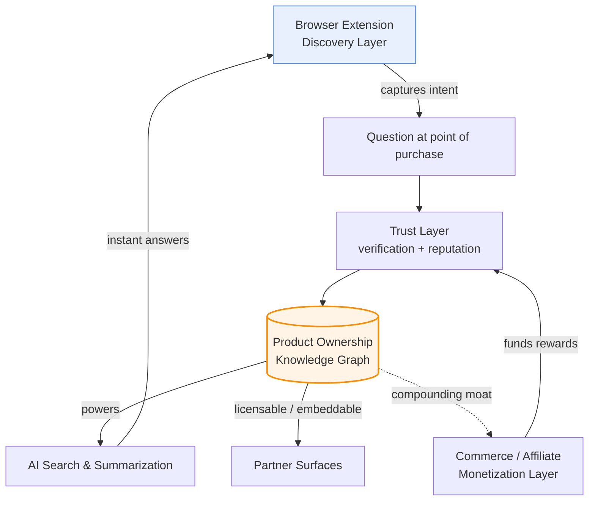

> **Implication for prioritization:** when a roadmap trade-off arises between "make the extension
> slicker" and "increase verified-answer coverage / graph quality," default to the graph
> (see: [Roadmap & Operations](#roadmap)).

### Market Wedge & Expansion Path

#### The wedge: start narrow and high-consideration

Pick **2–4 initial categories** where the pain is acute and verified-owner answers are
disproportionately valuable. Selection criteria:

- **High consideration / high regret cost** (price, complexity, or compatibility risk).
- **Specific, recurring questions** that generic reviews answer poorly.
- **Passionate ownership communities** (a supply of motivated experts already exists).
- **Healthy affiliate/commerce economics** (so the reward loop can be funded compliantly).
- **Reasonable product identity resolution** (we can reliably match a page to a canonical product —
  see [Architecture, Data & APIs](#architecture-overview)).

Illustrative candidate categories (to be validated, not committed): outdoor/adventure gear, power
tools, home automation/smart home, audio equipment, cycling, baby gear, pet products, specialized
kitchen appliances. **Avoid initially:** fast-moving consumables, low-price commodity items, and
heavily regulated categories (health claims, supplements) where compliance risk is high.

#### Expansion vectors

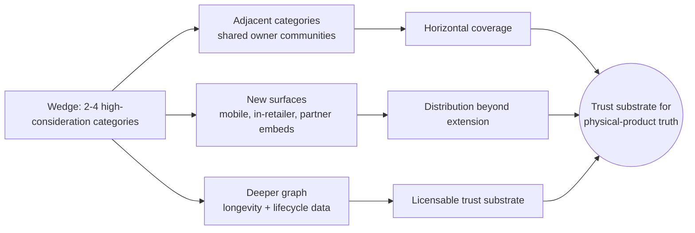

- **Category expansion:** move along shared owner communities and overlapping affiliate networks.
- **Surface expansion:** the discovery layer generalizes from extension → mobile → in-retailer
  widget → partner-embedded → AI-assistant integration. (Reinforces [§4](#strategic-thesis-the-browser-extension-is-the-discovery-layer-not-the-product): the surface is replaceable.)
- **Depth expansion:** enrich the graph with lifecycle/longevity data (post-purchase check-ins),
  increasing the value of answers competitors can't fabricate.
- **Data/licensing expansion (Horizon 3):** the POKG becomes a licensable, embeddable substrate.

#### Why incumbents don't already own this wedge

- **Review sites & marketplaces** are structurally built on *unverified text at scale*; pivoting to
  *verified person-level provenance* fights their existing incentives and content models.
- **Retailers** could verify ownership (they have purchase data) but lack neutral cross-retailer
  trust and the contributor community; shoppers distrust a seller grading its own products.
- **LLM shopping assistants** generate fluent text but have **no verified ownership provenance** —
  they are exactly the synthetic-content problem we counter with verifiable lived experience.

### Canonical Terminology & Product Taxonomy

> This is the **shared glossary** for the entire document; terms below are used consistently
> across all sections (see: [Roadmap](#roadmap) for change control).

| Term | Definition |
|---|---|
| **Owners.app / Verified Owners Platform** | The overall product: extension + community + knowledge graph + trust + commerce. |
| **Shopper** | A demand-side user seeking an answer, typically at point of purchase intent. |
| **Contributor** | Any supply-side user who answers questions or adds knowledge. |
| **Verified Owner** | A contributor whose ownership of a product (or variant) has been verified. |
| **Ownership Verification** | The process/evidence establishing that a contributor owns/used a product. |
| **Ownership Claim** | A contributor's assertion of ownership, pending or backed by verification evidence. |
| **Verification Evidence** | Signals supporting a claim (e.g., receipt, serial, photo, account link) — specifics in [Trust](#ownership-verification). |
| **Product Identity / Canonical Product** | The normalized entity a retailer page maps to (handles variants/SKUs). |
| **Variant / SKU** | A specific purchasable configuration mapped under a canonical product. |
| **Question / Answer (Q&A)** | A shopper question and contributor response; the atomic interaction unit. |
| **Live Answer** | A Q&A answered in real time by an available verified owner. |
| **Graph Answer** | An instant answer retrieved/summarized from prior verified contributions. |
| **Product Ownership Knowledge Graph (POKG)** | The core asset: entities (people, products, claims, Q&As, facts) and their relations. |
| **Reputation** | A contributor's earned, losable standing reflecting verified helpfulness. |
| **Reward** | Recognition/compensation funded by compliant commerce revenue. |
| **Discovery Layer** | The acquisition surface (initially the browser extension) — not the product. |
| **Trust Layer** | Verification + reputation + fraud controls. |
| **Knowledge Layer** | The POKG + AI retrieval/summarization. |
| **Monetization Layer** | Compliant affiliate/partner/commerce revenue funding the system. |
| **North Star Metric (NSM)** | The single metric best correlated with durable value (see [§11](#key-success-metrics--north-star-candidates)). |
| **Coverage** | The share of shopper questions answerable instantly with a trustworthy graph answer. |
| **Trusted Answer** | An answer meeting the quality + provenance bar to be surfaced to shoppers. |

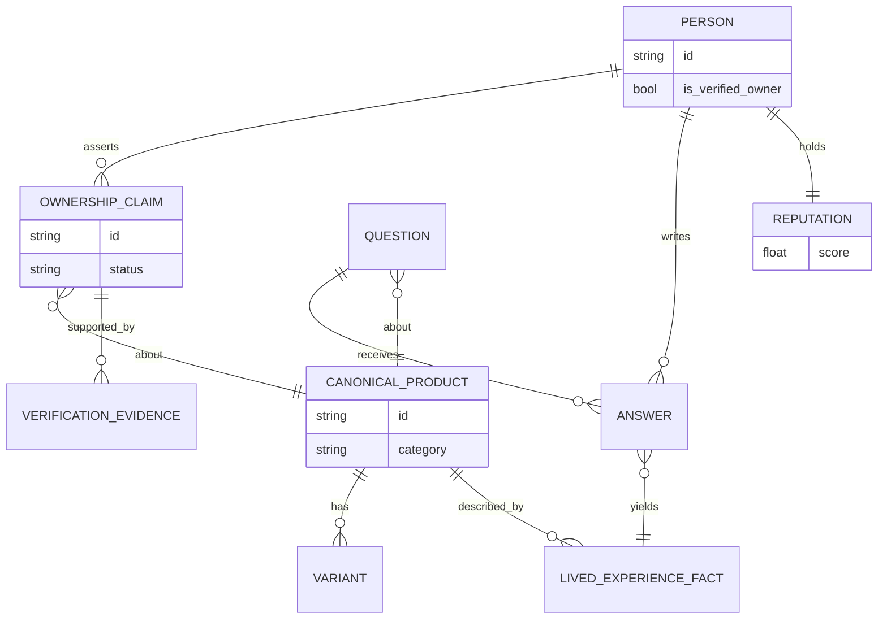

> The detailed, authoritative data model (cardinalities, storage, APIs) is owned by
> [Architecture, Data & APIs](#architecture-overview); the diagram above is the *conceptual*
> taxonomy for strategic alignment only.

### Key Success Metrics & North Star Candidates

#### What we explicitly refuse to optimize

- Raw **extension installs** (vanity; the extension is not the product).
- Raw **answer volume** without provenance/quality (invites fraud and dilution).
- **Affiliate revenue** as a primary objective (would corrupt answer integrity).

#### North Star Metric (NSM) candidates

| Candidate NSM | Why it's a good North Star | Risk / why it might fail |
|---|---|---|
| **Trusted Answers Delivered to Shoppers per week** | Captures the full value chain: a verified-grade answer actually reaching a shopper. Hard to fake without verification + quality bar. | Needs a tight "trusted" definition; could be gamed if the bar slips. |
| **Verified-Owner Answer Coverage (% of shopper questions answered instantly & trustworthily)** | Directly measures the compounding asset; rises as the graph matures. | Denominator (questions) is noisy early; coverage low at cold-start. |
| **Confident Purchase Decisions Influenced** | Closest to true user value (shopper acts with confidence). | Harder to measure/attribute; needs outcome instrumentation. |

> **Recommendation:** lead with **Trusted Answers Delivered to Shoppers / week** as the primary NSM,
> with **Coverage** as the leading indicator of the asset compounding, and **Confident Purchase
> Decisions Influenced** as the value-truth metric we instrument toward. Final selection should be
> reconciled with [Roadmap & Operations](#roadmap).

#### Supporting metric tree

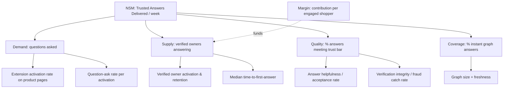

#### Guardrail metrics (must stay healthy)

- **Trust/integrity:** fraud catch rate, fake-ownership false-negative rate, shopper-reported
  "answer was misleading" rate (see: [Fraud & Abuse Defenses](#fraud-prevention-and-moderation)).
- **Incentive integrity:** correlation between reward size and answer sentiment must **not** trend
  toward "paid answers are more positive" (see: [Incentive Integrity](#incentive-system)).
- **Privacy/consent:** consent completion rate, data-minimization adherence
  (see: [Privacy & Data Governance](#privacy-and-security)).
- **Latency:** time-to-instant-answer and time-to-first-live-answer (see: [Browser Extension UX](#browser-extension)).
- **Unit economics:** contribution margin per engaged shopper ≥ 0 at maturity for a category.

### Core Assumptions & Things That Must Be True

Ranked roughly by *risk × impact*. Each should map to an experiment in
[Roadmap & Operations](#roadmap).

| # | Assumption ("must be true") | Risk if false | Confidence | How to validate early |
|---|---|---|---|---|
| **A1** | Shoppers will ask questions at the point of intent (won't just bounce). | No demand → no flywheel. | Medium | Wizard-of-Oz extension; measure ask-rate per activation. |
| **A2** | Enough verified owners will answer for useful coverage in a category. | Supply starvation; cold-start fails. | Medium-Low | Seed a single passionate community; measure answer rate & latency. |
| **A3** | Ownership can be verified cheaply, privately, and fraud-resistantly. | Either too costly or too gameable → trust collapses. | Medium | Prototype multiple verification methods; red-team them. |
| **A4** | At least one **compliant** monetization path yields positive contribution margin. | Can't fund rewards; model is charity. | Medium | Model affiliate/partner economics per category; legal review. |
| **A5** | Verified-owner answers measurably increase shopper confidence/conversion. | Core value prop unproven. | Medium | Holdout test: confidence/conversion with vs. without trusted answers. |
| **A6** | Conversations can be structured into a reusable, queryable graph. | No compounding asset; just ephemeral chat. | Medium-High | Build minimal POKG; measure instant-answer reuse rate. |
| **A7** | AI can retrieve/summarize verified content without fabricating ownership. | Trust + legal risk; brand damage. | Medium-High | Grounded-retrieval prototype with provenance constraints. |
| **A8** | Reward incentives won't corrupt answer integrity (with guardrails). | Becomes pay-for-praise; brand dies. | Medium | Monitor reward↔sentiment correlation; guardrail metric A3/AC-P3. |
| **A9** | We can reliably resolve a retail page to a canonical product. | Wrong matches → wrong answers. | Medium | Product-identity resolution accuracy test (see [Architecture](#architecture-overview)). |
| **A10** | Platform/store policies permit the extension's behavior. | Distribution channel risk. | Medium-Low | Review extension-store & retailer ToS early. |

> **Riskiest cluster:** A1–A5 (demand, supply, verification, money, value). If any of these is
> false, the strategy needs rework, not just iteration. These are the **kill-the-idea-fast**
> experiments.

### Startup Thesis & Investment-Style Memo

> Framed as an internal investment memo. Forward-looking statements are hypotheses, not commitments.

#### Thesis in one paragraph

The trustworthiness of online product information is collapsing precisely as generative AI makes
synthetic content infinitely cheap. The durable counter-asset is **verified, person-level ownership
provenance** — proof that a real human owns a product and what they've actually experienced.
Owners.app acquires that data at the cheapest possible point (a browser extension at purchase
intent), structures it into a **Product Ownership Knowledge Graph**, and monetizes it through
compliant commerce that funds contributor rewards. The graph **compounds**: each verified answer
makes the next shopper's answer instant and cheaper to serve, widening a moat that review sites,
retailers, and LLMs structurally cannot cross because they lack verified ownership provenance.

#### Why now

- **Trust collapse:** fake/incentivized/AI-generated reviews have broken the dominant trust signal.
- **AI duality:** generative AI worsens synthetic noise *and* enables grounded retrieval/summarization
  over verified data — advantage to whoever owns the verified data.
- **Commerce infra maturity:** affiliate/retail-media rails are mature enough to fund a two-sided
  reward model (subject to compliance — see [Commerce, Privacy & Legal](#commerce-layer)).
- **Distribution opening:** browser extensions and emerging assistant surfaces allow meeting shoppers
  at the point of intent without owning the retailer.

#### Why us / why this wins (moat)

1. **Data moat (primary):** verified ownership provenance is *expensive to fake and compounding to
   accumulate*; first credible mover builds an asset that gets better with scale.
2. **Two-sided network effects:** trust attracts shoppers; shoppers attract owners; owners deepen the
   graph; the graph deepens trust.
3. **Workflow/point-of-intent capture:** near-zero-CAC demand at the moment of decision.
4. **Trust brand:** being the *neutral, verified* source is a positioning incumbents (sellers,
   ad-funded review sites) cannot credibly claim.

#### Business model (hypothesis, compliance-gated)

- **Primary:** compliant affiliate/partner/commerce revenue on shopper purchases influenced by
  trusted answers, a portion of which funds contributor rewards.
- **Potential later layers:** brand/partner subscriptions for authentic-advocacy access (guardrailed
  against buying favorable answers); **data licensing** of aggregated, privacy-safe lived-experience
  insights; premium tooling for power contributors.
- **Explicit risk hedge:** *We do not assert that any specific affiliate/partner tactic is
  permissible.* All monetization is contingent on legal/compliance review, platform/retailer terms,
  and disclosure obligations (see: [Commerce, Privacy & Legal](#commerce-layer)). The model
  must also survive guardrail AC-P3 (rewards must not bias answers).

#### Go-to-market

- **Wedge:** 2–4 high-consideration categories with passionate owner communities (see [§9](#market-wedge--expansion-path)).
- **Supply-first cold-start:** seed verified owners from existing enthusiast communities before
  scaling demand, so early shoppers find answers (sequencing owned by
  [Roadmap & Operations](#roadmap)).
- **Land → deepen → expand:** prove value in a category, deepen the graph (incl. longevity data),
  then expand by shared communities, new surfaces, and licensing.

#### Key risks & mitigations

| Risk | Severity | Mitigation |
|---|---|---|
| **Cold-start (chicken-and-egg)** | High | Supply-first seeding; narrow wedge; graph answers reduce live-supply dependence. |
| **Verification gamed / fake owners** | High | Multi-signal verification, reputation gating, anomaly detection (see [Fraud & Abuse Defenses](#fraud-prevention-and-moderation)). |
| **Incentives corrupt integrity** | High | Reward design decoupled from sentiment; guardrail AC-P3; transparency. |
| **Monetization non-compliant / disallowed** | High | Early legal review; multiple revenue paths; disclosure-first (see [Commerce, Privacy & Legal](#commerce-layer)). |
| **Privacy/regulatory exposure** | Medium-High | Data minimization, consent, DPIA (see [Privacy & Data Governance](#privacy-and-security)). |
| **Incumbent fast-follow** | Medium | Lead on verified provenance + neutrality (hard for sellers/ad-funded sites). |
| **Surface/platform dependency** | Medium | Treat extension as replaceable; diversify surfaces early. |
| **AI hallucination / mislabeled provenance** | Medium-High | Grounded retrieval only; strict provenance labeling (AC-P1). |

#### What we need to believe to invest (the crux)

> *Verified ownership provenance is a real, defensible, compounding asset; it can be acquired cheaply
> at the point of intent; and it can be monetized compliantly without corrupting the trust that makes
> it valuable.* If those three hold, the prize is the **canonical trust substrate for physical-product
> truth** — a position no incumbent currently occupies.

#### Milestones / proof points (investment de-risking sequence)

1. **Demand & ask-rate** proven in one category (A1).
2. **Supply & coverage** sustained from a seeded community (A2, A6).
3. **Verification** survives red-team within thresholds (A3, AC-P2).
4. **Value** shown via confidence/conversion holdout (A5, AC-P8).
5. **Compliant unit economics** validated for one category (A4, AC-P7).
6. **Compounding** demonstrated: instant-answer coverage rising cohort-over-cohort (AC-P5).

> Detailed sequencing, owners, and timelines are deferred to
> [Roadmap & Operations](#roadmap).

### Strategy Acceptance Criteria & Quality Bar

This section defines the quality bar for *this strategic foundation*, and the product-level
acceptance criteria the rest of the document must satisfy.

#### Acceptance criteria for the strategy foundation

- **AC-S1.** Positioning is stated in one sentence **and** one paragraph, both consistent.
- **AC-S2.** The "extension is the discovery layer, not the product" thesis is explicit and used as a
  prioritization rule.
- **AC-S3.** Goals **and** non-goals are enumerated and non-contradictory.
- **AC-S4.** Personas exist for **both** demand and supply sides, each with a canonical JTBD.
- **AC-S5.** A market wedge and a multi-vector expansion path are defined with selection criteria.
- **AC-S6.** A primary NSM is recommended with rationale, leading indicators, and guardrails.
- **AC-S7.** A shared glossary/taxonomy is provided for the whole document.
- **AC-S8.** Every monetization claim is hedged and deferred to legal/commercial; no assertion that
  any specific affiliate tactic is definitively permitted.
- **AC-S9.** Core assumptions are listed with the riskiest ones flagged for validation.
- **AC-S10.** Cross-references between sections are present and use in-document anchor links.

#### Product-level quality bar (acceptance criteria the product must meet)

| ID | Acceptance criterion | How we'd verify |
|---|---|---|
| **AC-P1 (Provenance)** | Any answer surfaced to a shopper carries a clear, truthful provenance label (verified owner / graph-summarized / AI-assisted). | Audit a sample of surfaced answers; 100% labeled correctly. |
| **AC-P2 (Verification robustness)** | Ownership verification resists a defined red-team attack budget without exceeding a max fake-acceptance rate. | Red-team exercise vs. target thresholds (see [Trust](#ownership-verification)). |
| **AC-P3 (Incentive integrity)** | Rewards do not measurably bias answer sentiment or surfacing. | Statistical check: reward vs. sentiment/surfacing correlation within bound. |
| **AC-P4 (Latency)** | Instant graph answers render within a target budget; live questions route within a target time. | Performance instrumentation against SLOs (see [Architecture](#architecture-overview)). |
| **AC-P5 (Coverage growth)** | In a launched category, instant-answer coverage trends upward cohort-over-cohort. | Cohort coverage dashboards. |
| **AC-P6 (Privacy/consent)** | No sensitive data collected without explicit, minimal, revocable consent; shopper identity never sold. | Privacy review + DPIA (see [Privacy & Data Governance](#privacy-and-security)). |
| **AC-P7 (Compliance hedge)** | All monetized relationships are disclosed and pass the legal compliance gate before launch. | Legal sign-off checklist (see [Commerce, Privacy & Legal](#commerce-layer)). |
| **AC-P8 (Shopper outcome)** | Shoppers exposed to a trusted answer report higher decision confidence than a control. | Instrumented surveys / holdout comparison. |

---

## Network Effects

Three reinforcing loops drive compounding growth. Detailed network-effect theory lives in (see: [Foundation & Strategy](#executive-summary)); here we define the operational loops we instrument and optimize.

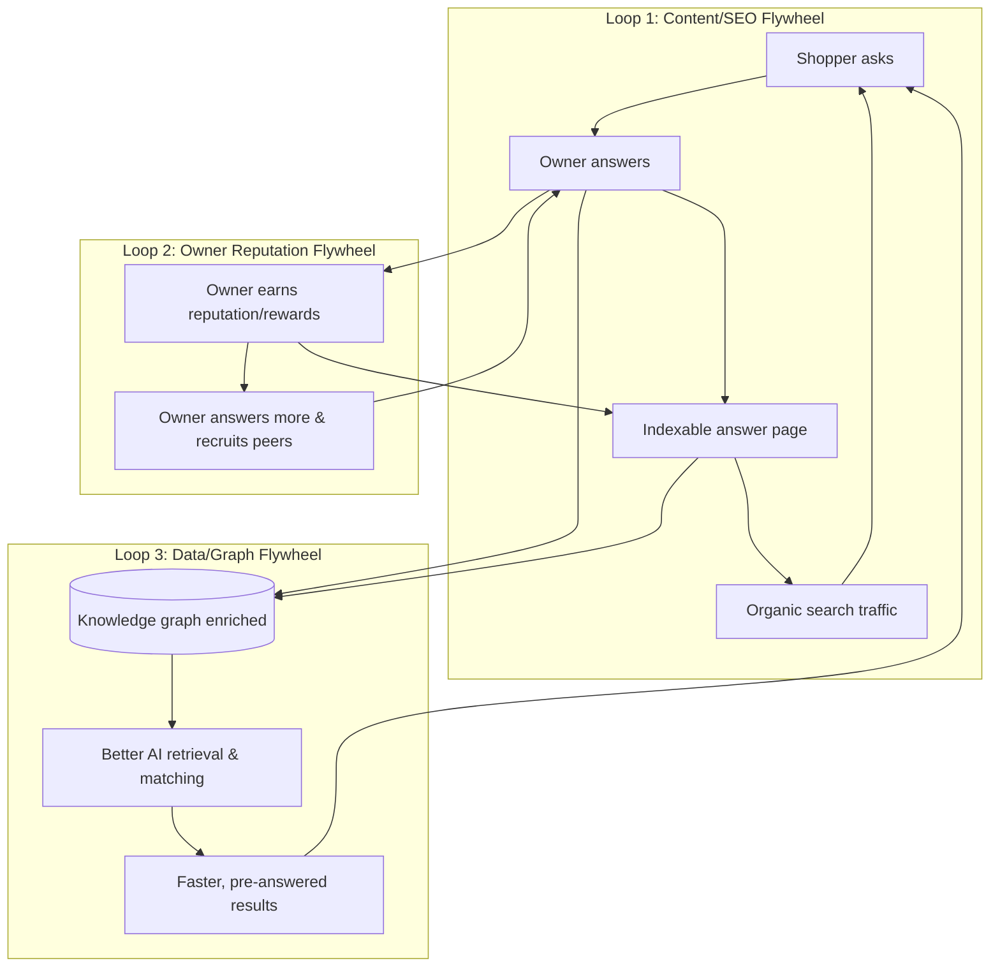

| Loop | Input | Output | Primary KPI | Risk if broken |
|------|-------|--------|-------------|----------------|
| Content/SEO | Q&A | Organic demand | Organic sessions/answer | Paid-only, unsustainable CAC |
| Reputation | Recognition/rewards | More supply | Owner retention | Supply collapse |
| Data/Graph | Structured answers | Reuse & matching | % intents deflected | No moat, no defensibility |

**Cross-side effect:** more verified owners → faster/better answers → more shoppers → more questions → more reputation & data → more owners. Liquidity is measured **per category** (see: [Metric Tree](#metric-tree)).

---

## User Journeys

### Experience Principles

These principles govern every screen decision in this section.

1. **Owner answers beat opinions.** The UI must always make it visually obvious whether information comes from a *verified owner*, *the community*, *the brand*, or *AI synthesis*. Provenance is a first-class UI element, never a footnote.
2. **Calm by default.** The extension is silent until it has something genuinely useful. No autoplay, no nags, no interstitials over checkout.
3. **Consent precedes capability.** Nothing reads page content, product IDs, or purchase history until the user grants the specific permission for that capability (see: [Privacy and Consent](#privacy-and-security)).
4. **One identity, two surfaces.** The extension and the website share one account, one reputation, and one notification stream. Context follows the user.
5. **Disclosure is non-negotiable.** Any monetized link, affiliate relationship, or sponsored answer is labeled inline at the point of interaction (see: [Commerce Layer](#commerce-layer)).
6. **Cold start is a feature, not an apology.** Empty states actively recruit the first owners and route questions to the AI assistant with honest "no verified owner yet" framing.
7. **Accessibility is acceptance criteria.** WCAG 2.2 AA is a gate, not a stretch goal.

### Journey A: Shopping and Discovering Owners

**Goal:** A shopper on a retailer product page learns that verified owners are available *without* being interrupted.

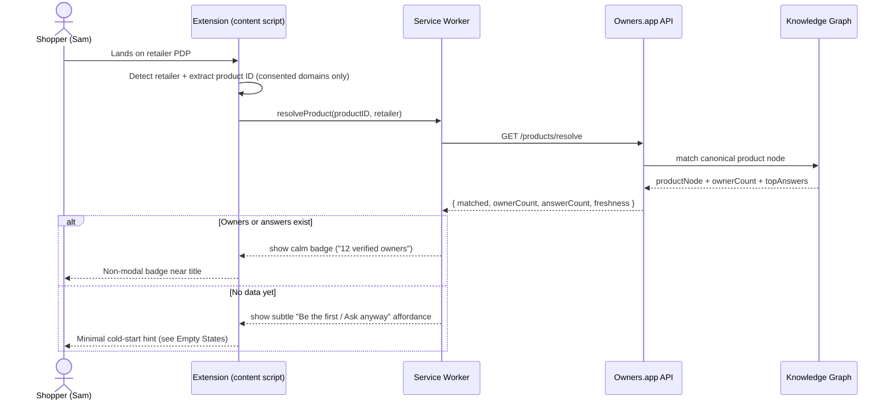

**Acceptance criteria**

- AC-A1: Badge renders only after a confirmed product match; no badge on non-product or ambiguous pages.
- AC-A2: Product resolution completes within 800 ms p75 or the badge shows a neutral loading state, never a layout shift on the host page.
- AC-A3: The extension never injects above-the-fold modals or moves host-page checkout elements.
- AC-A4: If the domain is not on the user's allowed list, no page content is read; badge stays dormant (see: [Privacy and Consent](#privacy-and-security)).

**Edge cases**

- Variant products (size/color) map to the same canonical node but answer counts may be variant-scoped — badge shows the broadest accurate count and the sidebar disambiguates.
- Marketplace listings (third-party sellers) may share one product but differ in fulfillment; provenance chips distinguish "product" vs "seller" answers.

### Journey B: Asking a Question

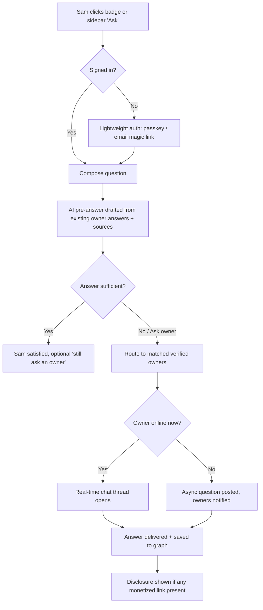

**Why AI-first, owner-backed:** The assistant (see: [AI Research Assistant](#ai-layer)) answers instantly from existing **owner** content so shoppers are never blocked on owner availability, while clearly labeling synthesized vs. owner-authored content. The "still ask an owner" path always remains.

**Acceptance criteria**

- AC-B1: Asking requires the minimum identity needed to prevent spam (passkey or verified email); no full profile required to ask.
- AC-B2: Every AI pre-answer cites its owner-answer sources and is labeled `AI summary of owner answers`.
- AC-B3: When routed to owners, the UI shows expected response time honestly ("typically replies in ~2h"), derived from owner history.
- AC-B4: Monetized links inside any answer carry an inline disclosure and are visually distinct (see: [Commerce Layer](#commerce-layer)).

**Edge cases**

- No matching owner: fall back to AI + offer to notify Sam when an owner verifies for this product.
- Toxic/abusive question: blocked pre-send with reason; repeated attempts throttled (see: [Fraud Prevention](#fraud-prevention-and-moderation)).
- Question contains PII (serial numbers, address): inline warning + optional redaction before posting.

### Journey C: Becoming a Verified Owner

See [Onboarding and Verification UX](#onboarding-and-verification-ux) for screen-level detail; the verification *logic* and trust tiers are owned by (see: [Ownership Verification](#ownership-verification)).

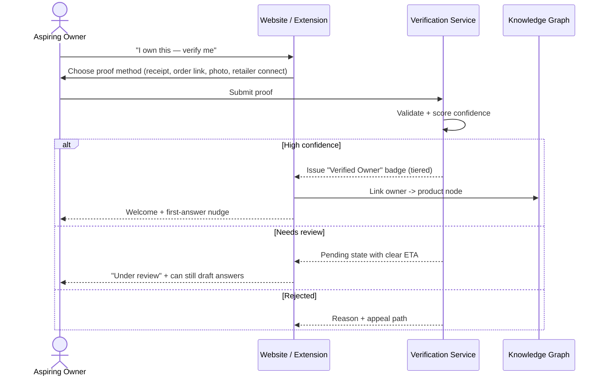

**Acceptance criteria**

- AC-C1: At least one privacy-preserving proof method exists (e.g., redacted receipt upload) that does not require connecting a retailer account.
- AC-C2: Verification status is always one of `verified`, `pending`, `rejected`, or `expired`, each with a plain-language explanation.
- AC-C3: Proof artifacts are minimized, encrypted, and never shown publicly; only the resulting badge tier is public (see: [Privacy and Consent](#privacy-and-security)).

### Journey D: Long-Term Ownership Updates

Ownership is durable; the platform's differentiator is **time**. Owners are re-engaged at meaningful intervals to capture longevity data.

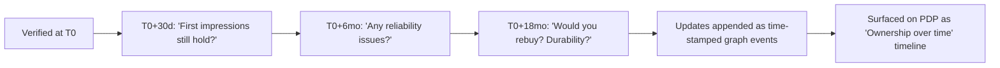

**Acceptance criteria**

- AC-D1: Re-engagement prompts are opt-in, rate-limited (max cadence configurable, default ≤1/month), and easy to snooze or stop forever.
- AC-D2: Each update is timestamped and shown on a longevity timeline; stale answers are visually de-emphasized (see: [Knowledge Graph](#product-knowledge-graph)).
- AC-D3: Negative durability updates are never suppressed or down-ranked for commercial reasons (see: [Fraud Prevention](#fraud-prevention-and-moderation)).

### Journey E: Contributor Payouts

The economics, attribution windows, and compliance gates live in (see: [Commerce Layer](#commerce-layer)). The UX here makes earnings **legible and trustworthy**.

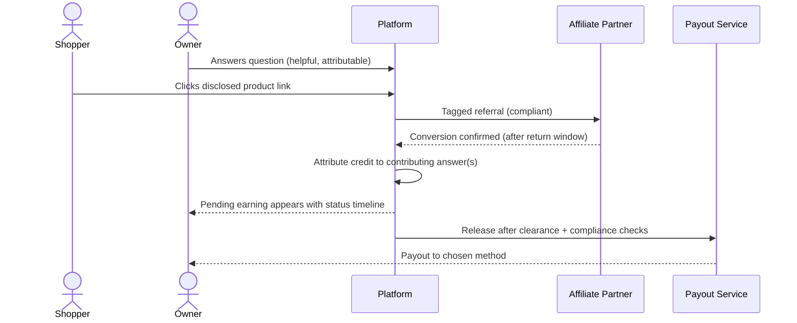

**Acceptance criteria**

- AC-E1: Every earning shows a status (`pending`, `clearing`, `available`, `paid`, `reversed`) with the reason and the return/clearance window.
- AC-E2: The exact attribution rationale ("your answer to Q#123 contributed") is viewable; no opaque lump sums.
- AC-E3: Disclosures shown to the shopper are logged and surfaced in the owner's earning detail for transparency.
- AC-E4: Payout requires the owner to have completed tax/compliance steps; UI blocks payout with a clear checklist, never silently withholds.

**Edge cases**

- Reversed conversion (return/chargeback): earning moves to `reversed` with explanation; no negative balance traps for first-time contributors per policy (see: [Commerce Layer](#commerce-layer)).
- Multiple answers contribute: credit-splitting is shown transparently.

### Journey F: AI-Assisted Product Research

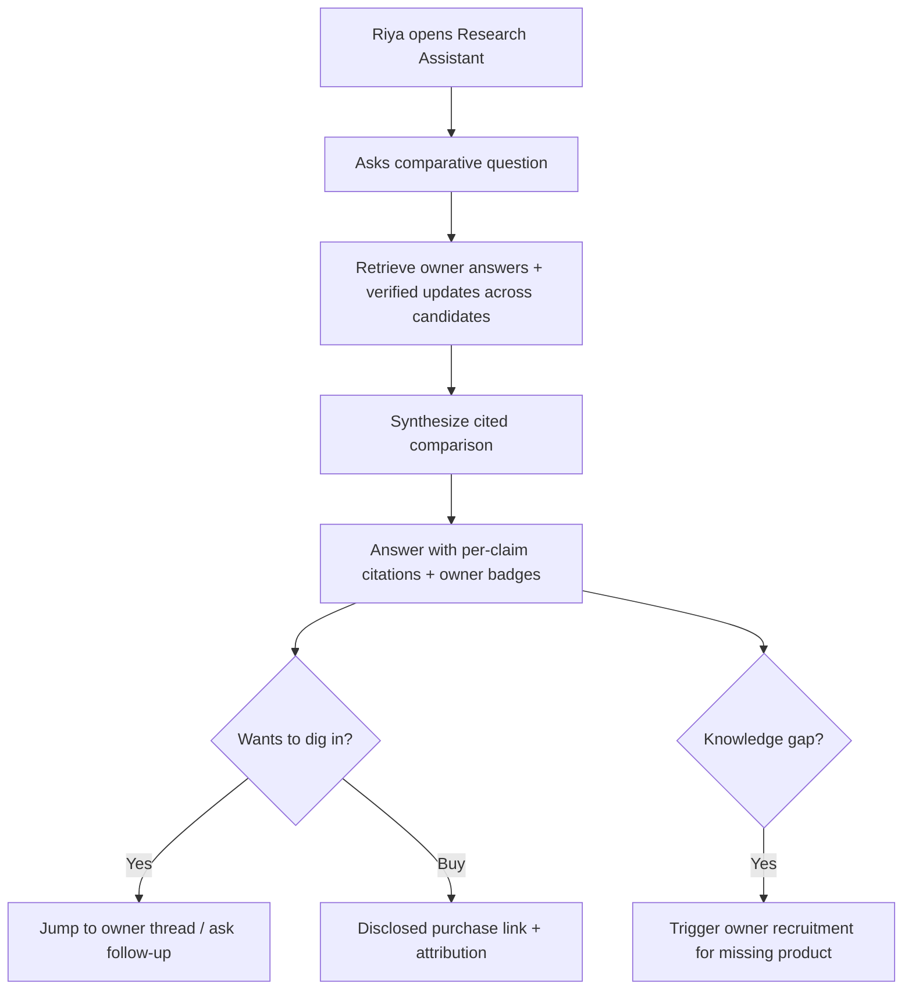

**Acceptance criteria**

- AC-F1: Every claim in a synthesized answer links to its source (owner answer, update, or external doc) (see: [AI Research Assistant](#ai-layer)).
- AC-F2: The assistant explicitly states uncertainty and coverage gaps ("Only 2 verified owners for Product X").
- AC-F3: Sponsored or affiliate results, if any, are segregated and labeled; ranking is never silently pay-for-placement (see: [Commerce Layer](#commerce-layer)).

---

## Browser Extension

### Surface Map

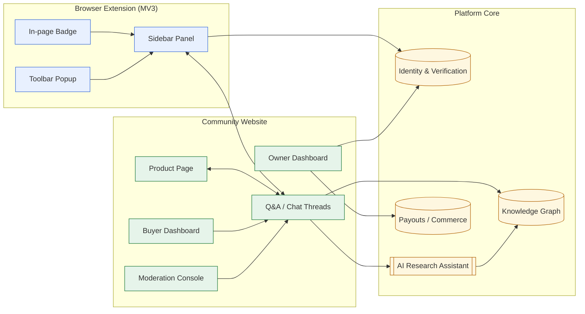

The **extension** is the acquisition surface (it meets shoppers where they already are). The **website** is the depth surface (durable threads, dashboards, research). The **core** services are detailed in other sections (see: [Architecture Overview](#architecture-overview), [Product Knowledge Graph](#product-knowledge-graph)).

This describes the extension as the **user perceives and controls it** — the engineering contract is in [Architecture Overview](#architecture-overview) and [Backend Services](#backend-services).

### Manifest V3 assumptions

- **Service worker** (event-driven, ephemeral) handles product resolution, auth token exchange, and messaging; no persistent background page.
- **Content scripts** are injected only on user-approved retailer domains and only read the DOM needed to extract a product identifier.
- **Permissions are scoped and incremental**: `activeTab` + per-site host permissions requested via `optional_host_permissions`, not a blanket `<all_urls>` grant at install.
- **Side Panel API** powers the sidebar; the toolbar **action popup** offers quick status and settings.
- **`declarativeNetRequest`** (not blocking webRequest) is used sparingly and only for affiliate link decoration on disclosed, consented flows.
- **Storage**: `chrome.storage.session` for transient page context; `chrome.storage.local` for settings; auth secrets held by the service worker, never in page context.

### Detection and product ID extraction

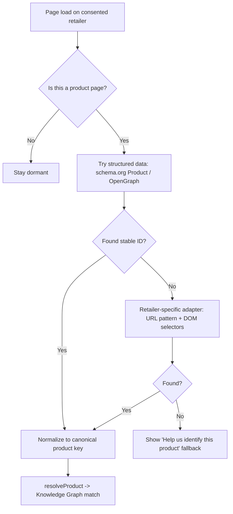

- Prefer **structured data** (`schema.org/Product`, `gtin`, `mpn`, `sku`, OpenGraph) before brittle DOM scraping.
- **Retailer adapters** encapsulate per-site quirks; failures degrade gracefully to a manual "identify product" affordance rather than guessing.
- Normalization maps retailer SKUs to a **canonical product node** (see: [Knowledge Graph](#product-knowledge-graph)).

### Sidebar, badges, and popup

- **In-page badge:** a single, calm chip near the product title (e.g., "12 verified owners · 34 answers"). Click opens the sidebar. Never overlaps host CTAs; respects host page reflow.
- **Sidebar (Side Panel):** the full Q&A surface — search existing answers, ask, watch live owner presence, follow up. Fully keyboard navigable and screen-reader labeled.
- **Toolbar popup:** account status, per-site permission toggles, notification summary, and a global "pause Owners.app on this site" switch.

### Safe behavior boundaries (hard rules)

- **Never** read page content on non-consented domains.
- **Never** auto-submit, auto-fill, or interact with the host page's cart/checkout.
- **Never** exfiltrate full page HTML; only the minimal product identifiers and the fields the user explicitly shares.
- **Never** rewrite host page links silently; affiliate decoration only on explicit, disclosed user action (see: [Commerce Layer](#commerce-layer)).
- **Always** make the extension's presence and current permission scope inspectable from the popup in one click.

**Acceptance criteria**

- AC-X1: Fresh install requests *no* host permissions; the first per-site grant is explicit and revocable.
- AC-X2: With the extension paused on a site, zero network calls reference that site's content.
- AC-X3: Sidebar passes automated axe-core checks with no critical violations.
- AC-X4: CPU/memory budget: content script idle cost negligible; no measurable jank (>50ms long tasks) on host scroll.

### Wireframes

#### PDP (desktop) — ASCII

```text
+---------------------------------------------------------------+
|  [Brand]  Acme Noise-Cancelling Headphones XT          [Save] |
|  [img]    ★ owners' longevity: holds up at 18mo                |
|           Verified owners: 12 · Answers: 34 · Updated 3d ago   |
+---------------------------------------------------------------+
|  ┌─────────────────────────────────────────────────────────┐  |
|  │  Ask a verified owner…                          [ Ask ▸ ]│  |
|  └─────────────────────────────────────────────────────────┘  |
|  AI summary of owner answers (cited)            [show owners] |
+---------------------------------------------------------------+
|  TOP OWNER ANSWERS                                            |
|  ┌───────────────────────────────────────────────────────┐   |
|  │ ✔ Verified owner · Olivia · 14mo owned                 │   |
|  │ "Battery still ~90%. ANC great on planes…"  [helpful 41]│   |
|  └───────────────────────────────────────────────────────┘   |
|  ┌───────────────────────────────────────────────────────┐   |
|  │ ✔ Verified owner · Leo · 6mo owned                     │   |
|  │ "Hinge creaks after a drop…"               [helpful 22]│   |
|  └───────────────────────────────────────────────────────┘   |
+---------------------------------------------------------------+
|  OWNERSHIP OVER TIME   30d ── 6mo ── 12mo ── 18mo →           |
|  LIVE NOW: 3 owners online        OWNERS ALSO CONSIDERED: ... |
+---------------------------------------------------------------+
|  Disclosures: some links are affiliate. Data sources. Privacy |
+---------------------------------------------------------------+
```

#### Extension sidebar (in-page) — ASCII

```text
+--------------------------+   <- Browser Side Panel
| Owners.app        [⚙][x] |
|--------------------------|
| Acme Headphones XT       |
| 12 owners · 34 answers   |
|--------------------------|
| [ Ask a verified owner ] |
|--------------------------|
| Live now: ● Olivia       |
|           ● Leo (away)   |
|--------------------------|
| Top answers              |
| ✔ "Battery ~90% @14mo"   |
| ✔ "ANC excellent…"       |
|--------------------------|
| Disclosure: affiliate ⓘ  |
+--------------------------+
```

#### Mobile PDP — ASCII

```text
+----------------------+
| Acme Headphones XT   |
| ✔12 owners · upd 3d  |
| [longevity: 18mo ok] |
|----------------------|
| AI summary (cited) ▾ |
|----------------------|
| Top owner answers ▾  |
| ✔ Olivia 14mo …      |
| ✔ Leo 6mo …          |
|----------------------|
| Owners online: 3     |
|......................|
| [ Ask an owner   ▸ ] | <- sticky bottom bar
+----------------------+
```

---

## Community Website

### Global IA

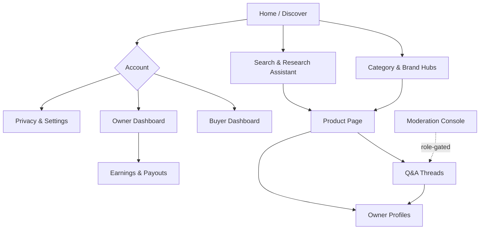

### Product page (PDP) information architecture

Priority order, top to bottom:

1. **Identity strip** — product name, canonical image, brand, key specs, and a **provenance summary** ("X verified owners, last update N days ago").
2. **Ask box** — primary CTA; AI-backed instant answer with owner sourcing.
3. **Top owner answers** — ranked by helpfulness + recency + owner tier (see: [Fraud Prevention](#fraud-prevention-and-moderation)).
4. **Ownership over time** — longevity timeline (Journey D).
5. **Live & recent activity** — owners online now, recent answered questions.
6. **Comparisons** — "Owners also considered…" linking to candidate products.
7. **Disclosures footer** — affiliate relationships, sponsorship state, data sources (see: [Privacy and Consent](#privacy-and-security)).

See full PDP wireframe in [Wireframes](#wireframes).

### Real-Time Chat and Q&A Experience

#### Presence and routing

- **Owner presence states:** `online`, `away`, `typically replies in ~Nh`, `offline`. Presence is privacy-respecting (no precise last-seen timestamps shown publicly).
- **Routing:** a question fans out to matched owners by product node, owner tier, topic affinity, and current availability — without spamming all owners (see: [Fraud Prevention](#fraud-prevention-and-moderation)).

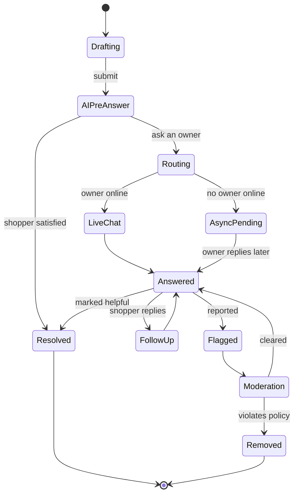

#### Async follow-up and notifications

- Questions never expire silently; if no owner answers within an SLA window, the shopper is offered AI synthesis + an owner-recruitment trigger.
- **Notifications** are unified across surfaces (extension popup badge, website bell, optional email/push) and **batched** to avoid fatigue. Each notification states *why* it was sent and links to one-tap preferences.

#### Moderation surfaces

- **Inline flag** on every answer with structured reasons (off-topic, incorrect, undisclosed promotion, harassment, PII).
- **Moderation console** (role-gated) shows the flagged item with full thread context, owner verification tier, edit history, and prior moderation actions.
- **Owner self-correction:** owners can edit/retract answers; the system keeps a visible, tamper-evident edit trail.

**Acceptance criteria**

- AC-CH1: Live chat messages deliver in <1s p95 when both parties are online; degraded networks fall back to async without data loss.
- AC-CH2: Every answer exposes provenance (owner tier / AI / brand) and timestamp.
- AC-CH3: A shopper can always reach a non-AI owner answer path when an owner exists.
- AC-CH4: Flagged content is hidden pending review only for high-severity categories (harassment, PII, illegal); low-severity stays visible with a flag marker to avoid censorship-by-flag.

### Onboarding and Verification UX

#### First-run (shopper)

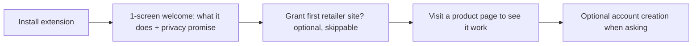

- The first run explains value and the **privacy-forward defaults** in one screen, then gets out of the way. No account required to browse.

#### Verification (owner)

- **Method chooser** with a clear privacy/effort tradeoff per method:
  - Redacted receipt upload (privacy-preserving, manual-ish)
  - Order confirmation link/email parse (consented)
  - Retailer account connect (fastest, most data — clearly labeled scope)
  - Photo of product + serial (for certain categories)
- **Progressive trust:** users can start contributing in a `pending` state with answers held or labeled until verification clears, reducing drop-off while protecting trust (see: [Ownership Verification](#ownership-verification)).
- **Status transparency:** a persistent verification card shows current tier, what raises it, and expiry/re-verification timing.

**Acceptance criteria**

- AC-V1: Onboarding completable with keyboard only and via screen reader.
- AC-V2: No verification method is mandatory; at least one path avoids connecting external accounts.
- AC-V3: Every requested data element shows *why it's needed* and *how long it's retained* at the point of request (see: [Privacy and Consent](#privacy-and-security)).

### Buyer and Owner Dashboards

#### Buyer dashboard

- **Watched products** and saved questions with answer notifications.
- **Your questions** with status (answered, awaiting owner, AI-answered).
- **Purchases / interests** (only what the user chose to share) feeding better recommendations.
- **Privacy center** shortcut: per-site permissions, data export, delete.

#### Owner dashboard

- **Your verified products** with badge tiers and re-verification reminders.
- **Inbox / routed questions** with availability toggle and canned-but-editable starters.
- **Reputation** breakdown (helpfulness, accuracy, longevity contributions) (see: [Fraud Prevention](#fraud-prevention-and-moderation)).
- **Earnings** with the status timeline from [Journey E](#journey-e-contributor-payouts) and compliance checklist (see: [Commerce Layer](#commerce-layer)).
- **Longevity prompts** queue (Journey D).

**Acceptance criteria**

- AC-DB1: Earnings figures reconcile to per-answer attribution and never display a number the owner can't drill into.
- AC-DB2: Availability toggle instantly affects routing and presence.
- AC-DB3: Both dashboards expose a one-click path to pause all activity and to export/delete data.

### Mobile and Responsive Considerations

- **Extension is desktop-class**, but the **website is mobile-first**. On mobile, the "extension sidebar" experience is delivered via:
  - A **PWA** and share-sheet target ("Share to Owners.app") so a shopper can send a product URL/link from a retailer app and get the same resolve→answer flow.
  - Deep links from notifications back into the relevant thread.
- **Responsive breakpoints:** single-column PDP on small screens with the **Ask box pinned** as a sticky bottom bar; answers in a collapsible accordion; longevity timeline becomes horizontally scrollable.
- **Touch targets** ≥44×44px; chat composer avoids covering the latest message; safe-area insets respected.
- **Offline/poor network:** queued questions and optimistic UI with clear "will send when online" state.

**Acceptance criteria**

- AC-M1: PDP is fully usable at 320px width with no horizontal scroll of primary content.
- AC-M2: Sticky Ask bar never obscures disclosures or the most recent chat message.
- AC-M3: Share-sheet flow resolves a product and reaches the Ask box in ≤3 taps.

### Accessibility and Internationalization

#### Accessibility (target: WCAG 2.2 AA)

- Full **keyboard operability** for sidebar, chat, ask box, and dashboards; visible focus rings; logical tab order.
- **Screen reader semantics:** ARIA live regions for incoming chat/presence updates (polite, not assertive, except urgent moderation prompts); labeled provenance badges read as text ("Verified owner answer").
- **Color is never the only signal** for provenance, status, or disclosure — icons + text accompany color.
- **Motion:** respect `prefers-reduced-motion`; presence pulses and typing indicators degrade to static.
- **Contrast:** ≥4.5:1 body, ≥3:1 large text and UI components.
- **Captions/transcripts** for any video answers; alt text required on image answers (assistive prompt provided).

#### Internationalization & localization

- **Unicode/RTL-ready** layouts; mirrored UI for RTL locales.
- **Localized number/currency/date** formatting, critical for earnings and payouts (see: [Commerce Layer](#commerce-layer)).
- **Translation of owner answers:** on-demand machine translation clearly labeled as translated, with original always one tap away to preserve trust.
- **Locale-aware product resolution:** the same product across regional retailers maps to the canonical node while preserving region-specific availability/disclosures.

**Acceptance criteria**

- AC-AX1: Zero critical/serious axe-core violations on PDP, sidebar, chat, and dashboards.
- AC-AX2: All interactive elements reachable and operable by keyboard and screen reader.
- AC-I18N1: No hard-coded user-facing strings; all via the i18n catalog.
- AC-I18N2: RTL layout verified for PDP and chat; translated content labeled.

### Empty States and Cold-Start UX

The platform's hardest problem is the first owner for any given product. UX must turn emptiness into **recruitment and honesty**, never a dead end.

| Situation | What the user sees | Active behavior |
| --- | --- | --- |
| Product matched, **no owners yet** | "No verified owners yet — be the first, or ask and we'll find one." | Offer ownership verification; allow asking → AI answer from docs/specs + queue for future owners |
| Product matched, **owners but no answer to this Q** | AI synthesis + "Notify me when an owner answers" | Route to owners async; trigger targeted recruitment |
| **No product match** | "Help us identify this product" with prefilled guess | Crowd-assisted identification feeds the graph (see: [Knowledge Graph](#product-knowledge-graph)) |
| **No owners online** | "Owners typically reply in ~Nh" + async post | Honest ETA; async notification |
| **New owner, zero answers** | Guided first-answer prompts for their verified products | Reduce blank-page paralysis |
| **New buyer, empty dashboard** | Suggested products from current browsing + watch prompts | Seed engagement without dark patterns |

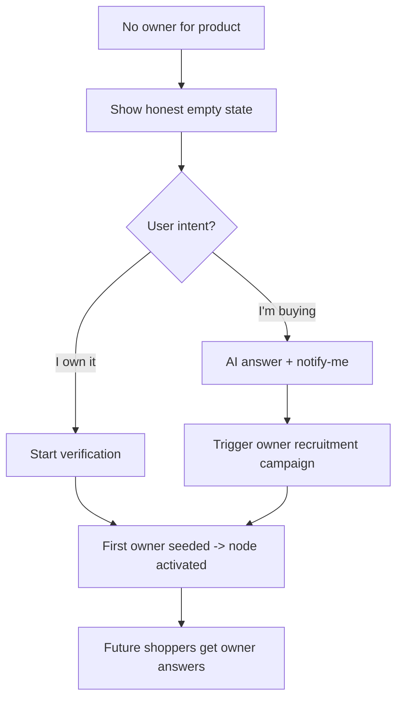

**Acceptance criteria**

- AC-CS1: No empty state is a dead end; each offers at least one forward action (verify, ask, identify, or notify-me).
- AC-CS2: Cold-start framing never implies owners exist when they don't.
- AC-CS3: AI-only answers in cold-start are explicitly labeled as not owner-verified.

### UX Safety, Disclosure, Consent, and Privacy Defaults

These are UX-level commitments; the legal/technical backing is in (see: [Privacy and Consent](#privacy-and-security)) and (see: [Commerce Layer](#commerce-layer)).

#### Privacy-forward defaults

- **Opt-in per site.** No data is read until the user enables Owners.app for that retailer.
- **Local-first context.** Page context stays in `chrome.storage.session` and is discarded when not needed.
- **Data minimization.** Only the product identifier and explicitly shared fields leave the device.
- **No silent tracking.** No cross-site behavioral profiling for ads; the business model is compliant affiliate/partner revenue, disclosed inline (see: [Commerce Layer](#commerce-layer)).
- **One-click pause and revoke** from the popup and the privacy center.
- **Transparent retention.** Each data type shows its retention period at collection time.

#### Disclosure & consent surfaces

```mermaid
flowchart TD
    subgraph Consent Moments
        C1[Install: what we do, what we don't]
        C2[First site enable: host permission]
        C3[First ask: minimal identity]
        C4[Verification: per-field purpose + retention]
        C5[Monetized link: inline affiliate disclosure]
        C6[Payout setup: tax/compliance consent]
    end
    C1 --> C2 --> C3 --> C4 --> C5 --> C6
```

- **Affiliate disclosure** is inline at the link, not buried in a footer, and is machine-logged for the owner's earning record.
- **Sponsored answers** (if ever allowed) are visually segregated and labeled; ranking integrity is preserved (see: [Fraud Prevention](#fraud-prevention-and-moderation)).
- **AI labeling** is mandatory wherever synthesis appears.
- **PII guards** warn before posting serial numbers, addresses, or order IDs and offer redaction.

**Acceptance criteria**

- AC-S1: A user can see, in ≤2 clicks from any surface, exactly what data Owners.app holds and can export/delete it.
- AC-S2: Every monetized interaction carries a visible, accessible disclosure at the point of action.
- AC-S3: Disabling a site produces zero content reads or network calls referencing that site.
- AC-S4: All consent is granular, revocable, and logged; revoking does not break core browsing.

### Acceptance Criteria and Edge Cases (Consolidated)

#### Cross-cutting acceptance criteria

- **Provenance everywhere:** No answer renders without a provenance label and timestamp.
- **Honesty in scarcity:** Empty/cold-start states never fabricate owner presence.
- **Consent before capability:** No capability activates before its specific consent.
- **Disclosure at the point of action:** Money is always labeled where it appears.
- **Accessibility gate:** AA conformance required to ship any user-facing surface.
- **Reversibility:** Pause, revoke, export, and delete are reachable from every surface.

#### Notable edge cases

| Area | Edge case | UX response |
| --- | --- | --- |
| Detection | Retailer A/B tests DOM | Adapter fails safe to "identify product"; no wrong badge |
| Identity | Same physical owner, multiple accounts | Linked via verification; reputation not double-counted (see: [Fraud Prevention](#fraud-prevention-and-moderation)) |
| Chat | Owner goes offline mid-thread | Converts to async; shopper notified; no message loss |
| Payouts | Conversion reversed post-payout | Status `reversed`, transparent explanation; policy-bound recovery (see: [Commerce Layer](#commerce-layer)) |
| Research | Conflicting owner answers | Assistant surfaces disagreement honestly with both citations |
| i18n | Translated answer changes meaning | Original one tap away; "translated" label persistent |
| Privacy | User revokes mid-session | In-flight context purged; UI returns to dormant |
| Moderation | Coordinated false flags | Low-severity stays visible with marker; pattern flagged to anti-abuse (see: [Fraud Prevention](#fraud-prevention-and-moderation)) |

---

#### Cross-section authority notes

- All UX claims about money, identity, and data retention defer to the authoritative policy in the [Commerce Layer](#commerce-layer), [Privacy and Security](#privacy-and-security), and [Trust and Reputation](#trust-and-reputation) / [Fraud Prevention and Moderation](#fraud-prevention-and-moderation) sections; where conflicts arise, those sections win.

---

## Ownership Verification

### Goals, Principles & Threat Posture

#### Design goals

- **Verify ownership, not identity theater.** A contributor should be trusted in proportion
  to evidence that they actually own and have used a specific product.
- **Reward helpfulness, not positivity.** Payouts and reputation must be neutral to sentiment.
  A blunt "don't buy this" that saves a shopper money is worth more than a glowing upsell.
- **Make manipulation expensive and slow to pay off.** Delayed, clawback-eligible payouts and
  graph-based collusion detection should make fraud net-negative in expectation.
- **Be transparent by default.** Shoppers always see *why* an owner is trusted and *whether*
  any compensation could exist (see: [Transparency & Disclosure Requirements](#transparency--disclosure-requirements)).

#### Core principles

| Principle | Implication |
|-----------|-------------|
| Evidence over assertion | Every trust level maps to verifiable signals, not self-declaration. |
| Defense in depth | No single signal (receipt, email, OAuth) is sufficient on its own at high tiers. |
| Sentiment neutrality | Scoring functions never read positive/negative polarity as a quality input. |
| Adversarial assumption | Assume every reward path will be attacked; design payouts to be reversible. |
| Least privilege for PII | Raw receipts/serials are redacted at rest (see: [Privacy & Security](#privacy-and-security)). |
| Graceful degradation | If a verification provider fails, downgrade confidence; never silently upgrade. |

#### Threat actors (summary)

| Actor | Motivation | Primary vectors |
|-------|-----------|-----------------|
| Incentivized shill | Earn payouts via positive answers | Fake receipts, incentivized positivity, Sybil |
| Brand/agency astroturfer | Manipulate product perception | Collusion rings, brigading, review manipulation |
| Competitor saboteur | Suppress a rival product | Coordinated negativity, harassment, brigading |
| Refund abuser | Buy → answer → return, keep payout | Refund abuse, churned ownership |
| Affiliate fraudster | Harvest commissions | Cookie stuffing, self-referral, attribution theft |
| Sybil farmer | Inflate signals at scale | Account farms, bot networks |

```mermaid
mindmap
  root((Trust & Integrity))
    Verify
      Receipt
      Email parse
      Merchant OAuth
      Manual review
      Serial/Warranty
      Longevity signals
    Score
      Ownership confidence
      Contributor reputation
      Answer helpfulness
    Reward
      Influence attribution
      Delayed payout
      Clawbacks
    Defend
      Fraud detection
      Moderation
      Appeals
```

Verification is **tiered**. Each tier is a set of evidence types with increasing cost-to-forge.
A contributor's **ownership confidence** for a specific product (see:
[Confidence Scoring & Verification Lifecycle](#confidence-scoring--verification-lifecycle)) is derived
from the strongest *and the combination* of evidence presented.

### V0 — Unverified / Self-declared

- Contributor claims ownership; no evidence.
- Answers allowed but flagged **Unverified**; ineligible for payout; minimal graph weight.

### V1 — Receipt upload

- User uploads a photo/PDF of a purchase receipt or order confirmation.
- AI Layer extracts merchant, product, date, price, order ID (see: [AI Layer](#ai-layer)).
- Anti-forgery checks: EXIF/coherence analysis, template/font anomaly detection, duplicate-hash
  detection across the corpus, price/date plausibility vs. catalog.
- Raw image redacted (card digits, address) before storage (see: [Privacy & Security](#privacy-and-security)).

### V2 — Email receipt forwarding / parsing

- User forwards an order-confirmation email to a unique ingest address, **or** grants scoped
  read access (e.g., Gmail API with a narrow query) to detect order confirmations.
- Higher trust than V1: harder to forge because it relies on **provenance** — DKIM/SPF/DMARC
  validation of the originating merchant domain.
- Parser extracts structured order data; mismatched DKIM → reject/quarantine.

### V3 — Merchant OAuth / Order APIs

- User connects a merchant account (Amazon, Best Buy, Shopify stores, etc.) via OAuth or a
  partner order API (see: [Commerce Layer](#commerce-layer)).
- Platform reads order history server-to-server; ownership is **authoritative** and includes
  purchase date, fulfillment status, and (critically) **return/refund status**.
- Strongest automated signal; primary source for refund-abuse defense.

### V4 — Serial / warranty confirmation

- User provides a serial number or registers warranty; platform validates against
  manufacturer registries / partner endpoints.
- Confirms a *specific unit*, enabling per-unit dedupe (one serial → one verified owner at a time).
- Useful for high-value durable goods where receipts are weak proxies.

### V5 — Manual review

- Human reviewer adjudicates ambiguous or high-stakes cases (high payout exposure, disputed
  ownership, appeals). Can confirm, downgrade, or reject.
- Sampled audits also run on automatically-approved items.

### Longevity layer — Long-term ownership signals

- Not a tier but a **multiplier**: evidence accrued *over time* that the contributor still owns
  and uses the product.
- Signals: repeated photo check-ins with consistent unit/wear, firmware/app telemetry opt-in,
  follow-up answers across months, warranty-period span, consistent serial across check-ins.
- Drives **years-owned weighting** in answer scoring (see:
  [Helpful Answer Scoring & Expertise Matching](#helpful-answer-scoring--expertise-matching)).

### Tier comparison

| Tier | Evidence | Forge cost | Payout eligible? | Refund-aware? | PII sensitivity |
|------|----------|-----------|------------------|---------------|-----------------|
| V0 | Self-declared | none | No | No | Low |
| V1 | Receipt image | Low–Med | Conditional | No | Med (redact) |
| V2 | Email + DKIM | Med–High | Yes | Partial | Med (redact) |
| V3 | Merchant OAuth | High | Yes | **Yes** | High (token scope) |
| V4 | Serial/warranty | High | Yes | Partial | Med |
| V5 | Manual review | Very high | Yes | Depends | High |

```mermaid
flowchart TD
    A[Ownership claim] --> B{Evidence provided?}
    B -- none --> V0[V0 Unverified]
    B -- receipt --> C[Receipt OCR + forgery checks]
    B -- email --> D[DKIM/SPF/DMARC validation]
    B -- merchant --> E[OAuth / Order API pull]
    B -- serial --> F[Registry/warranty lookup]
    C --> G[Confidence engine]
    D --> G
    E --> G
    F --> G
    G --> H{Confidence >= threshold?}
    H -- no --> V5[Queue manual review]
    H -- yes --> I[Verified at computed tier]
    V5 --> I
    I --> J[Apply longevity multiplier over time]
```

### Confidence Scoring & Verification Lifecycle

Ownership confidence is a continuous score in `[0, 1]` per `(contributor, product_unit)` pair,
not a binary. It feeds answer weighting, payout eligibility, and graph edge strength
(see: [Knowledge Graph](#product-knowledge-graph)).

#### Confidence model (design sketch)

```text
# Each evidence item has: base_strength, freshness, independence
# Independence prevents stacking correlated evidence (e.g., two photos of one receipt).

function ownership_confidence(evidence_set):
    combined_doubt = 1.0
    for ev in dedupe_by_provenance(evidence_set):
        s = ev.base_strength                      # V1=0.4, V2=0.6, V3=0.9, V4=0.8, V5=0.95
        s *= freshness_decay(ev.age)              # older receipts slightly weaker
        s *= ev.independence_weight               # correlated evidence discounted
        s *= forgery_penalty(ev.signals)          # anomaly score lowers strength
        combined_doubt *= (1.0 - clamp(s, 0, 0.98))
    base = 1.0 - combined_doubt                   # noisy-OR combination
    base *= longevity_multiplier(contributor, product)   # up to +X for sustained ownership
    return clamp(base, 0, 1)
```

Key properties:

- **Noisy-OR** combination: multiple independent evidences raise confidence with diminishing
  returns, and no single weak signal can reach high confidence alone.
- **Forgery penalty** is multiplicative, so a strong fraud signal collapses confidence fast.
- **Refund status from V3** can force confidence toward an "ex-owner" state (see:
  [Fraud & Abuse Prevention](#fraud-prevention-and-moderation)).

#### Verification lifecycle (state machine)

```mermaid
stateDiagram-v2
    [*] --> Unverified
    Unverified --> Pending: evidence submitted
    Pending --> Verified: confidence >= threshold
    Pending --> ManualReview: ambiguous / high-stakes
    ManualReview --> Verified: approved
    ManualReview --> Rejected: insufficient/forged
    Verified --> Reverified: periodic re-check / new evidence
    Reverified --> Verified: still valid
    Verified --> Lapsed: longevity signals expire
    Verified --> Revoked: refund/return or fraud confirmed
    Lapsed --> Pending: new evidence
    Revoked --> [*]
    Rejected --> Unverified: may resubmit (rate-limited)
```

#### Lifecycle rules

- **Re-verification cadence:** sample-based and event-driven (e.g., a big payout pending, a
  dispute filed, a refund webhook arriving from Commerce Layer).
- **Revocation propagates:** revoked ownership retroactively flags answers and triggers
  clawback evaluation (see: [Incentive System & Payout Logic](#incentive-system)).
- **Lapsed ≠ Revoked:** lapsed means "we no longer have fresh proof of continued ownership,"
  which lowers weighting but does not imply fraud.

---

## Trust and Reputation

Reputation is **multi-dimensional** and **category-scoped**. A contributor can be highly trusted
about espresso machines and untrusted about cameras. Global reputation exists but is weaker than
category reputation for any given query.

### Reputation dimensions

| Dimension | What it measures | Primary inputs |
|-----------|------------------|----------------|
| Ownership credibility | Track record of *real* verified ownership | Verification tiers, longevity, revocations |
| Helpfulness | Whether answers actually help shoppers | Helpful-answer score, accepted answers |
| Reliability | Consistency / accuracy over time | Outcome feedback, contradiction rate |
| Integrity | Absence of manipulation | Fraud flags, disclosure compliance |
| Civility | Behavior in interactions | Moderation actions, harassment reports |

### Reputation aggregation (design sketch)

```text
# Category-scoped reputation with Bayesian shrinkage toward a prior so new
# contributors aren't over- or under-trusted on thin evidence.

function category_reputation(contributor, category):
    n = evidence_count(contributor, category)
    raw = weighted_mean([
        ownership_credibility,
        helpfulness,
        reliability,
        integrity,
        civility
    ])
    # Shrink toward neutral prior when n is small (cold start defense).
    rep = (n / (n + K)) * raw + (K / (n + K)) * PRIOR
    rep *= integrity_gate(contributor)   # hard multiplier; severe fraud -> ~0
    return clamp(rep, 0, 1)
```

- **Shrinkage (`K`)** defeats "one lucky answer → instant authority" and slows Sybil ramp-up.
- **Integrity gate** is a hard multiplier: confirmed serious fraud zeroes out reputation
  regardless of other dimensions.
- **No sentiment term anywhere.** Positivity is never a reputation input.

### Helpful Answer Scoring & Expertise Matching

This is where "reward helpfulness, not positivity" becomes concrete. An answer's quality score
is **polarity-blind** and combines shopper-outcome signals, expertise match, and ownership depth.

#### Helpful answer score (design sketch)

```text
function helpful_answer_score(answer):
    # NONE of these terms read sentiment polarity.
    relevance   = semantic_match(answer, question)          # AI Layer embedding match
    specificity = concreteness(answer)                      # details, conditions, trade-offs
    outcome     = shopper_outcome_signal(answer)            # accepted, "this helped", purchase/return aided
    expertise   = expertise_match(answer.author, question)  # see below
    longevity   = years_owned_weight(answer.author, product)
    corrob      = corroboration(answer)                     # agreement w/ other verified owners
    penalty     = bias_penalty(answer)                      # promo/positivity-farming markers

    score = w1*relevance + w2*specificity + w3*outcome
          + w4*expertise + w5*longevity  + w6*corrob
    return clamp(score * (1 - penalty), 0, 1)
```

#### Years-owned weighting

```text
function years_owned_weight(author, product):
    yrs = continuous_ownership_years(author, product)   # from longevity signals
    # Saturating curve: experience matters, but caps to avoid gatekeeping.
    return min(1.0, log1p(yrs) / log1p(YEARS_CAP))
```

Rationale: someone who has owned a product for three years can speak to durability, failure
modes, and long-term satisfaction in ways a day-one buyer cannot — but the curve **saturates**
so long-tenure owners don't monopolize visibility.

#### Expertise matching

```mermaid
flowchart LR
    Q[Shopper question] --> QI[Intent + topic extraction]
    QI --> R{Match candidate owners}
    R --> O1[Owner A: 3yr, espresso, high rep]
    R --> O2[Owner B: 1mo, espresso, med rep]
    R --> O3[Owner C: 2yr, cameras, high rep]
    O1 --> S[Rank by expertise x ownership conf x availability]
    O2 --> S
    O3 --> S
    S --> A[Route question to best-fit verified owners]
```

Expertise match = `category_reputation × ownership_confidence × topical_overlap × responsiveness`.
Owner C (cameras) is filtered out despite high global rep — **category scope wins**.

#### Bias controls (anti-positivity)

- **Polarity-blind scoring:** the scoring function never receives sentiment as a feature.
- **Negative-answer parity audit:** periodically verify that negative/cautionary answers earn
  comparable scores and payouts to positive ones at equal helpfulness. Alert on divergence.
- **Promo-language penalty:** detect marketing/affiliate-style phrasing, superlatives, and CTA
  patterns; apply `bias_penalty`.
- **Outcome over applause:** a "this saved me from a bad purchase" outcome is weighted equally
  to a "this confirmed my purchase" outcome.
- **Disclosure gating:** if any compensation pathway exists, it must be disclosed or the answer
  is suppressed (see: [Transparency & Disclosure Requirements](#transparency--disclosure-requirements)).

### Reputation Decay & Long-Term Reliability

Reputation is **not permanent capital**. It decays without continued, verified activity and is
continuously corrected by real-world outcomes.

#### Decay & update rules

- **Inactivity decay:** category reputation decays toward the prior when a contributor stops
  participating, so dormant accounts can't be reactivated as instant authorities (Sybil defense).
- **Outcome-driven correction:** when later evidence shows an answer was wrong (product failed
  as someone warned, or didn't as someone claimed), reliability updates accordingly.
- **Recency-weighted reliability:** recent accuracy weighs more than old accuracy.
- **Longevity offset:** sustained verified ownership *slows* decay for that category.

```text
function update_reputation(contributor, category, t):
    rep = category_reputation(contributor, category)
    rep = rep * decay_factor(time_since_last_activity)      # toward PRIOR
    for outcome in resolved_outcomes(contributor, category, since=last_update):
        rep += learning_rate * (outcome.correct - rep)      # online correction
    rep = apply_longevity_offset(rep, contributor, category)
    persist(contributor, category, clamp(rep, 0, 1), t)
```

```mermaid
stateDiagram-v2
    [*] --> Active
    Active --> Active: verified activity (rep maintained/grown)
    Active --> Decaying: inactivity
    Decaying --> Active: returns + re-verifies
    Decaying --> Dormant: prolonged inactivity (rep ~ prior)
    Active --> Penalized: confirmed fraud/violation
    Penalized --> Active: appeal upheld / rehabilitation
    Dormant --> [*]
```

### Transparency & Disclosure Requirements

Trust depends on shoppers understanding *why* to believe an owner and *whether* money is involved.

#### What shoppers always see

- **Verification badge** with tier (e.g., "Verified via merchant account," "Receipt-verified")
  and **years owned** when available — without exposing PII.
- **Compensation disclosure:** a clear label whenever an answer's author *could* earn from a
  resulting purchase, with the nature of the relationship (affiliate/partner) (see:
  [Commerce Layer](#commerce-layer)).
- **Confidence, not certainty:** badges communicate evidence level honestly; no false precision.

#### Contributor obligations

- Disclose any external relationship to a brand (employee, sponsored, gifted unit).
- Non-disclosure is an integrity violation → answer suppressed, payout withheld, reputation hit.
- Gifted/sponsored units are flagged distinctly from self-purchased ownership.

#### Platform obligations

- Publish a **trust & methodology page**: how verification, scoring, and payouts work at a level
  that informs shoppers without handing a playbook to fraudsters.
- Honor data-subject rights for receipts/serials (see: [Privacy & Security](#privacy-and-security)).
- Regulatory alignment (e.g., disclosure of material connections in endorsements).

### Trust Dashboards & Admin Tools

#### Contributor-facing

- **Trust dashboard:** current tiers per product, reputation by category, helpfulness trends,
  disclosure status, and a plain-language "how to raise your trust" guide.
- **Earnings dashboard:** accrued vs. vested vs. paid, holdbacks, clawbacks, and the reason for
  each adjustment.

#### Shopper-facing

- Inline badges and a "why trust this owner" expander on each answer.

#### Admin / staff tooling

- **Case console:** unified view of a contributor's evidence, graph neighborhood, payout
  history, flags, and prior actions.
- **Fraud investigation graph:** interactive Sybil/collusion explorer with cluster risk scores.
- **Payout controls:** freeze, release, claw back, and adjust thresholds with audit logging.
- **Parity & fairness audits:** dashboards verifying negative-vs-positive answer payout parity
  and demographic non-discrimination in routing.
- **Model ops:** monitor classifier precision/recall, false-positive appeal rates, and drift.

```mermaid
flowchart LR
    subgraph Admin Console
      Cases[Case queue] --> Detail[Contributor detail]
      Detail --> Graph[Collusion graph view]
      Detail --> Payouts[Payout controls]
      Detail --> Actions[Enforcement actions]
    end
    Audit[(Immutable audit log)] --- Actions
    Audit --- Payouts
    Metrics[Parity & model dashboards] --- Detail
```

All admin actions write to an **immutable audit log** for accountability and incident review.

---

## Incentive System

Contributors may earn from **compliant affiliate/partner revenue** (see: [Commerce Layer](#commerce-layer)).
The payout engine is built around one rule: **pay for helpfulness, never for sentiment, and make
fraud unprofitable through delay and clawbacks.**

### Reward philosophy

- Reward **influence on a good shopper outcome**, not the *direction* of the recommendation.
- A negative answer that helps a shopper avoid a bad buy is fully rewardable.
- Rewards are **probabilistic and delayed**, so fast-churn fraud rarely realizes value.

### Payout allocation (design sketch)

```text
function allocate_payout(conversion_event):
    pool = compliant_revenue_share(conversion_event)   # from Commerce Layer
    contributors = answers_influencing(conversion_event)  # attribution set

    # Influence-weighted split, gated by eligibility.
    weights = {}
    for c in contributors:
        if not payout_eligible(c):     # verified tier, disclosure ok, not flagged
            continue
        weights[c] = influence_score(c, conversion_event)
                     * helpful_answer_score(c.answer)
                     * integrity_gate(c)
    normalized = normalize(weights)

    for c, w in normalized:
        amount = pool * w
        schedule_delayed_payout(c, amount,
            release_after = HOLDBACK_WINDOW,     # e.g., past refund/return window
            clawback_until = CLAWBACK_WINDOW)
```

### Eligibility, thresholds & holdbacks

| Control | Purpose |
|---------|---------|
| **Verification gate** | Only V2+ tiers earn; V0/V1 ineligible or capped. |
| **Disclosure gate** | Non-disclosed compensable answers are suppressed and unpaid. |
| **Payout threshold** | Minimum accrued balance before withdrawal (reduces micro-fraud ROI). |
| **Holdback window** | Funds held until the refund/return window closes (refund-abuse defense). |
| **Delayed release** | Earnings vest over time; abrupt anomalies pause vesting. |
| **Clawbacks** | Refunds, revoked ownership, or confirmed fraud reverse earnings. |
| **Velocity caps** | Per-account/per-cluster earning rate limits to blunt farms. |

### Clawback triggers

- Underlying purchase **refunded/returned** (signal from Commerce Layer / V3 OAuth).
- Ownership **revoked** (forged receipt discovered, serial dispute).
- Answer found to be **manipulated** (collusion, incentivized positivity).
- Disclosure violation discovered post-hoc.

```mermaid
sequenceDiagram
    participant S as Shopper
    participant O as Verified Owner
    participant P as Payout Engine
    participant C as Commerce Layer
    S->>O: Asks product question
    O->>S: Helpful (polarity-neutral) answer
    S->>C: Makes purchase decision (buy or skip)
    C->>P: Conversion + compliant revenue event
    P->>P: Compute attribution + influence weights
    P->>P: Schedule delayed payout (holdback window)
    Note over P: Funds accrue, not yet withdrawable
    C-->>P: Refund webhook (within window)?
    alt Refund occurs
        P->>P: Cancel/claw back scheduled payout
    else No refund, window closes
        P->>O: Release vested earnings (>= threshold)
    end
```

### Attribution & Influence Scoring

Attribution answers: *which answers actually influenced this shopper's decision, and how much?*
It must resist **attribution theft** (affiliate fraud) while fairly splitting credit.

#### Influence model

- **Multi-touch, decayed attribution:** credit is distributed across the answers a shopper
  genuinely engaged with (viewed, expanded, replied to), weighted by recency and depth.
- **Engagement-gated:** an answer the shopper never saw earns nothing, regardless of ranking.
- **Helpfulness-weighted:** influence is multiplied by the answer's helpful score, so low-quality
  but high-visibility answers don't dominate the split.

```text
function influence_score(contributor, event):
    touches = engaged_answers(event.shopper, event.product)
    base = 0
    for t in touches_by(contributor):
        base += recency_decay(t.time, event.time)
              * engagement_depth(t)        # view < expand < reply < followed link
    return base * helpful_answer_score(contributor.answer)
```

#### Attribution integrity (vs. affiliate fraud)

- **Server-side conversion validation** with Commerce Layer; ignore client-only claims.
- **Cookie-stuffing / self-referral detection:** same-device buyer==owner, impossible-velocity
  click chains, and last-click hijack patterns are filtered (see:
  [Fraud & Abuse Prevention](#fraud-prevention-and-moderation)).
- **Idempotent conversion keys** prevent double-credit from replayed events.

```mermaid
flowchart TD
    E[Conversion event] --> V{Server-side validated?}
    V -- no --> X[Discard - no credit]
    V -- yes --> T[Gather engaged answers]
    T --> F{Engagement real?}
    F -- bot/self-ref --> X
    F -- genuine --> W[Compute multi-touch weights]
    W --> H[Multiply by helpfulness]
    H --> N[Normalize across contributors]
    N --> P[Send to Payout Engine]
```

---

## Fraud Prevention and Moderation

A layered system: **prevention → detection → response**. Many controls are cross-cutting; this
subsection maps each threat to concrete defenses.

### Threat → defense matrix

| Threat | Detection signals | Primary defenses |
|--------|-------------------|------------------|
| **Fake receipts** | Template/font anomalies, duplicate hashes, EXIF/coherence, price/date mismatch | Forgery scoring, dedupe, prefer V2+ provenance |
| **Sybil accounts** | Device/IP/behavior fingerprints, account-farm clustering | Shrinkage priors, velocity caps, graph clustering |
| **Collusion rings** | Dense mutual-endorsement graphs, synchronized activity | Graph community detection, mutual-credit damping |
| **Incentivized positivity** | Polarity skew vs. peers, promo language, payout-correlated sentiment | Polarity-blind scoring, bias penalty, parity audit |
| **Refund abuse** | Buy→answer→return patterns, V3 refund status | Holdback window, clawbacks, ownership revocation |
| **Affiliate fraud** | Cookie stuffing, self-referral, last-click hijack | Server-side validation, idempotency, self-ref filter |
| **Brigading** | Activity spikes from coordinated cohorts | Rate limits, burst anomaly detection, cohort throttling |
| **Harassment** | Toxicity classifiers, report volume | Moderation, civility reputation, escalation |
| **Review manipulation** | Vote/endorsement anomalies, timing correlation | Weighted votes, anomaly nullification, audit |

### Sybil & collusion detection (graph approach)

Model contributors, devices, payment instruments, IPs, and mutual endorsements as a graph.
Tight communities with abnormal internal density and synchronized timing are candidate rings.

```mermaid
flowchart LR
    subgraph Ring[Suspected collusion cluster]
      A((Acct A)) --- B((Acct B))
      B --- C((Acct C))
      C --- A
      A --- D((Acct D))
    end
    Dev[Shared device fingerprint] -.-> A
    Dev -.-> B
    Pay[Shared payout instrument] -.-> C
    Pay -.-> D
    Ring --> Score[Cluster risk score]
    Score --> Act{Action}
    Act -->|high| Hold[Freeze payouts + manual review]
    Act -->|medium| Damp[Damp mutual credit]
    Act -->|low| Watch[Monitor]
```

```text
function cluster_risk(cluster):
    density   = internal_edge_density(cluster)
    sync      = timing_synchrony(cluster.activity)
    shared    = shared_identifiers(cluster)        # device, IP, payout instrument
    sentiment = polarity_homogeneity(cluster)      # all-positive farm signal
    velocity  = earning_velocity(cluster)
    return logistic(a*density + b*sync + c*shared + d*sentiment + e*velocity)
```

### Response ladder

1. **Soft:** lower weights, damp mutual credit, require re-verification.
2. **Medium:** freeze pending payouts, throttle activity, shadow-limit visibility.
3. **Hard:** revoke ownership, claw back earnings, suspend/ban, report to partners.

All automated hard actions are appealable (see: [Moderation Model](#moderation-model)).

### Moderation Model

A four-layer model balancing speed (automation) with fairness (human judgment and appeals).

```mermaid
flowchart TD
    Content[New answer / report] --> Auto[Automated layer]
    Auto -->|clear violation| Action1[Auto-action + notify]
    Auto -->|ambiguous| Comm[Community layer]
    Comm -->|consensus| Action2[Community action]
    Comm -->|disputed / severe| Staff[Staff review]
    Staff --> Action3[Staff decision]
    Action1 --> Appeal[Appeals queue]
    Action2 --> Appeal
    Action3 --> Appeal
    Appeal --> Final[Final adjudication]
    Final --> Restore[Restore / uphold + reputation adjust]
```

#### Layers

- **Automated:** classifiers for toxicity, spam, promo/manipulation, PII leakage, fraud signals.
  Acts instantly on high-confidence violations; routes the rest onward.
- **Community:** trusted high-integrity contributors triage and vote on flagged content; votes
  are **reputation-weighted** and themselves auditable for brigading.
- **Staff:** professional moderators handle severe, disputed, legal, or high-exposure cases.
- **Escalation:** severity- and exposure-based routing (e.g., harassment, doxxing, or large
  pending payouts skip straight to staff).

#### Appeals

- Every enforcement action is appealable once (with new-evidence exceptions).
- Appeals are reviewed by a different adjudicator than the original action.
- Overturned actions **restore reputation and earnings** and feed back into classifier tuning.
- Repeated bad-faith appeals lower integrity reputation.

### Edge Cases & Failure Modes

| Scenario | Risk | Handling |
|----------|------|----------|
| Gifted product, no receipt | Valid owner blocked | Allow alt-evidence (serial, photos); flag as gifted; disclose. |
| Shared household ownership | Double-credit / dispute | Allow multiple owners per unit but dedupe payout-influence per conversion. |
| Resold / second-hand unit | Stale serial ownership | Serial re-binds to current owner; prior owner moves to "ex-owner." |
| Legitimate negative answer flagged as sabotage | Suppressed truth | Polarity-blind review; require corroboration before negativity penalties. |
| Verification provider outage | Confidence wrongly inflated/blocked | Fail closed: downgrade confidence, queue manual review, never auto-upgrade. |
| OCR/AI misparse of receipt | Wrong product/owner | Confidence capped on low parser certainty; human review threshold. |
| Refund after payout released | Unrecoverable funds | Holdback past refund window; negative-balance recovery + future-earning offset. |
| Whale contributor monopoly | Few owners dominate visibility | Years-owned saturation, diversity in routing, anti-gatekeeping caps. |
| Coordinated mass-report (brigade) of a good answer | Wrongful takedown | Reputation-weighted reports, burst anomaly detection, staff escalation. |
| Privacy request to delete receipts | Lose evidence basis | Retain minimal derived proof / hashes per policy (see: [Privacy & Security](#privacy-and-security)); downgrade tier if needed. |
| Cold-start contributor with one great answer | Over-trust | Bayesian shrinkage limits authority until more evidence accrues. |
| Cross-category authority bleed | Misplaced trust | Category-scoped reputation dominates global in routing. |

#### Systemic failure modes to monitor

- **Over-suppression:** too many false-positive fraud flags silencing real owners → track appeal
  overturn rate; auto-loosen thresholds if it spikes.
- **Positivity drift:** payouts skewing positive over time → parity audit alarms.
- **Attribution leakage:** affiliate fraud inflating conversions → reconciliation with Commerce
  Layer ground truth.

### Acceptance Criteria & Anti-Abuse Quality Bar

#### Functional acceptance criteria

- [ ] Each verification tier (V0–V5) is implemented with documented evidence requirements and
      maps to a confidence contribution.
- [ ] Ownership confidence is computed per `(contributor, product_unit)` and exposed to answer
      weighting, payout eligibility, and the knowledge graph (see: [Knowledge Graph](#product-knowledge-graph)).
- [ ] The verification lifecycle state machine is enforced, including revocation propagation and
      re-verification triggers.
- [ ] Reputation is category-scoped, multi-dimensional, and uses shrinkage toward a prior.
- [ ] Helpful-answer scoring is **polarity-blind** and incorporates years-owned weighting and
      expertise matching.
- [ ] Payout allocation is influence-weighted, eligibility-gated, delayed, threshold-limited, and
      clawback-capable, sourced only from compliant revenue (see: [Commerce Layer](#commerce-layer)).
- [ ] Attribution validates conversions server-side and resists self-referral/cookie stuffing.
- [ ] All four moderation layers and a one-appeal process are implemented with audit logging.
- [ ] Disclosure is enforced; non-disclosed compensable answers are suppressed and unpaid.

#### Anti-abuse quality bar (must hold before launch)

- [ ] **Fraud must be net-negative in expectation** for every modeled attacker (positive
      cost-to-forge × delay × clawback risk > expected reward).
- [ ] **Sentiment neutrality:** measured payout/score parity between equally-helpful positive and
      negative answers within an agreed tolerance; parity audit runs continuously.
- [ ] **No single signal suffices** for a high tier or payout eligibility; high tiers require
      provenance-grade or multi-evidence confirmation.
- [ ] **Fail-closed verification:** provider failures never auto-upgrade confidence.
- [ ] **Refund-safe payouts:** no payout is withdrawable before the refund/return window closes.
- [ ] **Sybil resistance:** simulated account farms cannot reach payout eligibility faster than
      the holdback/velocity caps allow.
- [ ] **Collusion resistance:** synthetic mutual-endorsement rings are detected and damped in red-team tests.
- [ ] **Appeal fairness:** false-positive enforcement is reversible, restores earnings/reputation,
      and overturn rates are monitored as a quality metric.
- [ ] **PII minimization:** raw receipts/serials are redacted at rest and access-logged
      (see: [Privacy & Security](#privacy-and-security)).

#### Key metrics to track post-launch

| Metric | Target direction |
|--------|------------------|
| Verified-ownership precision (audit sample) | ↑ high |
| Fraudulent-payout rate (post-clawback) | ↓ minimal |
| Positive/negative payout parity ratio | ≈ 1.0 |
| Appeal overturn rate | low & stable |
| Median time-to-detection for collusion rings | ↓ |
| Disclosure compliance rate | ↑ ~100% |

---

_End of section: Trust, Incentives & Fraud Prevention._

---

## Product Knowledge Graph

The product graph is the system's core asset. It models **canonical products** (a real-world product
independent of which retailer sells it) and the rich relationships owners care about.

```mermaid
erDiagram
    CANONICAL_PRODUCT ||--o{ RETAILER_LISTING : "listed as"
    CANONICAL_PRODUCT ||--o{ PRODUCT_VARIANT : "has variant"
    CANONICAL_PRODUCT ||--o{ PRODUCT_IDENTIFIER : "identified by"
    CANONICAL_PRODUCT ||--o{ ACCESSORY_REL : "accessory of"
    CANONICAL_PRODUCT ||--o{ PART_REL : "replacement part of"
    CANONICAL_PRODUCT ||--o{ COMPATIBILITY_REL : "compatible with"
    CANONICAL_PRODUCT ||--o{ KNOWN_ISSUE : "exhibits"
    CANONICAL_PRODUCT ||--o{ RELIABILITY_SNAPSHOT : "reliability over time"
    MANUFACTURER ||--o{ CANONICAL_PRODUCT : "makes"
    CATEGORY ||--o{ CANONICAL_PRODUCT : "classifies"

    CANONICAL_PRODUCT {
        uuid id PK
        string title
        uuid manufacturer_id FK
        uuid category_id FK
        string model_number
        jsonb attributes
        timestamptz created_at
    }
    PRODUCT_IDENTIFIER {
        uuid id PK
        uuid product_id FK
        string id_type "ASIN|WALMART_SKU|BESTBUY_SKU|UPC|GTIN|MPN"
        string id_value
        string source
        float confidence
    }
    KNOWN_ISSUE {
        uuid id PK
        uuid product_id FK
        string title
        string severity
        int report_count
        string typical_onset "e.g. 12-18 months"
    }
    RELIABILITY_SNAPSHOT {
        uuid id PK
        uuid product_id FK
        date period
        float reliability_score
        int owner_sample_size
    }
```

### Canonical products and identifier resolution

A canonical product aggregates every way the same real product is referenced across retailers:

| Identifier type | Example source | Notes |
| --- | --- | --- |
| `ASIN` | Amazon | Marketplace-specific; multiple ASINs may map to one product |
| `WALMART_SKU` | Walmart | Retailer SKU/item id |
| `BESTBUY_SKU` | Best Buy | Retailer SKU |
| `UPC` / `GTIN` | Global barcodes | Strongest cross-retailer join key |
| `MPN` (manufacturer model) | Manufacturer | Disambiguates variants |

The **resolver** maps an incoming `(id_type, id_value)` to a canonical product. Resolution order:
exact identifier match → GTIN/UPC normalization join → manufacturer + model match → fuzzy/embedding
match (flagged low-confidence for human/AI review). New, unmatched identifiers create provisional
canonical products that the merge pipeline later reconciles.

```mermaid
flowchart TD
    A["Incoming retailer ID<br/>(ASIN/SKU/UPC/MPN)"] --> B{Exact identifier<br/>match?}
    B -->|yes| Z["Return canonical product"]
    B -->|no| C{Normalized<br/>GTIN/UPC join?}
    C -->|yes| Z
    C -->|no| D{Manufacturer +<br/>model match?}
    D -->|yes| Z
    D -->|no| E["Embedding / fuzzy match<br/>(low confidence)"]
    E -->|score >= threshold| F["Link + flag for review"] --> Z
    E -->|score < threshold| G["Create provisional<br/>canonical product"]
    G --> H["Enqueue merge-pipeline review"] --> Z
```

### Graph relationships

- **Accessories** — `(:Product)-[:HAS_ACCESSORY {required, fit_confidence}]->(:Product)`
- **Replacement parts** — `(:Product)-[:HAS_PART {part_type, oem}]->(:Product)`
- **Compatibility** — `(:Product)-[:COMPATIBLE_WITH {direction, verified_by_owners}]->(:Product)`
- **Known issues** — issue nodes attached to products, enriched by owner answers and severity-weighted.
- **Reliability over time** — periodic snapshots derived from owner reports/answers, enabling
  "how does this hold up after a year?" queries — a uniquely ownership-derived signal.

These relationships are **owner-evidenced**: edges carry provenance (which verified owners/answers
support them) so the graph's claims remain traceable, and the AI layer can cite them.

---

## AI Layer

### AI Goals & Non-Goals

#### Goals

1. Let any shopper get a **trustworthy, owner-grounded answer** to a product question in seconds — on the retailer page (via the extension) or in the web app.
2. Make **verified-owner experience** the dominant signal in every AI answer, ranking, and summary.
3. Turn fragmented owner conversations and long-term updates into a **structured reliability and durability knowledge graph** that compounds in value over time.
4. Keep AI **provably grounded**: every claim is traceable to a source node, with explicit uncertainty when evidence is thin.
5. Provide moderators and fraud systems with **AI assistance that augments, never replaces, human judgment** for consequential actions.

#### Non-Goals

- AI does **not** invent ownership. It never claims "I own this" or fabricates first-person experience.
- AI does **not** make medical, legal, financial, or safety-critical determinations; it routes to disclaimers and human review.
- AI does **not** auto-execute irreversible moderation actions (bans, payout clawbacks) without human confirmation (see: [Community & Moderation](#fraud-prevention-and-moderation)).
- AI ranking does **not** optimize for affiliate revenue. Commercial signals are isolated from relevance and disclosed (see: [Monetization & Compliance](#commerce-layer)).

### AI as a First-Class Product Interface

AI is not a chatbot bolted onto a forum; it is the primary lens through which the ownership graph is read. Five surfaces share one retrieval and grounding backbone.

| Surface | Entry point | What it does | Primary sources |
|---|---|---|---|
| **Ask AI** | Extension popup, product page, web app | Free-form Q&A grounded in verified owner content | Q&A threads, owner updates, reliability rollups |
| **Product Summary** | Auto-rendered on any product page | "What owners actually say" digest with citations | Owner reviews, long-term updates, issue clusters |
| **Owner-Matched Q&A** | "Ask an owner" CTA | Routes a question to matched verified owners; AI drafts/clarifies, never impersonates | Owner directory, matching service |
| **Comparison** | Multi-product selector | Side-by-side owner-grounded comparison on durability, issues, satisfaction | Reliability rollups across products |
| **Recommendations** | "Owners still recommend…" modules | Intent-driven shortlist with rationale and citations | Semantic search + reliability + recency |

```mermaid
flowchart LR
    U[Shopper] -->|types question / opens product| FE[Extension / Web App]
    FE --> IR[Intent Router]
    IR -->|factual lookup| RAG[RAG Pipeline]
    IR -->|needs a human owner| MATCH[Owner Matching]
    IR -->|compare N products| CMP[Comparison Builder]
    IR -->|shortlist request| REC[Recommendation Engine]
    RAG --> KG[(Product Knowledge Graph)]
    MATCH --> KG
    CMP --> RAG
    REC --> RAG
    RAG --> GEN[Grounded Generation + Citations]
    GEN --> SAFE[Safety & Provenance Gate]
    SAFE --> FE
    MATCH -.notifies.-> OWN[Verified Owner]
    OWN -.answers.-> KG
```

**Design principle — one backbone, many faces.** Every surface reduces to: *parse intent → retrieve grounded evidence → generate with citations → pass safety gate → render*. This keeps behavior consistent, evaluation centralized, and cost controllable.

### RAG Architecture

Retrieval-Augmented Generation is the core. The model never answers from parametric memory alone; it answers from retrieved, verified, time-aware evidence.

#### Retrieval corpus

The RAG corpus is a projection of the knowledge graph (see: [Product Knowledge Graph](#product-knowledge-graph)) into retrievable chunks. Source types:

- **Product graph nodes** — canonical product, variant, spec, category, accessory, compatibility edges.
- **Owner Q&A conversations** — questions and verified-owner answers, with thread context.
- **Verified owner updates** — longitudinal "still using it after N months" posts; the highest-value durability signal.
- **Media metadata** — transcriptions/captions and structured tags from owner photos/videos (not raw pixels in retrieval; see: [Privacy & Security](#privacy-and-security)).
- **Reliability signals** — failure-rate rollups, issue clusters, RMA/repair mentions.
- **Repair tips & maintenance** — owner-authored fixes, part numbers, maintenance cadences.
- **Accessories & compatibility** — "what works with this" edges and owner-confirmed pairings.
- **Retailer metadata** — price history, availability, model/SKU mapping (commercial; segregated from relevance scoring).

#### Pipeline

```mermaid
flowchart TD
    Q[User query + context] --> N[Normalize & enrich:<br/>product context, user locale, budget]
    N --> EQ[Embed query]
    N --> FILT[Build metadata filters:<br/>product_id, verified=true, freshness]
    EQ --> VEC[Vector search top-k]
    FILT --> VEC
    N --> BM[Lexical / BM25 search top-k]
    VEC --> FUSE[Hybrid fusion: RRF]
    BM --> FUSE
    FUSE --> RR[Cross-encoder re-rank<br/>+ verification & recency weighting]
    RR --> DEDUP[Dedup & diversity<br/>MMR across owners]
    DEDUP --> CTX[Assemble grounded context<br/>with provenance handles]
    CTX --> LLM[Generation model]
    LLM --> CITE[Citation binder<br/>map claims -> source chunks]
    CITE --> GATE[Safety & provenance gate]
    GATE --> OUT[Answer + citations + confidence]
```

#### Hybrid retrieval

- **Dense** (embeddings) captures semantic intent ("won't hold a charge" ≈ "battery dies fast").
- **Lexical** (BM25) captures exact tokens that embeddings blur — model numbers, part SKUs, error codes.
- **Fusion** via Reciprocal Rank Fusion (RRF), then a **cross-encoder re-ranker** that takes verification weight, recency, and owner reputation as features (see: [Trust & Reputation](#trust-and-reputation)).

#### Context assembly rules

1. **Verification first.** Verified-owner chunks are prioritized; unverified content may appear only as clearly-labeled secondary context and never as the sole basis for a confident claim.
2. **Freshness windows.** For reliability/durability claims, prefer chunks within the relevant ownership horizon; stale price/availability is excluded.
3. **Diversity.** Maximal Marginal Relevance across distinct owners prevents a single loud owner from dominating an answer.
4. **Provenance handles.** Each chunk carries a stable `source_id` so the citation binder can map every generated sentence back to evidence.

### Embedding & Index Strategy

#### Chunking

| Source type | Chunk unit | Rationale |
|---|---|---|
| Owner update / review | Semantic paragraph (200–400 tokens) with thread heading | Preserve a single coherent experience claim |
| Q&A thread | Question + accepted answer as one unit; follow-ups as linked units | Keep question intent attached to its answer |
| Spec / graph node | One attribute group per chunk | Enables precise spec retrieval |
| Repair tip | Whole tip + part references | Fixes are only useful intact |
| Media metadata | Per-asset caption + tags | Keep media grounding atomic |

Chunks overlap by ~15% to avoid severing claims at boundaries. Every chunk stores rich metadata for filtering.

#### Chunk metadata schema

```json
{
  "source_id": "upd_8f21c0",
  "source_type": "owner_update",
  "product_id": "prod_canonical_44192",
  "variant_id": "var_18ah_kit",
  "author_id": "owner_3310",
  "verified_owner": true,
  "verification_method": "receipt+serial",
  "owner_reputation": 0.82,
  "ownership_age_days": 1840,
  "created_at": "2025-11-02T00:00:00Z",
  "last_confirmed_at": "2026-04-12T00:00:00Z",
  "topic_tags": ["battery", "durability", "5-year"],
  "sentiment": -0.1,
  "language": "en",
  "retailer_scope": ["amazon", "homedepot"],
  "pii_scrubbed": true
}
```

#### Index layout

- **Primary vector index**: HNSW (cosine), one logical index partitioned by category for filter performance.
- **Sidecar lexical index**: BM25 over the same chunk text for hybrid retrieval.
- **Metadata store**: columnar filterable store for `verified_owner`, `product_id`, `created_at`, `topic_tags`, enabling pre-filter before ANN search.

#### Weighting model

Retrieval score is a learned combination, not raw cosine:

```text
final_score =
    w1 * semantic_similarity
  + w2 * verification_weight        (verified > unverified, by method strength)
  + w3 * recency_decay(created_at, topic)   (durability decays slowly; price fast)
  + w4 * owner_reputation
  + w5 * confirmation_bonus(last_confirmed_at)   (re-confirmed long-term updates)
  - w6 * redundancy_penalty(MMR)
```

```mermaid
flowchart LR
    C[Candidate chunk] --> S1[Semantic similarity]
    C --> S2[Verification weight]
    C --> S3[Recency decay<br/>topic-aware]
    C --> S4[Owner reputation]
    C --> S5[Long-term confirmation bonus]
    S1 & S2 & S3 & S4 & S5 --> SUM[Weighted sum]
    SUM --> MMR[MMR diversity penalty]
    MMR --> FINAL[Final ranked context]
```

**Topic-aware recency.** A single `recency_decay` is wrong. Durability claims ("brakes still fine at 60k miles") should decay slowly; availability/price should decay within days. The decay half-life is a function of `topic_tags`.

**Freshness & re-indexing.** New verified updates are embedded and indexed within minutes (near-real-time queue). Long-term ownership updates trigger re-computation of the product's reliability rollup (below) and a `last_confirmed_at` bump on related chunks.

### Semantic Search & Intent Parsing

Search must understand *intent*, *constraints*, and *the implicit "owners still recommend" bar* — not just keywords.

#### Intent parsing

The intent parser converts a natural query into a structured retrieval plan.

```mermaid
sequenceDiagram
    participant U as User
    participant IP as Intent Parser (LLM + rules)
    participant CAT as Catalog / Canonicalizer
    participant R as Retriever
    participant G as Generator
    U->>IP: "cordless drill under $250 owners still recommend after five years"
    IP->>IP: Extract category=power_drill, attr=cordless
    IP->>IP: Extract constraint price<=250 (USD)
    IP->>IP: Extract horizon=ownership>=5y, signal=still_recommended
    IP->>CAT: Resolve category + canonical products
    CAT-->>IP: candidate product_ids (cross-retailer canonical)
    IP->>R: structured query {filters, horizon, reco_signal}
    R-->>G: ranked owner-grounded evidence
    G-->>U: shortlist + per-item rationale + citations
```

#### Structured query produced

```json
{
  "category": "power_drill",
  "attributes": { "power_source": "cordless" },
  "constraints": { "price_usd_max": 250 },
  "ownership_horizon_days_min": 1825,
  "reliability_signal": "still_recommended",
  "min_verified_owners": 5,
  "sort": "durability_then_satisfaction"
}
```

#### Cross-retailer canonicalization

The same product appears under different titles/SKUs across retailers. The canonicalizer maps retailer listings to one canonical product node so owner evidence aggregates correctly (see: [Product Knowledge Graph](#product-knowledge-graph)).

```mermaid
flowchart TD
    L1[Amazon listing<br/>DCD771C2] --> M[Matcher:<br/>brand+model+specs+embeddings]
    L2[Home Depot<br/>DCD771] --> M
    L3[Lowe's<br/>20V MAX 1/2 in] --> M
    M --> CAND{Confident match?}
    CAND -->|yes| CANON[(Canonical product_id)]
    CAND -->|ambiguous| HUMAN[Human-in-the-loop<br/>resolution queue]
    HUMAN --> CANON
    CANON --> AGG[Aggregate owner evidence<br/>across all listings]
```

Matching uses a blend of structured keys (brand, model number, GTIN/UPC when present) and embedding similarity over titles/specs. Ambiguous matches go to a resolution queue rather than risk merging two distinct products.

#### Worked query examples

| Query | Parsed intent | Retrieval behavior |
|---|---|---|
| "cordless drill under $250 owners still recommend after 5 years" | category, price ≤ 250, horizon ≥ 5y, still_recommended | Filter to verified owners with `ownership_age_days ≥ 1825`, rank by durability + sustained satisfaction |
| "is the X1 quieter than the X2" | comparison on `noise` attribute | Pull noise-tagged owner chunks for both canonical IDs; comparison builder |
| "why does my model 44 leak after a year" | troubleshooting + reliability | Issue-cluster retrieval for `topic=leak`, surface repair tips |
| "what battery fits this trimmer" | compatibility | Accessory/compatibility edges + owner-confirmed pairings |

### Product Reliability Intelligence

This is the compounding asset: turning longitudinal owner data into durability and failure intelligence no single review can provide.

#### Derived signals

- **Failure rate over time** — proportion of owners reporting a defined failure within ownership-age buckets (0–6m, 6–12m, 1–2y, 2–5y, 5y+).
- **Known issues / issue clusters** — recurring problems detected by clustering owner reports (topic + sentiment), each with prevalence, first-seen, and trend.
- **Durability summaries** — natural-language rollups grounded in long-horizon updates.
- **Maintenance reminders** — owner-derived cadences ("clean the filter quarterly") surfaced as optional reminders.

```mermaid
flowchart TD
    UPD[Verified owner updates<br/>+ Q&A + repair tips] --> EXT[Claim extraction<br/>issue, age, outcome]
    EXT --> CLU[Issue clustering<br/>embedding + topic]
    CLU --> SURV[Survival / hazard estimation<br/>failure rate by age bucket]
    EXT --> SURV
    SURV --> ROLL[Reliability rollup per product_id]
    CLU --> ROLL
    ROLL --> SUM[Durability summary generation<br/>with citations]
    ROLL --> REM[Maintenance reminder candidates]
    SUM --> GATE[Safety & provenance gate]
    GATE --> SURFACE[Surfaced on product page,<br/>comparison, recommendations]
```

#### Reliability rollup contract

```json
{
  "product_id": "prod_canonical_44192",
  "verified_owner_n": 214,
  "ownership_horizon_coverage": { "1y": 180, "2y": 121, "5y": 38 },
  "failure_rate_by_age": {
    "0-6m": 0.03, "6-12m": 0.05, "1-2y": 0.09, "2-5y": 0.17
  },
  "known_issues": [
    { "issue": "chuck wobble", "prevalence": 0.11, "first_seen": "2024-08",
      "trend": "stable", "evidence_ids": ["upd_8f21c0", "qa_77a"] }
  ],
  "durability_grade": "B+",
  "confidence": 0.74,
  "evidence_window_days": 1825,
  "generated_at": "2026-06-30T00:00:00Z"
}
```

**Statistical honesty.** Failure rates are estimates from self-reported, non-random samples. The platform reports **confidence and sample size**, never bare percentages, and the AI must verbalize the limitation ("based on 38 owners past 5 years"). Survivorship and reporting bias are documented in evaluation.

### Owner-Matched Q&A Routing

When a question needs lived experience the graph can't answer, AI routes to a real verified owner — and never pretends to be one.

```mermaid
sequenceDiagram
    participant S as Shopper
    participant AI as Ask AI
    participant RAG as RAG
    participant MR as Matching/Reputation
    participant O as Verified Owner
    S->>AI: question
    AI->>RAG: retrieve
    RAG-->>AI: thin / no confident evidence
    AI->>S: "No verified owner has covered this yet — ask an owner?"
    S->>AI: yes
    AI->>MR: match owners by product + expertise + responsiveness
    MR-->>O: routed question (AI-clarified, attributed to shopper)
    O-->>RAG: verified answer (new graph node)
    RAG-->>AI: ground future answers on it
    AI-->>S: notify + grounded summary with citation
```

- AI may **clarify and structure** the shopper's question and **draft prompts** for the owner, but the answer is authored by the human owner.
- Matching uses product ownership, topical expertise, reputation, and responsiveness (see: [Trust & Reputation](#trust-and-reputation)).
- New answers become first-class, citable graph nodes, improving future RAG coverage.

### AI-Assisted Moderation & Fraud Detection

AI assists human moderators (see: [Community & Moderation](#fraud-prevention-and-moderation)) and the fraud/abuse systems with **scored signals and explanations**, never autonomous enforcement on consequential actions.

#### Moderation assistance

- **Toxicity / policy classification** with category and confidence.
- **Spam / promotional detection** including covert affiliate stuffing.
- **Quality triage** routing low-effort content down and high-signal content up.
- **Summarize-for-review** so moderators read a 3-line synopsis before the full thread.

#### Fraud / fake-ownership detection signals

AI contributes features to a fraud model that protects payout integrity (see: [Monetization & Compliance](#commerce-layer)):

- **Authenticity scoring** of "ownership" claims — does the content show experience consistent with genuine use vs. generic/marketing language?
- **Duplicate / template detection** across accounts (near-duplicate embeddings).
- **Coordinated-behavior signals** — synchronized posting, mutual upvoting rings.
- **Inconsistency detection** — claims contradicting verified product specs or the owner's own history.

```mermaid
flowchart TD
    NEW[New content / claim] --> FEAT[AI feature extraction<br/>authenticity, dup, sentiment, consistency]
    FEAT --> RISK[Fraud/abuse risk model]
    RISK --> T{Risk band}
    T -->|low| PUBLISH[Auto-publish + monitor]
    T -->|medium| QUEUE[Human review queue<br/>with AI rationale]
    T -->|high| HOLD[Hold + escalate<br/>payout freeze pending review]
    QUEUE --> MOD[Moderator decision]
    HOLD --> MOD
    MOD --> FB[Label feedback -> retrain]
    FB --> RISK
```

**Hard rule.** Bans, content removal at scale, and payout clawbacks require **human confirmation**. AI provides the rationale and evidence; a person decides. All AI moderation decisions are logged and auditable.

### Summaries, Citations & Provenance

Every AI-generated summary or answer is **grounded and attributable**. No citation, no confident claim.

#### Citation binding

After generation, a binder maps each sentence/claim to the `source_id`(s) that support it. Claims that cannot be bound are either dropped or downgraded to explicit uncertainty.

```mermaid
flowchart LR
    GEN[Draft answer] --> SPLIT[Split into claims]
    SPLIT --> MATCH[Match each claim to<br/>retrieved source chunks]
    MATCH --> OK{Supported?}
    OK -->|yes| BIND[Attach citation source_id]
    OK -->|no| DOWN[Rewrite as uncertain<br/>or remove]
    BIND --> OUT[Answer with inline citations]
    DOWN --> OUT
```

#### Answer output contract

```json
{
  "answer": "Most verified owners still recommend it after five years, citing strong battery life; a minority report chuck wobble around year two.",
  "confidence": 0.71,
  "citations": [
    { "claim_span": [0, 62], "source_ids": ["upd_8f21c0", "upd_5510a"], "verified_owner": true },
    { "claim_span": [64, 120], "source_ids": ["qa_77a"], "verified_owner": true }
  ],
  "uncertainty_notes": "Based on 38 owners past 5 years; self-reported sample.",
  "no_owner_experience_disclaimer": true,
  "commercial_disclosure": null
}
```

- Citations link to the underlying verified owner content so users can verify themselves.
- Provenance includes whether the source is a **verified owner** and the **verification method**.

### Safety Guardrails & Policy

Guardrails are enforced in a dedicated gate that every AI response passes through before rendering.

#### Non-negotiable guardrails

1. **No fabricated ownership.** The model never claims first-person ownership/experience. First-person framing is reserved for genuine owner content, clearly attributed.
2. **Disclose uncertainty.** Thin or conflicting evidence → explicit hedging plus sample-size context. No false confidence.
3. **No fabricated facts/specs.** Specs come from graph nodes; unknown → "not confirmed by owners/specs."
4. **Recommendation bias controls.** Ranking ignores affiliate/commercial signals; relevance and reliability are computed in a pipeline isolated from monetization (see: [Monetization & Compliance](#commerce-layer)).
5. **Brand & sponsorship disclosure.** Any sponsored placement or partner context is labeled inline; sponsorship can never alter the substantive answer.
6. **Compliance boundaries.** No medical/legal/financial/safety determinations; route to disclaimers and, where needed, human review.
7. **Privacy.** Retrieval operates on PII-scrubbed chunks; the model never surfaces personal data from owner accounts (see: [Privacy & Security](#privacy-and-security)).

```mermaid
flowchart TD
    A[Candidate AI response] --> G1[Grounding check:<br/>all confident claims cited?]
    G1 -->|no| FIX1[Hedge or drop unbound claims]
    G1 -->|yes| G2[Ownership-impersonation check]
    FIX1 --> G2
    G2 -->|violation| FIX2[Rewrite to attributed/neutral voice]
    G2 -->|clean| G3[Bias & disclosure check]
    FIX2 --> G3
    G3 -->|commercial influence| BLOCK[Strip influence + add disclosure]
    G3 -->|clean| G4[Compliance/PII scan]
    BLOCK --> G4
    G4 -->|fail| ESCALATE[Block + safe fallback message]
    G4 -->|pass| RENDER[Render to user + log]
```

**Safe fallback.** When the gate cannot produce a compliant grounded answer, the user gets an honest "no verified owner has covered this yet" message plus the option to ask an owner — never a fabricated answer.

### Data Contracts & Prompt Templates

#### Generation prompt contract (system)

```text
You are Owners.app's grounding assistant. You answer ONLY from the
PROVIDED EVIDENCE about product {product_id}.

Rules:
- Never claim to own or have used any product. Attribute experience to owners.
- Every factual or evaluative claim MUST be supported by an evidence item;
  cite its source_id. If unsupported, say it is not confirmed.
- Prefer VERIFIED owner evidence. Note sample size for reliability claims.
- If evidence conflicts, present both sides with citations.
- Do not consider price, affiliate, or sponsorship when judging quality.
- If evidence is insufficient, say so and offer to ask a verified owner.
- Output strictly in the Answer Output Contract JSON schema.

EVIDENCE:
{retrieved_chunks_with_source_ids_and_metadata}

USER QUESTION:
{user_query}
```

#### Intent-parse prompt contract

```text
Extract a structured retrieval plan from the user query. Output JSON:
{ category, attributes, constraints (price/region/etc.),
  ownership_horizon_days_min, reliability_signal, comparison_targets,
  min_verified_owners, sort }. Use null where unknown. Do not invent
constraints the user did not state.
```

#### Evidence item contract (into the model)

```json
{
  "source_id": "upd_8f21c0",
  "text": "Still going strong at 5 years, battery holds ~80% of original.",
  "verified_owner": true,
  "ownership_age_days": 1840,
  "owner_reputation": 0.82,
  "created_at": "2025-11-02",
  "topic_tags": ["battery", "durability"]
}
```

#### Moderation classification contract (output)

```json
{
  "content_id": "cmt_991",
  "labels": [{ "category": "spam_affiliate", "confidence": 0.88 }],
  "authenticity_score": 0.21,
  "recommended_action": "human_review",
  "rationale": "Generic promotional language, near-duplicate of 3 other posts.",
  "evidence_ids": ["cmt_991", "cmt_654"]
}
```

### Evaluation Framework

Nothing ships without measurement. Evaluation runs offline (regression gates) and online (production monitoring), with human review in the loop.

#### Evaluation dimensions & metrics

| Dimension | Metric | Bar (target) |
|---|---|---|
| **Groundedness / faithfulness** | % claims supported by cited evidence | ≥ 0.97 |
| **Hallucination rate** | % responses with ≥1 unsupported confident claim | ≤ 1% |
| **Citation correctness** | % citations that actually support the claim | ≥ 0.95 |
| **Answer helpfulness** | Human 1–5 rubric avg | ≥ 4.2 |
| **Retrieval recall@k** | Relevant evidence present in top-k | ≥ 0.90 |
| **Intent-parse accuracy** | Exact-match on constraints | ≥ 0.92 |
| **Moderation precision/recall** | Per category | Precision ≥ 0.90, Recall ≥ 0.85 |
| **Fraud detection** | AUC / precision@high-risk | AUC ≥ 0.90 |
| **Uncertainty calibration** | ECE on confidence vs. correctness | ≤ 0.05 |
| **Bias / commercial neutrality** | Δ ranking with/without commercial signals | ≈ 0 (no measurable shift) |
| **Latency** | p95 end-to-end | ≤ 2.5 s (cached ≤ 600 ms) |

```mermaid
flowchart LR
    DS[Curated eval sets<br/>Q&A, reliability, intent, moderation] --> RUN[Offline eval harness]
    PROD[Sampled production traffic] --> RUN
    RUN --> AUTO[Automated checks:<br/>faithfulness, citation, recall]
    RUN --> LLMJ[LLM-as-judge<br/>w/ rubric]
    RUN --> HUM[Human review panel]
    AUTO --> SCORE[Scorecard]
    LLMJ --> SCORE
    HUM --> SCORE
    SCORE --> GATE{Meets bar?}
    GATE -->|yes| SHIP[Promote model/prompt/index]
    GATE -->|no| BLOCK[Block + regression report]
    HUM --> DS
```

#### Eval set construction

- **Golden Q&A set** — curated questions with known owner-grounded answers and the expected citations; covers durability, troubleshooting, compatibility, comparison.
- **Hallucination traps** — questions about products with *no* owner coverage; correct behavior is to decline / offer owner routing.
- **Adversarial moderation set** — covert affiliate spam, fake-ownership templates, edge-case toxicity.
- **Intent-parse set** — natural queries with labeled structured plans (incl. the "cordless drill under $250 after 5 years" archetype).
- **Bias set** — paired products where one has affiliate ties; rankings must be invariant to the commercial signal.

#### Human review

- Calibrated rubric for helpfulness, faithfulness, and tone.
- Dual annotation with adjudication on disagreements; inter-annotator agreement tracked.
- Human-labeled errors flow back into eval sets and model/prompt tuning.

### AI Operations

#### Model routing & cost controls

```mermaid
flowchart TD
    REQ[AI request] --> CLASS[Classify task:<br/>intent-parse / extract / generate / judge]
    CLASS --> SIMPLE{Cheap model<br/>sufficient?}
    SIMPLE -->|yes| SM[Small/fast model]
    SIMPLE -->|no| ESC{High stakes or<br/>low confidence?}
    ESC -->|no| MID[Mid model]
    ESC -->|yes| LG[Large/grounding model]
    SM --> CONF{Confidence ok?}
    MID --> CONF
    CONF -->|low| LG
    CONF -->|ok| DONE[Return]
    LG --> DONE
```

- **Tiered routing**: lightweight models for intent parsing, classification, and extraction; larger models reserved for grounded generation and judging. Escalate only on low confidence or high stakes.
- **Caching**: semantic cache on (canonical product_id + normalized intent) for product summaries and common questions; embedding cache; reliability rollups recomputed on data change, not per request.
- **Budget guards**: per-surface token/cost ceilings, batching for embeddings, async pre-computation of summaries during off-peak.

#### AI Observability

- **Tracing**: every request carries a trace covering retrieval (which `source_id`s), routing decisions, gate outcomes, latency, and cost.
- **Quality telemetry**: live groundedness sampling, citation-coverage rate, fallback rate, user feedback (thumbs + reason).
- **Drift detection**: monitor retrieval recall and intent-parse accuracy on shadow eval sets; alert on regression.

#### Abuse controls

- Rate limiting and anomaly detection on Ask AI (scraping, prompt-injection probing).
- **Prompt-injection defense**: evidence is data, not instructions; the system prompt explicitly forbids following instructions embedded in retrieved content; injection attempts are filtered and logged.
- PII egress checks on every output (see: [Privacy & Security](#privacy-and-security)).

### Acceptance Criteria & AI Quality Bar

A feature in this section is **Done** only when all of the following hold:

#### Functional

- [ ] Ask AI, product summaries, owner-matched Q&A, comparison, and recommendations all run on the shared RAG backbone and return citations.
- [ ] Intent parser correctly extracts category, constraints (price/region), ownership horizon, and reliability signal for the golden intent set (≥ 0.92 exact-match).
- [ ] Cross-retailer canonicalization merges equivalent listings and aggregates owner evidence; ambiguous matches go to human resolution, never silent merge.
- [ ] Reliability rollups expose failure-rate-by-age, known issues, durability grade, **sample size, and confidence**.
- [ ] Owner-matched routing creates real owner-authored, citable nodes; AI never authors first-person ownership.

#### Grounding & safety

- [ ] Every confident claim in shipped answers is citation-bound to verified-preferred evidence; unbound claims are hedged or removed.
- [ ] Safety gate blocks fabricated ownership, fabricated specs, undisclosed commercial influence, and PII egress — verified against the adversarial set.
- [ ] Sponsorship/brand placements are inline-disclosed and never alter substantive answers; ranking is invariant to commercial signals (bias set Δ ≈ 0).
- [ ] Insufficient-evidence cases produce the safe fallback + ask-an-owner offer, never a fabricated answer.

#### Quality bar (must meet eval targets)

- [ ] Faithfulness ≥ 0.97; hallucination rate ≤ 1%; citation correctness ≥ 0.95.
- [ ] Helpfulness ≥ 4.2/5 (human); retrieval recall@k ≥ 0.90; calibration ECE ≤ 0.05.
- [ ] Moderation precision ≥ 0.90 / recall ≥ 0.85 per category; fraud AUC ≥ 0.90.
- [ ] p95 latency ≤ 2.5 s (≤ 600 ms cached).

#### Operability

- [ ] Full tracing of retrieval sources, routing, gate outcomes, latency, and cost per request.
- [ ] Offline eval harness gates every model/prompt/index change; regressions block promotion.
- [ ] Cost ceilings, semantic caching, and tiered routing in place and monitored.

---

## Commerce Layer

The commerce layer is the part of the platform that touches money: affiliate and
partner revenue in, contributor payouts out, and the premium/sponsored products
that fund the operation. It is deliberately the **thinnest** layer in the system.
The durable asset is not the checkout flow — it is the **product ownership
knowledge graph** (see: [AI Search & Knowledge](#ai-layer)) and the
**verified-owner trust network** (see: [Trust & Reputation](#trust-and-reputation)).
Commerce is a monetization surface bolted to that asset, not the asset itself.

### Guiding principles

| # | Principle | What it means in practice |
|---|-----------|---------------------------|
| P1 | **Thin commerce, fat knowledge** | We never become a store of record, payment processor, or merchant. We hand off to retailers and PSPs. |
| P2 | **Disclosure is a feature, not a footnote** | Affiliate relationships, sponsorships, and AI-generated content are labeled at the point of consumption, not buried in a policy page. |
| P3 | **Permission before money** | We only use affiliate mechanics that the retailer's own program explicitly authorizes. "Technically possible" ≠ "permitted." |
| P4 | **Data minimization by default** | We collect the least data that makes a verified answer trustworthy. Receipts and PII are liabilities, not assets. |
| P5 | **Trust is the moat; never trade it for a commission** | Any feature that improves short-term revenue at the cost of user/partner/retailer trust is rejected. |
| P6 | **Separable money paths** | Revenue-in (affiliate) and money-out (payouts) are decoupled ledgers so a problem in one cannot corrupt the other. |

### Where commerce sits in the system

```mermaid
flowchart LR
    subgraph User["Shopper / Owner (Browser Extension)"]
      EXT["Extension UI<br/>(see: Browser Extension)"]
    end
    subgraph Core["Core Platform"]
      KG["Knowledge Graph<br/>(see: AI Search & Knowledge)"]
      TRUST["Trust & Reputation<br/>(see: Trust & Reputation)"]
      INC["Incentive System<br/>(see: Incentive System)"]
    end
    subgraph Commerce["Commerce Layer (THIN)"]
      ATTR["Attribution Service"]
      LEDGER["Revenue & Payout Ledger"]
      DISC["Disclosure Engine"]
    end
    subgraph External["External (we do NOT own)"]
      AFF["Affiliate Networks /<br/>Partner APIs"]
      RET["Retailer Checkout"]
      PSP["Payout PSP /<br/>Tax & KYC vendor"]
    end

    EXT -->|"Buy intent"| DISC
    DISC -->|"disclosed handoff"| ATTR
    ATTR -->|"tagged link / deep link"| RET
    RET -->|"conversion postback"| AFF
    AFF -->|"commission report"| LEDGER
    KG --> INC
    TRUST --> INC
    INC -->|"reward accrual"| LEDGER
    LEDGER -->|"payout instruction"| PSP
```

**Acceptance for this section:** a new engineer can read §1 and correctly answer
"are we a payment processor?" (no), "who owns the money-in relationship?"
(retailer/affiliate network), and "what is the asset we are protecting?" (the
knowledge graph and trust network).

### Commerce Layer Boundaries — Why Thin Wins

#### What the commerce layer **is**

- A **disclosure engine** that renders required labels before any monetized action.
- An **attribution service** that produces compliant, retailer-approved outbound
  links/handoffs and reconciles conversions reported back to us.
- A **dual-ledger** that records (a) revenue earned and (b) contributor rewards
  owed, with a clean separation between the two (see: [Incentive System](#incentive-system)).
- A set of **partner adapters** (affiliate networks, partner APIs, payout/KYC
  vendors) behind a stable internal interface.

#### What the commerce layer is **NOT**

- ❌ Not a merchant of record. We never take title to goods.
- ❌ Not a payment processor or money transmitter. PSPs move money; we instruct them.
- ❌ Not a custodian of card data. Card PANs never touch our systems
  (see: [Payment Security Boundary](#payment-security-boundary)).
- ❌ Not a price/inventory source of truth — retailers are. We cache and label
  staleness.
- ❌ Not the arbiter of warranty/insurance claims — those are the underwriter's.

#### Why thin is the right call

1. **Regulatory surface area scales with what you touch.** Becoming a money
   transmitter or merchant of record triggers licensing (e.g., state MTLs,
   card-network rules, PCI scope). Staying thin keeps us out of those regimes.
2. **Trust transfers from retailers, not to them.** If we behave like a parasitic
   overlay, retailers cut us off (see: [Reloading & Overlay Legitimacy](#legitimacy--compliance-reloading-pages-and-overlaying-content)).
   A thin, cooperative integration is durable.
3. **The knowledge graph is the compounding asset.** Engineering effort spent on
   checkout plumbing is effort not spent on the moat.
4. **Failure isolation.** A thin layer with adapters means a partner outage is a
   degraded-but-safe experience, not a platform-wide incident.

```mermaid
flowchart TD
    A["Feature request touches money"] --> B{"Does it require us to<br/>hold funds, take title,<br/>or store card data?"}
    B -->|Yes| C["❌ Reject or redesign<br/>Push responsibility to PSP/retailer/underwriter"]
    B -->|No| D{"Is the behavior explicitly<br/>permitted by the partner program?"}
    D -->|No / Unknown| E["⚖️ LEGAL REVIEW REQUIRED<br/>+ program confirmation"]
    D -->|Yes| F{"Can we disclose it clearly<br/>at point of consumption?"}
    F -->|No| C
    F -->|Yes| G["✅ Thin-layer compliant<br/>Build with adapter + disclosure"]
```

### Affiliate & Partner Attribution Approaches

This is the most legally sensitive design area. Each approach below is rated on
**Revenue potential**, **Retailer acceptance risk**, and **Disclosure burden**.
The recommended posture is to **start with the lowest-risk approaches** (explicit
handoff, partner APIs) and only expand into higher-risk mechanics with explicit
program approval and counsel sign-off.

#### Approach catalog

| Approach | How it works | Revenue | Retailer risk | Disclosure burden | Recommended phase |
|----------|-------------|:------:|:------:|:------:|------|
| **A. Explicit Buy-button handoff** | User clicks "Buy at Retailer," we open a tagged affiliate deep link in a new context | Med | **Low** | Med | **Phase 1 (default)** |
| **B. Retailer-approved extension behavior** | Extension applies affiliate tag only via documented program rules (e.g., on explicit click, never silent rewrite) | Med | Low–Med | Med | Phase 1–2 |
| **C. Partner APIs** | Direct product/commerce APIs (e.g., catalog + commission APIs) with contractual terms | Med–High | **Low** | Med | Phase 1–2 (where available) |
| **D. Cashback / rewards-style** | User gets a share of commission back as cashback/credit | High engagement | Med | **High** | Phase 2–3 |
| **E. Post-purchase attribution** | Attribution derived after purchase (receipt/email/order confirmation, with consent) | Med | Med–High | **High** | Phase 3 (consent-gated) |
| **F. Coupon / deal partnerships** | Curated, partner-supplied codes/deals; commission on redemption | Med | Med | High | Phase 2 |

> ⚖️ **LEGAL REVIEW REQUIRED** for D, E, and F before any production rollout, and
> a **program-by-program** confirmation for A–C (terms differ across networks and
> retailers).

#### Explicit Buy-button handoff (the safe default)

The cleanest mechanic: the user takes an unambiguous action ("Buy at {Retailer}"),
we show a disclosure, then we open a **retailer-sanctioned affiliate deep link**.
No silent rewriting, no injection into the retailer's own page DOM, no page reload.

```mermaid
sequenceDiagram
    autonumber
    participant U as Shopper
    participant X as Extension (see: Browser Extension)
    participant D as Disclosure Engine
    participant A as Attribution Service
    participant N as Affiliate Network
    participant R as Retailer Checkout

    U->>X: Views verified-owner answers on a product
    U->>X: Clicks "Buy at Retailer"
    X->>D: Request disclosure for this retailer/program
    D-->>X: Render "Affiliate link — we may earn a commission"
    U->>X: Confirms
    X->>A: Request tagged deep link (program-approved)
    A-->>X: Deep link with our affiliate ID + click ref
    X->>R: Open deep link (new tab / sanctioned context)
    R-->>N: Conversion event (if purchase)
    N-->>A: Postback / commission report (async, may be days)
    A->>A: Reconcile click ref -> conversion -> commission
```

**Key design rules**

- The affiliate tag is applied **only** on explicit user action, never on passive
  browsing, and never by mutating the retailer's checkout page.
- Each program's **link format, cookie/attribution window, and allowed contexts**
  are encoded as adapter config, not hardcoded assumptions.
- We respect "**last click**" and **de-duplication** rules — we do not overwrite a
  more-recent legitimate affiliate click that we did not originate.

#### Retailer-approved extension behavior

Browser-extension affiliate behavior is the single biggest source of program
violations in the industry. The guardrails:

- **No silent link rewriting** of links the user did not click through us.
- **No cookie stuffing** (dropping affiliate cookies without a user click).
- **No "last-touch hijacking"** that overwrites another publisher's legitimate
  attribution.
- **Honor program-specific extension policies** — some programs ban browser
  extensions entirely; those retailers get the non-affiliate experience.
- Behavior is **gated per-retailer** by an allowlist sourced from signed program
  terms, not by what the code is technically able to do.

See [Legitimacy & Compliance](#legitimacy--compliance-reloading-pages-and-overlaying-content)
for the detailed risk analysis of the overlay/reload pattern specifically.

#### Partner APIs

Where a retailer offers a first-class commerce/affiliate API, prefer it: terms are
explicit, attribution is server-reported, and there is a contract to point to.
Adapters normalize: product catalog, price (with staleness), availability,
commission rate, attribution window, and postback schema.

#### Cashback / rewards-style

Sharing commission back to users drives engagement but raises:

- **Disclosure complexity** (users must understand the source of the reward).
- **Program compatibility** — many programs prohibit "incentivized traffic" or
  cashback without explicit approval. ⚖️
- **Fraud exposure** — self-referral and wash purchases
  (see: [Fraud holds](#fraud-holds-refunds-and-chargebacks) and
  [Trust & Reputation](#trust-and-reputation)).

#### Post-purchase attribution (consent-gated)

Attribution derived from a confirmed purchase (e.g., user-forwarded order email,
connected account, or uploaded receipt) is powerful for **verifying ownership**
(it feeds the trust system) but is **privacy-heavy**:

- Strictly **opt-in**, with granular consent (see: [Privacy](#privacy-and-security)).
- Receipt/email parsing must run under **data minimization**: extract the minimum
  fields (merchant, item, date, last-4 of order id) and discard the rest.
- ⚖️ Must be checked against email-provider terms and applicable privacy law.

#### Coupon / deal partnerships

Only **partner-supplied** codes (no scraped/expired codes that erode retailer
trust). Deals are labeled with source, expiry, and any affiliate relationship.

#### Attribution data model (conceptual)

See [Architecture & Data/APIs](#architecture-overview) for the canonical schema;
the commerce-relevant entities are:

```mermaid
erDiagram
    CLICK ||--o| CONVERSION : "may produce"
    CONVERSION ||--|| COMMISSION : "yields"
    COMMISSION ||--o{ REWARD_ALLOCATION : "splits into"
    PROGRAM ||--o{ CLICK : "governs"
    USER ||--o{ CLICK : "initiates"

    CLICK {
      uuid click_ref
      uuid user_id
      string program_id
      string product_ref
      datetime created_at
      string disclosure_version
    }
    CONVERSION {
      uuid click_ref
      string order_ref_hash
      decimal order_value
      string currency
      datetime reported_at
      string status
    }
    COMMISSION {
      uuid id
      decimal gross_amount
      decimal platform_fee
      string status
    }
    REWARD_ALLOCATION {
      uuid id
      uuid contributor_id
      decimal amount
      string hold_state
    }
    PROGRAM {
      string program_id
      string allowed_contexts
      int attribution_window_days
      bool extension_allowed
    }
```

### Revenue Model

#### Revenue streams

| Stream | Description | Margin profile | Trust risk | Disclosure |
|--------|-------------|:---:|:---:|------------|
| **Affiliate commissions** | Commission on retailer-attributed purchases | Variable | Low–Med | Always disclosed at handoff |
| **Premium AI assistant** | Paid tier of the AI shopping/owner assistant (see: AI Search & Knowledge) | High | Low | Subscription terms |
| **Brand-sponsored Q&A** | Brands fund verified-owner Q&A sessions, **clearly labeled "Sponsored"** | High | **Med–High** | Prominent "Sponsored" + advertiser identity |
| **Warranty / insurance offers** | Referral/commission from licensed underwriters | Med | Med | Underwriter identity + "offer" labeling |
| **Deal alerts** | Premium price-drop / deal notifications | Med | Low | Affiliate label where applicable |
| **Price tracking** | Premium price-history + tracking | Med | Low | — |
| **Aggregate analytics** | Anonymized/aggregated category insights to brands | High | **High** | No PII; aggregation + k-anonymity bar |
| **Retailer partnerships** | Co-marketing, featured placement (labeled) | High | Med | "Partner" labeling |

#### Principles that protect trust

- **Sponsored content is never disguised as organic owner content.** Sponsored
  Q&A is labeled at the unit level and excluded from "verified owner" trust
  signals unless the owner is independently verified (see: [Trust & Reputation](#trust-and-reputation)).
- **AI-generated answers are labeled** and never impersonate a human verified
  owner (see: [AI Search & Knowledge](#ai-layer)).
- **Analytics products sell aggregates, not people.** Minimum cohort sizes and
  suppression rules prevent re-identification (see: [Privacy](#privacy-and-security)).
- **No pay-to-rank in organic trust.** Money can buy a *labeled* placement, never a
  manipulation of the trust/reputation score.

```mermaid
flowchart LR
    subgraph In["Revenue In"]
      A1["Affiliate commissions"]
      A2["Premium AI subscriptions"]
      A3["Sponsored Q&A (labeled)"]
      A4["Warranty/insurance referrals"]
      A5["Deals / price tracking"]
      A6["Aggregate analytics"]
    end
    POOL["Net Revenue Pool"]
    subgraph Out["Allocation"]
      O1["Platform operating costs"]
      O2["Contributor reward pool<br/>(see: Incentive System)"]
      O3["Fraud / chargeback reserve"]
      O4["Reinvestment: knowledge graph + trust"]
    end
    A1 --> POOL
    A2 --> POOL
    A3 --> POOL
    A4 --> POOL
    A5 --> POOL
    A6 --> POOL
    POOL --> O1
    POOL --> O2
    POOL --> O3
    POOL --> O4
```

#### Revenue ↔ incentive coupling

The reward pool funded here is consumed by the [Incentive System](#incentive-system).
The commerce layer's responsibility ends at producing a **clean, auditable accrual**
into the contributor ledger; the *rules* for who earns what live in the incentive
design. This separation keeps payout policy changes from requiring commerce code
changes.

### Contributor Payout Model (Commerce Perspective)

The *rules* of who earns rewards belong to the [Incentive System](#incentive-system)
and anti-gaming belongs to [Trust & Reputation](#trust-and-reputation). This subsection
covers only the **commercial/financial plumbing** of paying people.

#### Accounting & ledger

- **Double-entry, append-only ledger.** Every accrual, hold, release, payout,
  reversal, and adjustment is an immutable event.
- **Separation of money-in and money-out** (principle P6): commissions reconcile
  into a revenue ledger; rewards accrue into a payout ledger; the reward pool is
  funded by an explicit transfer event (see §4.2).
- **Currency & rounding** handled at the ledger boundary; contributors see their
  local currency where supported by the PSP.

#### Fraud holds, refunds, and chargebacks

```mermaid
stateDiagram-v2
    [*] --> Accrued: reward earned
    Accrued --> Held: risk signal / new account / velocity
    Accrued --> Clearing: passes risk checks
    Held --> Clearing: manual/auto review clears
    Held --> Voided: fraud confirmed
    Clearing --> Payable: attribution window + clawback window elapsed
    Payable --> Paid: payout batch executes (>= threshold)
    Paid --> Clawback: retailer refund/chargeback after payout
    Clearing --> Reversed: conversion reversed before payout
    Clawback --> [*]
    Voided --> [*]
    Reversed --> [*]
    Paid --> [*]
```

- **Clawback/refund window:** rewards do not become *payable* until the underlying
  commission has cleared the retailer's refund/return window (rewards mirror the
  reversibility of the revenue that funds them).
- **Negative balances** from post-payout chargebacks are netted against future
  earnings per the contributor terms (no surprise debt collection without notice).
- **Fraud reserve** (see §4.2, O3) absorbs unrecovered clawbacks.

#### Thresholds & batching

- Minimum payout **threshold** to control PSP fees and tax-form overhead.
- **Batch payouts** on a fixed cadence; below-threshold balances roll forward.
- Contributors can see *Accrued / Held / Payable / Paid* states transparently.

#### Tax, KYC, and geographic limits

- **KYC/identity verification via a specialized vendor** (we don't build this).
  Payout is blocked until KYC passes for the contributor's jurisdiction.
- **Tax documentation** (e.g., appropriate forms by jurisdiction) collected before
  the first payout that crosses reporting thresholds; reporting is generated from
  the payout ledger.
- **Sanctions/eligibility screening** before payout (denied-party screening).
- **Geographic limits:** payouts only to supported jurisdictions/currencies; users
  in unsupported regions can still contribute but see clear "payout unavailable in
  your region" status. ⚖️
- ⚖️ **LEGAL REVIEW REQUIRED** for the contributor agreement, tax classification,
  and any region added to the payout allowlist.

```mermaid
sequenceDiagram
    autonumber
    participant C as Contributor
    participant L as Payout Ledger
    participant K as KYC/Tax Vendor
    participant S as Sanctions Screen
    participant P as Payout PSP

    C->>L: Reaches payout threshold
    L->>K: Is KYC + tax docs complete?
    K-->>L: Verified (jurisdiction OK)
    L->>S: Denied-party screen
    S-->>L: Clear
    L->>L: Confirm rewards are Payable (windows elapsed)
    L->>P: Instruct payout (batch)
    P-->>C: Funds disbursed
    P-->>L: Settlement confirmation -> mark Paid
```

### Commercial Partnership & Retailer Risk Mitigation

#### Strategy: be a partner, not a parasite

The platform's long-term value to retailers is **higher-intent, better-informed
buyers** (owners answering real questions reduce returns and boost conversion).
That's the pitch — and it only holds if we are demonstrably non-adversarial.

#### Retailer risk mitigation playbook

| Risk to retailer | Our mitigation |
|------------------|----------------|
| Attribution hijacking / cookie stuffing | Click-based, disclosed handoff only; honor last legitimate click (see §5) |
| DOM defacement / brand confusion | Content in our own surface, clearly branded; no retailer-page mutation |
| Fake/incentivized reviews | Verified-owner trust system + moderation (see: [Trust & Reputation](#trust-and-reputation)) |
| Margin erosion via unwanted coupons | Only partner-supplied deals; no scraped codes |
| Data misuse | Minimization, no PII resale, aggregate-only analytics |
| Program-term violations | Program Terms Register + fail-closed legal gates (see §9.9) |

#### Partnership tiers

```mermaid
flowchart LR
    T0["Tier 0: Public affiliate<br/>(standard program terms)"] --> T1["Tier 1: API partner<br/>(catalog + commission API)"]
    T1 --> T2["Tier 2: Co-marketing partner<br/>(labeled placement, data-sharing under contract)"]
    T2 --> T3["Tier 3: Strategic partner<br/>(deep integration, return-reduction analytics)"]
    classDef t fill:#eef,stroke:#557;
    class T0,T1,T2,T3 t;
```

Higher tiers unlock richer integration **only** with contractual terms, mutual
disclosure standards, and data-use limits.

### Commerce, Payout, Privacy, Security & Legal Acceptance Criteria

#### Commerce acceptance criteria

- [ ] No affiliate tag is ever applied without an **explicit, disclosed user
      action**.
- [ ] No retailer page is reloaded or DOM-mutated for monetization purposes.
- [ ] Every monetized surface renders a **versioned disclosure** stored with its
      event.
- [ ] Each enabled program has a **current, counsel-dated** Program Terms Register
      entry; expired entries disable the program (fail-closed).
- [ ] Revenue-in and payout ledgers are **separate, append-only, and reconcilable**.
- [ ] Sponsored/AI content is **labeled at the unit level** and excluded from
      organic trust signals.

#### Payout acceptance criteria

- [ ] No payout executes before **KYC + tax docs + sanctions screen** pass.
- [ ] Rewards become *Payable* only after the **refund/clawback window** elapses.
- [ ] Post-payout chargebacks are handled via reserve and netted per terms with
      notice.
- [ ] Payouts restricted to **supported jurisdictions**; unsupported regions see
      clear status.

#### Privacy quality bar

- [ ] Ownership and all sensitive processing are **opt-in** and revocable.
- [ ] Raw receipts/email bodies are **minimized and discarded** after extraction
      per retention schedule.
- [ ] Sensitive-category purchases are **suppressed** from public surfaces and ads.
- [ ] Access, export, and deletion are implemented; deletion honors lawful-basis
      retention carve-outs with user notice.
- [ ] A **DPIA** exists and is reviewed before launch. ⚖️

#### Security quality bar

- [ ] Card data never touches our systems; payout PII lives with PSP/KYC vendor
      (tokens/refs only on our side).
- [ ] Least-privilege extension permissions + strict CSP + no remote code.
- [ ] Secrets in a manager; encryption in transit and at rest; receipts segregated
      and access-logged.
- [ ] Admin/privileged actions are MFA-gated, role-scoped, and immutably audited.
- [ ] Dependencies pinned, scanned, and builds signed.

#### Legal/compliance quality bar

- [ ] All four launch gates (program terms, privacy/DPIA, store policy, financial)
      are **green and dated** (see §9.9).
- [ ] Disclosures meet endorsement-rule expectations and are point-of-consumption.
- [ ] ToS, Privacy Policy, and Contributor Agreement reflect **actual** behavior.
- [ ] Warranty/insurance offers route only to **licensed underwriters** with proper
      labeling.

---

## Privacy and Security

> ⚖️ Privacy-law applicability (e.g., GDPR/UK GDPR, CCPA/CPRA, and others) depends
> on user location and data practices. The controls below are **design controls**;
> a DPIA and counsel review are required before launch.

### Core stance: opt-in ownership, minimal data

- **Ownership is opt-in.** A user is only a "verified owner" of a product after an
  explicit, revocable action. We never silently infer-and-publish ownership.
- **Anonymized / pseudonymized profiles** by default. Public owner identity is a
  handle, not a legal name, unless the user chooses otherwise.
- **Data minimization (P4).** Each data element must justify itself against a
  verification or product purpose; if it can't, we don't collect it.

### Sensitive data: receipts, emails, purchases

| Data type | Why we might touch it | Control |
|-----------|----------------------|---------|
| **Receipts** | Verify ownership | Parse → extract minimal fields → **discard raw image/PDF** after extraction (configurable retention); encrypt at rest; never public |
| **Email parsing** | Post-purchase attribution / verification (opt-in) | Granular consent; minimal-field extraction; revocable; never read non-purchase content |
| **Purchase history** | Personalization / verification | Opt-in; user-visible; deletable |
| **Sensitive purchases** | (health, intimate, etc.) | **Excluded from public ownership and recommendations by default**; extra suppression; never used for sponsored targeting |
| **Minors** | Should not be primary users | Age gating; no monetized profiling of minors; ⚖️ children's-privacy review |

```mermaid
flowchart TD
    R["Receipt / order email (opt-in)"] --> P["Parser"]
    P --> E["Extract minimal fields:<br/>merchant, item, date, order-id hash"]
    E --> S{"Sensitive category?"}
    S -->|Yes| Supp["Store privately + suppress<br/>from public & ads; extra encryption"]
    S -->|No| Store["Store minimal record (encrypted)"]
    E --> Discard["Discard raw receipt/email body<br/>after retention window"]
    Store --> Use["Used only for: verification,<br/>user-visible history"]
    Supp --> Use2["Used only for: private verification"]
```

### Consent, deletion, export

- **Granular, layered consent** — separate toggles for verification, attribution,
  personalization, and analytics. Consent is **versioned and logged**.
- **Right to access/export** — user can export their data in a portable format.
- **Right to deletion** — deletion cascades across profile, receipts, parsed
  records, and removes the user from future analytics aggregates; ledger entries
  required for tax/audit are **retained in a minimized, lawful-basis form** and the
  user is told why (see §8.4 retention).
- **Withdrawal of consent** disables the dependent feature prospectively.

### Privacy ↔ trust tension

Verification (trust) wants more data; privacy wants less. We resolve this by
**proving ownership without publishing it**: verification artifacts stay private,
only a derived "verified owner" badge is public (see: [Trust & Reputation](#trust-and-reputation)).

### Security

#### Authentication & authorization

- **Strong auth** (passwordless/MFA-capable); session tokens short-lived and
  rotated; refresh tokens revocable.
- **Authorization is least-privilege and role-based.** A contributor cannot read
  another contributor's PII/receipts; only scoped service roles can read raw
  verification artifacts.
- **Server is the source of truth.** The extension is treated as an untrusted
  client; all authorization decisions are server-side (see: [Architecture & Data/APIs](#architecture-overview)).

#### Secrets, encryption, and receipt storage

- **Secrets** in a managed secrets manager; never in source, extension bundles, or
  logs (see: [Supply chain](#supply-chain--extension-permissions)).
- **Encryption in transit (TLS) and at rest.** Receipts/PII encrypted at rest with
  managed keys; access is logged and minimized.
- **Receipt storage** is private-by-default, short-retention, and segregated from
  public content stores.

#### Supply chain & extension permissions

- **Least-privilege extension permissions.** Request only the host permissions and
  APIs strictly needed; prefer activeTab/explicit-action models over broad
  all-sites access where possible (see: [Browser Extension](#browser-extension)).
- **Strict Content Security Policy (CSP)** for extension and web surfaces; no
  remote code execution; no `eval`.
- **Dependency hygiene:** pinned/locked dependencies, automated vulnerability
  scanning, signed builds, and review of any third-party script that runs in our
  surfaces.
- **No injection of remote, unreviewed scripts** into pages.

#### Payment security boundary

```mermaid
flowchart LR
    subgraph Ours["Owners.app (out of PCI/card scope)"]
      X["Extension"]
      API["Platform API"]
      LED["Ledger (amounts, status only)"]
    end
    subgraph Theirs["Third parties (in scope)"]
      RET["Retailer checkout<br/>(card data)"]
      PSP["Payout PSP / KYC vendor<br/>(bank/identity data)"]
    end
    X -->|"redirect / deep link"| RET
    API -->|"payout instruction (no card data)"| PSP
    RET -. "we never see PAN" .- LED
    PSP -. "we store tokens/refs, not raw bank creds" .- LED
```

- **Card data never enters our systems** — checkout happens on the retailer.
- **Payout bank/identity data lives with the PSP/KYC vendor**; we store only
  **tokens/references** and payout *status*, keeping us out of the most sensitive
  scope.
- **Admin security:** privileged actions (refund overrides, manual reward release,
  program toggles) require MFA, are role-gated, and are **fully audit-logged** with
  immutable trails.

#### Retention (security + legal overlap)

- Define a **retention schedule** per data class (receipts: short; ledger: long for
  tax/audit; logs: bounded). Deletion requests honor the schedule's lawful-basis
  carve-outs and tell the user what is retained and why (see §7.3). ⚖️

---

## Legal and Compliance

### Legitimacy & Compliance: Reloading Pages and Overlaying Content

> ⚖️ **LEGAL REVIEW REQUIRED — this entire subsection.** The analysis below is a
> design risk assessment, **not** a legal determination. Each behavior must be
> cleared against (a) each affiliate program's terms, (b) each retailer's terms of
> service, (c) extension-store policies, and (d) applicable law, with counsel.

#### The pattern in question

A tempting growth hack: when a shopper lands on a product page, the extension
**reloads the page through an affiliate link** and/or **overlays owner testimonials
directly onto the retailer's page**. Both are high-risk.

#### Risk analysis

| Behavior | Why it's tempting | Why it's risky | Likely classification |
|----------|------------------|----------------|------------------------|
| **Silent reload through affiliate link** | Captures commission without a click | Drops affiliate attribution without user action; overwrites other publishers | **Likely "cookie stuffing" / attribution hijacking — commonly prohibited** ⚠️ |
| **Auto-applying affiliate tag on passive browse** | Higher capture rate | No user intent; violates "click-based" attribution | **Likely program violation** ⚠️ |
| **Overlaying testimonials on retailer DOM** | Rich in-context UX | Modifies retailer property; may imply retailer endorsement; brand/trademark issues | **Retailer ToS + possible IP/passing-off risk** ⚠️ |
| **Injecting our content to look native to retailer** | Trust transfer | Deceptive; consumer-protection exposure | **High risk — avoid** ⛔ |

#### Safer alternatives (recommended)

```mermaid
flowchart TD
    Start["Shopper on a product page"] --> Q1{"Want to show owner content?"}
    Q1 -->|Yes| Safe1["Render in OUR extension surface<br/>(side panel / popup / badge)<br/>visually distinct from retailer page"]
    Q1 -->|Monetize| Q2{"User took explicit buy action?"}
    Q2 -->|No| NoMon["No affiliate tag. Informational only."]
    Q2 -->|Yes| Safe2["Disclosed handoff via tagged deep link<br/>(see 3.2)"]
    Safe1 --> Done["✅ Clearly attributed to Owners.app,<br/>no retailer DOM mutation"]
    Safe2 --> Done
    NoMon --> Done
```

**Design rules that keep us legitimate**

1. **Own surface, not their page.** Owner content lives in *our* extension chrome
   (side panel/popup), clearly branded as Owners.app — never disguised as the
   retailer's own content.
2. **No reload-for-commission.** Affiliate tags require an explicit, disclosed user
   action.
3. **Respect existing attribution.** Never overwrite another publisher's legitimate
   last click.
4. **Per-program/per-retailer allowlist.** Behavior is enabled only where terms
   permit; default is the conservative, non-affiliate experience.
5. **Disclosure at the moment of monetization**, versioned and logged
   (see: [Disclosures](#disclosures-design)).

#### Disclosure requirements (design view)

- Affiliate relationship disclosed **before** the user leaves for the retailer.
- Sponsored content labeled **at the unit level**, not only in a global policy.
- AI content labeled as AI (see: [AI Search & Knowledge](#ai-layer)).
- Disclosure copy is **versioned**; the version shown is stored with the click for
  audit (see §3.8).

#### The "need for program-specific legal review" gate

There is no single global rule. Amazon's, a network's (e.g., CJ/Impact-style), and
a direct retailer's terms **differ and change**. Therefore:

- Maintain a **Program Terms Register** (per program: extension allowed? reload
  allowed? incentivized traffic allowed? required disclosure language?).
- Each register entry is **reviewed and dated by counsel**; expired reviews disable
  the program in production. See [Legal Review Gates](#legal-review-gates).

> ⚖️ **This subsection is a checklist of areas requiring qualified legal review.**
> It is **not** legal advice and must not be treated as a determination of
> compliance.

### Endorsement & disclosure (FTC-style and international equivalents)

- **Material connections must be disclosed** clearly and conspicuously: affiliate
  links, sponsorships, free products to owners, and any incentivized content.
- **Testimonials/endorsements must be truthful** and reflect genuine owner
  experience; no fabricated or undisclosed-incentivized reviews.
- **Disclosures are at the point of consumption**, not buried (see: [Disclosures](#disclosures-design)).

### Affiliate program & retailer terms

- **Program-by-program compliance** (no global assumption). Extension allowances,
  reload/auto-tag prohibitions, incentivized-traffic rules, and required disclosure
  language vary (see §5.5 Program Terms Register).

### Consumer protection & advertising law

- No deceptive UI, no dark patterns, no implying retailer/brand endorsement we
  don't have, accurate pricing/availability with staleness labeling.

### Privacy & data-protection law

- Applicability and obligations (notice, lawful basis, DSAR handling, data-transfer
  mechanisms) depend on jurisdiction; **DPIA + counsel required** (see §7).

### Financial/tax/sanctions

- Contributor payouts implicate **tax reporting, KYC/AML-style screening, and
  sanctions** obligations; structured to keep us out of money-transmission where
  possible by using licensed PSPs (see §6).

### Warranty / insurance offers

- Insurance is **heavily regulated**; we act only as a referrer to **licensed
  underwriters**, with required disclosures and **no implied underwriting by us**. ⚖️

### Content moderation & intermediary liability

- User-generated Q&A requires a **moderation policy**, notice-and-takedown, and
  handling of defamation/IP claims; intermediary-liability protections vary by
  jurisdiction (see: [Trust & Reputation](#trust-and-reputation) for moderation
  mechanics).

### Platform terms & store policies

- **Our ToS, Privacy Policy, and Contributor Agreement** must align with actual
  behavior.
- **Extension/app-store policies** (e.g., affiliate-link, data-use, and
  permission-justification rules) are a gating dependency — a store rejection
  blocks distribution (see: [Browser Extension](#browser-extension)).

### Legal Review Gates

```mermaid
flowchart TD
    F["Feature ready for launch"] --> G1{"Touches money / attribution?"}
    G1 -->|Yes| R1["Program Terms Register entry<br/>reviewed & dated by counsel"]
    G1 -->|No| G2
    R1 --> G2{"Touches PII / receipts / email?"}
    G2 -->|Yes| R2["DPIA + privacy counsel sign-off"]
    G2 -->|No| G3
    R2 --> G3{"Distributed via extension/app store?"}
    G3 -->|Yes| R3["Store-policy compliance check"]
    G3 -->|No| G4
    R3 --> G4{"Payouts / warranty / insurance?"}
    G4 -->|Yes| R4["Financial/insurance counsel sign-off"]
    G4 -->|No| OK
    R4 --> OK["✅ Launch-eligible (all gates green & dated)"]
```

**Gate rule:** any expired or missing review **disables the feature/program in
production automatically** (fail-closed).

### Disclosures (Design)

Disclosures are productized, not an afterthought.

- **Disclosure Engine** renders the correct, **versioned** disclosure for the
  context (affiliate handoff, sponsored unit, AI content, warranty offer).
- **Point-of-consumption placement:** the label appears where the user makes the
  decision, in plain language.
- **Auditability:** the disclosure *version* shown is stored with the related event
  (click/conversion/sponsored impression) for after-the-fact proof (see §3.8).
- **Labels we standardize:**
  - "Affiliate link — we may earn a commission."
  - "Sponsored by {Advertiser}" (unit-level).
  - "AI-generated — not a verified owner" (see: [AI Search & Knowledge](#ai-layer)).
  - "Offer provided by {Licensed Underwriter}" (warranty/insurance).

---

## Architecture Overview

### Architecture Goals & Quality Attributes

The platform's defensible asset is the **product ownership knowledge graph** — the accumulated,
structured, verified knowledge of real owners. Every architectural decision optimizes for capturing,
structuring, and reusing that knowledge while keeping the shopper experience instantaneous inside the
browser.

| Quality Attribute | Target | Architectural Driver |
| --- | --- | --- |
| **Latency (read path)** | p95 < 150 ms for product lookup; first answer/summary < 1 s perceived | Edge caching, CDN, denormalized read models, pre-computed AI summaries |
| **Realtime delivery** | p95 message fan-out < 250 ms within a room | WebSocket fabric with regional brokers and presence sharding |
| **Availability** | 99.9% for read/lookup; 99.5% for write/realtime | Stateless services, multi-AZ, graceful degradation to cached answers |
| **Scalability** | 10M MAU, 100k concurrent realtime sessions, 50M canonical products | Horizontal scale-out, partitioned graph, async ingestion |
| **Knowledge integrity** | Verified ownership provenance on every answer | Ownership Service as system-of-record for verification claims |
| **Trust & safety** | < 1% unmoderated policy-violating content surfaced | Moderation pipeline + reputation gating + AI pre-screen |
| **Cost efficiency** | AI spend bounded per-product, not per-request | Summary caching + embedding reuse + tiered model routing |
| **Evolvability** | New retailer/source onboarded in < 2 weeks | Adapter pattern at ingestion edge; canonical-id abstraction |
| **Compliance separation** | Affiliate/commerce isolated from content trust | Commerce Service boundary; no commerce signal in ranking |

> **Non-goal:** This section does not define privacy, consent, or legal/compliance policy in depth —
> see the dedicated Privacy & Compliance section. We only describe the *architectural boundaries* that
> make those policies enforceable.

The system is organized into four planes:

1. **Edge / Client plane** — the browser extension and web app where shoppers and owners interact.
2. **Gateway plane** — authentication, routing, rate limiting, and protocol translation.
3. **Service plane** — domain microservices, each owning its data and emitting domain events.
4. **Data & Intelligence plane** — relational stores, the graph database, vector index, object
   storage, search, the event store/stream, and the AI inference layer.

```mermaid
graph TB
    subgraph Edge["Edge / Client Plane"]
        EXT["Browser Extension<br/>(content script + service worker)"]
        WEB["Web App<br/>(SPA + SSR)"]
        ADMIN["Admin / Moderation Console"]
    end

    subgraph Gateway["Gateway Plane"]
        APIGW["API Gateway<br/>(REST + GraphQL)"]
        WSGW["Realtime Gateway<br/>(WebSocket / SSE)"]
        CDN["CDN / Edge Cache"]
    end

    subgraph Services["Service Plane"]
        IDENT["Identity Service"]
        OWN["Ownership Service"]
        PGRAPH["Product Graph Service"]
        COMM["Community Service"]
        RT["Realtime Service"]
        REP["Reputation Engine"]
        AI["AI Service"]
        CMRC["Commerce Service"]
        NOTIF["Notification Service"]
        MOD["Moderation Service"]
    end

    subgraph Data["Data & Intelligence Plane"]
        RDB[("Relational DB<br/>PostgreSQL")]
        GDB[("Graph DB<br/>Neo4j / Neptune")]
        VEC[("Vector Index<br/>pgvector / Pinecone")]
        OBJ[("Object Storage<br/>S3")]
        SRCH[("Search<br/>OpenSearch")]
        BUS[["Event Bus<br/>Kafka / Kinesis"]]
        ESTORE[("Event Store")]
        CACHE[("Redis")]
    end

    EXT --> CDN --> APIGW
    WEB --> CDN
    WEB --> APIGW
    ADMIN --> APIGW
    EXT --> WSGW
    WEB --> WSGW

    APIGW --> IDENT
    APIGW --> OWN
    APIGW --> PGRAPH
    APIGW --> COMM
    APIGW --> REP
    APIGW --> AI
    APIGW --> CMRC
    APIGW --> NOTIF
    APIGW --> MOD
    WSGW --> RT

    IDENT --> RDB
    OWN --> RDB
    COMM --> RDB
    REP --> RDB
    CMRC --> RDB
    PGRAPH --> GDB
    PGRAPH --> RDB
    AI --> VEC
    AI --> OBJ
    COMM --> SRCH
    PGRAPH --> SRCH
    RT --> CACHE
    NOTIF --> CACHE

    IDENT -. events .-> BUS
    OWN -. events .-> BUS
    COMM -. events .-> BUS
    REP -. events .-> BUS
    CMRC -. events .-> BUS
    PGRAPH -. events .-> BUS
    BUS --> ESTORE
    BUS --> AI
    BUS --> NOTIF
    BUS --> RT
    BUS --> SRCH
```

**Boundary principle:** clients never talk to a domain service directly — all traffic flows through
the **API Gateway** (request/response) or the **Realtime Gateway** (streaming). Services communicate
synchronously only when a request must be satisfied inline; everything else is asynchronous via the
**Event Bus** to keep the write path fast and the services loosely coupled.

### Realtime Architecture

Realtime powers "ask an owner and get a live answer." Rooms are keyed by **canonical product id** so
shoppers and owners of the same real product converge regardless of which retailer page they're on.

```mermaid
sequenceDiagram
    participant Sh as Shopper (extension)
    participant WSGW as Realtime Gateway
    participant RT as Realtime Service
    participant R as Redis Pub/Sub
    participant Own as Owner (web/extension)
    participant COMM as Community Service
    participant NOTIF as Notification Service

    Sh->>WSGW: WS connect (auth token)
    WSGW->>RT: authorize + join room(product_id)
    RT->>R: SUBSCRIBE room:product_id
    RT-->>Sh: presence snapshot (N verified owners online)
    Sh->>RT: ask "Is it loud?"
    RT->>COMM: persist question (async)
    RT->>R: PUBLISH room:product_id {question}
    R-->>Own: deliver question
    Own->>RT: live answer (verified owner)
    RT->>COMM: persist answer (async)
    RT->>R: PUBLISH room:product_id {answer}
    R-->>Sh: deliver answer (<250ms p95)
    RT->>NOTIF: notify offline owners/subscribers
```

Key mechanisms:

- **Transport** — WebSocket primary; **SSE fallback** for restrictive networks (read-only stream).
- **Presence** — Redis-backed presence with TTL heartbeats; presence sharded by room to avoid hot keys;
  "verified owners online" badge increases shopper trust and answer probability.
- **Fan-out** — Redis pub/sub per room; the Realtime Service is stateless and horizontally scalable;
  any node can serve any room because room state lives in Redis.
- **Rate limits** — per-connection message rate, per-room post rate, and per-user daily caps; verified
  owners get higher quotas (reputation-aware, see: [Reputation Engine](#reputation-engine)).
- **Backpressure** — per-connection outbound queues with bounded depth; slow consumers get coalesced
  presence/typing events and, if persistently slow, are dropped to SSE catch-up or disconnected with a
  resumable cursor. Persistence to the Community Service is **asynchronous** so a slow DB never stalls
  the live room.
- **Ordering & delivery** — per-room monotonic sequence ids enable client gap-detection and replay of
  missed messages on reconnect.

### Security-Relevant Architecture Boundaries

This section names boundaries only; policy lives in the Security & Privacy sections.

- **AuthN/Z chokepoint** — all traffic passes the API/Realtime Gateways; services trust signed tokens
  validated against the Identity Service JWKS; service-to-service calls use mTLS + scoped tokens.
- **Ownership as trust anchor** — answering requires a verified `ownership_claim`; the Ownership
  Service is the only writer of verification status, and answers carry an immutable claim reference
  (see: [Ownership Verification](#ownership-verification)).
- **Commerce isolation** — the Commerce Service is a sink, not a source, of trust: commerce/affiliate
  signals **must not** influence ranking, reputation, or AI summaries (see: [Commerce Layer](#commerce-layer)).
- **Evidence containment** — verification evidence lives only in access-controlled object storage,
  referenced by key; never inlined into relational rows, logs, or events.
- **AI provenance & guardrails** — AI summaries cite source verified answers and are pre-screened;
  generated content is clearly labeled and never fabricates ownership (see: [AI Layer](#ai-layer)).
- **Moderation auditability** — every moderation/admin action is event-sourced and immutable.
- **Tenant of least privilege** — each service has scoped DB credentials and topic ACLs; no shared
  super-user database access across service boundaries.

### Evolution: MVP Monolith → Modular Services

The architecture is target-state; the MVP ships as a **modular monolith** to maximize early velocity
while preserving the seams that allow later extraction.

```mermaid
graph LR
    subgraph MVP["Phase 1 — Modular Monolith"]
        M["Single deployable<br/>modules: identity | ownership | community | productgraph | commerce"]
        MPG[("PostgreSQL + pgvector")]
        MR[("Redis")]
        M --> MPG
        M --> MR
    end
    subgraph P2["Phase 2 — Extract Hot Paths"]
        RTx["Realtime Service (extracted)"]
        AIx["AI Service (extracted)"]
        PGx["Product Graph Service + Graph DB"]
    end
    subgraph P3["Phase 3 — Full Services + Event Bus"]
        BUSx{{Kafka Event Bus}}
        ALL["All services independent + projections"]
    end
    MVP --> P2 --> P3
```

**Sequencing rationale:**

1. **Phase 1 (Modular Monolith).** One deployable with clean module boundaries and in-process events
   (an outbox table emulating the future bus). PostgreSQL + `pgvector` + Redis cover relational,
   vector, cache, and lightweight pub/sub. Ship the extension, canonical resolution, verified Q&A, and
   cached AI summaries fast.
2. **Phase 2 (Extract hot paths).** Pull out the **Realtime Service** (independent scaling for
   concurrency), the **AI Service** (independent cost/scaling and model lifecycle), and the
   **Product Graph Service** with a dedicated graph DB once traversal complexity outgrows SQL.
3. **Phase 3 (Full event-driven services).** Introduce the durable event bus, convert the outbox to
   real topics, and extract remaining services. Reputation/search/AI become recomputable projections.

The **outbox pattern** from day one means the move from in-process events to the bus is a transport
change, not a redesign — domain code already produces the events in
[the catalog](#event-model).

### Architecture Acceptance Criteria

The architecture is considered to satisfy this section when:

1. **Canonical resolution** — Given any supported retailer identifier (ASIN, Walmart SKU, Best Buy SKU,
   UPC/GTIN, MPN), `GET /v1/products/resolve` returns a single canonical product (or a clearly flagged
   provisional one) with a confidence score; identical real products across retailers resolve to the
   same `canonical_product_id`.
2. **Verified answering enforced** — Posting an answer without a verified ownership claim returns
   `403 OWNERSHIP_REQUIRED`; every persisted answer references an immutable `ownership_claim_id`.
3. **Realtime SLO** — Within a product room, p95 message fan-out is < 250 ms and presence reflects
   "verified owners online"; persistence to the Community Service is asynchronous and never blocks
   live delivery; reconnects can replay missed messages via per-room sequence ids.
4. **AI summary freshness & provenance** — Each canonical product exposes a cached AI summary that
   cites the verified answers it derives from and is invalidated by `answer.posted` /
   `answer.accepted` / `product.merged` / `ownership.revoked` events (see: [AI Layer](#ai-layer)).
5. **Event recomputability** — Reputation scores, the search index, and AI summaries can each be
   rebuilt from the event store with no manual data fixes.
6. **Commerce isolation verified** — No commerce/affiliate field is an input to ranking, reputation, or
   AI summary generation; reward accrual is driven only by compliant `commerce.conversion` events
   (see: [Commerce Layer](#commerce-layer)).
7. **Diagrams & contracts present** — At least seven diagrams (system, extension, resolver, graph ER,
   data-store, realtime sequence, event flow, deployment, evolution) and concrete REST/GraphQL +
   SQL/Cypher examples are documented and consistent with the event catalog.
8. **Observability** — Every request carries a `trace_id` end-to-end; SLO dashboards exist for read-path
   latency, realtime fan-out, event-consumer lag, and the verification funnel, with error-budget alerts.
9. **Evolvability** — A new retailer adapter can be added without schema changes to canonical products;
   the modular monolith can extract Realtime, AI, and Product Graph services without changing domain
   event contracts.

---

> **Cross-section dependencies recap:** ownership trust semantics → (see: [Ownership Verification](#ownership-verification));
> summarization, embeddings, and moderation pre-screen → (see: [AI Layer](#ai-layer)); affiliate
> compliance and contributor rewards → (see: [Commerce Layer](#commerce-layer)). This section provides
> the structural backbone those sections plug into.

---

## Backend Services

### Browser Extension Client

The extension is the primary acquisition surface. It runs as a Manifest V3 extension with:

- **Content script** — detects product pages on supported retailers, extracts retailer identifiers
  (ASIN, SKU, UPC/GTIN, model), and injects the Owners.app overlay/widget.
- **Service worker (background)** — manages the auth session, opens the realtime connection, and
  caches the canonical-product resolution.
- **Overlay UI** — surfaces the AI owner-summary, top verified answers, the "Ask an Owner" entry
  point, and the commerce handoff CTA.

```mermaid
graph LR
    subgraph Browser
        CS["Content Script<br/>page detection + ID extraction"]
        SW["Service Worker<br/>session + WS + cache"]
        UI["Overlay Widget"]
    end
    CS -->|retailer IDs| SW
    SW -->|resolve canonical product| APIGW["API Gateway"]
    SW -->|subscribe room| WSGW["Realtime Gateway"]
    UI --> SW
    APIGW -->|canonical product + summary| SW --> UI
    WSGW -->|live answers / presence| SW --> UI
```

Design rules:

- The extension **never** scrapes or transmits more than the minimal retailer identifiers needed for
  canonical resolution. Identifier extraction is governed by per-retailer adapter manifests.
- All AI summaries shown in the overlay are **pre-computed and cached** server-side
  (see: [AI Service](#ai-layer)); the extension fetches, it does not generate.
- Commerce CTAs are rendered only when the (see: [Commerce Service](#commerce-layer))
  returns a compliant, disclosed offer.

### Web Application

A server-rendered + hydrated SPA providing the full community experience: product pages, question
threads, owner profiles, reputation dashboards, contributor earnings, and onboarding/verification
flows. The web app is SEO-critical (canonical product pages are the organic-growth engine) so product
and answer pages are server-rendered with structured data.

### API Gateway

- Terminates TLS, authenticates requests (delegating token validation to the Identity Service / JWKS),
  enforces global and per-principal rate limits, and routes to services.
- Exposes **REST** for simple resource access and **GraphQL** for the composite read views the web app
  and overlay need (one round-trip to assemble product + answers + reputation + commerce).
- Performs request shaping, response caching (for anonymous lookups), and schema/version negotiation.

### Identity Service

System-of-record for accounts, sessions, OAuth/social login, API tokens, and role/permission claims.
Issues short-lived access tokens (JWT) and rotating refresh tokens; publishes a JWKS endpoint consumed
by the gateway. Roles include `shopper`, `owner`, `contributor`, `moderator`, `admin`. It does **not**
store ownership proofs — that is the Ownership Service's domain.

### Ownership Service (Ownership Verification)

Owns the **verification claim lifecycle**: an assertion that user *U* owns canonical product *P*, with
a verification method, evidence reference, confidence score, and status. This is the trust anchor of
the platform — every answer can be traced to a verification claim.

Supported verification methods (extensible via strategy adapters):

| Method | Evidence | Confidence weight |
| --- | --- | --- |
| Order/receipt upload (OCR-validated) | object-storage ref + parsed order data | High |
| Retailer-account linkage (OAuth purchase history) | linked-account token + order id | Highest |
| Serial/registration number | manufacturer-validated serial | High |
| Photo of product + matching attributes | image ref + AI attribute match | Medium |
| Community attestation | corroborating verified owners | Low |

The service computes an **ownership confidence score** and emits `ownership.verified` events that the
Reputation Engine and Community Service consume. Full method detail and anti-fraud policy live in the
dedicated (see: [Ownership Verification](#ownership-verification)) section; here we treat it as a
service boundary that produces signed verification claims.

### Product Graph Service

Owns the **canonical product identity** and the knowledge graph (see:
[Product Knowledge Graph](#product-knowledge-graph)). Responsibilities:

- Resolve any retailer identifier → canonical product (the "resolver").
- Maintain canonical product records, variants, and cross-retailer identifier mappings.
- Maintain graph relationships: accessories, replacement parts, compatibility, known issues, reliability.
- Serve graph queries (e.g., "compatible accessories", "common failures after 12 months").
- Run the ingestion/merge pipeline that deduplicates and links incoming product data.

### Community Service

Owns **questions, answers, threads, votes, comments, and tags**. Enforces the rule that answering
requires a verified ownership claim for the relevant canonical product (verified inline against the
Ownership Service or via cached claim). Indexes content into search and emits content events for AI
summarization, reputation, and notifications.

### Realtime Service

Provides live chat/Q&A rooms keyed by canonical product, presence, typing indicators, and live answer
delivery (see: [Realtime Architecture](#realtime-architecture)). Backed by Redis pub/sub for fan-out
and a regional WebSocket broker fabric.

### Reputation Engine

Consumes events (answers, votes, verifications, moderation outcomes, accepted answers, earnings) and
computes per-user, per-category reputation scores and badges. Reputation gates privileges (e.g.,
reduced moderation friction, higher answer visibility) and feeds the (see:
[Commerce Layer](#commerce-layer)) reward-eligibility calculation. It is **append-driven and
recomputable** from the event store.

### AI Service (AI Layer)

The intelligence layer (see: [AI Layer](#ai-layer)). Responsibilities:

- Generate and cache **owner-knowledge summaries** per canonical product from verified answers.
- Produce embeddings for semantic search and duplicate-question detection.
- Pre-screen content for moderation (toxicity, spam, policy).
- Route answer-generation/assist requests across tiered models (cheap model for classification,
  stronger model for synthesis) with cost budgets per product.
- Maintain provenance: every AI summary cites the verified answers it was derived from.

### Commerce Service (Commerce Layer)

Owns affiliate/partner link generation, offer retrieval, click/conversion attribution, disclosure
metadata, and contributor reward accrual from **compliant** revenue (see: [Commerce Layer](#commerce-layer)).
Architecturally isolated so that **no commerce signal influences content ranking or reputation
trust** — the only coupling is one-directional: reputation/eligibility → reward distribution.

### Notification Service

Multi-channel delivery (in-extension, web push, email, optional mobile). Consumes events
(`question.created`, `answer.posted`, `answer.accepted`, `reward.accrued`, mentions) and applies
per-user preferences, batching, and rate limits.

### Admin & Moderation Console

A privileged web surface backed by a **Moderation Service** that manages report queues, AI
pre-screen verdicts, manual review, content takedowns, ban/appeal workflows, and verification-fraud
review. All moderation actions are audited and event-sourced.

---

## Database Design

A **polyglot persistence** strategy: each store is chosen for the access pattern it serves. Services
own their schemas; cross-service joins happen via events and read models, not shared tables.

```mermaid
graph TB
    subgraph Stores
        PG[("PostgreSQL<br/>transactional system-of-record")]
        GR[("Graph DB<br/>relationships & traversal")]
        VX[("Vector Index<br/>semantic search & dedupe")]
        OS[("Object Storage<br/>evidence, media, exports")]
        ES[("Event Store<br/>append-only log")]
        SE[("Search Index<br/>full-text & faceted")]
    end
    PG -->|CDC| ES
    PG -->|index sync| SE
    GR -->|embeddings| VX
    Answers["Answers / Summaries"] -->|embeddings| VX
    Evidence["Verification evidence"] --> OS
    ES -->|projections| PG
    ES -->|projections| GR
```

### Relational Schema

PostgreSQL is the transactional system-of-record for users, ownership claims, questions, answers,
reputation, and commerce. Candidate core tables (design-level; per-service ownership noted):

```sql
-- Identity Service
CREATE TABLE users (
  id            UUID PRIMARY KEY DEFAULT gen_random_uuid(),
  handle        CITEXT UNIQUE NOT NULL,
  email         CITEXT UNIQUE,
  display_name  TEXT,
  roles         TEXT[] NOT NULL DEFAULT '{shopper}',
  created_at    TIMESTAMPTZ NOT NULL DEFAULT now()
);

-- Ownership Service (system-of-record for verification claims)
CREATE TABLE ownership_claims (
  id              UUID PRIMARY KEY DEFAULT gen_random_uuid(),
  user_id         UUID NOT NULL REFERENCES users(id),
  product_id      UUID NOT NULL,             -- canonical product (Product Graph)
  method          TEXT NOT NULL,             -- RECEIPT|RETAILER_LINK|SERIAL|PHOTO|ATTESTATION
  status          TEXT NOT NULL DEFAULT 'pending', -- pending|verified|rejected|revoked
  confidence      NUMERIC(4,3) NOT NULL DEFAULT 0,
  evidence_ref    TEXT,                      -- object-storage key (no raw PII inline)
  verified_at     TIMESTAMPTZ,
  created_at      TIMESTAMPTZ NOT NULL DEFAULT now(),
  UNIQUE (user_id, product_id, method)
);
CREATE INDEX ON ownership_claims (product_id) WHERE status = 'verified';

-- Community Service
CREATE TABLE questions (
  id            UUID PRIMARY KEY DEFAULT gen_random_uuid(),
  product_id    UUID NOT NULL,               -- canonical product
  author_id     UUID NOT NULL REFERENCES users(id),
  body          TEXT NOT NULL,
  status        TEXT NOT NULL DEFAULT 'open', -- open|answered|closed|hidden
  embedding_id  UUID,                         -- link to vector index
  created_at    TIMESTAMPTZ NOT NULL DEFAULT now()
);

CREATE TABLE answers (
  id              UUID PRIMARY KEY DEFAULT gen_random_uuid(),
  question_id     UUID NOT NULL REFERENCES questions(id),
  author_id       UUID NOT NULL REFERENCES users(id),
  ownership_claim_id UUID NOT NULL REFERENCES ownership_claims(id), -- enforces verified answering
  body            TEXT NOT NULL,
  is_accepted     BOOLEAN NOT NULL DEFAULT false,
  vote_score      INTEGER NOT NULL DEFAULT 0,
  created_at      TIMESTAMPTZ NOT NULL DEFAULT now()
);

-- Reputation Engine (projection, recomputable from events)
CREATE TABLE reputation_scores (
  user_id       UUID NOT NULL REFERENCES users(id),
  category_id   UUID,                          -- NULL = global
  score         INTEGER NOT NULL DEFAULT 0,
  tier          TEXT NOT NULL DEFAULT 'novice',
  updated_at    TIMESTAMPTZ NOT NULL DEFAULT now(),
  PRIMARY KEY (user_id, category_id)
);

-- Commerce Service (isolated; reward accrual)
CREATE TABLE reward_accruals (
  id            UUID PRIMARY KEY DEFAULT gen_random_uuid(),
  user_id       UUID NOT NULL REFERENCES users(id),
  source_event  TEXT NOT NULL,                 -- attribution event id
  amount_cents  INTEGER NOT NULL,
  currency      CHAR(3) NOT NULL DEFAULT 'USD',
  status        TEXT NOT NULL DEFAULT 'pending',-- pending|cleared|paid|reversed
  created_at    TIMESTAMPTZ NOT NULL DEFAULT now()
);
```

> Note: `product_id` is a foreign key to the **Product Graph Service** canonical product and is treated
> as an opaque reference across the relational boundary (no cross-service FK enforcement).

### Graph Schema

The graph database (Neo4j / Amazon Neptune) stores the traversal-heavy product relationships. Node and
relationship sketch (Cypher-style):

```cypher
// Nodes
(:Product {id, title, model_number, manufacturer, category})
(:Issue {id, title, severity, typical_onset})
(:Retailer {id, name})

// Relationships
(:Product)-[:HAS_ACCESSORY {required, fit_confidence, evidence_count}]->(:Product)
(:Product)-[:HAS_PART {part_type, oem}]->(:Product)
(:Product)-[:COMPATIBLE_WITH {direction, verified_by_owners}]->(:Product)
(:Product)-[:EXHIBITS {report_count, first_seen}]->(:Issue)
(:Product)-[:LISTED_ON {external_id, id_type}]->(:Retailer)

// Example: compatible accessories owners actually verified
MATCH (p:Product {id: $productId})-[r:HAS_ACCESSORY]->(a:Product)
WHERE r.fit_confidence >= 0.7
RETURN a, r.evidence_count ORDER BY r.evidence_count DESC LIMIT 20;
```

### Vector Index

`pgvector` (MVP) → dedicated vector DB (Pinecone/Milvus) at scale. Stores embeddings for:

- **Questions** — semantic duplicate detection ("has someone already asked this?").
- **Answers** — retrieval-augmented generation for AI summaries (see: [AI Layer](#ai-layer)).
- **Products** — fuzzy resolution fallback in the canonical resolver.

Each vector row carries `{namespace, entity_id, product_id, model_version, embedding}` so embeddings
can be re-generated when models change without losing provenance.

### Object Storage

S3-compatible storage holds verification evidence (receipts, photos, serials), user media, AI summary
snapshots, and analytic exports. Evidence objects are write-once, access-controlled, and referenced by
key only — **no raw PII evidence is stored in relational rows**. Lifecycle policies expire raw
evidence after the verification decision per the Privacy section's retention rules.

### Event Store

An append-only log (Kafka topics with compaction + long-term archive, or a dedicated event store) is
the source of truth for **what happened**. Reputation, search, AI summaries, and notifications are all
**projections** derivable from it, which makes the system recomputable and auditable.

---

## APIs

The platform exposes **REST** for resource CRUD and integrations and **GraphQL** for composite read
views. All endpoints are versioned (`/v1`), authenticated via bearer tokens (except a small set of
anonymous read endpoints), and rate-limited per principal.

### REST (selected endpoints)

**Product lookup / resolution**

```http
GET /v1/products/resolve?id_type=ASIN&id_value=B0XXXXXXX
200 OK
{
  "canonical_product_id": "1f0c...e9",
  "title": "Acme Cordless Drill 20V",
  "manufacturer": "Acme",
  "model_number": "ACD-20V",
  "identifiers": [
    { "id_type": "ASIN", "id_value": "B0XXXXXXX" },
    { "id_type": "UPC",  "id_value": "0123456789012" }
  ],
  "confidence": 0.98,
  "ai_summary_ref": "/v1/products/1f0c...e9/summary"
}
```

```http
GET /v1/products/{productId}                 # full canonical product + graph rollups
GET /v1/products/{productId}/accessories     # graph-derived accessories
GET /v1/products/{productId}/issues          # known issues + reliability-over-time
GET /v1/products/{productId}/summary         # cached AI owner-knowledge summary (see: AI Layer)
```

**Questions & answers**

```http
POST /v1/products/{productId}/questions
Authorization: Bearer <token>
{ "body": "Does the 20V battery fit the older ACD-18V?" }
201 Created -> { "question_id": "q_...", "status": "open" }

POST /v1/questions/{questionId}/answers
Authorization: Bearer <token>
{ "body": "Yes—same battery rail. I've used both for 2 years." }
# Server verifies caller has a VERIFIED ownership_claim for productId,
# else 403 OWNERSHIP_REQUIRED.
201 Created -> { "answer_id": "a_...", "ownership_claim_id": "oc_..." }

POST /v1/answers/{answerId}/accept            # question author accepts
POST /v1/answers/{answerId}/votes  { "value": 1 }
```

**Ownership verification** (see: [Ownership Verification](#ownership-verification))

```http
POST /v1/ownership/claims
{ "product_id": "1f0c...e9", "method": "RECEIPT", "evidence_upload_id": "up_..." }
201 Created -> { "claim_id": "oc_...", "status": "pending" }

GET  /v1/ownership/claims/{claimId}           # status + confidence
```

**Reputation, commerce, notifications, admin**

```http
GET  /v1/users/{userId}/reputation            # global + per-category scores, tier, badges
GET  /v1/products/{productId}/offers          # compliant, disclosed offers (see: Commerce Layer)
POST /v1/commerce/click  { "offer_id": "of_...", "context": "overlay" }   # attribution
GET  /v1/notifications?cursor=...             # paginated feed
PUT  /v1/notifications/preferences
POST /v1/admin/moderation/{reportId}/decision { "action": "remove", "reason": "spam" }
```

**Standard error envelope**

```json
{ "error": { "code": "OWNERSHIP_REQUIRED", "message": "Verified ownership needed to answer.",
             "request_id": "req_..." } }
```

### GraphQL (composite read for overlay/web)

```graphql
query ProductView($id: ID!) {
  product(id: $id) {
    id
    title
    manufacturer
    aiSummary { text generatedAt sources { answerId } }   # see: AI Layer
    topAnswers(limit: 3) {
      body
      voteScore
      author { handle reputation { tier score } }
      ownership { method confidence }                       # see: Ownership Verification
    }
    knownIssues { title severity typicalOnset reportCount }
    accessories(minFitConfidence: 0.7) { id title }
    offers { partner price disclosure }                     # see: Commerce Layer
  }
}
```

GraphQL lets the overlay assemble the entire product experience in **one round-trip**, which is
critical for perceived latency inside the browser.

---

## Event Model

Services are loosely coupled through a durable event bus (Kafka / Kinesis). Producers own their
events; consumers subscribe to topics. Events are **versioned, immutable facts** with a stable schema
(envelope + payload) and are the substrate for reputation, AI, search, and notifications.

```mermaid
flowchart LR
    OWN[Ownership Service] -- ownership.verified --> BUS{{Event Bus}}
    COMM[Community Service] -- question.created / answer.posted / answer.accepted --> BUS
    REP[Reputation Engine] -- reputation.updated --> BUS
    CMRC[Commerce Service] -- commerce.click / commerce.conversion / reward.accrued --> BUS
    PG[Product Graph] -- product.merged / issue.detected --> BUS

    BUS --> REPc[Reputation Engine]
    BUS --> AIc[AI Service]
    BUS --> SRCHc[Search Indexer]
    BUS --> NOTIFc[Notification Service]
    BUS --> RTc[Realtime Service]
    BUS --> ESc[(Event Store / Archive)]
```

**Event envelope**

```json
{
  "event_id": "evt_01H...",
  "type": "answer.posted",
  "version": 1,
  "occurred_at": "2026-06-30T23:14:05Z",
  "actor_id": "usr_...",
  "subject": { "product_id": "1f0c...", "answer_id": "a_...", "question_id": "q_..." },
  "payload": { "ownership_claim_id": "oc_...", "vote_score": 0 },
  "trace_id": "trc_..."
}
```

**Event catalog (selected)**

| Topic / Type | Producer | Key consumers | Purpose |
| --- | --- | --- | --- |
| `ownership.verified` | Ownership Service | Reputation, Community, AI | Unlocks answering; provenance for answers |
| `ownership.revoked` | Ownership Service | Community, Reputation | Demote/flag affected answers |
| `question.created` | Community Service | AI (dedupe/summary), Notification, Realtime | New question lifecycle |
| `answer.posted` | Community Service | Reputation, AI (summary refresh), Search, Notification | New verified answer |
| `answer.accepted` | Community Service | Reputation, Notification | Boost contributor reputation |
| `content.flagged` | Moderation/AI | Moderation, Reputation | Trust & safety pipeline |
| `reputation.updated` | Reputation Engine | Commerce (eligibility), Web, Realtime | Privilege/visibility changes |
| `commerce.click` | Commerce Service | Analytics, Attribution | Affiliate attribution start |
| `commerce.conversion` | Commerce Service | Reward accrual, Analytics | Compliant revenue event |
| `reward.accrued` | Commerce Service | Notification, Ledger | Contributor earnings |
| `product.merged` | Product Graph | Search, AI, Community | Canonical dedupe; re-link content |
| `issue.detected` | Product Graph / AI | Search, Notification | Surface emerging known issues |

**Delivery semantics:** at-least-once with idempotent consumers (dedupe on `event_id`). Ordering is
guaranteed per partition key (typically `product_id` or `user_id`). The event store enables **replay**
to rebuild any projection (reputation, search index, AI summaries) from scratch.

---

## Deployment and Operations

### Deployment & Environment Strategy

```mermaid
graph TB
    subgraph Regions["Multi-Region (active-active reads, primary-region writes)"]
        subgraph R1["Region A (primary)"]
            LB1[Load Balancer] --> K1["Kubernetes cluster<br/>service pods (HPA)"]
            K1 --> DB1[("PostgreSQL primary")]
            K1 --> RDS1[("Redis")]
            K1 --> KFK1[["Kafka"]]
        end
        subgraph R2["Region B"]
            LB2[Load Balancer] --> K2["Kubernetes cluster"]
            K2 --> DB2[("PostgreSQL read replica")]
            K2 --> RDS2[("Redis")]
        end
    end
    CDN[Global CDN / Edge] --> LB1
    CDN --> LB2
    DB1 -. streaming replication .-> DB2
    KFK1 -. mirror .-> R2
```

- **Containers + Kubernetes** with Horizontal Pod Autoscaling per service; each service deploys
  independently (CI/CD with canary + automated rollback).
- **Environments:** `dev` → `staging` → `production`, plus ephemeral **preview environments** per PR
  for the web app/extension. Infrastructure as code (Terraform); config via secrets manager.
- **Data residency / DR:** primary-region writes with cross-region replicas; CDN serves cached
  canonical product pages and AI summaries globally for low-latency reads.
- **Extension release:** staged rollout through the browser web stores; the extension is
  version-tolerant against the API via the `/v1` contract and feature flags.

### Scaling, Caching, Queues & Search

| Concern | Approach |
| --- | --- |
| **Read scaling** | Denormalized read models + GraphQL BFF; PostgreSQL read replicas; CDN edge caching of canonical product pages & AI summaries |
| **Caching tiers** | CDN (anonymous reads) → Redis (hot canonical products, presence, sessions) → in-process LRU for resolver hits |
| **Write scaling** | Async event-driven persistence; partition Kafka by `product_id`/`user_id`; idempotent consumers |
| **Queues** | Kafka for domain events; a separate work queue (SQS/Redis Streams) for jobs (OCR, embeddings, AI summary generation, image processing) |
| **Search** | OpenSearch/Elasticsearch for full-text + faceted question/answer/product search, kept in sync via `*.posted`/`product.merged` events |
| **Graph scaling** | Read replicas for traversal queries; pre-computed rollups (accessory/issue counts) cached in Redis and the relational read model |
| **AI cost control** | Per-canonical-product summary cache; embeddings reused; tiered model routing; summaries regenerated only when underlying verified answers change materially |
| **Hot-room handling** | Presence sharding, message coalescing, and per-room rate limits in the Realtime Service |

**Cache invalidation:** AI summaries and product rollups are invalidated by events (`answer.posted`,
`answer.accepted`, `product.merged`, `ownership.revoked`) rather than TTL alone, so the overlay always
reflects current verified knowledge.

### Observability

Three pillars plus domain KPIs, correlated by a `trace_id` propagated from the extension through the
gateway, services, and events.

- **Tracing** — OpenTelemetry distributed traces across gateway → services → event consumers.
- **Metrics** — RED (Rate, Errors, Duration) per service; realtime fan-out latency; resolver hit/miss
  ratio; AI cost-per-product; queue depths/lag (consumer lag is a primary health signal).
- **Logging** — structured JSON logs with `request_id`/`trace_id`; PII-scrubbed; centralized.
- **Domain dashboards** — verified-answer rate, ownership-verification funnel, question→answer time,
  AI-summary freshness, moderation queue latency, contributor reward accrual.
- **Alerting & SLOs** — error-budget-based alerts on the SLOs in
  [Architecture Goals](#architecture-goals--quality-attributes); paged on read-path p95, realtime
  fan-out p95, event-consumer lag, and verification pipeline backlog.

### Analytics & KPI Instrumentation

> Principle: **No feature ships without its events.** Each roadmap epic (see: [Implementation Backlog (Epics)](#implementation-backlog)) must define the events it emits before merge.

#### Metric Tree

```mermaid
flowchart TD
    NS[North Star: Verified Answer Throughput / week]
    NS --> SUP[Supply: Active verified owners]
    NS --> DEM[Demand: Shopper questions]
    NS --> QLT[Quality: Helpfulness & latency]

    SUP --> S1[Verified owner count]
    SUP --> S2[Answer rate %]
    SUP --> S3[Owner retention W4/W12]

    DEM --> D1[Questions asked]
    DEM --> D2[Ask/upvote rate]
    DEM --> D3[Shopper retention]

    QLT --> Q1[Time-to-first-answer p50/p90]
    QLT --> Q2[Helpfulness rating]
    QLT --> Q3[% intents deflected by graph]
    QLT --> Q4[Decision-influence rate]

    NS --> MON[Monetization]
    MON --> M1[Affiliate revenue / answer]
    MON --> M2[Contribution margin / category]
    MON --> M3[Partner ARR]
```

**Tier-1 KPIs (weekly review):** Verified Answer Throughput, answer rate, TTFA p50/p90, helpfulness, ask rate, category liquidity ratio (answered/asked), decision-influence rate.

**Tier-2 KPIs (monthly):** owner & shopper retention cohorts, % intents deflected, organic sessions/answer, verification abandonment, moderation removal rate, fraud rate, affiliate revenue/answer, contribution margin/category.

#### Event Taxonomy

Naming: `object_action`, `snake_case`, past-tense semantics; every event carries `user_id` (or anon id), `session_id`, `category_id`, `product_id?`, `timestamp`, `platform`, `app_version`.

| Event | Trigger | Key Properties |
|-------|---------|----------------|
| `extension_activated` | Extension fires on PDP | `retailer`, `pdp_url_hash` |
| `question_viewed` | Shopper sees existing Q&A | `question_id`, `source` (search/extension/embed) |
| `question_asked` | Shopper posts question | `question_id`, `has_existing_match` |
| `question_routed` | System routes to owner(s) | `question_id`, `owner_ids`, `route_method` |
| `answer_submitted` | Owner answers | `answer_id`, `owner_id`, `ttfa_seconds`, `verified` |
| `answer_rated` | Shopper rates answer | `answer_id`, `rating`, `helpful_bool` |
| `decision_influenced` | Post-answer survey | `answer_id`, `influence_bool` |
| `verification_started` / `verification_completed` / `verification_failed` | Owner verification | `method`, `duration_seconds`, `failure_reason?` |
| `intent_deflected` | Existing content satisfies intent | `question_id?`, `match_source` |
| `affiliate_click` / `affiliate_conversion` | Commerce | `merchant`, `order_value?`, `commission?` |
| `payout_requested` / `payout_completed` | Rewards | `amount`, `currency`, `provider` |
| `content_flagged` / `content_removed` | Moderation | `reason`, `actor` |

#### Dashboards & Review Cadence

- **Daily ops dashboard:** open question queue, unrouted questions, verification backlog, moderation backlog, incident status.
- **Weekly growth review:** Tier-1 KPIs vs. targets; per-category liquidity.
- **Monthly business review:** retention cohorts, unit economics, fraud & quality, monetization.
- **Data integrity:** event-volume anomaly alerts; monthly reconciliation of analytics vs. source-of-truth DB (see: [Architecture, Data & APIs](#architecture-overview)).

Ops is a first-class product surface. The same loop that delights users can be abused, so each ops function pairs a **workflow** with **SLAs** and **abuse controls** (see: [Trust, Incentives & Fraud](#trust-and-reputation)).

```mermaid
flowchart LR
    IN[Inbound events] --> MOD[Moderation Ops]
    IN --> VER[Verification Ops]
    IN --> PAY[Payout Ops]
    IN --> SUP[Support Ops]
    MOD --> QA[Content Quality Review]
    VER --> QA
    PAY --> FIN[Finance/Reconciliation]
    SUP --> INC[Incident Response]
    QA --> KG[(Knowledge Graph)]
    INC --> POST[Postmortems → Backlog]
```

### Moderation Operations

- **Pipeline:** automated filters (spam, PII, profanity, links) → risk scoring → human queue for borderline/flagged → action.
- **Queue SLAs:** flagged content triaged < 4h; high-severity (safety, doxxing, illegal) < 1h.
- **Actions:** approve, edit-request, hide, remove, warn, suspend, ban; all logged with reason codes (audit trail).
- **Policy:** owners may not be paid to alter answers; conflicts-of-interest must be disclosed (see: [Commerce, Privacy & Legal](#commerce-layer)).
- **Tooling:** moderator console with bulk actions, reason codes, appeal handling, and reviewer double-blind for high-stakes removals.

### Verification Operations

Verification is the trust backbone (full method design in (see: [Ownership Verification](#ownership-verification))). Ops responsibilities:

- **Method ladder:** receipt/order upload, serial/IMEI check, photo-with-token, retailer purchase-history OAuth, manufacturer warranty registration — escalate strength by reward tier.
- **Review SLA:** automated checks instant; manual review < 24h (charter fast-lane < 4h).
- **Re-verification:** periodic or risk-triggered re-checks; expire stale verifications.
- **Fraud signals:** duplicate receipts, image reuse/EXIF anomalies, velocity spikes, device/IP clustering → route to Trust & Safety (see: [Trust, Incentives & Fraud](#trust-and-reputation)).
- **Privacy:** verification artifacts stored encrypted, minimized, and auto-purged after decision (see: [Commerce, Privacy & Legal](#commerce-layer)).

```mermaid
sequenceDiagram
    participant O as Owner
    participant V as Verification Service
    participant R as Reviewer (Ops)
    participant T as Trust & Safety
    O->>V: Submit proof (receipt/serial/photo)
    V->>V: Automated checks (OCR, dup, EXIF, velocity)
    alt High confidence pass
        V-->>O: Verified badge granted
    else Borderline
        V->>R: Queue for manual review (<24h)
        R-->>O: Approve / request more / reject
    else Fraud signal
        V->>T: Escalate (hold rewards)
        T-->>O: Investigation outcome
    end
```

### Payout Operations

(Introduced in v2; off-platform manual rewards in v0/v1.)

- **Eligibility:** verified + reputation threshold + clean fraud history; rewards funded **only** from realized, compliant affiliate/partner revenue (see: [Commerce, Privacy & Legal](#commerce-layer)).
- **Flow:** accrue → hold window (clawback for reversed/returned orders & fraud) → KYC/tax (W-9/W-8/1099 where applicable) → payout via provider → reconcile.
- **Controls:** maximum velocity caps, manual review above thresholds, dual-approval for large payouts, full ledger/audit.
- **Disputes:** clear appeal path; documented reasons for held/denied payouts.

```mermaid
flowchart LR
    EARN[Reward accrued] --> HOLD{Hold window<br/>(returns/fraud)}
    HOLD -->|clean| KYC{KYC/tax<br/>required?}
    HOLD -->|reversed| CLAW[Clawback]
    KYC -->|yes| KYCp[Collect & verify]
    KYC -->|no| PAY[Payout via provider]
    KYCp --> PAY
    PAY --> REC[Reconcile ledger]
    REC --> AUD[(Audit trail)]
```

### Support Workflows

- **Channels:** in-app help, email, help center; community for non-account issues.
- **Tiers:** T1 self-serve/macros → T2 specialist (verification, payouts) → T3 engineering/trust escalation.
- **SLAs:** first response < 24h (T1); payout/verification disputes < 48h; safety issues immediate.
- **Knowledge base** kept in sync with shipped features; deflection tracked as a KPI.

### Incident Response

- **Severity levels:** SEV1 (outage, data breach, mass fraud, payout error at scale) → SEV3 (minor/cosmetic).
- **On-call rotation** with paging for SEV1/SEV2; defined RACI.
- **Lifecycle:** detect → declare → mitigate → communicate (status page) → resolve → blameless postmortem → action items into backlog (see: [Implementation Backlog (Epics)](#implementation-backlog)).
- **Security/privacy incidents** follow breach-notification obligations (see: [Commerce, Privacy & Legal](#commerce-layer)).

### Content Quality Review

- Sampling-based audits of answers for accuracy, helpfulness, and policy.
- Expert spot-checks for safety-critical categories (e.g., baby gear, e-bikes).
- Stale-content detection: flag answers tied to discontinued/changed SKUs for refresh; feed corrections into the knowledge graph (see: [AI Search & Knowledge](#ai-layer)).
- Quality scores feed owner reputation (see: [Trust, Incentives & Fraud](#trust-and-reputation)).

---

## Roadmap

### North Star & Operating Principles

**North Star Metric:** *Verified Answer Throughput* — the number of high-quality answers from **verified owners** delivered to shoppers at a decision moment per week. This single metric captures both supply (verified owners answering) and demand (shoppers asking at the point of purchase), and it feeds the durable asset: the **product ownership knowledge graph** (see: [AI Search & Knowledge](#ai-layer)).

Operating principles that constrain every roadmap and ops decision:

1. **Trust before scale.** A wrong or fraudulent "verified" answer is worse than no answer. Verification integrity (see: [Ownership Verification](#ownership-verification)) gates growth, not the reverse.
2. **Liquidity per category, not globally.** We win one product category at a time; breadth without depth produces dead questions.
3. **Compliant monetization only.** Revenue derives from compliant affiliate/partner programs and disclosed partnerships (see: [Commerce, Privacy & Legal](#commerce-layer)). We never trade answer integrity for commission.
4. **The graph compounds.** Every answer, verification, and reaction should enrich a reusable, queryable knowledge graph — not just a thread.
5. **Instrument first.** No feature ships without its analytics events defined (see: [Analytics & KPI Instrumentation](#analytics--kpi-instrumentation)).

### MVP Definition

The MVP exists to answer one question: **Will verified owners answer real shopper questions fast enough and well enough to change a purchase decision?** Everything else (payouts, graph, partner dashboards) is deferred until that loop is proven.

#### What Must Be Validated First

We validate riskiest assumptions in priority order. Each has a falsifiable hypothesis and a kill/continue threshold.

| # | Riskiest Assumption | Hypothesis | Validation Method | Continue Threshold |
|---|---------------------|------------|-------------------|--------------------|
| A1 | **Owners will answer for free (intrinsic motivation)** | Verified owners answer questions before any cash incentive exists | Manual recruit 50 owners in 1 category; measure response | ≥ 40% of asked owners answer within 24h |
| A2 | **Shoppers will ask at the decision moment** | Shoppers on a product page will post a question to a stranger-owner | Extension/widget on seed pages | ≥ 5% of engaged sessions post or upvote a question |
| A3 | **Answers change behavior** | A verified answer measurably shifts purchase intent | Post-answer survey + (later) affiliate click/convert | ≥ 30% self-report "this changed my decision" |
| A4 | **Verification is trustworthy & low-friction** | Owners can prove ownership without unacceptable drop-off | Test 2–3 verification methods | < 40% verification abandonment |
| A5 | **Answer latency is tolerable** | Median time-to-first-answer is fast enough to matter | Measure TTFA | Median TTFA < 6h; p90 < 24h |
| A6 | **Content is reusable** | Past answers satisfy new shoppers without a new question | Surface prior Q&A; measure deflection | ≥ 25% of intents resolved by existing content |

```mermaid
flowchart TD
    A[A1: Owners answer for free?] -->|Yes| B[A2: Shoppers ask at decision?]
    A -->|No| K1[Pivot: incentive-first design]
    B -->|Yes| C[A3: Answers change behavior?]
    B -->|No| K2[Pivot: placement / distribution]
    C -->|Yes| D[A4: Verification trustworthy?]
    C -->|No| K3[Pivot: value prop / format]
    D -->|Yes| E[A5: Latency tolerable?]
    D -->|No| K4[Re-design verification]
    E -->|Yes| F[A6: Content reusable?]
    F -->|Yes| G[MVP Validated → v1 Beta]
    F -->|No| H[Invest in knowledge graph reuse]
```

#### MVP Scope (In / Out)

**In scope (v0/v1):**

- Single category wedge (see: [Category Wedge Selection](#category-wedge-selection)).
- Shopper ask flow via browser extension + lightweight web widget (see: [UX Flows & Extension](#browser-extension)).
- Owner answer flow (web + email/push notification).
- One or two ownership verification methods (see: [Ownership Verification](#ownership-verification)).
- Basic Q&A threading, upvotes, and "this helped" signal.
- Manual moderation queue (human-in-the-loop).
- Core analytics events (see: [Event Taxonomy](#event-taxonomy)).
- Affiliate link attachment on retailer products (disclosed) (see: [Commerce, Privacy & Legal](#commerce-layer)).

**Explicitly out of scope (deferred):**

- Automated cash payouts and contributor wallets (manual, off-platform rewards in MVP).
- Full knowledge graph + AI retrieval (stubbed; manual surfacing of prior answers).
- Multi-category breadth.
- Brand/manufacturer dashboards.
- Mobile native apps (PWA only).
- Reputation/leveling systems beyond a basic verified badge.

#### MVP Acceptance Criteria

The MVP is considered **validated and ready to graduate to v1 beta** when **all** of the following hold over a rolling 4-week window in the seed category:

- [ ] **AC-MVP-1 (Supply):** ≥ 50 verified owners active; ≥ 40% answer rate on routed questions.
- [ ] **AC-MVP-2 (Latency):** Median time-to-first-answer < 6h; p90 < 24h.
- [ ] **AC-MVP-3 (Demand):** ≥ 200 unique shopper questions asked; ≥ 5% ask/upvote rate on engaged sessions.
- [ ] **AC-MVP-4 (Impact):** ≥ 30% of answered shoppers report the answer influenced their decision.
- [ ] **AC-MVP-5 (Trust):** ≥ 95% of answers from accounts that passed verification; < 1% confirmed fraudulent/verification-spoofing incidents.
- [ ] **AC-MVP-6 (Reuse):** ≥ 25% of new shopper intents resolved by existing Q&A without a new question.
- [ ] **AC-MVP-7 (Quality):** Average answer helpfulness rating ≥ 4.0/5; moderation removal rate < 10%.
- [ ] **AC-MVP-8 (Instrumentation):** 100% of funnel steps emit events; dashboards live and reconciled (see: [Dashboards & Review Cadence](#dashboards--review-cadence)).

### Phase Overview

```mermaid
timeline
    title Owners.app Phased Roadmap
    v0 Prototype (0-3 mo) : Wizard-of-Oz ops : 1 category wedge : Manual verification & rewards : Validate ask-answer loop
    v1 Public Beta (3-8 mo) : Self-serve onboarding : Extension GA in 1 store : Automated verification v1 : Helpfulness signals
    v2 Incentives & Graph (8-16 mo) : Contributor payouts : Knowledge graph + AI retrieval : 3-5 categories : Reputation system
    v3 Marketplace & Partners (16-28 mo) : Brand/retailer dashboards : Partner revenue sharing : API & SDK : Multi-locale
    Long-Term Platform (28 mo+) : Ownership graph as infra : Repairs/recalls/resale : Manufacturer & enterprise analytics : Warranty/insurance
```

| Phase | Primary Goal | Exit Criteria → Next Phase |
|-------|--------------|----------------------------|
| **v0** | Prove the ask→verified-answer→impact loop | MVP Acceptance Criteria met (see: [MVP Acceptance Criteria](#mvp-acceptance-criteria)) |
| **v1** | Make the loop self-serve & repeatable | Retention + liquidity targets met in seed category |
| **v2** | Add durable incentives & the knowledge graph | Payouts compliant & fraud-controlled; graph drives ≥ 40% reuse |
| **v3** | Open to partners & monetize the graph | ≥ 3 paying partners; positive contribution margin per category |
| **Long-term** | Become ownership-knowledge infrastructure | Multiple expansion verticals live (see: [Future Expansion](#future-expansion)) |

### v0 — Prototype & Wizard-of-Oz

**Theme:** Do things that don't scale. Humans simulate automation.

- **Verification:** Manual review of receipts/photos by ops team (see: [Verification Operations](#verification-operations)).
- **Routing:** Ops manually route shopper questions to relevant owners (Slack/email/SMS concierge).
- **Rewards:** Manual gift cards / off-platform thank-yous to high-value contributors; **no automated payouts**.
- **Surface:** Browser extension (unlisted/dev mode) + embeddable widget on a handful of seed product pages.
- **Goal:** Hit the [MVP Acceptance Criteria](#mvp-acceptance-criteria).

### v1 — Public Beta

**Theme:** Remove humans from the critical path; ship to a public store.

- Self-serve owner onboarding + automated verification v1 (see: [Ownership Verification](#ownership-verification)).
- Extension published in at least one browser store (Chrome/Edge).
- Notification system (push/email) for question routing.
- Helpfulness ratings, basic owner profiles, verified badges.
- Trust & safety baseline: report flow, automated spam filters (see: [Trust, Incentives & Fraud](#trust-and-reputation)).
- Affiliate attribution wired end-to-end (disclosed) (see: [Commerce, Privacy & Legal](#commerce-layer)).

### v2 — Incentives & Knowledge Graph

**Theme:** Make contribution rewarding and answers reusable.

- **Contributor payouts** from compliant affiliate/partner revenue: wallets, KYC where required, tax handling (see: [Payout Operations](#payout-operations)).
- **Reputation & leveling** to gate rewards and reduce fraud.
- **Knowledge graph** construction: entity resolution (products, models, owners, attributes), Q&A linking, structured attributes (see: [AI Search & Knowledge](#ai-layer)).
- **AI retrieval** to deflect repeat questions and pre-answer with cited owner sources.
- Expand to 3–5 adjacent categories.

### v3 — Marketplace & Partner Platform

**Theme:** Monetize the graph; open to partners.

- **Brand/retailer dashboards:** sentiment, FAQ gaps, objection insights.
- **Partner revenue sharing** & sponsored verified-owner programs (clearly disclosed).
- **Public API & SDK** for embedding verified Q&A on retailer PDPs and brand sites (see: [Architecture, Data & APIs](#architecture-overview)).
- Internationalization & multi-locale moderation.

### Long-Term Platform

**Theme:** The ownership knowledge graph becomes infrastructure.

- Expansion verticals: repairs, predictive reliability, recalls, maintenance, resale, warranty/insurance, accessory compatibility (see: [Future Expansion](#future-expansion)).
- Enterprise analytics & manufacturer reliability feedback loops.

### Cold-Start Strategy

The chicken-and-egg problem: shoppers won't ask where no owners answer; owners won't hang around where no one asks. We solve it **per category** by manufacturing initial liquidity.

```mermaid
flowchart LR
    subgraph Seed[Manufactured Liquidity]
      O1[Recruit owners from existing communities]
      Q1[Seed canonical questions from reviews/forums]
      A1[Concierge-route to owners]
    end
    O1 --> A1
    Q1 --> A1
    A1 --> KB[(Seed Q&A content)]
    KB --> S1[Shoppers find answers via search/extension]
    S1 --> NQ[New shopper questions]
    NQ --> O1
    KB --> SEO[Indexable answer pages → organic demand]
    SEO --> S1
```

#### Category Wedge Selection

Pick categories where owner expertise materially de-risks a purchase. Scoring rubric (1–5 each; pick highest total):

| Criterion | Why it matters |
|-----------|----------------|
| **Decision anxiety** | High consideration, fear of buyer's remorse → demand for owner truth |
| **Owner passion** | Enthusiast owners answer for free (validates A1) |
| **Question longevity** | Answers stay valid → graph reuse compounds |
| **Affiliate economics** | Healthy commissions / partner budgets → monetization |
| **Fragmented info** | No single trusted source today → we fill a gap |
| **SKU stability** | Models don't churn weekly → content doesn't rot |

**Strong wedge examples:** robot vacuums & home appliances; e-bikes & mobility; espresso machines & prosumer kitchen; 3D printers; baby gear (car seats, strollers); power tools; standing desks/ergonomic; mechanical keyboards; cameras/lenses; smart-home ecosystems; mattresses; pet tech.

#### Seed Communities

- Subreddits, Discords, Facebook groups, and enthusiast forums in the wedge category.
- Manufacturer/owner clubs and warranty-registration communities.
- Existing review ecosystems (we recruit prolific reviewers as charter owners).

#### Owner Acquisition

- **Charter Owner program:** hand-pick 50–200 credible owners; offer status, early features, and recognition.
- **Verification fast-lane** for charter owners to minimize friction (see: [Verification Operations](#verification-operations)).
- **Recognition over cash** early (badges, leaderboards, "Top Owner"); cash rewards introduced in v2 (see: [Payout Operations](#payout-operations)).
- Outreach via warranty registrations, review imports (with consent), and community partnerships.

#### Shopper Acquisition

- **Browser extension** that activates on retailer PDPs in the wedge category.
- **SEO answer pages:** every verified Q&A produces an indexable, structured page → durable organic demand.
- **Creator embeds & referral links** (see below).
- Targeted paid acquisition only after organic loops show retention (avoid buying into a leaky funnel).

#### Creator & Expert Partnerships

- Recruit category YouTubers/TikTokers/bloggers as **anchor verified owners**; their audience seeds both supply and demand.
- Co-branded "Ask the Owner" embeds on creator content.
- Revenue share from compliant affiliate links on their referred purchases (disclosed) (see: [Commerce, Privacy & Legal](#commerce-layer)).

#### Retailer & Brand Partnerships

- Pilot embedding verified Q&A on retailer PDPs (improves conversion, reduces returns) (see: [Architecture, Data & APIs](#architecture-overview)).
- Brands sponsor *access to honest owners* (not paid answers) — strict disclosure & no answer-editing (see: [Trust, Incentives & Fraud](#trust-and-reputation)).
- Returns-reduction and CSAT case studies become the enterprise sales narrative.

### Future Expansion

The ownership knowledge graph is the durable asset; each expansion is a new query/use-case over the same owner relationships and product entities (see: [AI Search & Knowledge](#ai-layer)).

```mermaid
mindmap
  root((Ownership Knowledge Graph))
    Pre-Purchase
      Verified Q&A
      Accessory compatibility
      Comparison / objection handling
    Ownership Lifecycle
      Maintenance reminders
      Repairs & troubleshooting
      Recalls & safety alerts
      Warranty & insurance
    Reliability Intelligence
      Predictive reliability scores
      Failure-mode aggregation
      Manufacturer feedback dashboards
    End-of-Life
      Resale valuation & marketplace
      Trade-in / recycling
    Enterprise
      Brand sentiment & FAQ gaps
      Returns-reduction analytics
      Category trend intelligence
```

| Expansion | Value Unlocked | Graph Leverage |
|-----------|----------------|----------------|
| **Repairs & troubleshooting** | Owners help owners fix issues | Failure-mode + solution links |
| **Predictive reliability** | Reliability scores from real ownership signals | Longitudinal owner reports |
| **Recalls & safety alerts** | Reach verified owners of affected SKUs directly | Owner↔product registry |
| **Maintenance reminders** | Lifecycle engagement & retention | Product attributes + ownership date |
| **Resale / trade-in** | Trusted secondary marketplace | Ownership provenance & condition |
| **Manufacturer dashboards** | Honest reliability/feedback loop to makers | Aggregated owner sentiment |
| **Enterprise analytics** | Returns reduction, FAQ gaps, objections | Question/intent aggregation |
| **Warranty / insurance** | Verified ownership powers claims/pricing | Verified ownership records |
| **Accessory compatibility** | "Will X work with my Y?" answered with authority | Product compatibility edges |

**Sequencing principle:** expand only after a category proves liquidity and unit economics; reuse the same verification and graph infrastructure to keep marginal cost low.

### Launch Plan & Beta Program

```mermaid
gantt
    title Launch Sequence (Indicative)
    dateFormat  YYYY-MM-DD
    axisFormat  %b
    section v0 Prototype
    Recruit charter owners        :a1, 2026-01-01, 30d
    Seed Q&A + concierge routing  :a2, after a1, 45d
    Validate MVP criteria         :a3, after a2, 30d
    section v1 Closed Beta
    Self-serve onboarding         :b1, after a3, 30d
    Automated verification v1     :b2, after a3, 45d
    Closed beta (waitlist)        :b3, after b1, 45d
    section v1 Public Beta
    Extension store submission    :c1, after b3, 21d
    Public beta launch            :c2, after c1, 30d
    section v2
    Payouts + knowledge graph     :d1, after c2, 90d
```

**Beta program structure:**

1. **Charter Owners (v0):** ~50–200 hand-picked, fast-lane verified, recognition-driven; tight feedback loop.
2. **Closed Beta (v1):** waitlisted shoppers + owners in the wedge category; weekly cohort reviews against [MVP Acceptance Criteria](#mvp-acceptance-criteria).
3. **Public Beta (v1):** extension live in one store; controlled category expansion only after liquidity holds.
4. **Feedback channels:** in-app NPS, owner & shopper interviews, support-ticket themes → backlog (see: [Implementation Backlog (Epics)](#implementation-backlog)).

**Category wedge launch examples:** lead with one (e.g., **robot vacuums** or **e-bikes**), prove the loop, then expand to adjacent enthusiast categories that share owner communities and SEO surface area (see: [Category Wedge Selection](#category-wedge-selection)).

### Launch Readiness Acceptance Criteria

Public launch (v1 → GA) is approved when **all** are satisfied:

**Product & Quality**

- [ ] **LR-1:** All [MVP Acceptance Criteria](#mvp-acceptance-criteria) sustained ≥ 4 weeks.
- [ ] **LR-2:** TTFA p50 < 6h and p90 < 24h under live load.
- [ ] **LR-3:** Existing-content reuse ≥ 30%; helpfulness ≥ 4.0/5.

**Trust & Safety**

- [ ] **LR-4:** Verification automated path live; manual SLA < 24h; fraud rate < 1% (see: [Ownership Verification](#ownership-verification)).
- [ ] **LR-5:** Moderation queues meet SLA; appeals path live; reason-code audit trail (see: [Moderation Operations](#moderation-operations)).

**Compliance & Legal**

- [ ] **LR-6:** Affiliate disclosures present and audited; no paid answer-editing (see: [Commerce, Privacy & Legal](#commerce-layer)).
- [ ] **LR-7:** Privacy: verification artifacts encrypted, minimized, auto-purged; DSR process live.
- [ ] **LR-8:** Safety-critical category guardrails (disclaimers, expert review) in place where applicable.

**Operations & Reliability**

- [ ] **LR-9:** Analytics 100% funnel coverage; dashboards reconciled (see: [Analytics & KPI Instrumentation](#analytics--kpi-instrumentation)).
- [ ] **LR-10:** On-call, status page, SEV runbooks, and one rehearsed incident drill complete (see: [Incident Response](#incident-response)).
- [ ] **LR-11:** Extension passes target browser store policy review; minimal-permission posture (see: [UX Flows & Extension](#browser-extension)).
- [ ] **LR-12:** Support channels staffed; KB synced; first-response SLA < 24h (see: [Support Workflows](#support-workflows)).

**Business**

- [ ] **LR-13:** Per-category liquidity ratio (answered/asked) ≥ 0.7.
- [ ] **LR-14:** Positive or clear path to positive contribution margin in seed category modeled (see: [Foundation & Strategy](#executive-summary)).

---

## Risk Register

Severity (S) and Likelihood (L): **H/M/L**. Priority = function of both. Owners are roles, not individuals.

| ID | Risk | Category | S | L | Mitigations | Owner |
|----|------|----------|---|---|-------------|-------|
| R1 | **Fake "verified" owners / verification spoofing** | Trust | H | M | Layered verification, EXIF/dup detection, velocity & device clustering, re-verification, reward holds (see: [Ownership Verification](#ownership-verification)) | Trust & Safety |
| R2 | **Incentive farming / low-quality answer spam** | Trust | H | H | Reputation gating, quality-weighted rewards, clawbacks, rate limits (see: [Trust, Incentives & Fraud](#trust-and-reputation)) | Trust & Safety |
| R3 | **Cold-start failure (no liquidity)** | Growth | H | M | Per-category wedge, charter owners, concierge routing, seeded Q&A (see: [Cold-Start Strategy](#cold-start-strategy)) | Growth |
| R4 | **Owners won't answer without cash** | Growth | H | M | Recognition systems, fast feedback, expert status; introduce rewards v2 | Growth |
| R5 | **Affiliate compliance / FTC disclosure failures** | Legal | H | M | Mandatory disclosures, no paid answer-editing, audited (see: [Commerce, Privacy & Legal](#commerce-layer)) | Legal |
| R6 | **Privacy/data breach of verification artifacts** | Security | H | L | Encryption, data minimization, auto-purge, access controls, pen tests | Security |
| R7 | **Affiliate program ToS bans / link breakage** | Monetization | M | M | Diversify merchants, direct partnerships, monitor link health | BizDev |
| R8 | **Browser store policy rejection/removal** | Distribution | H | M | Strict policy compliance, minimal permissions, web-widget fallback (see: [UX Flows & Extension](#browser-extension)) | Eng |
| R9 | **Liability from harmful/wrong answers (safety categories)** | Legal | H | M | Disclaimers, expert review, safety-category policies, no medical/legal advice | Legal |
| R10 | **Brand/manufacturer pressure to suppress negative answers** | Trust | M | M | Editorial firewall, transparent policy, no answer suppression for pay | Policy |
| R11 | **Defamation / off-platform abuse via answers** | Legal | M | M | Reporting, moderation, takedown process, identity protections | Trust & Safety |
| R12 | **Scaling moderation cost** | Ops | M | H | Automation-first triage, community flagging, reputation auto-actions | Ops |
| R13 | **SEO/algorithm dependence for demand** | Growth | M | M | Diversify channels (extension, creators, embeds, partners) | Growth |
| R14 | **Payout fraud / clawback failure** | Finance | H | M | Hold windows, dual approval, KYC, ledger audit (see: [Payout Operations](#payout-operations)) | Finance |
| R15 | **Knowledge-graph data quality decay** | Product | M | M | Stale detection, audits, entity-resolution QA (see: [AI Search & Knowledge](#ai-layer)) | Data |
| R16 | **Key-person / single-category concentration** | Strategy | M | M | Document playbooks, sequence multi-category expansion | Leadership |

```mermaid
quadrantChart
    title Risk Heatmap (Likelihood x Severity)
    x-axis Low Likelihood --> High Likelihood
    y-axis Low Severity --> High Severity
    quadrant-1 Monitor
    quadrant-2 Mitigate Now
    quadrant-3 Accept/Watch
    quadrant-4 Plan Mitigation
    R2 Spam: [0.85, 0.9]
    R1 Spoofing: [0.5, 0.9]
    R3 ColdStart: [0.5, 0.85]
    R5 Compliance: [0.5, 0.85]
    R8 StorePolicy: [0.5, 0.8]
    R14 PayoutFraud: [0.5, 0.85]
    R12 ModCost: [0.8, 0.55]
    R6 Breach: [0.2, 0.9]
    R13 SEO: [0.5, 0.55]
    R7 AffiliateToS: [0.5, 0.5]
```

---

## Open Questions

> These require explicit decisions before or during the indicated phase. Track resolution in the consolidation pass (see: [Consolidation](#open-questions)).

| # | Open Question | Phase Needed | Owner | Default / Leaning |
|---|---------------|--------------|-------|-------------------|
| Q1 | Which **single category** is the launch wedge? | v0 | Growth | Highest score in [Category Wedge Selection](#category-wedge-selection) |
| Q2 | **Recognition-only vs. cash** rewards at launch? | v0 | Product | Recognition first; cash v2 |
| Q3 | Minimum-viable **verification method(s)** for MVP? | v0 | Trust | Receipt + photo-token |
| Q4 | **Anonymity model** for owners (handle vs. real name)? | v1 | Policy | Pseudonymous + verified badge |
| Q5 | How are **conflicts of interest / sponsorship** disclosed without eroding trust? | v1 | Legal/Policy | Explicit labels; no answer editing |
| Q6 | **Payout funding rule** — only realized affiliate revenue, or subsidized to bootstrap? | v2 | Finance | Realized revenue only |
| Q7 | **KYC threshold** and tax handling jurisdictions? | v2 | Finance/Legal | KYC above payout threshold; 1099/W-8 |
| Q8 | **Graph ownership & data rights** — who owns contributed Q&A; licensing to partners? | v2/v3 | Legal | Platform license; contributor attribution |
| Q9 | **Brand dashboard** boundaries — what insights are sellable vs. privacy-sensitive? | v3 | Legal/Product | Aggregated, anonymized only |
| Q10 | **Safety-critical categories** — do we allow them, with what guardrails? | v1 | Legal | Allow with disclaimers + expert review |
| Q11 | **Extension vs. embed vs. PWA** primary surface long-term? | v1/v3 | Product | Extension now; embeds at v3 |
| Q12 | **Moderation: in-house vs. outsourced** as volume scales? | v2 | Ops | Hybrid: automation + in-house core |
| Q13 | **Pricing model** for partners (rev-share, SaaS, hybrid)? | v3 | BizDev | Hybrid |
| Q14 | How do we prevent **AI-generated fake "owner" answers**? | v1+ | Trust | Verification + behavioral signals |

### AI Open Questions

1. **Failure-rate disclosure** — how prominently to surface self-report bias caveats without undermining the (genuine) signal value? Coordinate with (see: [Community & Moderation](#fraud-prevention-and-moderation)).
2. **Owner update cadence incentives** — how do longitudinal-update incentives interact with payout compliance (see: [Monetization & Compliance](#commerce-layer)) without encouraging low-quality "still good" spam?
3. **Canonicalization authority** — who owns final merge decisions for ambiguous cross-retailer products, and what SLA does the human queue need?
4. **Model/provider portability** — abstraction layer so routing, caching, and eval stay provider-agnostic as models change.
5. **Multilingual grounding** — strategy for owner content and answers across languages while preserving citation fidelity.

### Commerce, Privacy & Legal Open Questions

Hand these to [Roadmap & Operations](#roadmap) / open-questions tracking:

1. Which affiliate programs/retailers are in scope for Phase 1, and which permit
   extension behavior at all? (Needs the Program Terms Register populated.)
2. Build vs. buy for KYC/tax/sanctions and for payout PSP — confirm vendor and
   supported payout geographies.
3. Cashback (Approach D) and post-purchase attribution (Approach E): legal/program
   feasibility per market.
4. Aggregate-analytics product: minimum cohort size / suppression thresholds and
   whether it requires separate consent.
5. Minors policy and age-gating mechanism — needed before any monetized profiling.
6. Sponsored Q&A labeling standard — final copy and placement, validated against
   endorsement rules.
7. Insurance/warranty: which licensed underwriters, in which states/countries.

---

## Implementation Backlog

> Structured so a future fleet (e.g., Claude Opus fleet mode) can pick up epics independently. Each epic lists intent, key stories, dependencies, instrumentation, and acceptance. IDs are stable references.

### EPIC-1 — Browser Extension & Web Widget (Shopper Ask Surface)

- **Intent:** Let shoppers see/ask owner questions on retailer PDPs.
- **Stories:** PDP detection & product matching; ask composer; existing-Q&A surfacing; auth-lite; minimal permissions.
- **Depends on:** EPIC-3 (matching), EPIC-7 (analytics).
- **Events:** `extension_activated`, `question_viewed`, `question_asked`, `intent_deflected`.
- **Acceptance:** Activates on seed retailers; ask flow < 30s; passes store policy review (see: [UX Flows & Extension](#browser-extension)).

### EPIC-2 — Owner Onboarding & Verification

- **Intent:** Recruit and verify owners with low friction, high trust.
- **Stories:** signup; method ladder (receipt/serial/photo-token/OAuth); reviewer console; re-verification; fraud signals.
- **Depends on:** EPIC-8 (trust signals), Security.
- **Events:** `verification_started/completed/failed`.
- **Acceptance:** < 40% abandonment; automated pass for high-confidence; < 24h manual SLA (see: [Ownership Verification](#ownership-verification)).

### EPIC-3 — Question Routing & Matching

- **Intent:** Route a question to the best available verified owners; surface existing answers first.
- **Stories:** product/entity resolution; owner-question matching; notification fan-out; dedup/merge of similar questions.
- **Depends on:** EPIC-2, EPIC-5.
- **Events:** `question_routed`, `intent_deflected`.
- **Acceptance:** ≥ 80% of questions routed to ≥ 1 relevant owner; median route < 5 min.

### EPIC-4 — Answering, Threading & Helpfulness Signals

- **Intent:** Owners answer; shoppers rate; quality is captured.
- **Stories:** answer composer; threads; upvotes/"this helped"; decision-influence survey; owner profiles & verified badge.
- **Events:** `answer_submitted`, `answer_rated`, `decision_influenced`.
- **Acceptance:** TTFA p50 < 6h; helpfulness ≥ 4.0/5 (see: [MVP Acceptance Criteria](#mvp-acceptance-criteria)).

### EPIC-5 — Knowledge Graph & AI Retrieval

- **Intent:** Turn answers into a reusable, queryable graph; pre-answer repeat intents.
- **Stories:** entity resolution (product/model/owner/attribute); Q&A linking; structured attributes; retrieval + citation; stale detection.
- **Depends on:** EPIC-4 data.
- **Events:** `intent_deflected`, graph-quality metrics.
- **Acceptance:** ≥ 40% reuse at v2; cited owner sources (see: [AI Search & Knowledge](#ai-layer)).

### EPIC-6 — Monetization & Affiliate Attribution

- **Intent:** Compliant revenue from affiliate/partner programs.
- **Stories:** link attachment + disclosure; click/conversion attribution; merchant diversification; partner deal plumbing.
- **Depends on:** Legal (disclosures).
- **Events:** `affiliate_click`, `affiliate_conversion`.
- **Acceptance:** End-to-end attribution; disclosures present (see: [Commerce, Privacy & Legal](#commerce-layer)).

### EPIC-7 — Analytics & Experimentation

- **Intent:** Instrument the funnel; enable A/B.
- **Stories:** event SDK; metric tree dashboards; cohort retention; experiment framework; data reconciliation.
- **Acceptance:** 100% funnel coverage; dashboards live (see: [Analytics & KPI Instrumentation](#analytics--kpi-instrumentation)).

### EPIC-8 — Trust, Safety & Moderation Tooling

- **Intent:** Keep content trustworthy and abuse-controlled.
- **Stories:** automated filters; moderator console; reason codes; appeals; reputation system; reward clawbacks.
- **Events:** `content_flagged`, `content_removed`.
- **Acceptance:** SLA queues met; removal rate < 10% (see: [Trust, Incentives & Fraud](#trust-and-reputation)).

### EPIC-9 — Payouts, Wallet & Compliance (v2)

- **Intent:** Pay contributors safely and lawfully.
- **Stories:** wallet/ledger; hold windows & clawbacks; KYC/tax; payout provider integration; dual approval; audit.
- **Events:** `payout_requested`, `payout_completed`.
- **Acceptance:** Reconciled ledger; fraud controls; tax compliance (see: [Payout Operations](#payout-operations)).

### EPIC-10 — Partner Platform, Dashboards & API (v3)

- **Intent:** Monetize the graph; enable embeds.
- **Stories:** brand/retailer dashboards (aggregated, anonymized); public API/SDK; rev-share; rate limits & auth.
- **Acceptance:** ≥ 3 partners live; privacy boundaries enforced (see: [Architecture, Data & APIs](#architecture-overview)).

### EPIC-11 — Operations Console & Incident Tooling

- **Intent:** Run daily ops and incidents reliably.
- **Stories:** ops dashboard (queues/backlogs); on-call & paging; status page; postmortem workflow.
- **Acceptance:** SLAs visible; SEV process exercised (see: [Incident Response](#incident-response)).

### EPIC-12 — Internationalization & Multi-Locale (v3+)

- **Intent:** Expand beyond initial locale.
- **Stories:** i18n; locale-aware moderation; regional compliance; currency for payouts.
- **Acceptance:** ≥ 1 additional locale live with localized moderation.

---
