# 01 — User Persona Flows

> **The most user-centric document in this set.** It describes, end to end, what the
> Owners.app experience *feels like* for the two people the product lives or dies on:
> the **shopper** using the Chrome extension while browsing, and the **verified owner**
> who already bought a product and wants to help (and be rewarded fairly). Everything here
> is written from the user's point of view — what they see, tap, feel, and trust.

**Read this alongside:**

- [README](../README.md) — project overview and the full document map.
- [02 — Foundation & Components](./02-foundation-and-components.md) — vision, problem, goals, principles, strategy, network effects.
- [03 — UX, Extension & Community](./03-ux-extension-and-community.md) — screen-level UX specs, surface maps, wireframes, accessibility, empty states.
- [04 — Architecture, Data & APIs](./04-architecture-data-and-apis.md) — how these flows are implemented (services, realtime, data).
- [05 — Trust, Verification, Incentives & Fraud](./05-trust-verification-incentives-and-fraud.md) — verification tiers, reputation, payout mechanics, anti-abuse.
- [06 — AI & Product Knowledge Graph](./06-ai-and-product-knowledge-graph.md) — the AI summary, retrieval, citations, and the graph these flows write to.
- [07 — Commerce, Privacy, Security & Legal](./07-commerce-privacy-security-and-legal.md) — authoritative rules for the affiliate handoff, disclosures, consent, and data.
- [08 — Roadmap, Operations, Risks & Backlog](./08-roadmap-operations-risks-and-backlog.md) — sequencing and launch criteria.
- [09 — MVP Implementation Spec](./09-mvp-implementation-spec.md) — locked v0 build decisions for Amazon.com earbuds, Chrome MV3, verification, and deferred systems.

> **Authority note:** Where this document describes money, identity, data retention, or the
> affiliate handoff, the authoritative rules live in
> [07 — Commerce, Privacy, Security & Legal](./07-commerce-privacy-security-and-legal.md) and
> [05 — Trust, Verification, Incentives & Fraud](./05-trust-verification-incentives-and-fraud.md).
> If anything here conflicts with those, **those documents win.**
>
> **v0 clarification:** the first implementation is Amazon.com earbuds only. Owner rewards are
> recognition-only, the commerce handoff uses no affiliate tag, and AI answer generation is deferred.

---

## Table of Contents

- [1. Who these flows serve](#1-who-these-flows-serve)
- [2. Experience principles (the rules every screen obeys)](#2-experience-principles-the-rules-every-screen-obeys)
- [3. Persona 1 — The Shopper (Chrome extension)](#3-persona-1--the-shopper-chrome-extension)
  - [3.1 The shopper's world in one picture](#31-the-shoppers-world-in-one-picture)
  - [3.2 Flow S1 — Install & first run](#32-flow-s1--install--first-run)
  - [3.3 Flow S2 — Silent product detection & the calm badge](#33-flow-s2--silent-product-detection--the-calm-badge)
  - [3.4 Flow S3 — Opening the sidebar & the AI summary](#34-flow-s3--opening-the-sidebar--the-ai-summary)
  - [3.5 Flow S4 — Live owners & asking a question](#35-flow-s4--live-owners--asking-a-question)
  - [3.6 Flow S5 — Decision confidence & the compliant buy handoff](#36-flow-s5--decision-confidence--the-compliant-buy-handoff)
  - [3.7 Shopper empty states & cold start](#37-shopper-empty-states--cold-start)
  - [3.8 Shopper privacy & disclosure, felt not buried](#38-shopper-privacy--disclosure-felt-not-buried)
- [4. Persona 2 — The Verified Owner / Contributor](#4-persona-2--the-verified-owner--contributor)
  - [4.1 The owner's world in one picture](#41-the-owners-world-in-one-picture)
  - [4.2 Flow O1 — Verification & onboarding](#42-flow-o1--verification--onboarding)
  - [4.3 Flow O2 — The verified owner badge](#43-flow-o2--the-verified-owner-badge)
  - [4.4 Flow O3 — Answering questions (low-friction contribution loop)](#44-flow-o3--answering-questions-low-friction-contribution-loop)
  - [4.5 Flow O4 — Long-term updates & photos](#45-flow-o4--long-term-updates--photos)
  - [4.6 Flow O5 — Being rewarded fairly](#46-flow-o5--being-rewarded-fairly)
  - [4.7 The owner dashboard & reputation](#47-the-owner-dashboard--reputation)
  - [4.8 Owner privacy & anonymity](#48-owner-privacy--anonymity)
- [5. Where the two personas meet](#5-where-the-two-personas-meet)
- [6. Consolidated acceptance criteria](#6-consolidated-acceptance-criteria)
- [7. Consolidated edge cases](#7-consolidated-edge-cases)
- [8. Low-friction UX principles cheat sheet](#8-low-friction-ux-principles-cheat-sheet)

---

## 1. Who these flows serve

Owners.app is a **multi-sided marketplace with a data flywheel**: more verified answers → more
shopper trust → more shopper questions → more reasons for owners to participate → a richer
knowledge graph → cheaper instant answers → bigger rewards → more owners. The two people at the
heart of that loop:

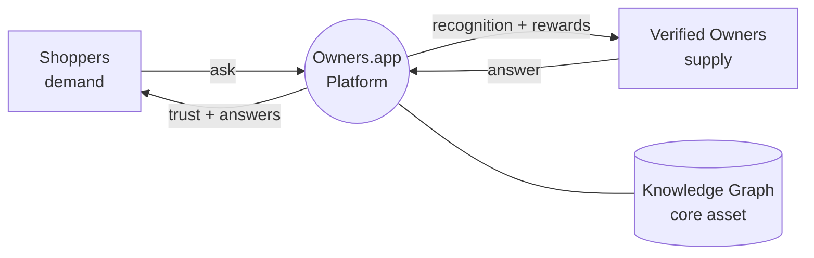

**Persona 1 — Shoppers (demand side)**

| Persona | Context | Job to be done | Anxiety we remove |
|---|---|---|---|
| **High-Consideration Hank** | About to spend meaningful money on a durable/technical product. | "Confirm this specific product fits *my* situation before I commit." | Buyer's remorse, returns, wrong fit. |
| **Edge-Case Erin** | Has an unusual constraint (compatibility, size, environment, accessibility). | "Tell me whether it works for *my* edge case that generic reviews ignore." | Wasting money on something that won't work. |
| **Skeptical Sam** | Distrusts ratings; suspects fake reviews. | "Give me a source I can actually believe." | Being manipulated by incentivized content. |
| **Longevity Lena** | Cares about durability, repairability, total cost of ownership. | "Tell me what this is like after 1–3 years, not at unboxing." | Buying something that fails early. |

> **Shopper JTBD (canonical):** *"When I'm about to make a high-consideration purchase, I want a
> trustworthy, specific answer from someone who actually owns it, so I can decide with confidence
> and without regret."*

**Persona 2 — Verified Owners / Contributors (supply side)**

| Persona | Motivation | Job to be done | What would make them quit |
|---|---|---|---|
| **Helpful Helen** | Intrinsic: enjoys helping; identity as the "go-to" expert. | "Let me share what I know and be recognized for it." | Feeling used, spammed, or unrecognized. |
| **Recognition-Seeking Raj** | Extrinsic: wants credit now and may want compliant monetization later. | "Let me build trusted status from real ownership experience." | Opaque/unfair rewards; feeling like a salesperson. |
| **Enthusiast Ellie** | Community/status: hobbyist who lives in the category. | "Connect me with people who care about this as much as I do." | Low-quality questions, toxic interactions. |
| **Pro/Prosumer Pat** | Professional user with deep, current usage. | "Let my professional experience reach buyers credibly." | Reputation diluted by spam; no differentiation from amateurs. |

> **Contributor JTBD (canonical):** *"When someone needs help with a product I truly own and
> understand, I want to answer credibly, build a reputation, and be fairly rewarded — without
> becoming a shill."*

> Partners (brands / retailers / affiliate networks) are a **secondary** persona. They provide
> compliant revenue and, optionally, labeled official answers — but they can never buy favorable
> answers. Their mechanics live in
> [07 — Commerce, Privacy, Security & Legal](./07-commerce-privacy-security-and-legal.md).

---

## 2. Experience principles (the rules every screen obeys)

These seven principles govern every decision in the flows below. If a design choice violates one,
it is wrong regardless of how well it converts.

1. **Owner answers beat opinions.** The UI always makes it visually obvious whether information
   comes from a *verified owner*, *the community*, *the brand*, or *AI synthesis*. Provenance is a
   first-class UI element, never a footnote.
2. **Calm by default.** The extension stays silent until it has something genuinely useful. No
   autoplay, no nags, no interstitials over checkout, no layout shifts on the host page.
3. **Consent precedes capability.** Nothing reads page content, product IDs, or purchase history
   until the user grants the specific permission for that capability
   (see [07 — Commerce, Privacy, Security & Legal](./07-commerce-privacy-security-and-legal.md)).
4. **One identity, two surfaces.** The extension and the website share one account, one reputation,
   and one notification stream. Context follows the user.
5. **Disclosure is non-negotiable.** Any monetized link, affiliate relationship, or sponsored
   answer is labeled inline **at the point of interaction**, not buried in a footer.
6. **Cold start is a feature, not an apology.** Empty states actively recruit the first owners and
   surface prior Q&A/admin summaries with honest "no verified owner yet" framing. Future AI surfaces
   inherit the same rule.
7. **Accessibility is acceptance criteria.** WCAG 2.2 AA is a gate, not a stretch goal. (Full specs
   in [03 — UX, Extension & Community](./03-ux-extension-and-community.md).)

---

## 3. Persona 1 — The Shopper (Chrome extension)

The extension is the **acquisition surface**: it meets shoppers where they already are — on a
retailer product page (PDP), deciding whether to spend real money. The entire experience is
designed to be *invisible until valuable*, then *deep on demand*.

### 3.1 The shopper's world in one picture

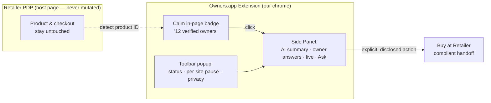

**Entry points a shopper can use:**

- **In-page badge** — a single calm chip near the product title (e.g. *"12 verified owners · 34
  answers"*). Click opens the side panel. It never overlaps host CTAs and never moves checkout.
- **Toolbar popup** — account status, per-site permission toggles, notification summary, and a
  global "pause Owners.app on this site" switch.
- **Side Panel** — the full Q&A surface: AI summary, owner answers, live presence, and the Ask box.
- **(Mobile / retailer apps)** — a PWA + share-sheet target ("Share to Owners.app") delivers the
  same resolve→answer flow from a shared product link. See
  [03 — UX, Extension & Community](./03-ux-extension-and-community.md).

### 3.2 Flow S1 — Install & first run

**Goal:** the shopper understands the value and the privacy promise in one screen, then gets out of
the way — with *zero* data read until they opt in per site.

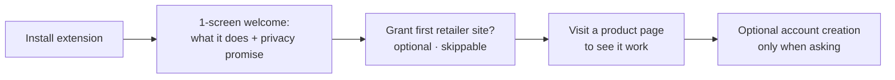

**Step by step**

1. Shopper installs from the store. The extension requests **no host permissions** at install.
2. A single welcome screen states, in plain language: *what it does* (surfaces answers from people
   who actually own the product) and *the privacy promise* (opt-in per site, nothing read until you
   say so, one-click pause/revoke).
3. The shopper can enable a first retailer site now or skip — both paths are fine.
4. No account is required to browse. An account is offered only later, at the moment they ask a
   question.

**Acceptance criteria**

- **AC-S1.1** Fresh install requests *no* host permissions; the first per-site grant is explicit and
  revocable.
- **AC-S1.2** First run is completable with keyboard only and via screen reader.
- **AC-S1.3** With the extension paused on a site, **zero** network calls reference that site's
  content.

### 3.3 Flow S2 — Silent product detection & the calm badge

**Goal:** on a retailer PDP the shopper learns that verified owners exist *without being
interrupted*.

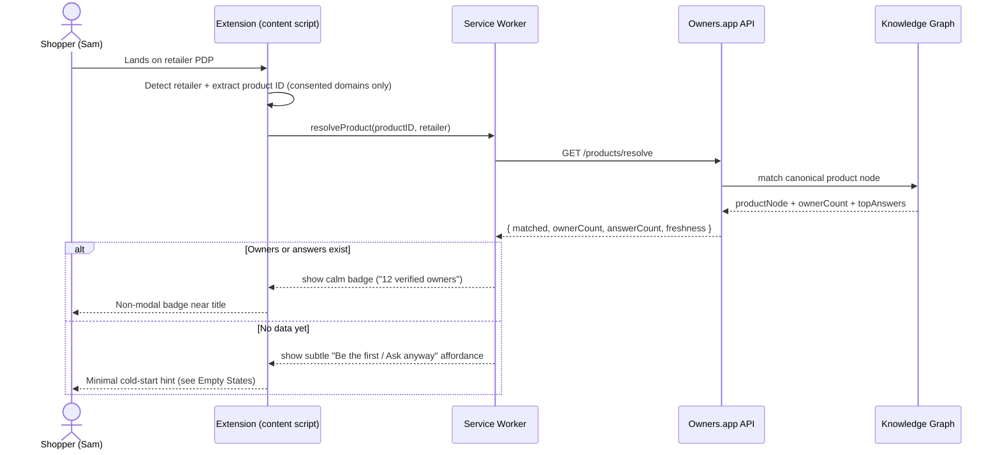

**How detection works (as the shopper experiences it):** the extension prefers **structured data**
(`schema.org/Product`, `gtin`, `mpn`, `sku`, OpenGraph) before any brittle DOM scraping, then falls
back to a per-retailer adapter, then — if all else fails — to a friendly *"Help us identify this
product"* affordance rather than guessing. Retailer SKUs normalize to a single **canonical product
node** so the same headphones across three retailers share one set of answers. Details in
[06 — AI & Product Knowledge Graph](./06-ai-and-product-knowledge-graph.md).

**Acceptance criteria**

- **AC-S2.1** The badge renders only after a confirmed product match; no badge on non-product or
  ambiguous pages.
- **AC-S2.2** Product resolution completes within **800 ms p75** or the badge shows a neutral loading
  state — never a layout shift on the host page.
- **AC-S2.3** The extension never injects above-the-fold modals and never moves host-page checkout
  elements.
- **AC-S2.4** If the domain is not on the user's allowed list, no page content is read; the badge
  stays dormant.

**Edge cases**

- **Variant products** (size/color) map to the same canonical node; the badge shows the broadest
  accurate count and the sidebar disambiguates variant-scoped answers.
- **Marketplace listings** (third-party sellers) may share a product but differ in fulfillment;
  provenance chips distinguish *"product"* vs *"seller"* answers.
- **Retailer A/B-tests its DOM:** the adapter fails safe to *"identify product"* — never a wrong
  badge.

### 3.4 Flow S3 — Opening the sidebar & the AI summary

**Goal:** the shopper gets an instant, trustworthy, *cited* summary of what owners say — without
waiting on a human — while never mistaking AI synthesis for an owner's own words.

When the shopper clicks the badge, the Side Panel opens with this hierarchy:

```text
+--------------------------+   <- Browser Side Panel (our chrome)
| Owners.app        [⚙][x] |
|--------------------------|
| Acme Headphones XT       |
| 12 owners · 34 answers   |
|--------------------------|
| [ Ask a verified owner ] |
|--------------------------|
| AI summary of owner      |
| answers (cited)     ⓘ    |
| "Battery holds ~90% at   |
|  14mo; ANC strong on     |
|  planes; hinge can creak"|
|  [1][2][3]  show owners▸ |
|--------------------------|
| Live now: ● Olivia       |
|           ● Leo (away)   |
|--------------------------|
| Top owner answers        |
| ✔ Olivia 14mo "Battery…" |
| ✔ Leo 6mo  "Hinge…"      |
|--------------------------|
| Disclosure: affiliate ⓘ  |
+--------------------------+
```

**What makes the AI summary trustworthy:**

- It is **explicitly labeled** `AI summary of owner answers`, visually distinct from owner-authored
  content — never disguised as a human owner.
- **Every claim carries a citation** back to the specific owner answer, longevity update, or source
  document it came from. Tapping a citation jumps to that owner's answer.
- It **states uncertainty and coverage gaps honestly** (e.g. *"Only 2 verified owners for this
  configuration"*).
- It **surfaces disagreement** rather than papering over it — if owners conflict, both cited views
  appear.
- The **"show owners" / "still ask an owner"** path is always present; AI never blocks the human path.

The mechanics of retrieval, chunking, and citation binding are in
[06 — AI & Product Knowledge Graph](./06-ai-and-product-knowledge-graph.md).

**Acceptance criteria**

- **AC-S3.1** Every AI summary is labeled `AI summary of owner answers` and is visually distinct from
  owner content.
- **AC-S3.2** Every claim in a synthesized answer links to its source (owner answer, update, or
  external doc).
- **AC-S3.3** The assistant explicitly states coverage gaps and never implies owners exist when they
  don't.
- **AC-S3.4** The sidebar is fully keyboard-navigable and screen-reader-labeled; provenance badges
  read as text (e.g. "Verified owner answer").

### 3.5 Flow S4 — Live owners & asking a question

**Goal:** the shopper is never blocked. They get an instant AI pre-answer from existing owner
content, and can escalate to a real owner — live if one is online, async otherwise — with an
**honest** expected response time.

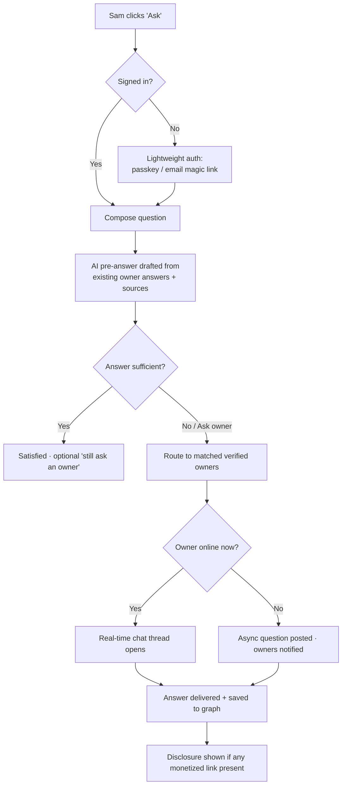

**Presence, as the shopper sees it:** owners show as `online`, `away`, `typically replies in ~Nh`,
or `offline`. Presence is privacy-respecting — no precise last-seen timestamps are shown publicly.
A question fans out to *matched* owners (by product node, tier, topic affinity, and availability)
— it never spams every owner.

**Lifecycle of a question (the shopper's thread):**

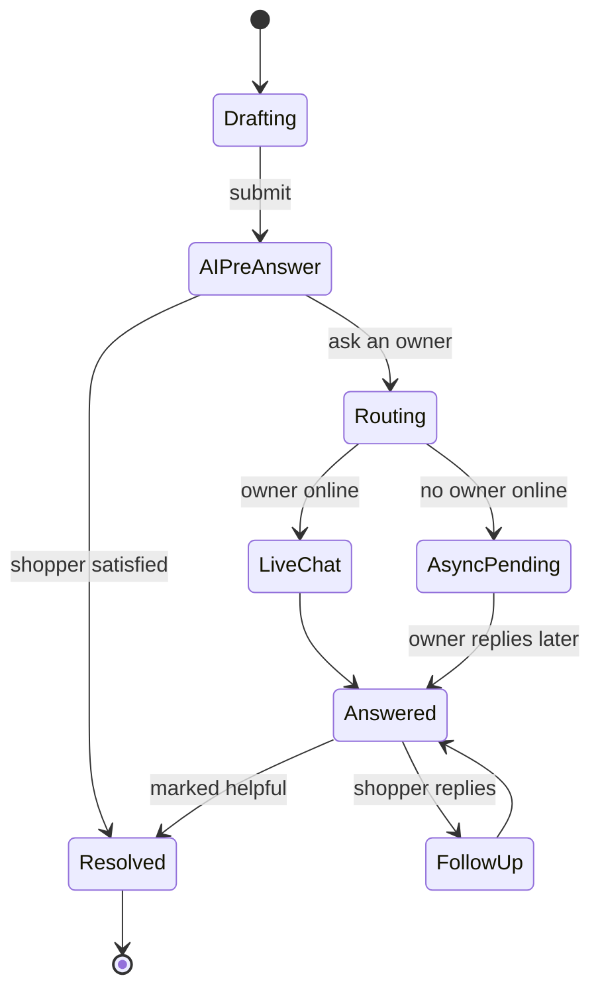

**Step by step**

1. Sam clicks **Ask**. If not signed in, a lightweight passkey / email magic-link flow appears — the
   minimum identity needed to prevent spam. No full profile required.
2. Sam composes the question. Before send, **PII guards** warn if it contains serial numbers,
   addresses, or order IDs and offer redaction.
3. An **AI pre-answer** is drafted instantly from existing owner content, cited and labeled.
4. If that's enough, Sam is done (with a "still ask an owner" option). If not, the question routes to
   matched verified owners.
5. If an owner is online, a **real-time chat thread** opens. If not, the question is **posted async**,
   owners are notified, and Sam sees an honest ETA (*"typically replies in ~2h"*).
6. The answer is delivered, saved back to the graph for future shoppers, and any monetized link in it
   carries an inline disclosure.

**Acceptance criteria**

- **AC-S4.1** Asking requires the minimum identity needed to prevent spam (passkey or verified
  email); no full profile required to ask.
- **AC-S4.2** When routed to owners, the UI shows an **honest** expected response time derived from
  owner history — never a fabricated "instant."
- **AC-S4.3** Live chat messages deliver in **<1s p95** when both parties are online; degraded
  networks fall back to async **without data loss**.
- **AC-S4.4** A shopper can always reach a non-AI owner answer path when an owner exists.
- **AC-S4.5** Toxic/abusive questions are blocked pre-send with a reason; repeated attempts are
  throttled (see [05 — Trust, Verification, Incentives & Fraud](./05-trust-verification-incentives-and-fraud.md)).

**Edge cases**

- **No matching owner:** fall back to AI + offer to notify Sam when an owner verifies for this
  product.
- **Owner goes offline mid-thread:** the thread converts to async; Sam is notified; no message is
  lost.
- **Conflicting owner answers:** both are shown with citations; the disagreement is surfaced, not
  hidden.

### 3.6 Flow S5 — Decision confidence & the compliant buy handoff

**Goal:** give the shopper enough grounded signal to decide *with confidence* — including the
confidence to **not** buy — and, if they do buy, hand off to the retailer in a way that is
**explicit, disclosed, and program-compliant**.

**Decision confidence** comes from three things the UI makes legible:

1. **Provenance** — every answer shows whether it's from a verified owner (and their tier), the
   community, the brand, or AI, plus a timestamp. Stale answers are visually de-emphasized.
2. **Longevity** — an "Ownership over time" timeline (30d → 6mo → 12mo → 18mo) shows how the product
   held up, so Lena isn't judging from unboxing hype.
3. **Honest coverage** — thin evidence is stated plainly (*"only 2 verified owners"*), and negative
   durability findings are **never suppressed for commercial reasons**.

A fully-negative answer that helps Sam *avoid* a bad buy is a **success**, not a lost conversion.

**The compliant buy handoff — the safe default:**

```mermaid
sequenceDiagram
    autonumber
    participant U as Shopper
    participant X as Extension
    participant D as Disclosure Engine
    participant R as Retailer Checkout

    U->>X: Reads verified-owner answers on a product
    U->>X: Clicks "Continue to Amazon" (explicit action)
    X->>D: Request v0 disclosure
    D-->>X: Render "No affiliate tag in MVP; opens Amazon"
    U->>X: Confirms
    X->>X: Record internal handoff intent event
    X->>R: Open normal Amazon product page in new tab
```

> ⚖️ **Legal nuance — do not cut this corner.** It is tempting to *silently reload the retailer page
> through an affiliate link* or *auto-apply an affiliate tag on passive browsing*. **These are high
> risk and are not treated as safe here.** They are commonly classified as *cookie stuffing* /
> *attribution hijacking*, they overwrite other publishers' legitimate last click, and they may
> violate program terms, retailer ToS, and consumer-protection law. Likewise, overlaying our content
> *onto the retailer's DOM* to look native is deceptive and carries IP/passing-off risk. **The only
> default this product ships is the explicit, disclosed, user-initiated handoff above.** Any
> deviation is gated per-retailer by signed program terms and requires the legal review described in
> [07 — Commerce, Privacy, Security & Legal](./07-commerce-privacy-security-and-legal.md). This
> document does **not** imply that automatic link replacement or page reloading is safe.

**Design rules the shopper benefits from:**

- In v0, **no affiliate tag is applied at all**. Future affiliate links require explicit user action,
  inline disclosure, and program-specific approval.
- We respect **"last click"** and de-duplication — we never overwrite another legitimate
  affiliate click.
- Some programs **ban browser extensions entirely**; for those retailers the shopper simply gets the
  informational, non-affiliate experience. Owner content still lives in *our* chrome, clearly branded
  Owners.app.
- Ranking is **never** silent pay-for-placement. If sponsored results ever exist, they are segregated
  and labeled.

**Acceptance criteria**

- **AC-S5.1** v0 applies no affiliate tag. Later affiliate tagging remains gated by explicit,
  disclosed user action and retailer/program approval; passive browsing is never monetized.
- **AC-S5.2** The affiliate disclosure is shown **before** the user leaves for the retailer, is
  accessible, and the disclosure copy version is logged with the click.
- **AC-S5.3** Negative or "don't buy" outcomes are fully supported and never down-ranked for
  commercial reasons.
- **AC-S5.4** The extension never rewrites host-page links silently and never reloads the page for
  commission.

### 3.7 Shopper empty states & cold start

The platform's hardest problem is the **first owner for any given product**. Emptiness must become
*recruitment and honesty*, never a dead end.

| Situation | What the shopper sees | Active behavior |
|---|---|---|
| Product matched, **no owners yet** | "No verified owners yet — be the first, or ask and we'll find one." | Offer verification; allow asking → prior Q&A/admin summary if available + queue for future owners |
| Owners exist, **no answer to this Q** | AI synthesis + "Notify me when an owner answers" | Route to owners async; trigger targeted recruitment |
| **No product match** | "Help us identify this product" with a prefilled guess | Crowd-assisted identification feeds the graph |
| **No owners online** | "Owners typically reply in ~Nh" + async post | Honest ETA; async notification |

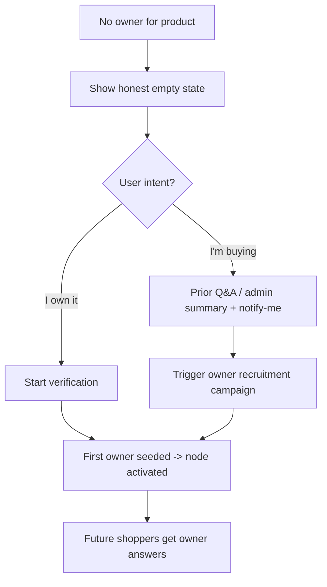

**Acceptance criteria**

- **AC-S6.1** No empty state is a dead end; each offers at least one forward action (verify, ask,
  identify, or notify-me).
- **AC-S6.2** Cold-start framing never implies owners exist when they don't.
- **AC-S6.3** AI-only answers in cold-start are explicitly labeled as *not owner-verified*.

### 3.8 Shopper privacy & disclosure, felt not buried

Privacy isn't a policy page here — it's something the shopper *feels* through defaults:

- **Opt-in per site.** No data is read until the shopper enables Owners.app for that retailer.
- **Local-first context.** Page context stays in transient session storage and is discarded when not
  needed.
- **Data minimization.** Only the product identifier and explicitly shared fields ever leave the
  device.
- **No silent tracking.** No cross-site behavioral profiling for ads. The business model is compliant
  affiliate/partner revenue, disclosed inline.
- **One-click pause and revoke** from the popup and the privacy center.
- **Transparent retention.** Each data type shows its retention period at the moment it's collected.

Consent is requested at natural moments, in order, never all at once:

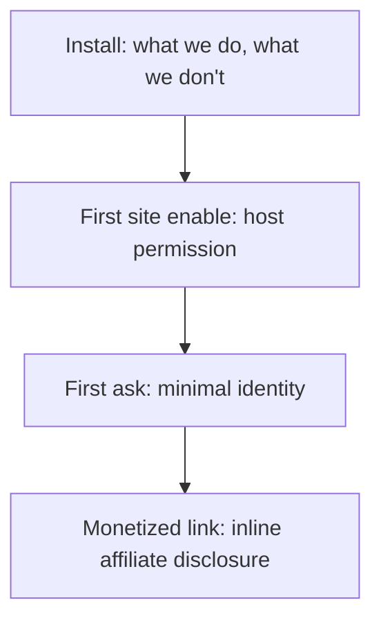

**Acceptance criteria**

- **AC-S7.1** A shopper can see, in ≤2 clicks from any surface, exactly what data Owners.app holds and
  can export/delete it.
- **AC-S7.2** Disabling a site produces **zero** content reads or network calls referencing that site.
- **AC-S7.3** Every monetized interaction carries a visible, accessible disclosure at the point of
  action.
- **AC-S7.4** Revoking consent mid-session purges in-flight context and returns the UI to dormant —
  without breaking core browsing.

---

## 4. Persona 2 — The Verified Owner / Contributor

The owner already bought the product. They want to help others, be recognized, and eventually — where
it's compliant — earn from knowledge they already have, **without becoming a shill**. In v0, the
reward is recognition only. Every owner-facing flow is engineered to be **low-friction to enter** and
**fair and legible to stay in**.

### 4.1 The owner's world in one picture

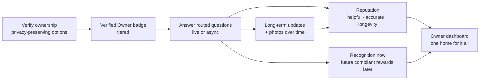

The owner dashboard is the **home** that ties verification, inbox, reputation, recognition, and
longevity prompts into one place. The extension and website share **one identity, one reputation, one
notification stream**.

### 4.2 Flow O1 — Verification & onboarding

**Goal:** let a real owner prove ownership through an explicit, privacy-minimal Amazon Orders scan
that they initiate from the Chrome extension — and start contributing immediately once verification
clears.

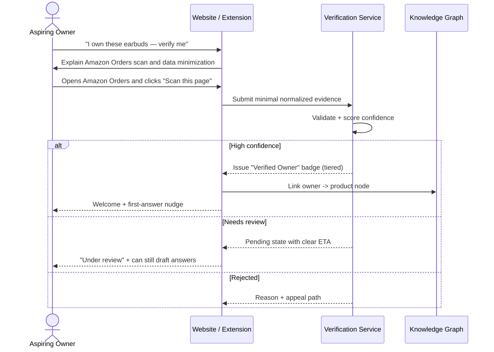

**v0 method** is intentionally narrow:

| Method | Feel | Privacy | v0 status |
|---|---|---|---|
| **User-initiated Amazon Orders scan** | Fast, explicit | No credentials; store ASIN/parent ASIN, purchase month/year, hashed order id, verification timestamp | Required for v0 verified badge |
| Redacted receipt upload | Manual fallback | Not shipped unless Orders scan is blocked | Deferred |
| Order confirmation email parse | Fast but more sensitive | Requires inbox/forwarding design | Deferred |
| Retailer account connect | Fastest but highest policy/data risk | Requires program/API review | Deferred |
| Photo of product + serial | Category-specific | Lower purchase confidence for earbuds | Deferred |

**Progressive trust:** owners can draft in a **`pending`** state, but v0 published answers require an
approved Amazon Orders ownership claim for that canonical earbud product. A
persistent **verification card** always shows the current tier, what raises it, and expiry /
re-verification timing. The verification *logic*, confidence scoring, and tier definitions are owned
by [05 — Trust, Verification, Incentives & Fraud](./05-trust-verification-incentives-and-fraud.md).

**Acceptance criteria**

- **AC-O1.1** The Amazon Orders scan is user-initiated, credential-free, and stores only the minimal
  normalized evidence listed in [09 — MVP Implementation Spec](./09-mvp-implementation-spec.md).
- **AC-O1.2** Verification status is always one of `verified`, `pending`,
  `rejected`, or `expired`, each with a plain-language explanation.
- **AC-O1.3** Every requested data element shows *why it's needed* and *how long it's retained* at the
  point of request.
- **AC-O1.4** Proof artifacts are minimized, encrypted, and never shown publicly; only the resulting
  badge tier is public.
- **AC-O1.5** Onboarding is completable with keyboard only and via screen reader.

### 4.3 Flow O2 — The verified owner badge

The badge is the owner's credibility, made visible to shoppers, while keeping the *evidence* private.

- **Only the tier is public.** Shoppers see "Verified owner · 14mo owned" — never the receipt, email,
  or serial behind it.
- **Tiered by confidence.** Higher-evidence tiers carry more weight; future payout eligibility remains
  deferred and policy-gated. In v0, Amazon Orders verification unlocks verified-owner recognition.
- **Longevity multiplier.** The badge gains a longevity signal as the owner accumulates verified time
  with the product — surfacing "18mo owned" as a first-class trust cue for Longevity Lena.
- **Category-scoped reputation.** Being a trusted owner of one product doesn't inflate trust in an
  unrelated category (Bayesian shrinkage toward a prior for thin evidence — see
  [05 — Trust, Verification, Incentives & Fraud](./05-trust-verification-incentives-and-fraud.md)).

### 4.4 Flow O3 — Answering questions (low-friction contribution loop)

**Goal:** make it effortless for an owner to turn a routed question into a helpful, credible answer —
and to see their contribution recognized immediately.

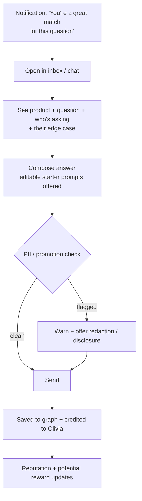

**What keeps it low-friction:**

- **Smart routing, not spam.** Questions reach an owner only when they're a genuine match (product,
  tier, topic affinity, availability). An **availability toggle** instantly affects routing.
- **Blank-page relief.** Canned-but-editable starter prompts reduce paralysis without producing
  generic answers.
- **Honest, direction-neutral norms.** Owners are told plainly: reward comes from *helpfulness*, not
  from pushing a purchase. A "you probably shouldn't buy this for your use case" answer is fully
  valued.
- **Self-correction is first-class.** Owners can edit or retract answers; the system keeps a visible,
  tamper-evident edit trail rather than silently rewriting history.
- **Disclosure by construction.** If an answer contains a monetized link or the owner has any
  relationship to disclose, an inline label is required at the unit level, and it's logged.

**Acceptance criteria**

- **AC-O2.1** Routing respects the owner's availability toggle in real time and never fans a question
  out to all owners indiscriminately.
- **AC-O2.2** Every answer an owner posts exposes provenance (owner tier) and a timestamp to shoppers.
- **AC-O2.3** Owners can edit/retract with a visible edit trail; no silent edits.
- **AC-O2.4** Non-disclosed compensable answers are suppressed and unpaid (see
  [05 — Trust, Verification, Incentives & Fraud](./05-trust-verification-incentives-and-fraud.md)).

### 4.5 Flow O4 — Long-term updates & photos

**Goal:** capture the platform's true differentiator — **time** — by re-engaging owners at
meaningful intervals, entirely on their terms.

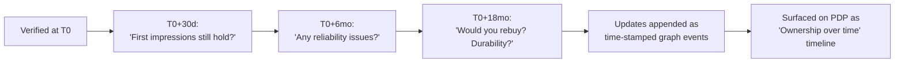

- **Opt-in and gentle.** Longevity prompts are opt-in, rate-limited (default ≤1/month), and easy to
  snooze or stop forever. They queue in the owner dashboard, never nag.
- **Photos over time.** Owners can attach photos to updates (wear, repairs, "still going strong"),
  with alt-text assistance for accessibility.
- **Truth is protected.** Negative durability updates are **never** suppressed or down-ranked for
  commercial reasons — that protection is what makes the longevity timeline believable.
- **Freshness is visible.** Each update is timestamped; stale answers are visually de-emphasized on
  the PDP.

**Acceptance criteria**

- **AC-O3.1** Re-engagement prompts are opt-in, rate-limited (default ≤1/month), and easy to snooze or
  stop forever.
- **AC-O3.2** Each update is timestamped and shown on a longevity timeline; stale answers are
  de-emphasized.
- **AC-O3.3** Negative durability updates are never suppressed or down-ranked for commercial reasons.

### 4.6 Flow O5 — Being rewarded fairly

**Goal:** make recognition **legible and trustworthy** in v0, while preserving a clear target-state
path to compliant payouts later. The owner should understand what was helpful, why it counted, and
what payout systems are intentionally not active yet.

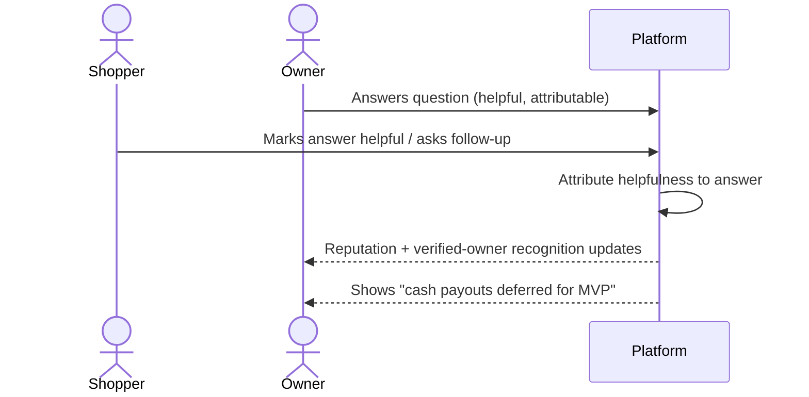

**The v0 reward philosophy the owner can rely on:**

- **Recognize helpfulness, never sentiment.** A negative answer that helps a shopper avoid a bad buy
  counts as much as a positive answer.
- **No cash promises in v0.** The UI must not imply that a purchase generates owner revenue until the
  affiliate/payout system is legally and programmatically cleared.
- **Legible contribution credit.** The owner can see which answers were marked helpful and how that
  affects status/leaderboard placement.
- **Future payout path is labeled as future.** Target-state payout mechanics remain documented in the
  trust and commerce docs, but they are not shown as active earnings in v0.

The economics, attribution windows, thresholds, holdbacks, clawbacks, and compliance gates are
authoritative in
[07 — Commerce, Privacy, Security & Legal](./07-commerce-privacy-security-and-legal.md) and
[05 — Trust, Verification, Incentives & Fraud](./05-trust-verification-incentives-and-fraud.md).

**Acceptance criteria**

- **AC-O4.1** v0 shows recognition metrics (`helpful`, `answered`, `top helper`) rather than cash
  earning states.
- **AC-O4.2** The exact helpfulness rationale is viewable; no opaque scores.
- **AC-O4.3** The UI never displays pending dollar amounts or payout timelines in v0.
- **AC-O4.4** Future payout eligibility copy links to the commerce/trust docs and clearly says the
  system is deferred.
- **AC-O4.5** Only verified owners can earn verified-owner recognition for a product.

### 4.7 The owner dashboard & reputation

One home surface ties the whole contributor experience together:

- **Your verified products** — badge tiers and re-verification reminders.
- **Inbox / routed questions** — with an availability toggle and canned-but-editable starters.
- **Reputation** — a legible breakdown of helpfulness, accuracy, and longevity contributions
  (category-scoped, decay-aware, anti-positivity controls so genuine critical answers aren't
  penalized). Details in
  [05 — Trust, Verification, Incentives & Fraud](./05-trust-verification-incentives-and-fraud.md).
- **Recognition** — helpfulness, answered questions, top-helper status, and future payout education
  from [Flow O5](#46-flow-o5--being-rewarded-fairly).
- **Longevity prompts queue** — from [Flow O4](#45-flow-o4--long-term-updates--photos).
- **Privacy center** — one-click pause of all activity, plus export/delete.

**Acceptance criteria**

- **AC-O5.1** v0 dashboard shows recognition metrics, not dollar earnings; any future payout copy is
  clearly labeled as deferred.
- **AC-O5.2** The availability toggle instantly affects routing and presence.
- **AC-O5.3** The dashboard exposes a one-click path to pause all activity and to export/delete data.

### 4.8 Owner privacy & anonymity

Owners help others without over-exposing themselves:

- **Evidence stays private.** Receipts, emails, serials, and OAuth tokens are minimized, encrypted,
  and never public — only the resulting **badge tier** is visible.
- **Pseudonymity is supported.** An owner can build reputation under a stable handle without exposing
  their legal identity to shoppers. (Tax/KYC identity, when required for payout, is a separate,
  private compliance surface — see
  [07 — Commerce, Privacy, Security & Legal](./07-commerce-privacy-security-and-legal.md).)
- **Presence is coarse.** Shoppers see `online` / `away` / `typically replies in ~Nh`, never precise
  last-seen timestamps.
- **One physical owner, one reputation.** Multiple accounts for the same person are linked via
  verification so reputation isn't double-counted — and so a single person can't sock-puppet
  (see [05 — Trust, Verification, Incentives & Fraud](./05-trust-verification-incentives-and-fraud.md)).
- **Full reversibility.** Pause, revoke, export, and delete are reachable from every surface.

---

## 5. Where the two personas meet

The magic moment is when a shopper's question becomes an owner's contribution becomes the next
shopper's instant answer — the flywheel turning one interaction at a time:

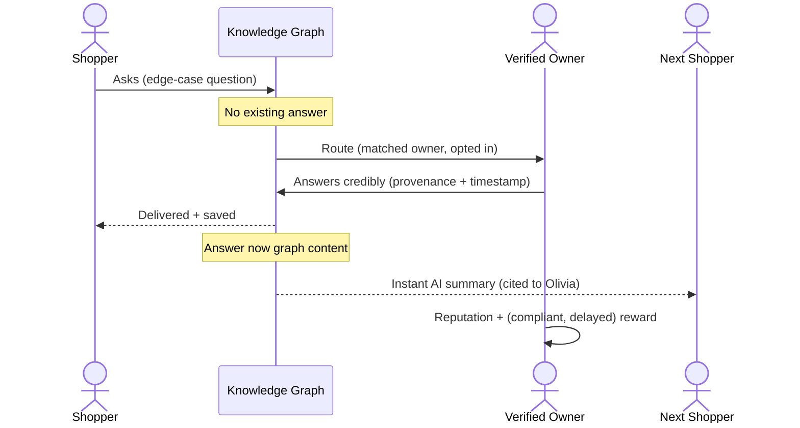

- **Scenario A (instant graph answer):** Erin lands on a roof-rack PDP; the extension recognizes it
  and shows a verified-owner answer already in the graph ("Fits a 2014 Tacoma with the OE crossbars;
  you'll need the X adapter"). She buys with confidence — no live human needed.
- **Scenario B (routed live question):** Hank asks something novel ("Does the app still push firmware
  after the 2026 update?"). No graph answer exists, so it routes to opted-in owners. Raj answers in
  minutes, earns reputation and (if applicable) a compliant reward, and the Q&A joins the graph.
- **Scenario C (fraud attempt):** A brand tries to seed fake "owners." Verification + anomaly
  detection flag the accounts; reputation gating keeps their answers from surfacing (see
  [05 — Trust, Verification, Incentives & Fraud](./05-trust-verification-incentives-and-fraud.md)).

---

## 6. Consolidated acceptance criteria

These cross-cutting gates apply to **both** personas and every surface:

- **Provenance everywhere.** No answer renders without a provenance label and timestamp.
- **Honesty in scarcity.** Empty/cold-start states never fabricate owner presence.
- **Consent before capability.** No capability activates before its specific consent.
- **Disclosure at the point of action.** Money is always labeled where it appears, before the user
  leaves for the retailer, with the disclosure version logged.
- **No unsafe monetization.** No silent link rewriting, no reload-for-commission, no auto-tagging on
  passive browse, no retailer-DOM overlay disguised as native.
- **Accessibility gate.** WCAG 2.2 AA conformance is required to ship any user-facing surface; zero
  critical/serious axe-core violations on PDP, sidebar, chat, and dashboards.
- **Reversibility.** Pause, revoke, export, and delete are reachable from every surface.

## 7. Consolidated edge cases

| Area | Edge case | UX response |
|---|---|---|
| Detection | Retailer A/B-tests its DOM | Adapter fails safe to "identify product"; no wrong badge |
| Identity | Same physical owner, multiple accounts | Linked via verification; reputation not double-counted |
| Chat | Owner goes offline mid-thread | Converts to async; shopper notified; no message loss |
| Ask | Question contains PII (serial, address, order id) | Inline warning + optional redaction before posting |
| Future payouts | Conversion reversed post-payout | Deferred for v0; later UI must show `reversed` with transparent explanation |
| Research | Conflicting owner answers | UI surfaces disagreement honestly; future AI must preserve both citations |
| Commerce | Program bans extensions | Retailer gets the informational, non-affiliate experience |
| i18n | Translated answer changes meaning | Original one tap away; "translated" label persistent |
| Privacy | User revokes mid-session | In-flight context purged; UI returns to dormant |
| Moderation | Coordinated false flags | Low-severity content stays visible with a marker; pattern flagged to anti-abuse |

## 8. Low-friction UX principles cheat sheet

A quick reference distilled from every flow above:

1. **Invisible until valuable, deep on demand.** Silence beats noise; the badge earns the click.
2. **Never block the user.** Prior verified-owner content appears instantly when available; the human
   path is always available, never mandatory. Future AI must remain grounded in owner content.
3. **Minimum identity, maximum trust.** Ask for the least data that prevents spam, and explain every
   field's purpose and retention at the point of request.
4. **Provenance is the product.** Owner vs community vs brand vs AI is always obvious, with a
   timestamp.
5. **Honesty scales trust.** Say "only 2 owners," surface disagreement, never suppress negative
   truth, never fake presence.
6. **Reward helpfulness, not sentiment.** Direction-neutral, delayed, legible, reversible-with-reason.
7. **Consent and disclosure at the moment they matter** — inline, accessible, logged, and reversible.
8. **Own our chrome, not their page.** Everything renders in Owners.app surfaces; the retailer's page
   and checkout are never mutated, and the affiliate handoff is always explicit and disclosed.
