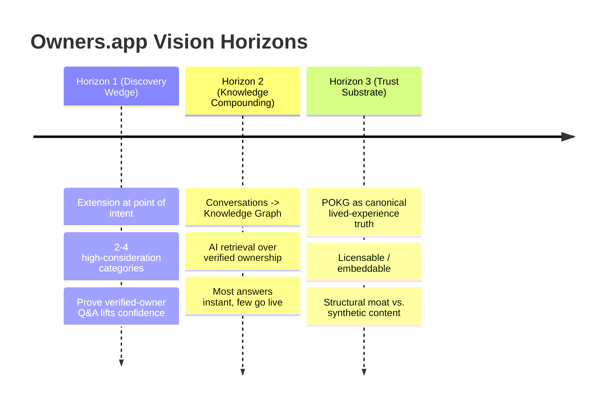
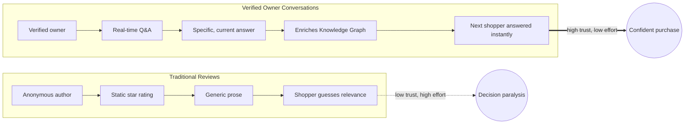
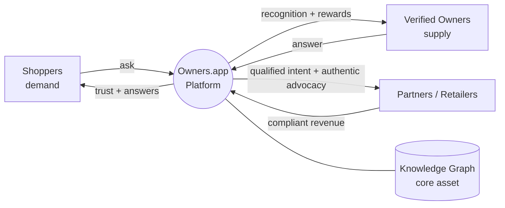
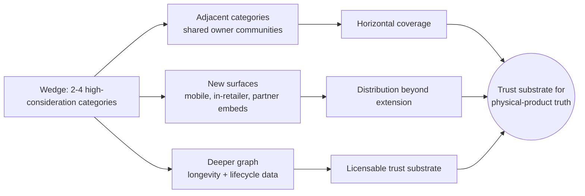
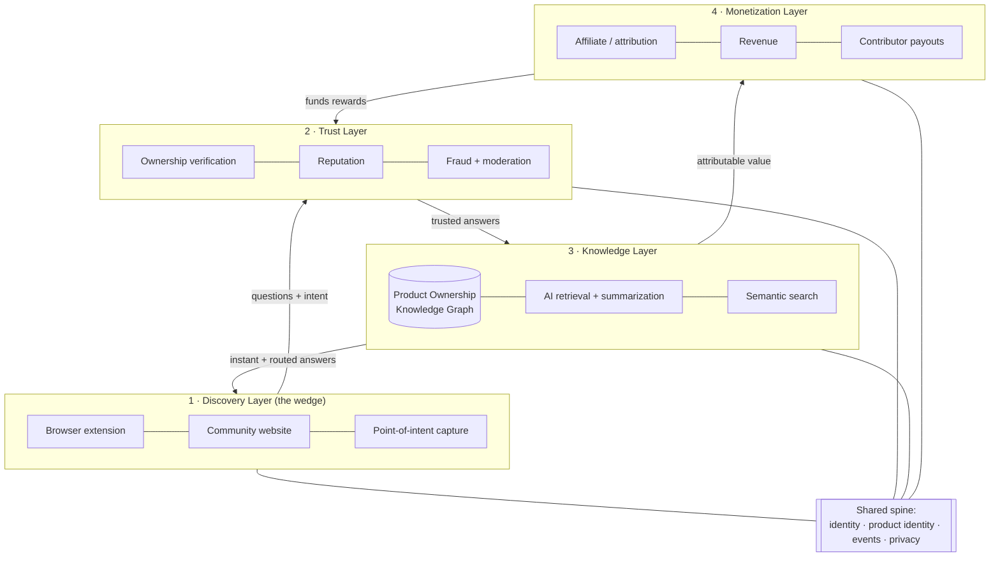
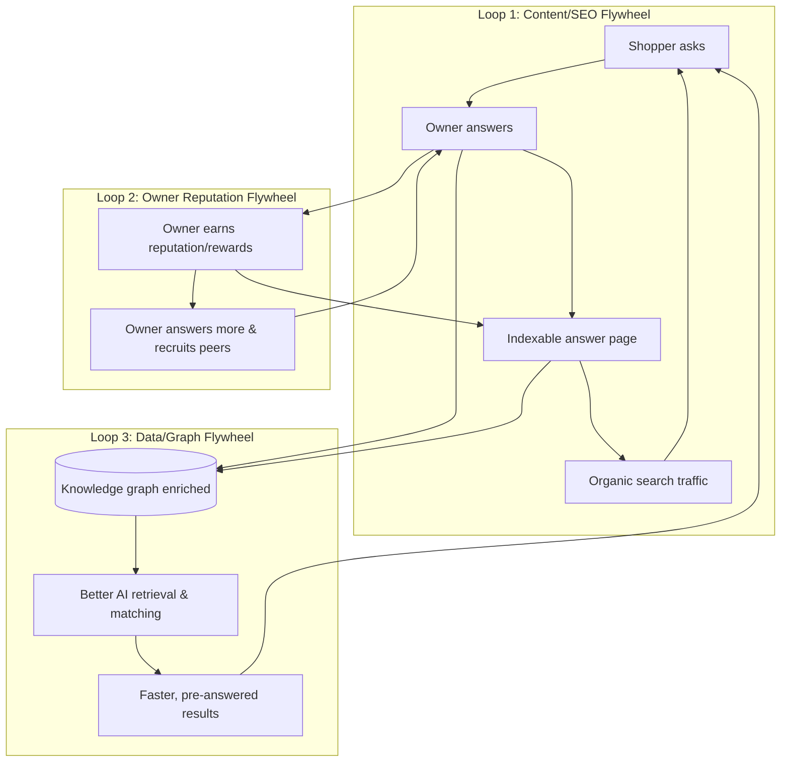
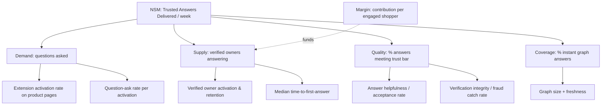
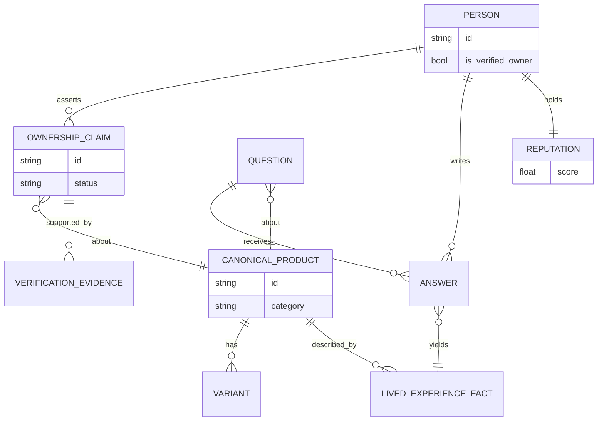

# Owners.app — Foundation & Components

> **Document 02 of the Owners.app product & design set.** This is the strategic foundation: what
> we're building, why it can win, and the high-level component map the rest of the documentation
> details. It is intentionally strategy- and product-design-oriented — implementation depth lives in
> the sibling documents mapped below.

---

## Document map

Owners.app's design is split across focused documents. This document (**02**) owns the *foundation*:
vision, problem, goals, principles, strategy, network effects, the component map, success metrics,
assumptions, and the canonical glossary. Everything else is delegated:

| Doc | Scope | When to read it |
|---|---|---|
| [01 — User Persona Flows](./01-user-persona-flows.md) | Shopper (Chrome-extension) journey and verified-owner contributor flow, end-to-end. | You need the low-friction UX narrative for the two core actors. |
| **02 — Foundation & Components** *(this doc)* | Strategy, vision, principles, component map, metrics, glossary. | You need the "why" and the high-level system shape. |
| [03 — UX, Extension & Community](./03-ux-extension-and-community.md) | Extension surfaces, community website IA, onboarding, chat, dashboards, accessibility, empty states. | You need screen-level **UX** detail. |
| [04 — Architecture, Data & APIs](./04-architecture-data-and-apis.md) | Architecture overview, services, database, APIs, event model, deployment, scaling, observability. | You need the authoritative **architecture** and data model. |
| [05 — Trust, Verification, Incentives & Fraud](./05-trust-verification-incentives-and-fraud.md) | Ownership verification tiers, reputation, incentives/payouts, fraud prevention, moderation, transparency. | You need the **trust** mechanics and anti-abuse posture. |
| [06 — AI & Product Knowledge Graph](./06-ai-and-product-knowledge-graph.md) | Product knowledge graph, AI layer, RAG, semantic search, reliability intelligence, evaluation. | You need the **AI** and knowledge-graph design. |
| [07 — Commerce, Privacy, Security & Legal](./07-commerce-privacy-security-and-legal.md) | Commerce layer, affiliate/attribution, revenue, privacy, security, legal, compliance, disclosures. | You need the **commerce/legal** and privacy posture. |
| [08 — Roadmap, Operations, Risks & Backlog](./08-roadmap-operations-risks-and-backlog.md) | Roadmap, go-to-market, operations, risk register, open questions, implementation backlog, launch criteria. | You need the **roadmap** and delivery plan. |

> **Cross-reference convention:** links in this document point to the *owning* sibling document.
> Where a topic (e.g., verification thresholds, attribution windows, SLOs) is only summarized here,
> the linked document is authoritative.

---

## Executive Summary

**Owners.app (the "Verified Owners Platform")** is a browser extension and community platform that
lets shoppers ask **verified product owners** real, real-time questions at the moment of purchase
intent — and rewards those owners and other contributors from **compliant** affiliate/partner
revenue. The defensible long-term asset is not the extension or the Q&A feed; it is a structured,
continuously-refreshed **Product Ownership Knowledge Graph (POKG)**: a graph linking real people who
demonstrably own products to the questions, answers, longevity signals, and lived-experience facts
they contribute.

The strategic insight is a separation of concerns most "review" products conflate — the four
foundational layers detailed in the [Foundational component map](#foundational-component-map):

1. **Discovery layer (the wedge):** a browser extension that activates on retail product pages
   (initially a small set of high-consideration categories) and surfaces "Ask a verified owner."
   This is *how we acquire demand cheaply at the point of intent* — it is **not** the product.
   (UX detail: [03 — UX, Extension & Community](./03-ux-extension-and-community.md).)
2. **Trust layer:** ownership verification, contributor reputation, and fraud controls that make
   answers credibly more trustworthy than anonymous reviews
   ([05 — Trust, Verification, Incentives & Fraud](./05-trust-verification-incentives-and-fraud.md)).
3. **Knowledge layer:** the POKG plus AI retrieval/summarization that turns one-to-one conversations
   into reusable, searchable, durable knowledge
   ([06 — AI & Product Knowledge Graph](./06-ai-and-product-knowledge-graph.md)).
4. **Monetization layer:** compliant affiliate/partner/commerce revenue that funds contributor
   rewards without distorting answer integrity
   ([07 — Commerce, Privacy, Security & Legal](./07-commerce-privacy-security-and-legal.md)).

**Why now:** review trust is collapsing (incentivized, AI-generated, and fake reviews are
endemic), generative AI makes both the *problem* (synthetic content) and the *solution* (verified
provenance + retrieval over real ownership data) more acute and more feasible, and affiliate/retail
media infrastructure is mature enough to fund a two-sided incentive model.

**What must be true** (elaborated in [Core assumptions](#core-assumptions--things-that-must-be-true)):
shoppers will ask questions at the point of intent; enough verified owners will answer for
meaningful coverage; ownership can be verified cheaply and fraud-resistantly; and at least one
compliant monetization path yields positive contribution margin per engaged shopper.

**One-line investment thesis:** *Own the verified-ownership graph of the physical world's products,
entered through a near-zero-CAC browser extension at the point of purchase intent, and monetized
through compliant commerce — a data asset that compounds and that incumbents (retailers, review
sites, and LLMs) cannot easily replicate because they lack verified, person-level ownership
provenance.*

---

## Product Vision

### One-sentence positioning

> **Owners.app turns "I wish I could ask someone who actually owns this" into a real answer from a
> verified owner — right where you're about to buy.**

### One-paragraph positioning

> For high-consideration shoppers who don't trust star ratings and anonymous reviews, Owners.app is
> a browser extension and community that connects them — at the exact moment of purchase intent — to
> **verified owners** of the specific product (or close alternatives) who answer their real
> questions in real time. Unlike review sites, marketplaces, and AI shopping assistants that
> aggregate unverifiable text, Owners.app is built on **proven ownership and lived experience**,
> creating a trustworthy, conversational, and continuously-growing **Product Ownership Knowledge
> Graph**. Contributors are recognized and rewarded from compliant commerce revenue, aligning the
> incentive to be *helpful and honest* with the incentive to *earn* — without letting either corrupt
> the other.

### Vision narrative (the 3-horizon story)

- **Horizon 1 — Discovery wedge:** Win a few high-consideration categories where "ask an owner"
  beats "read 4,000 reviews." Prove that verified-owner Q&A meaningfully changes purchase
  confidence and conversion.
- **Horizon 2 — Knowledge compounding:** Convert conversations into a searchable knowledge graph.
  Most shoppers get instant answers from *prior* verified-owner content; only novel questions route
  to live owners. AI does retrieval and summarization, never fabrication of ownership.
- **Horizon 3 — The trust substrate:** The POKG becomes the canonical, queryable source of
  *verified lived-experience truth* about products — licensable to partners, embeddable in other
  surfaces, and a structural moat against synthetic content.

---

## Problem Statement

Shoppers making **high-consideration purchases** (durable goods, gear, appliances, tools, baby/pet,
hobbyist equipment, etc.) face a *trust and specificity gap*:

- They have **specific, contextual questions** ("Will this fit a 2014 Tacoma?", "Does the app still
  work after the latest firmware?", "Is it loud enough to wake a light sleeper?") that generic
  content cannot answer.
- The information that *would* answer them lives in the heads of people who **actually own and use
  the product** — but that knowledge is fragmented across forums, comment sections, video
  descriptions, and private group chats, or simply never written down.
- The most accessible signals — **star ratings and reviews** — are increasingly **untrustworthy,
  unverifiable, stale, and gameable**.

The result: decision paralysis, returns, regret, and a reliance on whichever voice is loudest or
most incentivized rather than most *experienced*.

### Why traditional reviews are insufficient

| Failure mode | What goes wrong | Consequence for the shopper |
|---|---|---|
| **Unverifiable authorship** | Reviewer may never have owned/used the product. | Can't weight the opinion; trust is a coin flip. |
| **Incentivized & fake content** | Seeded, paid, vote-manipulated, or AI-generated reviews. | Ratings are inflated; bad products look fine. |
| **Static & one-directional** | A review is frozen at the time of writing; you can't ask follow-ups. | Your *specific* question stays unanswered. |
| **Survivorship & recency bias** | Reviews cluster at purchase time, not after long-term use. | Longevity/durability questions go dark. |
| **Aggregate hides the relevant case** | A 4.3★ average buries the one review from someone in your exact situation. | High effort to find the answer that matters to *you*. |
| **No accountability or reputation** | Anonymous reviewers have nothing at stake. | No reason to be accurate, no recourse if wrong. |
| **AI synthetic flooding** | Generative text makes plausible fake reviews trivially cheap. | The signal-to-noise ratio is collapsing. |

> Reviews optimize for *broad coverage of opinions*. High-consideration shoppers need *verified,
> specific, current, and accountable* answers. These are different problems.

### Why real-time verified owner conversations are better

- **Provenance:** The answer comes from someone with a verified relationship to the product (or a
  near-identical variant), so the shopper can weight it appropriately (verification mechanics:
  [05 — Trust, Verification, Incentives & Fraud](./05-trust-verification-incentives-and-fraud.md)).
- **Specificity:** A conversation can resolve the shopper's *exact* edge case rather than forcing
  them to pattern-match generic prose.
- **Currency:** Live owners reflect the product *as it is now* (post-firmware, post-redesign,
  after 18 months of wear), not as it was at launch.
- **Bidirectionality:** Follow-up questions converge on the real decision driver fast.
- **Accountability & reputation:** Contributors build durable reputation; good answers are rewarded
  and surfaced, bad actors lose standing
  ([05 — Trust, Verification, Incentives & Fraud](./05-trust-verification-incentives-and-fraud.md)).
- **Reusability:** Each answered question enriches the knowledge graph, so the *next* shopper often
  gets the answer instantly ([06 — AI & Product Knowledge Graph](./06-ai-and-product-knowledge-graph.md)).

---

## Goals and Non-Goals

### Goals (what success requires us to do)

- **G1.** Capture high-intent shopper questions at the point of purchase with negligible friction.
- **G2.** Verify product ownership cheaply, privately, and fraud-resistantly at meaningful scale.
- **G3.** Build a contributor base of verified owners motivated to answer well and repeatedly.
- **G4.** Convert conversations into a structured, queryable **Product Ownership Knowledge Graph**.
- **G5.** Deliver instant, trustworthy answers to most shoppers via AI retrieval over the graph.
- **G6.** Establish at least one **compliant** monetization path with positive contribution margin
  per engaged shopper that funds contributor rewards.
- **G7.** Maintain answer integrity and trust as the brand's core, measurable asset.

### Non-Goals (explicitly out of scope, at least initially)

- **N1.** Becoming a general-purpose review site or replacing star ratings everywhere.
- **N2.** Being a marketplace / reseller / inventory holder (we are not selling the products).
- **N3.** A general social network or messaging app; conversations are purpose-bound to product help.
- **N4.** A pay-per-answer expert marketplace where shoppers pay owners directly (initially) — the
  default model is commerce-funded rewards, not shopper-paid consultations.
- **N5.** A generic AI shopping chatbot that invents opinions; our AI is grounded in verified
  ownership, not free-floating generation.
- **N6.** Broad multi-category coverage on day one; we deliberately start narrow
  (see [Market wedge & expansion path](#market-wedge--expansion-path)).
- **N7.** Owning checkout/payments for the underlying products (we route to retailers/partners).

> **Note on non-goals:** several "non-goals" are *time-bound*, not permanent (e.g., N4 paid
> consultations could become an opt-in tier later). They are excluded now to protect focus and
> incentive integrity.

---

## Personas and Jobs to Be Done (summary)

> This is the **strategic** persona summary. The end-to-end shopper and contributor journeys live in
> [01 — User Persona Flows](./01-user-persona-flows.md), and the persona-to-surface (UX) mapping
> lives in [03 — UX, Extension & Community](./03-ux-extension-and-community.md).

### Demand side — Shoppers

| Persona | Context | Primary JTBD | Anxiety we remove |
|---|---|---|---|
| **High-Consideration Hank** | About to spend meaningful money on a durable/technical product. | "Help me confirm this specific product fits my specific situation before I commit." | Buyer's remorse, returns, wrong fit. |
| **Edge-Case Erin** | Has an unusual constraint (compatibility, size, environment, accessibility). | "Tell me whether it works for *my* edge case, which generic reviews ignore." | Wasting money on something that won't work for her. |
| **Skeptical Sam** | Distrusts ratings; suspects fake reviews. | "Give me a source I can actually believe." | Being manipulated by incentivized content. |
| **Longevity Lena** | Cares about durability/repairability/total cost of ownership. | "Tell me what this is like after 1–3 years, not at unboxing." | Buying something that fails early. |

**Shopper JTBD (canonical):** *"When I'm about to make a high-consideration purchase, I want a
trustworthy, specific answer from someone who actually owns it, so I can decide with confidence and
without regret."*

### Supply side — Contributors / Verified Owners

| Persona | Motivation | Primary JTBD | What would make them quit |
|---|---|---|---|
| **Helpful Helen** | Intrinsic: enjoys helping, identity as the "go-to" expert. | "Let me share what I know and be recognized for it." | Feeling used, spammed, or unrecognized. |
| **Reward-Seeking Raj** | Extrinsic: wants to earn from knowledge he already has. | "Let me monetize my real ownership experience fairly." | Opaque/unfair rewards; feeling like a salesperson. |
| **Enthusiast Ellie** | Community/status: hobbyist who lives in the category. | "Connect me with people who care about this as much as I do." | Low-quality questions, toxic interactions. |
| **Pro/Prosumer Pat** | Professional user (tradesperson, creator) with deep, current usage. | "Let my professional experience reach buyers credibly." | Reputation diluted by spam; no differentiation from amateurs. |

**Contributor JTBD (canonical):** *"When someone needs help with a product I truly own and
understand, I want to answer credibly, build a reputation, and be fairly rewarded — without
becoming a shill."*

### Partner side (secondary persona)

- **Brands/Retailers/Affiliate partners:** want qualified, high-intent shoppers and authentic
  advocacy — but must not be allowed to buy favorable answers (mechanics and guardrails:
  [07 — Commerce, Privacy, Security & Legal](./07-commerce-privacy-security-and-legal.md)).

> This is a **multi-sided marketplace with a data flywheel**: more verified answers → more shopper
> trust → more shopper questions → more reasons for owners to participate → a richer graph → cheaper
> instant answers → better margins → bigger rewards → more owners. Cold-start strategy is the hard
> part (see [Market wedge & expansion path](#market-wedge--expansion-path) and
> [08 — Roadmap, Operations, Risks & Backlog](./08-roadmap-operations-risks-and-backlog.md)).

---

## Core Product Principles

These are durable decision rules. When in doubt, apply them in order.

1. **Verification before volume.** A smaller corpus of *verified* lived-experience answers beats a
   large corpus of unverifiable ones. Never trade provenance for raw quantity.
2. **Helpfulness is the product; monetization funds it.** Commerce revenue exists to reward
   contributors and sustain the platform — it must **never** bias which answers are surfaced or how
   owners answer (see [05 — Trust, Verification, Incentives & Fraud](./05-trust-verification-incentives-and-fraud.md)).
3. **Conversations become knowledge.** Every interaction should leave the graph richer; ephemeral
   one-to-one help that isn't captured is a missed compounding opportunity.
4. **AI retrieves and summarizes; it does not impersonate ownership.** Generated content must be
   clearly labeled and grounded in verified contributions — never fabricate an "owner"
   ([06 — AI & Product Knowledge Graph](./06-ai-and-product-knowledge-graph.md)).
5. **Reputation must be earned and losable.** Standing reflects demonstrated, verified helpfulness;
   it can be lost through low quality or abuse
   ([05 — Trust, Verification, Incentives & Fraud](./05-trust-verification-incentives-and-fraud.md)).
6. **Default to the shopper's interest.** When the shopper's interest and a partner's interest
   conflict, the shopper wins. This is a brand-survival rule, not a nicety.
7. **Privacy and consent are non-negotiable.** Ownership verification and browsing context are
   sensitive; collect the minimum, be explicit, and never sell shopper identity
   ([07 — Commerce, Privacy, Security & Legal](./07-commerce-privacy-security-and-legal.md)).
8. **Latency is trust.** "Real-time" means the experience feels responsive even when a live human is
   involved; degrade gracefully to instant graph answers when humans aren't available.
9. **Disclose everything monetized.** Affiliate relationships, sponsorships, and rewards must be
   transparently disclosed (compliance posture:
   [07 — Commerce, Privacy, Security & Legal](./07-commerce-privacy-security-and-legal.md)).
10. **Compounding over flash.** Prefer decisions that increase the long-run value of the graph over
    those that spike a vanity metric.

---

## Market Wedge and Strategy

### Strategic thesis: the browser extension is the discovery layer, not the product

A foundational, easy-to-misread claim:

> **The browser extension is a customer-acquisition and demand-capture mechanism. The product is the
> verified-ownership knowledge graph and the trust system around it.**

Why this distinction is load-bearing:

1. **Near-zero-CAC demand at the point of intent.** Shoppers self-identify high intent by being on a
   product page. Meeting them there with "Ask a verified owner" captures demand without paid
   acquisition — the cheapest possible top-of-funnel (extension behavior:
   [03 — UX, Extension & Community](./03-ux-extension-and-community.md)).
2. **The extension is replaceable; the graph is not.** Surfaces change (apps, in-retailer widgets,
   AI assistants, partner embeds). If we mistake the extension for the product, we build a thin
   overlay that any incumbent can clone. If we build the *graph*, we own an asset that survives any
   single surface.
3. **Distribution ≠ defensibility.** The extension solves distribution. Defensibility comes from
   **verified person-level ownership provenance** that compounds and that incumbents structurally
   lack (see [Startup thesis & investment memo](#startup-thesis--investment-style-memo)).
4. **It forces the right metrics.** If the extension were the product, we'd over-index on installs.
   Because it is not, we measure the graph and the trusted answers it delivers
   (see [Key success metrics](#key-success-metrics--north-star-candidates)).

### Market wedge & expansion path

#### The wedge: start narrow and high-consideration

Pick **2–4 initial categories** where the pain is acute and verified-owner answers are
disproportionately valuable. Selection criteria:

- **High consideration / high regret cost** (price, complexity, or compatibility risk).
- **Specific, recurring questions** that generic reviews answer poorly.
- **Passionate ownership communities** (a supply of motivated experts already exists).
- **Healthy affiliate/commerce economics** (so the reward loop can be funded compliantly).
- **Reasonable product identity resolution** (we can reliably match a page to a canonical product —
  see [04 — Architecture, Data & APIs](./04-architecture-data-and-apis.md)).

Illustrative candidate categories (to be validated, not committed): outdoor/adventure gear, power
tools, home automation/smart home, audio equipment, cycling, baby gear, pet products, specialized
kitchen appliances. **Avoid initially:** fast-moving consumables, low-price commodity items, and
heavily regulated categories (health claims, supplements) where compliance risk is high.

#### Expansion vectors

- **Category expansion:** move along shared owner communities and overlapping affiliate networks.
- **Surface expansion:** the discovery layer generalizes from extension → mobile → in-retailer
  widget → partner-embedded → AI-assistant integration (reinforces that the surface is replaceable).
- **Depth expansion:** enrich the graph with lifecycle/longevity data (post-purchase check-ins),
  increasing the value of answers competitors can't fabricate.
- **Data/licensing expansion (Horizon 3):** the POKG becomes a licensable, embeddable substrate.

#### Why incumbents don't already own this wedge

- **Review sites & marketplaces** are structurally built on *unverified text at scale*; pivoting to
  *verified person-level provenance* fights their existing incentives and content models.
- **Retailers** could verify ownership (they have purchase data) but lack neutral cross-retailer
  trust and the contributor community; shoppers distrust a seller grading its own products.
- **LLM shopping assistants** generate fluent text but have **no verified ownership provenance** —
  they are exactly the synthetic-content problem we counter with verifiable lived experience.

### Startup thesis & investment-style memo

> Framed as an internal investment memo. Forward-looking statements are hypotheses, not commitments.

#### Thesis in one paragraph

The trustworthiness of online product information is collapsing precisely as generative AI makes
synthetic content infinitely cheap. The durable counter-asset is **verified, person-level ownership
provenance** — proof that a real human owns a product and what they've actually experienced.
Owners.app acquires that data at the cheapest possible point (a browser extension at purchase
intent), structures it into a **Product Ownership Knowledge Graph**, and monetizes it through
compliant commerce that funds contributor rewards. The graph **compounds**: each verified answer
makes the next shopper's answer instant and cheaper to serve, widening a moat that review sites,
retailers, and LLMs structurally cannot cross because they lack verified ownership provenance.

#### Why us / why this wins (moat)

1. **Data moat (primary):** verified ownership provenance is *expensive to fake and compounding to
   accumulate*; first credible mover builds an asset that gets better with scale.
2. **Two-sided network effects:** trust attracts shoppers; shoppers attract owners; owners deepen
   the graph; the graph deepens trust (see [Network Effects](#network-effects)).
3. **Workflow/point-of-intent capture:** near-zero-CAC demand at the moment of decision.
4. **Trust brand:** being the *neutral, verified* source is a positioning incumbents (sellers,
   ad-funded review sites) cannot credibly claim.

#### Business model (hypothesis, compliance-gated)

- **Primary:** compliant affiliate/partner/commerce revenue on shopper purchases influenced by
  trusted answers, a portion of which funds contributor rewards.
- **Potential later layers:** brand/partner subscriptions for authentic-advocacy access (guardrailed
  against buying favorable answers); **data licensing** of aggregated, privacy-safe lived-experience
  insights; premium tooling for power contributors.
- **Explicit risk hedge:** *We do not assert that any specific affiliate/partner tactic is
  permissible.* All monetization is contingent on legal/compliance review, platform/retailer terms,
  and disclosure obligations
  ([07 — Commerce, Privacy, Security & Legal](./07-commerce-privacy-security-and-legal.md)). The
  model must also survive the incentive-integrity guardrail (rewards must not bias answers).

#### Key risks & mitigations (strategic)

| Risk | Severity | Mitigation |
|---|---|---|
| **Cold-start (chicken-and-egg)** | High | Supply-first seeding; narrow wedge; graph answers reduce live-supply dependence ([08](./08-roadmap-operations-risks-and-backlog.md)). |
| **Verification gamed / fake owners** | High | Multi-signal verification, reputation gating, anomaly detection ([05](./05-trust-verification-incentives-and-fraud.md)). |
| **Incentives corrupt integrity** | High | Reward design decoupled from sentiment; guardrail metrics; transparency ([05](./05-trust-verification-incentives-and-fraud.md)). |
| **Monetization non-compliant / disallowed** | High | Early legal review; multiple revenue paths; disclosure-first ([07](./07-commerce-privacy-security-and-legal.md)). |
| **Privacy/regulatory exposure** | Medium-High | Data minimization, consent, DPIA ([07](./07-commerce-privacy-security-and-legal.md)). |
| **Incumbent fast-follow** | Medium | Lead on verified provenance + neutrality (hard for sellers/ad-funded sites). |
| **Surface/platform dependency** | Medium | Treat extension as replaceable; diversify surfaces early. |
| **AI hallucination / mislabeled provenance** | Medium-High | Grounded retrieval only; strict provenance labeling ([06](./06-ai-and-product-knowledge-graph.md)). |

#### The crux (what we must believe to invest)

> *Verified ownership provenance is a real, defensible, compounding asset; it can be acquired cheaply
> at the point of intent; and it can be monetized compliantly without corrupting the trust that makes
> it valuable.* If those three hold, the prize is the **canonical trust substrate for physical-product
> truth** — a position no incumbent currently occupies.

Detailed go-to-market sequencing, milestones, owners, and timelines are deferred to
[08 — Roadmap, Operations, Risks & Backlog](./08-roadmap-operations-risks-and-backlog.md).

---

## Foundational component map

The system decomposes into **four layers** and a shared **data/identity spine**. Each layer maps to
an owning sibling document; this map is the connective tissue for the whole documentation set.

| # | Layer | Core components | Primary role | Owning document |
|---|---|---|---|---|
| 1 | **Discovery** | Browser extension, community website, point-of-intent capture | Acquire demand and questions cheaply where shoppers already are. | [03 — UX, Extension & Community](./03-ux-extension-and-community.md) |
| 2 | **Trust** | Ownership verification, reputation, fraud prevention & moderation, incentives | Make answers credibly more trustworthy than anonymous reviews; keep incentives honest. | [05 — Trust, Verification, Incentives & Fraud](./05-trust-verification-incentives-and-fraud.md) |
| 3 | **Knowledge** | POKG, AI RAG/summarization, semantic search, reliability intelligence | Turn conversations into reusable, searchable, durable knowledge with provenance. | [06 — AI & Product Knowledge Graph](./06-ai-and-product-knowledge-graph.md) |
| 4 | **Monetization** | Affiliate/attribution, revenue model, contributor payouts | Fund rewards from compliant commerce without distorting answer integrity. | [07 — Commerce, Privacy, Security & Legal](./07-commerce-privacy-security-and-legal.md) |
| — | **Shared spine** | Identity, product-identity resolution, event model, privacy/security, services & APIs | Cross-cutting infrastructure every layer depends on. | [04 — Architecture, Data & APIs](./04-architecture-data-and-apis.md) |

> **Reading the map:** the Discovery layer feeds questions into the Trust layer, which produces
> *trusted* answers that enrich the Knowledge layer; the Knowledge layer serves instant answers back
> to Discovery and exposes attributable value to Monetization; Monetization funds the rewards that
> keep the Trust layer's contributor supply healthy. The **shared spine** (owned by
> [04 — Architecture, Data & APIs](./04-architecture-data-and-apis.md)) underpins all four.

---

## Network Effects

Three reinforcing loops drive compounding growth. The strategic "why" lives in this document; the
operational instrumentation of these loops is coordinated with
[08 — Roadmap, Operations, Risks & Backlog](./08-roadmap-operations-risks-and-backlog.md).

| Loop | Input | Output | Primary KPI | Risk if broken |
|------|-------|--------|-------------|----------------|
| Content/SEO | Q&A | Organic demand | Organic sessions/answer | Paid-only, unsustainable CAC |
| Reputation | Recognition/rewards | More supply | Owner retention | Supply collapse |
| Data/Graph | Structured answers | Reuse & matching | % intents deflected | No moat, no defensibility |

**Cross-side effect:** more verified owners → faster/better answers → more shoppers → more questions
→ more reputation & data → more owners. Liquidity is measured **per category** (see the
[supporting metric tree](#supporting-metric-tree)).

---

## Key Success Metrics & North Star Candidates

### What we explicitly refuse to optimize

- Raw **extension installs** (vanity; the extension is not the product).
- Raw **answer volume** without provenance/quality (invites fraud and dilution).
- **Affiliate revenue** as a primary objective (would corrupt answer integrity).

### North Star Metric (NSM) candidates

| Candidate NSM | Why it's a good North Star | Risk / why it might fail |
|---|---|---|
| **Trusted Answers Delivered to Shoppers per week** | Captures the full value chain: a verified-grade answer actually reaching a shopper. Hard to fake without verification + quality bar. | Needs a tight "trusted" definition; could be gamed if the bar slips. |
| **Verified-Owner Answer Coverage (% of shopper questions answered instantly & trustworthily)** | Directly measures the compounding asset; rises as the graph matures. | Denominator (questions) is noisy early; coverage low at cold-start. |
| **Confident Purchase Decisions Influenced** | Closest to true user value (shopper acts with confidence). | Harder to measure/attribute; needs outcome instrumentation. |

> **Recommendation:** lead with **Trusted Answers Delivered to Shoppers / week** as the primary NSM,
> with **Coverage** as the leading indicator of the asset compounding, and **Confident Purchase
> Decisions Influenced** as the value-truth metric we instrument toward. Final selection should be
> reconciled with [08 — Roadmap, Operations, Risks & Backlog](./08-roadmap-operations-risks-and-backlog.md).

### Supporting metric tree

### Guardrail metrics (must stay healthy)

- **Trust/integrity:** fraud catch rate, fake-ownership false-negative rate, shopper-reported
  "answer was misleading" rate ([05 — Trust, Verification, Incentives & Fraud](./05-trust-verification-incentives-and-fraud.md)).
- **Incentive integrity:** correlation between reward size and answer sentiment must **not** trend
  toward "paid answers are more positive" ([05 — Trust, Verification, Incentives & Fraud](./05-trust-verification-incentives-and-fraud.md)).
- **Privacy/consent:** consent completion rate, data-minimization adherence
  ([07 — Commerce, Privacy, Security & Legal](./07-commerce-privacy-security-and-legal.md)).
- **Latency:** time-to-instant-answer and time-to-first-live-answer
  ([03 — UX, Extension & Community](./03-ux-extension-and-community.md)).
- **Unit economics:** contribution margin per engaged shopper ≥ 0 at maturity for a category.

---

## Core Assumptions & Things That Must Be True

Ranked roughly by *risk × impact*. Each should map to an experiment in
[08 — Roadmap, Operations, Risks & Backlog](./08-roadmap-operations-risks-and-backlog.md).

| # | Assumption ("must be true") | Risk if false | Confidence | How to validate early |
|---|---|---|---|---|
| **A1** | Shoppers will ask questions at the point of intent (won't just bounce). | No demand → no flywheel. | Medium | Wizard-of-Oz extension; measure ask-rate per activation. |
| **A2** | Enough verified owners will answer for useful coverage in a category. | Supply starvation; cold-start fails. | Medium-Low | Seed a single passionate community; measure answer rate & latency. |
| **A3** | Ownership can be verified cheaply, privately, and fraud-resistantly. | Either too costly or too gameable → trust collapses. | Medium | Prototype multiple verification methods; red-team them. |
| **A4** | At least one **compliant** monetization path yields positive contribution margin. | Can't fund rewards; model is charity. | Medium | Model affiliate/partner economics per category; legal review. |
| **A5** | Verified-owner answers measurably increase shopper confidence/conversion. | Core value prop unproven. | Medium | Holdout test: confidence/conversion with vs. without trusted answers. |
| **A6** | Conversations can be structured into a reusable, queryable graph. | No compounding asset; just ephemeral chat. | Medium-High | Build minimal POKG; measure instant-answer reuse rate. |
| **A7** | AI can retrieve/summarize verified content without fabricating ownership. | Trust + legal risk; brand damage. | Medium-High | Grounded-retrieval prototype with provenance constraints. |
| **A8** | Reward incentives won't corrupt answer integrity (with guardrails). | Becomes pay-for-praise; brand dies. | Medium | Monitor reward↔sentiment correlation; guardrail metric. |
| **A9** | We can reliably resolve a retail page to a canonical product. | Wrong matches → wrong answers. | Medium | Product-identity resolution accuracy test ([04](./04-architecture-data-and-apis.md)). |
| **A10** | Platform/store policies permit the extension's behavior. | Distribution channel risk. | Medium-Low | Review extension-store & retailer ToS early. |

> **Riskiest cluster:** A1–A5 (demand, supply, verification, money, value). If any of these is
> false, the strategy needs rework, not just iteration. These are the **kill-the-idea-fast**
> experiments.

### Strategy acceptance criteria (quality bar for this foundation)

- **AC-S1.** Positioning is stated in one sentence **and** one paragraph, both consistent.
- **AC-S2.** The "extension is the discovery layer, not the product" thesis is explicit and used as
  a prioritization rule.
- **AC-S3.** Goals **and** non-goals are enumerated and non-contradictory.
- **AC-S4.** Personas exist for **both** demand and supply sides, each with a canonical JTBD.
- **AC-S5.** A market wedge and a multi-vector expansion path are defined with selection criteria.
- **AC-S6.** A primary NSM is recommended with rationale, leading indicators, and guardrails.
- **AC-S7.** A shared glossary/taxonomy is provided for the whole documentation set.
- **AC-S8.** Every monetization claim is hedged and deferred to legal/commercial; no assertion that
  any specific affiliate tactic is definitively permitted.
- **AC-S9.** Core assumptions are listed with the riskiest ones flagged for validation.
- **AC-S10.** Cross-references between sibling documents are present and use relative links.

---

## Canonical Terminology & Product Taxonomy

> This is the **shared glossary** for the entire documentation set; terms below are used
> consistently across all documents. Change control for terminology is coordinated with
> [08 — Roadmap, Operations, Risks & Backlog](./08-roadmap-operations-risks-and-backlog.md).

| Term | Definition |
|---|---|
| **Owners.app / Verified Owners Platform** | The overall product: extension + community + knowledge graph + trust + commerce. |
| **Shopper** | A demand-side user seeking an answer, typically at point of purchase intent. |
| **Contributor** | Any supply-side user who answers questions or adds knowledge. |
| **Verified Owner** | A contributor whose ownership of a product (or variant) has been verified. |
| **Ownership Verification** | The process/evidence establishing that a contributor owns/used a product. |
| **Ownership Claim** | A contributor's assertion of ownership, pending or backed by verification evidence. |
| **Verification Evidence** | Signals supporting a claim (e.g., receipt, serial, photo, account link) — specifics in [05](./05-trust-verification-incentives-and-fraud.md). |
| **Product Identity / Canonical Product** | The normalized entity a retailer page maps to (handles variants/SKUs). |
| **Variant / SKU** | A specific purchasable configuration mapped under a canonical product. |
| **Question / Answer (Q&A)** | A shopper question and contributor response; the atomic interaction unit. |
| **Live Answer** | A Q&A answered in real time by an available verified owner. |
| **Graph Answer** | An instant answer retrieved/summarized from prior verified contributions. |
| **Product Ownership Knowledge Graph (POKG)** | The core asset: entities (people, products, claims, Q&As, facts) and their relations. |
| **Reputation** | A contributor's earned, losable standing reflecting verified helpfulness. |
| **Reward** | Recognition/compensation funded by compliant commerce revenue. |
| **Discovery Layer** | The acquisition surface (initially the browser extension) — not the product. |
| **Trust Layer** | Verification + reputation + fraud controls. |
| **Knowledge Layer** | The POKG + AI retrieval/summarization. |
| **Monetization Layer** | Compliant affiliate/partner/commerce revenue funding the system. |
| **North Star Metric (NSM)** | The single metric best correlated with durable value (see [Key success metrics](#key-success-metrics--north-star-candidates)). |
| **Coverage** | The share of shopper questions answerable instantly with a trustworthy graph answer. |
| **Trusted Answer** | An answer meeting the quality + provenance bar to be surfaced to shoppers. |

> The detailed, authoritative data model (cardinalities, storage, APIs) is owned by
> [04 — Architecture, Data & APIs](./04-architecture-data-and-apis.md); the diagram above is the
> *conceptual* taxonomy for strategic alignment only.

---

*Next: read [01 — User Persona Flows](./01-user-persona-flows.md) for the core actor journeys, or
jump to any layer via the [Document map](#document-map) above.*
