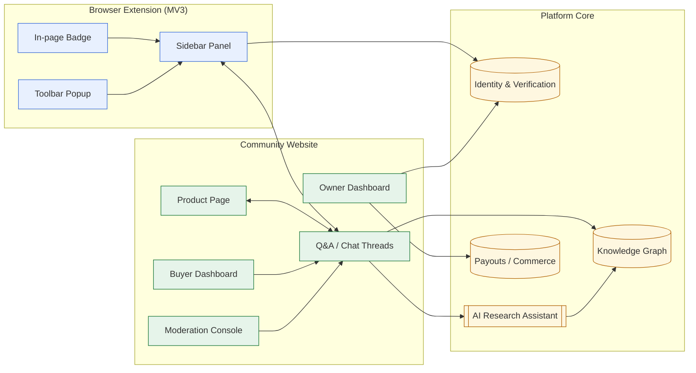
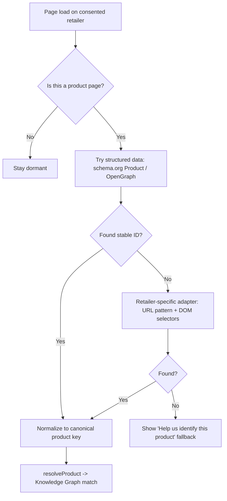
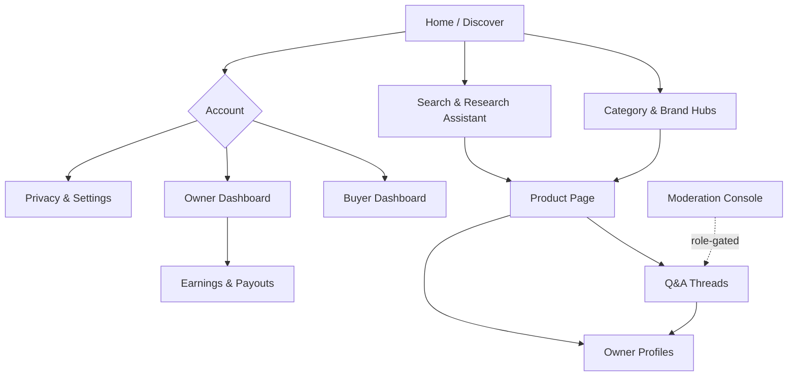
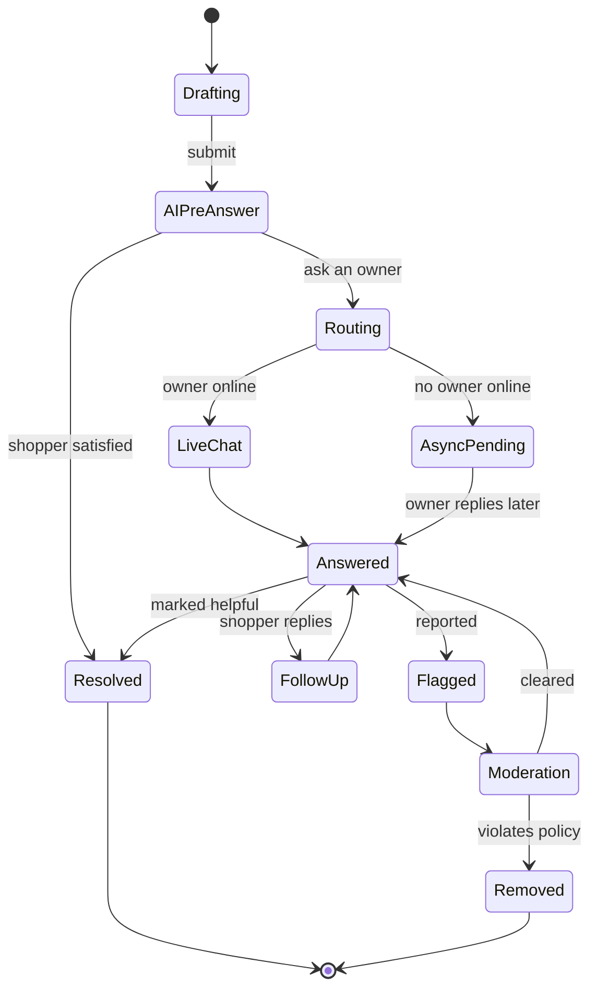
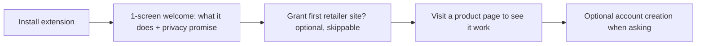
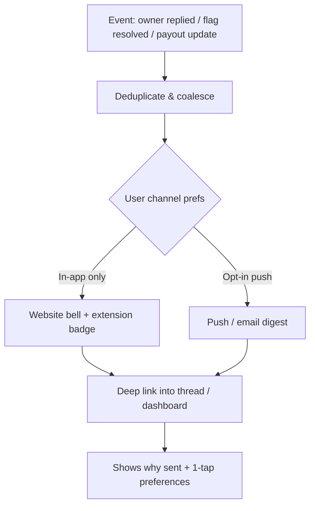
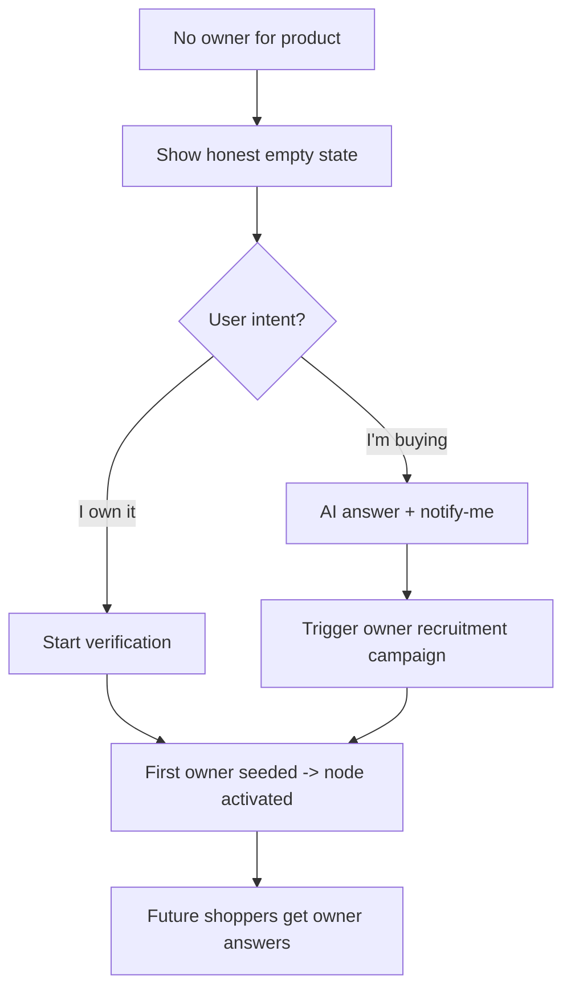
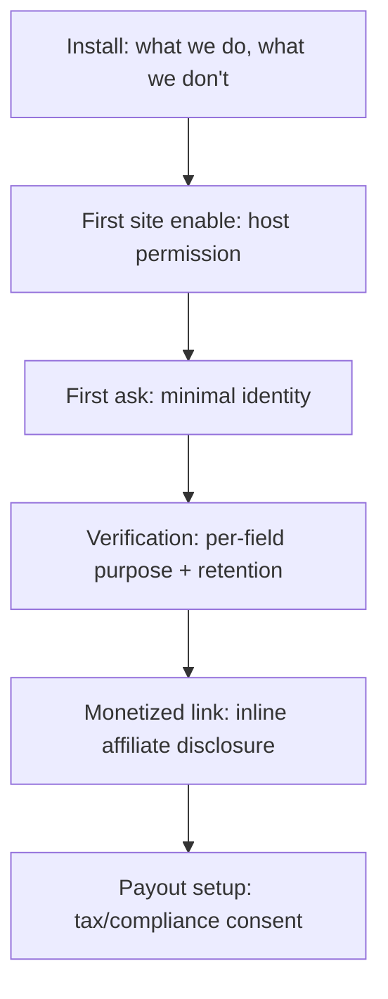

# 03 — UX, Browser Extension & Community Experience

> **Scope.** This document is the high-level UX design for Owners.app across its two
> primary surfaces — the **browser extension** (acquisition surface) and the
> **community website** (depth surface) — plus the cross-cutting experience layers:
> onboarding, real-time chat, dashboards, accessibility & i18n, mobile/responsive,
> notifications, empty/cold-start states, and interaction/disclosure design.
>
> It describes the product as the **user perceives and controls it**. Persona journeys
> are summarized here and link to the full flows; engineering, policy, and commerce
> details live in the sibling documents cross-referenced throughout.

## Related documents

- [01 — User Personas & Flows](./01-user-persona-flows.md) — full persona journeys (A–F) and JTBD.
- [02 — Foundation & Components](./02-foundation-and-components.md) — vision, principles, terminology.
- [04 — Architecture, Data & APIs](./04-architecture-data-and-apis.md) — the engineering contract behind these surfaces.
- [05 — Trust, Incentives & Fraud](./05-trust-verification-incentives-and-fraud.md) — reputation, ranking, moderation, anti-abuse.
- [06 — AI, Search & Knowledge Graph](./06-ai-and-product-knowledge-graph.md) — AI synthesis, product resolution, knowledge graph.
- [07 — Commerce, Privacy & Legal](./07-commerce-privacy-security-and-legal.md) — affiliate/payout mechanics, consent, retention, legal backing.
- [08 — Roadmap & Operations](./08-roadmap-operations-risks-and-backlog.md) — sequencing and operational readiness.

> **Authority note.** Where UX claims touch money, identity, or data retention, the
> authoritative rules live in [07 — Commerce, Privacy & Legal](./07-commerce-privacy-security-and-legal.md)
> and [05 — Trust, Incentives & Fraud](./05-trust-verification-incentives-and-fraud.md). If this document
> ever conflicts with those, **those sections win**.

---

## Table of Contents

1. [Experience Principles](#experience-principles)
2. [Persona-to-Surface Mapping](#persona-to-surface-mapping)
3. [Surface Map (extension ↔ website ↔ core)](#surface-map)
4. [Browser Extension](#browser-extension)
   - [Manifest V3 assumptions](#manifest-v3-assumptions)
   - [Detection & product ID extraction](#detection--product-id-extraction)
   - [Sidebar, badges & popup](#sidebar-badges--popup)
   - [Safe behavior boundaries (hard rules)](#safe-behavior-boundaries-hard-rules)
   - [Wireframes](#wireframes)
5. [Community Website](#community-website)
   - [Global IA](#global-ia)
   - [Product page (PDP) IA](#product-page-pdp-information-architecture)
   - [Real-time chat & Q&A](#real-time-chat-and-qa-experience)
   - [Onboarding & verification UX](#onboarding-and-verification-ux)
   - [Buyer & owner dashboards](#buyer-and-owner-dashboards)
6. [Mobile & Responsive](#mobile-and-responsive-considerations)
7. [Accessibility & Internationalization](#accessibility-and-internationalization)
8. [Notifications](#notifications)
9. [Empty States & Cold-Start UX](#empty-states-and-cold-start-ux)
10. [UX Safety, Disclosure & Consent Defaults](#ux-safety-disclosure-consent-and-privacy-defaults)
11. [Consolidated Acceptance Criteria & Edge Cases](#consolidated-acceptance-criteria-and-edge-cases)

---

## Experience Principles

These principles govern every screen decision in this document.

1. **Owner answers beat opinions.** The UI must always make it visually obvious whether
   information comes from a *verified owner*, *the community*, *the brand*, or *AI
   synthesis*. Provenance is a first-class UI element, never a footnote.
2. **Calm by default.** The extension is silent until it has something genuinely useful.
   No autoplay, no nags, no interstitials over checkout.
3. **Consent precedes capability.** Nothing reads page content, product IDs, or purchase
   history until the user grants the specific permission for that capability
   (see [07 — Commerce, Privacy & Legal](./07-commerce-privacy-security-and-legal.md)).
4. **One identity, two surfaces.** The extension and the website share one account, one
   reputation, and one notification stream. Context follows the user.
5. **Disclosure is non-negotiable.** Any monetized link, affiliate relationship, or
   sponsored answer is labeled inline at the point of interaction
   (see [07 — Commerce, Privacy & Legal](./07-commerce-privacy-security-and-legal.md)).
6. **Cold start is a feature, not an apology.** Empty states actively recruit the first
   owners and route questions to the AI assistant with honest "no verified owner yet"
   framing.
7. **Accessibility is acceptance criteria.** WCAG 2.2 AA is a gate, not a stretch goal.

---

## Persona-to-Surface Mapping

Journeys are summarized here; the **full step-by-step flows (A–F)** live in
[01 — User Personas & Flows](./01-user-persona-flows.md).

| Persona | Primary JTBD | Key surface | Success signal |
| --- | --- | --- | --- |
| **Shopper "Sam"** | "Before I buy, get a real answer from someone who owns this." | Extension sidebar on retailer PDP | Asks a question, receives a trusted answer, buys (or skips) with confidence |
| **Verified Owner "Olivia"** | "Help others and earn a share when my knowledge drives a purchase." | Owner dashboard + chat | Answers questions, earns reputation, receives compliant payout |
| **Long-term Owner "Leo"** | "Share how this product held up after 18 months." | Ownership updates / review prompts | Posts a durability update surfaced on the PDP |
| **Researcher "Riya"** | "Compare 3 options across real ownership experience." | AI Research Assistant | Gets a synthesized, cited comparison grounded in owner answers |
| **Moderator "Mara"** | "Keep answers honest, on-topic, and safe." | Moderation surfaces | Resolves flags quickly with full context |
| **Brand rep "Bram"** (optional) | "Officially answer and correct misinformation." | Verified brand seat | Posts labeled official answers |

Journey-to-surface quick reference (see the full journeys in
[01 — User Personas & Flows](./01-user-persona-flows.md)):

- **Journey A — Shopping & discovering owners** → extension badge → sidebar.
- **Journey B — Asking a question** → sidebar Ask box → AI pre-answer → owner routing.
- **Journey C — Becoming a verified owner** → onboarding & verification UX.
- **Journey D — Long-term ownership updates** → longevity prompts on the owner dashboard.
- **Journey E — Contributor payouts** → owner dashboard earnings timeline.
- **Journey F — AI-assisted product research** → website research assistant.

---

## Surface Map

The **extension** is the acquisition surface (it meets shoppers where they already are).
The **website** is the depth surface (durable threads, dashboards, research). The **core**
services are detailed in [04 — Architecture, Data & APIs](./04-architecture-data-and-apis.md)
and [06 — AI, Search & Knowledge Graph](./06-ai-and-product-knowledge-graph.md).



This describes the extension as the **user perceives and controls it**; the engineering
contract is in [04 — Architecture, Data & APIs](./04-architecture-data-and-apis.md).

---

## Browser Extension

### Manifest V3 assumptions

- **Service worker** (event-driven, ephemeral) handles product resolution, auth token
  exchange, and messaging; no persistent background page.
- **Content scripts** are injected only on user-approved retailer domains and only read
  the DOM needed to extract a product identifier.
- **Permissions are scoped and incremental**: `activeTab` + per-site host permissions
  requested via `optional_host_permissions`, not a blanket `<all_urls>` grant at install.
- **Side Panel API** powers the sidebar; the toolbar **action popup** offers quick status
  and settings.
- **`declarativeNetRequest`** (not blocking `webRequest`) is used sparingly, and **only**
  for affiliate link decoration on explicitly disclosed, consented flows
  (see [Safe behavior boundaries](#safe-behavior-boundaries-hard-rules)).
- **Storage**: `chrome.storage.session` for transient page context; `chrome.storage.local`
  for settings; auth secrets held by the service worker, never in page context.

### Detection & product ID extraction



- Prefer **structured data** (`schema.org/Product`, `gtin`, `mpn`, `sku`, OpenGraph)
  before brittle DOM scraping.
- **Retailer adapters** encapsulate per-site quirks; failures degrade gracefully to a
  manual "identify product" affordance rather than guessing.
- Normalization maps retailer SKUs to a **canonical product node**
  (see [06 — AI, Search & Knowledge Graph](./06-ai-and-product-knowledge-graph.md)).

### Sidebar, badges & popup

- **In-page badge:** a single, calm chip near the product title (e.g., "12 verified
  owners · 34 answers"). Click opens the sidebar. Never overlaps host CTAs; respects host
  page reflow.
- **Sidebar (Side Panel):** the full Q&A surface — search existing answers, ask, watch
  live owner presence, follow up. Fully keyboard navigable and screen-reader labeled.
- **Toolbar popup:** account status, per-site permission toggles, notification summary,
  and a global "pause Owners.app on this site" switch.

### Safe behavior boundaries (hard rules)

The extension operates inside someone else's page. These boundaries are non-negotiable and
are what keep the product trustworthy and store-policy compliant.

- **Never** read page content on non-consented domains.
- **Never** auto-submit, auto-fill, or interact with the host page's cart/checkout.
- **Never** exfiltrate full page HTML; only the minimal product identifiers and the fields
  the user explicitly shares.
- **Never** rewrite host page links silently. See the affiliate-safety note below.
- **Always** make the extension's presence and current permission scope inspectable from
  the popup in one click.

> **Affiliate-link safety (important boundary).** Affiliate/partner link decoration is a
> **sensitive** capability, not an automatically legitimate one. Replacing or redirecting a
> retailer's links — or reloading a page to attach an affiliate parameter — is **not**
> inherently allowed just because it produces revenue. It is permitted **only** when it
> meets *all* of these conditions, and it must be treated as off by default:
>
> 1. The user has taken an **explicit, disclosed action** on an Owners.app affiliate link
>    (not a background rewrite of the host page's own links).
> 2. An **inline disclosure** is visible at the point of action.
> 3. The behavior complies with the retailer's / affiliate program's terms **and** browser
>    web-store policies on link/redirect manipulation.
> 4. Nothing overwrites an existing attribution the shopper or another party already set
>    ("last-click hijacking" is prohibited).
>
> The UX **must not** imply that affiliate replacement or a silent reload is a free,
> always-legitimate action. The authoritative rules — including which retailers permit
> decoration and how attribution is recorded — live in
> [07 — Commerce, Privacy & Legal](./07-commerce-privacy-security-and-legal.md), which wins on any conflict.

**Acceptance criteria**

- **AC-X1:** Fresh install requests *no* host permissions; the first per-site grant is
  explicit and revocable.
- **AC-X2:** With the extension paused on a site, zero network calls reference that site's
  content.
- **AC-X3:** Sidebar passes automated axe-core checks with no critical violations.
- **AC-X4:** CPU/memory budget: content-script idle cost negligible; no measurable jank
  (>50ms long tasks) on host scroll.
- **AC-X5:** No host-page link is modified, redirected, or reloaded for affiliate purposes
  without a preceding explicit user action and a visible inline disclosure; existing
  attribution is never overwritten.

### Wireframes

#### PDP (desktop) — ASCII

```text
+---------------------------------------------------------------+
|  [Brand]  Acme Noise-Cancelling Headphones XT          [Save] |
|  [img]    ★ owners' longevity: holds up at 18mo                |
|           Verified owners: 12 · Answers: 34 · Updated 3d ago   |
+---------------------------------------------------------------+
|  ┌─────────────────────────────────────────────────────────┐  |
|  │  Ask a verified owner…                          [ Ask ▸ ]│  |
|  └─────────────────────────────────────────────────────────┘  |
|  AI summary of owner answers (cited)            [show owners] |
+---------------------------------------------------------------+
|  TOP OWNER ANSWERS                                            |
|  ┌───────────────────────────────────────────────────────┐   |
|  │ ✔ Verified owner · Olivia · 14mo owned                 │   |
|  │ "Battery still ~90%. ANC great on planes…"  [helpful 41]│   |
|  └───────────────────────────────────────────────────────┘   |
|  ┌───────────────────────────────────────────────────────┐   |
|  │ ✔ Verified owner · Leo · 6mo owned                     │   |
|  │ "Hinge creaks after a drop…"               [helpful 22]│   |
|  └───────────────────────────────────────────────────────┘   |
+---------------------------------------------------------------+
|  OWNERSHIP OVER TIME   30d ── 6mo ── 12mo ── 18mo →           |
|  LIVE NOW: 3 owners online        OWNERS ALSO CONSIDERED: ... |
+---------------------------------------------------------------+
|  Disclosures: some links are affiliate. Data sources. Privacy |
+---------------------------------------------------------------+
```

#### Extension sidebar (in-page) — ASCII

```text
+--------------------------+   <- Browser Side Panel
| Owners.app        [⚙][x] |
|--------------------------|
| Acme Headphones XT       |
| 12 owners · 34 answers   |
|--------------------------|
| [ Ask a verified owner ] |
|--------------------------|
| Live now: ● Olivia       |
|           ● Leo (away)   |
|--------------------------|
| Top answers              |
| ✔ "Battery ~90% @14mo"   |
| ✔ "ANC excellent…"       |
|--------------------------|
| Disclosure: affiliate ⓘ  |
+--------------------------+
```

#### Toolbar popup (permission & pause controls) — ASCII

```text
+------------------------------+
| Owners.app                   |
| Signed in as sam@…    [acct] |
|------------------------------|
| This site: amazon.com        |
|  Enabled  [ ●───○ pause ]    |
|  Reads: product ID only      |
|------------------------------|
| Notifications (2)         ▸  |
| Privacy center            ▸  |
| Per-site permissions      ▸  |
+------------------------------+
```

#### Mobile PDP — ASCII

```text
+----------------------+
| Acme Headphones XT   |
| ✔12 owners · upd 3d  |
| [longevity: 18mo ok] |
|----------------------|
| AI summary (cited) ▾ |
|----------------------|
| Top owner answers ▾  |
| ✔ Olivia 14mo …      |
| ✔ Leo 6mo …          |
|----------------------|
| Owners online: 3     |
|......................|
| [ Ask an owner   ▸ ] | <- sticky bottom bar
+----------------------+
```

---

## Community Website

### Global IA



### Product page (PDP) information architecture

Priority order, top to bottom:

1. **Identity strip** — product name, canonical image, brand, key specs, and a
   **provenance summary** ("X verified owners, last update N days ago").
2. **Ask box** — primary CTA; AI-backed instant answer with owner sourcing.
3. **Top owner answers** — ranked by helpfulness + recency + owner tier
   (see [05 — Trust, Incentives & Fraud](./05-trust-verification-incentives-and-fraud.md)).
4. **Ownership over time** — longevity timeline (Journey D — see
   [01 — User Personas & Flows](./01-user-persona-flows.md)).
5. **Live & recent activity** — owners online now, recent answered questions.
6. **Comparisons** — "Owners also considered…" linking to candidate products.
7. **Disclosures footer** — affiliate relationships, sponsorship state, data sources
   (see [07 — Commerce, Privacy & Legal](./07-commerce-privacy-security-and-legal.md)).

See the full PDP wireframe in [Wireframes](#wireframes).

### Real-Time Chat and Q&A Experience

#### Presence and routing

- **Owner presence states:** `online`, `away`, `typically replies in ~Nh`, `offline`.
  Presence is privacy-respecting (no precise last-seen timestamps shown publicly).
- **Routing:** a question fans out to matched owners by product node, owner tier, topic
  affinity, and current availability — without spamming all owners
  (see [05 — Trust, Incentives & Fraud](./05-trust-verification-incentives-and-fraud.md)).



#### Async follow-up

- Questions never expire silently; if no owner answers within an SLA window, the shopper is
  offered AI synthesis + an owner-recruitment trigger.
- See [Notifications](#notifications) for how updates reach the shopper across surfaces.

#### Moderation surfaces

- **Inline flag** on every answer with structured reasons (off-topic, incorrect,
  undisclosed promotion, harassment, PII).
- **Moderation console** (role-gated) shows the flagged item with full thread context,
  owner verification tier, edit history, and prior moderation actions.
- **Owner self-correction:** owners can edit/retract answers; the system keeps a visible,
  tamper-evident edit trail.

**Acceptance criteria**

- **AC-CH1:** Live chat messages deliver in <1s p95 when both parties are online; degraded
  networks fall back to async without data loss.
- **AC-CH2:** Every answer exposes provenance (owner tier / AI / brand) and timestamp.
- **AC-CH3:** A shopper can always reach a non-AI owner answer path when an owner exists.
- **AC-CH4:** Flagged content is hidden pending review only for high-severity categories
  (harassment, PII, illegal); low-severity stays visible with a flag marker to avoid
  censorship-by-flag.

### Onboarding and Verification UX

#### First-run (shopper)



- The first run explains value and the **privacy-forward defaults** in one screen, then
  gets out of the way. No account required to browse.

#### Verification (owner)

- **Method chooser** with a clear privacy/effort tradeoff per method:
  - Redacted receipt upload (privacy-preserving, manual-ish)
  - Order confirmation link/email parse (consented)
  - Retailer account connect (fastest, most data — clearly labeled scope)
  - Photo of product + serial (for certain categories)
- **Progressive trust:** users can start contributing in a `pending` state with answers
  held or labeled until verification clears, reducing drop-off while protecting trust
  (see [05 — Trust, Incentives & Fraud](./05-trust-verification-incentives-and-fraud.md)).
- **Status transparency:** a persistent verification card shows current tier, what raises
  it, and expiry/re-verification timing.

**Acceptance criteria**

- **AC-V1:** Onboarding completable with keyboard only and via screen reader.
- **AC-V2:** No verification method is mandatory; at least one path avoids connecting
  external accounts.
- **AC-V3:** Every requested data element shows *why it's needed* and *how long it's
  retained* at the point of request
  (see [07 — Commerce, Privacy & Legal](./07-commerce-privacy-security-and-legal.md)).

### Buyer and Owner Dashboards

#### Buyer dashboard

- **Watched products** and saved questions with answer notifications.
- **Your questions** with status (answered, awaiting owner, AI-answered).
- **Purchases / interests** (only what the user chose to share) feeding better
  recommendations.
- **Privacy center** shortcut: per-site permissions, data export, delete.

#### Owner dashboard

- **Your verified products** with badge tiers and re-verification reminders.
- **Inbox / routed questions** with availability toggle and canned-but-editable starters.
- **Reputation** breakdown (helpfulness, accuracy, longevity contributions)
  (see [05 — Trust, Incentives & Fraud](./05-trust-verification-incentives-and-fraud.md)).
- **Earnings** with the payout status timeline (Journey E) and compliance checklist
  (see [07 — Commerce, Privacy & Legal](./07-commerce-privacy-security-and-legal.md)).
- **Longevity prompts** queue (Journey D).

**Acceptance criteria**

- **AC-DB1:** Earnings figures reconcile to per-answer attribution and never display a
  number the owner can't drill into.
- **AC-DB2:** Availability toggle instantly affects routing and presence.
- **AC-DB3:** Both dashboards expose a one-click path to pause all activity and to
  export/delete data.

---

## Mobile and Responsive Considerations

- **Extension is desktop-class**, but the **website is mobile-first**. On mobile, the
  "extension sidebar" experience is delivered via:
  - A **PWA** and share-sheet target ("Share to Owners.app") so a shopper can send a
    product URL/link from a retailer app and get the same resolve→answer flow.
  - Deep links from notifications back into the relevant thread.
- **Responsive breakpoints:** single-column PDP on small screens with the **Ask box
  pinned** as a sticky bottom bar; answers in a collapsible accordion; longevity timeline
  becomes horizontally scrollable.
- **Touch targets** ≥44×44px; chat composer avoids covering the latest message; safe-area
  insets respected.
- **Offline/poor network:** queued questions and optimistic UI with a clear "will send when
  online" state.

**Acceptance criteria**

- **AC-M1:** PDP is fully usable at 320px width with no horizontal scroll of primary
  content.
- **AC-M2:** Sticky Ask bar never obscures disclosures or the most recent chat message.
- **AC-M3:** Share-sheet flow resolves a product and reaches the Ask box in ≤3 taps.

---

## Accessibility and Internationalization

### Accessibility (target: WCAG 2.2 AA)

- Full **keyboard operability** for sidebar, chat, ask box, and dashboards; visible focus
  rings; logical tab order.
- **Screen reader semantics:** ARIA live regions for incoming chat/presence updates
  (polite, not assertive, except urgent moderation prompts); labeled provenance badges read
  as text ("Verified owner answer").
- **Color is never the only signal** for provenance, status, or disclosure — icons + text
  accompany color.
- **Motion:** respect `prefers-reduced-motion`; presence pulses and typing indicators
  degrade to static.
- **Contrast:** ≥4.5:1 body, ≥3:1 large text and UI components.
- **Captions/transcripts** for any video answers; alt text required on image answers
  (assistive prompt provided).

### Internationalization & localization

- **Unicode/RTL-ready** layouts; mirrored UI for RTL locales.
- **Localized number/currency/date** formatting, critical for earnings and payouts
  (see [07 — Commerce, Privacy & Legal](./07-commerce-privacy-security-and-legal.md)).
- **Translation of owner answers:** on-demand machine translation clearly labeled as
  translated, with the original always one tap away to preserve trust.
- **Locale-aware product resolution:** the same product across regional retailers maps to
  the canonical node while preserving region-specific availability/disclosures.

**Acceptance criteria**

- **AC-AX1:** Zero critical/serious axe-core violations on PDP, sidebar, chat, and
  dashboards.
- **AC-AX2:** All interactive elements reachable and operable by keyboard and screen
  reader.
- **AC-I18N1:** No hard-coded user-facing strings; all via the i18n catalog.
- **AC-I18N2:** RTL layout verified for PDP and chat; translated content labeled.

---

## Notifications

Notifications are **unified across surfaces** (extension popup badge, website bell,
optional email/push) and share a single stream tied to one identity.

- **Batched to avoid fatigue.** Related events coalesce; digests are preferred over a
  stream of interrupts.
- **Explains itself.** Each notification states *why* it was sent and links to one-tap
  preferences.
- **Actionable & deep-linked.** A notification opens directly to the relevant thread,
  question, verification step, or earnings entry.
- **Respects quiet defaults.** Push/email are opt-in; nothing is enabled silently.



**Acceptance criteria**

- **AC-N1:** Every notification names its trigger and links to preferences in one tap.
- **AC-N2:** No push/email channel is active without explicit opt-in.
- **AC-N3:** Notifications for the same thread coalesce rather than stacking one-per-event.

---

## Empty States and Cold-Start UX

The platform's hardest problem is the first owner for any given product. UX must turn
emptiness into **recruitment and honesty**, never a dead end.

| Situation | What the user sees | Active behavior |
| --- | --- | --- |
| Product matched, **no owners yet** | "No verified owners yet — be the first, or ask and we'll find one." | Offer ownership verification; allow asking → AI answer from docs/specs + queue for future owners |
| Product matched, **owners but no answer to this Q** | AI synthesis + "Notify me when an owner answers" | Route to owners async; trigger targeted recruitment |
| **No product match** | "Help us identify this product" with prefilled guess | Crowd-assisted identification feeds the graph (see [06 — AI, Search & Knowledge Graph](./06-ai-and-product-knowledge-graph.md)) |
| **No owners online** | "Owners typically reply in ~Nh" + async post | Honest ETA; async notification |
| **New owner, zero answers** | Guided first-answer prompts for their verified products | Reduce blank-page paralysis |
| **New buyer, empty dashboard** | Suggested products from current browsing + watch prompts | Seed engagement without dark patterns |



**Acceptance criteria**

- **AC-CS1:** No empty state is a dead end; each offers at least one forward action
  (verify, ask, identify, or notify-me).
- **AC-CS2:** Cold-start framing never implies owners exist when they don't.
- **AC-CS3:** AI-only answers in cold-start are explicitly labeled as not owner-verified.

---

## UX Safety, Disclosure, Consent, and Privacy Defaults

These are UX-level commitments; the legal/technical backing lives in
[07 — Commerce, Privacy & Legal](./07-commerce-privacy-security-and-legal.md).

### Privacy-forward defaults

- **Opt-in per site.** No data is read until the user enables Owners.app for that retailer.
- **Local-first context.** Page context stays in `chrome.storage.session` and is discarded
  when not needed.
- **Data minimization.** Only the product identifier and explicitly shared fields leave the
  device.
- **No silent tracking.** No cross-site behavioral profiling for ads; the business model is
  compliant, disclosed affiliate/partner revenue
  (see [07 — Commerce, Privacy & Legal](./07-commerce-privacy-security-and-legal.md)).
- **One-click pause and revoke** from the popup and the privacy center.
- **Transparent retention.** Each data type shows its retention period at collection time.

### Disclosure & consent surfaces



- **Affiliate disclosure** is inline at the link, not buried in a footer, and is
  machine-logged for the owner's earning record. Consistent with the
  [affiliate-link safety boundary](#safe-behavior-boundaries-hard-rules): decoration is an
  explicit, consented, disclosed action — never a silent background rewrite.
- **Sponsored answers** (if ever allowed) are visually segregated and labeled; ranking
  integrity is preserved (see [05 — Trust, Incentives & Fraud](./05-trust-verification-incentives-and-fraud.md)).
- **AI labeling** is mandatory wherever synthesis appears.
- **PII guards** warn before posting serial numbers, addresses, or order IDs and offer
  redaction.

**Acceptance criteria**

- **AC-S1:** A user can see, in ≤2 clicks from any surface, exactly what data Owners.app
  holds and can export/delete it.
- **AC-S2:** Every monetized interaction carries a visible, accessible disclosure at the
  point of action.
- **AC-S3:** Disabling a site produces zero content reads or network calls referencing that
  site.
- **AC-S4:** All consent is granular, revocable, and logged; revoking does not break core
  browsing.

---

## Consolidated Acceptance Criteria and Edge Cases

### Cross-cutting acceptance criteria

- **Provenance everywhere:** No answer renders without a provenance label and timestamp.
- **Honesty in scarcity:** Empty/cold-start states never fabricate owner presence.
- **Consent before capability:** No capability activates before its specific consent.
- **Disclosure at the point of action:** Money is always labeled where it appears, and
  affiliate decoration is never silent or assumed-legitimate.
- **Accessibility gate:** AA conformance required to ship any user-facing surface.
- **Reversibility:** Pause, revoke, export, and delete are reachable from every surface.

### Notable edge cases

| Area | Edge case | UX response |
| --- | --- | --- |
| Detection | Retailer A/B tests DOM | Adapter fails safe to "identify product"; no wrong badge |
| Identity | Same physical owner, multiple accounts | Linked via verification; reputation not double-counted (see [05 — Trust, Incentives & Fraud](./05-trust-verification-incentives-and-fraud.md)) |
| Chat | Owner goes offline mid-thread | Converts to async; shopper notified; no message loss |
| Affiliate | Retailer/program forbids link decoration | Decoration disabled for that retailer; plain link shown; no silent rewrite (see [07 — Commerce, Privacy & Legal](./07-commerce-privacy-security-and-legal.md)) |
| Affiliate | Existing attribution already present | Owners.app does not overwrite it; no last-click hijack |
| Payouts | Conversion reversed post-payout | Status `reversed`, transparent explanation; policy-bound recovery (see [07 — Commerce, Privacy & Legal](./07-commerce-privacy-security-and-legal.md)) |
| Research | Conflicting owner answers | Assistant surfaces disagreement honestly with both citations |
| i18n | Translated answer changes meaning | Original one tap away; "translated" label persistent |
| Privacy | User revokes mid-session | In-flight context purged; UI returns to dormant |
| Moderation | Coordinated false flags | Low-severity stays visible with marker; pattern flagged to anti-abuse (see [05 — Trust, Incentives & Fraud](./05-trust-verification-incentives-and-fraud.md)) |

---

> **Cross-section authority.** All UX claims about money, identity, and data retention
> defer to the authoritative policy in
> [07 — Commerce, Privacy & Legal](./07-commerce-privacy-security-and-legal.md) and
> [05 — Trust, Incentives & Fraud](./05-trust-verification-incentives-and-fraud.md); where conflicts arise,
> those documents win.
