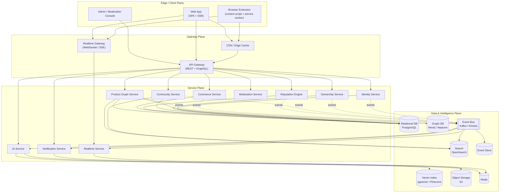
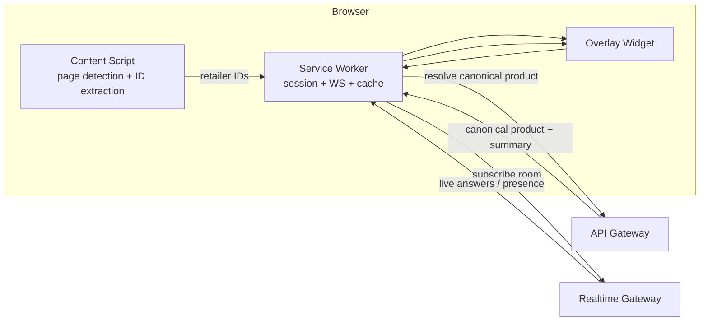
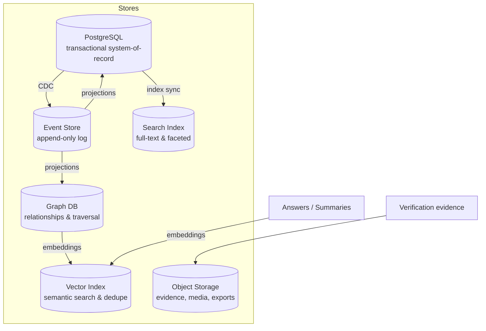
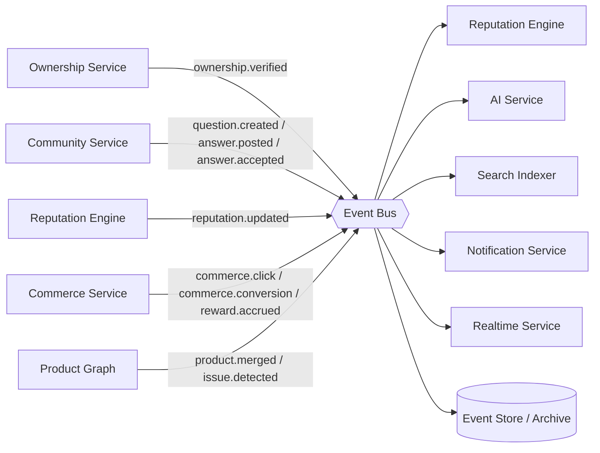
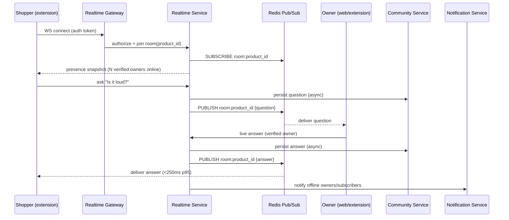
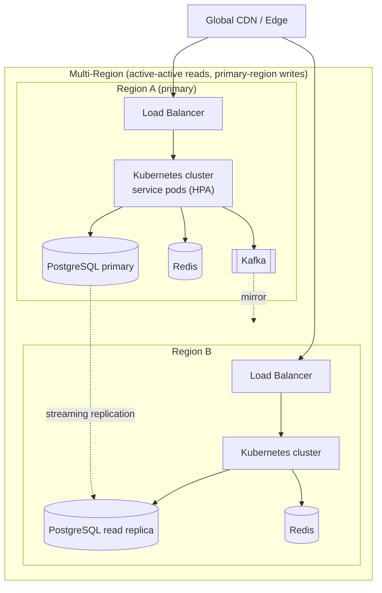
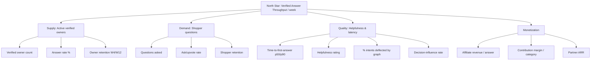
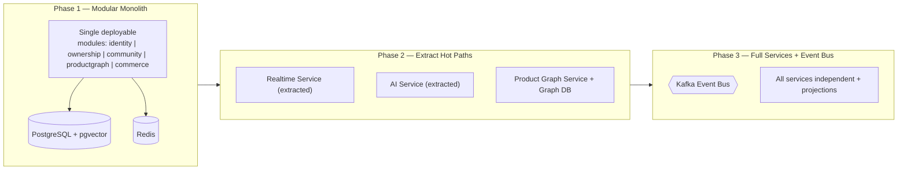

# Architecture, Data & APIs

> **Part of the Owners.app product & design documentation set.** This document is the engineering
> backbone: it defines the system architecture, backend services, data stores, public APIs, the
> domain event model, and the deployment/operations posture that the rest of the platform plugs into.

## Purpose & scope

This is the standalone, implementation-ready architecture reference for the **Verified Owners
Platform**. It covers:

- Architecture overview, goals, and quality attributes
- Backend services and their boundaries
- Database design (polyglot persistence)
- REST and GraphQL APIs (design-level examples)
- The domain event model and event catalog
- The realtime service and its delivery guarantees
- Deployment, scaling, caching, queues, search, and observability
- The migration path from an MVP modular monolith to modular services
- Architecture acceptance criteria

The design is intentionally **stack-adaptable**: concrete technologies (PostgreSQL, Redis, Kafka,
Neo4j/Neptune, OpenSearch, pgvector/Pinecone, Kubernetes) are named as *reference implementations* to
make the design concrete, not as hard requirements. Swapping any one component should be a local
decision, not an architectural rewrite.

> **Non-goal:** This document does **not** define privacy, consent, or legal/compliance policy in
> depth. It only describes the *architectural boundaries* that make those policies enforceable. For
> policy detail, see [Commerce, Privacy, Security & Legal](07-commerce-privacy-security-and-legal.md).

## Related documents

| Concern | Where it lives |
| --- | --- |
| User & contributor journeys | [User & Persona Flows](01-user-persona-flows.md) |
| Vision, strategy, success metrics | [Foundation & Components](02-foundation-and-components.md) |
| Extension UX, community website, onboarding | [UX, Extension & Community](03-ux-extension-and-community.md) |
| Ownership verification, reputation, incentives, fraud, moderation | [Trust, Verification, Incentives & Fraud](05-trust-verification-incentives-and-fraud.md) |
| Product knowledge graph, AI layer, RAG, search | [AI & Product Knowledge Graph](06-ai-and-product-knowledge-graph.md) |
| Commerce, affiliate compliance, privacy, security, legal | [Commerce, Privacy, Security & Legal](07-commerce-privacy-security-and-legal.md) |
| Roadmap, operations runbooks, risks, backlog | [Roadmap, Operations, Risks & Backlog](08-roadmap-operations-risks-and-backlog.md) |

---

## Architecture Overview

### Architecture Goals & Quality Attributes

The platform's defensible asset is the **product ownership knowledge graph** — the accumulated,
structured, verified knowledge of real owners. Every architectural decision optimizes for capturing,
structuring, and reusing that knowledge while keeping the shopper experience instantaneous inside the
browser.

| Quality Attribute | Target | Architectural Driver |
| --- | --- | --- |
| **Latency (read path)** | p95 < 150 ms for product lookup; first answer/summary < 1 s perceived | Edge caching, CDN, denormalized read models, pre-computed AI summaries |
| **Realtime delivery** | p95 message fan-out < 250 ms within a room | WebSocket fabric with regional brokers and presence sharding |
| **Availability** | 99.9% for read/lookup; 99.5% for write/realtime | Stateless services, multi-AZ, graceful degradation to cached answers |
| **Scalability** | 10M MAU, 100k concurrent realtime sessions, 50M canonical products | Horizontal scale-out, partitioned graph, async ingestion |
| **Knowledge integrity** | Verified ownership provenance on every answer | Ownership Service as system-of-record for verification claims |
| **Trust & safety** | < 1% unmoderated policy-violating content surfaced | Moderation pipeline + reputation gating + AI pre-screen |
| **Cost efficiency** | AI spend bounded per-product, not per-request | Summary caching + embedding reuse + tiered model routing |
| **Evolvability** | New retailer/source onboarded in < 2 weeks | Adapter pattern at ingestion edge; canonical-id abstraction |
| **Compliance separation** | Affiliate/commerce isolated from content trust | Commerce Service boundary; no commerce signal in ranking |

The system is organized into four planes:

1. **Edge / Client plane** — the browser extension and web app where shoppers and owners interact.
2. **Gateway plane** — authentication, routing, rate limiting, and protocol translation.
3. **Service plane** — domain microservices, each owning its data and emitting domain events.
4. **Data & Intelligence plane** — relational stores, the graph database, vector index, object
   storage, search, the event store/stream, and the AI inference layer.



**Boundary principle:** clients never talk to a domain service directly — all traffic flows through
the **API Gateway** (request/response) or the **Realtime Gateway** (streaming). Services communicate
synchronously only when a request must be satisfied inline; everything else is asynchronous via the
**Event Bus** to keep the write path fast and the services loosely coupled.

### Security-Relevant Architecture Boundaries

This section names boundaries only; policy lives in
[Commerce, Privacy, Security & Legal](07-commerce-privacy-security-and-legal.md).

- **AuthN/Z chokepoint** — all traffic passes the API/Realtime Gateways; services trust signed tokens
  validated against the Identity Service JWKS; service-to-service calls use mTLS + scoped tokens.
- **Ownership as trust anchor** — answering requires a verified `ownership_claim`; the Ownership
  Service is the only writer of verification status, and answers carry an immutable claim reference
  (see: [Trust, Verification, Incentives & Fraud](05-trust-verification-incentives-and-fraud.md)).
- **Commerce isolation** — the Commerce Service is a sink, not a source, of trust: commerce/affiliate
  signals **must not** influence ranking, reputation, or AI summaries
  (see: [Commerce, Privacy, Security & Legal](07-commerce-privacy-security-and-legal.md)).
- **Evidence containment** — verification evidence lives only in access-controlled object storage,
  referenced by key; never inlined into relational rows, logs, or events.
- **AI provenance & guardrails** — AI summaries cite source verified answers and are pre-screened;
  generated content is clearly labeled and never fabricates ownership
  (see: [AI & Product Knowledge Graph](06-ai-and-product-knowledge-graph.md)).
- **Moderation auditability** — every moderation/admin action is event-sourced and immutable.
- **Tenant of least privilege** — each service has scoped DB credentials and topic ACLs; no shared
  super-user database access across service boundaries.

---

## Backend Services

Each service owns its data and its slice of the domain. Cross-service reads happen via composite
gateway queries or event-derived read models — never via direct database sharing.

### Browser Extension Client

The extension is the primary acquisition surface. It runs as a Manifest V3 extension with:

- **Content script** — detects product pages on supported retailers, extracts retailer identifiers
  (ASIN, SKU, UPC/GTIN, model), and injects the Owners.app overlay/widget.
- **Service worker (background)** — manages the auth session, opens the realtime connection, and
  caches the canonical-product resolution.
- **Overlay UI** — surfaces the AI owner-summary, top verified answers, the "Ask an Owner" entry
  point, and the commerce handoff CTA.



Design rules:

- The extension **never** scrapes or transmits more than the minimal retailer identifiers needed for
  canonical resolution. Identifier extraction is governed by per-retailer adapter manifests.
- All AI summaries shown in the overlay are **pre-computed and cached** server-side
  (see: [AI & Product Knowledge Graph](06-ai-and-product-knowledge-graph.md)); the extension fetches,
  it does not generate.
- Commerce CTAs are rendered only when the Commerce Service
  (see: [Commerce, Privacy, Security & Legal](07-commerce-privacy-security-and-legal.md)) returns a
  compliant, disclosed offer.

> Full extension UX, wireframes, and safe-behavior boundaries live in
> [UX, Extension & Community](03-ux-extension-and-community.md).

### Web Application

A server-rendered + hydrated SPA providing the full community experience: product pages, question
threads, owner profiles, reputation dashboards, contributor earnings, and onboarding/verification
flows. The web app is SEO-critical (canonical product pages are the organic-growth engine) so product
and answer pages are server-rendered with structured data.

### API Gateway

- Terminates TLS, authenticates requests (delegating token validation to the Identity Service / JWKS),
  enforces global and per-principal rate limits, and routes to services.
- Exposes **REST** for simple resource access and **GraphQL** for the composite read views the web app
  and overlay need (one round-trip to assemble product + answers + reputation + commerce).
- Performs request shaping, response caching (for anonymous lookups), and schema/version negotiation.

### Identity Service

System-of-record for accounts, sessions, OAuth/social login, API tokens, and role/permission claims.
Issues short-lived access tokens (JWT) and rotating refresh tokens; publishes a JWKS endpoint consumed
by the gateway. Roles include `shopper`, `owner`, `contributor`, `moderator`, `admin`. It does **not**
store ownership proofs — that is the Ownership Service's domain.

### Ownership Service (Ownership Verification)

Owns the **verification claim lifecycle**: an assertion that user *U* owns canonical product *P*, with
a verification method, evidence reference, confidence score, and status. This is the trust anchor of
the platform — every answer can be traced to a verification claim.

Supported verification methods (extensible via strategy adapters):

| Method | Evidence | Confidence weight |
| --- | --- | --- |
| Order/receipt upload (OCR-validated) | object-storage ref + parsed order data | High |
| Retailer-account linkage (OAuth purchase history) | linked-account token + order id | Highest |
| Serial/registration number | manufacturer-validated serial | High |
| Photo of product + matching attributes | image ref + AI attribute match | Medium |
| Community attestation | corroborating verified owners | Low |

The service computes an **ownership confidence score** and emits `ownership.verified` events that the
Reputation Engine and Community Service consume. Full method detail and anti-fraud policy live in
[Trust, Verification, Incentives & Fraud](05-trust-verification-incentives-and-fraud.md); here we
treat it as a service boundary that produces signed verification claims.

### Product Graph Service

Owns the **canonical product identity** and the knowledge graph (see:
[AI & Product Knowledge Graph](06-ai-and-product-knowledge-graph.md)). Responsibilities:

- Resolve any retailer identifier → canonical product (the "resolver").
- Maintain canonical product records, variants, and cross-retailer identifier mappings.
- Maintain graph relationships: accessories, replacement parts, compatibility, known issues, reliability.
- Serve graph queries (e.g., "compatible accessories", "common failures after 12 months").
- Run the ingestion/merge pipeline that deduplicates and links incoming product data.

### Community Service

Owns **questions, answers, threads, votes, comments, and tags**. Enforces the rule that answering
requires a verified ownership claim for the relevant canonical product (verified inline against the
Ownership Service or via cached claim). Indexes content into search and emits content events for AI
summarization, reputation, and notifications.

### Realtime Service

Provides live chat/Q&A rooms keyed by canonical product, presence, typing indicators, and live answer
delivery (see: [Realtime Service](#realtime-service-1) below). Backed by Redis pub/sub for fan-out and
a regional WebSocket broker fabric.

### Reputation Engine

Consumes events (answers, votes, verifications, moderation outcomes, accepted answers, earnings) and
computes per-user, per-category reputation scores and badges. Reputation gates privileges (e.g.,
reduced moderation friction, higher answer visibility) and feeds the reward-eligibility calculation
(see: [Commerce, Privacy, Security & Legal](07-commerce-privacy-security-and-legal.md)). It is
**append-driven and recomputable** from the event store. Scoring model detail lives in
[Trust, Verification, Incentives & Fraud](05-trust-verification-incentives-and-fraud.md).

### AI Service (AI Layer)

The intelligence layer (see: [AI & Product Knowledge Graph](06-ai-and-product-knowledge-graph.md)).
Responsibilities:

- Generate and cache **owner-knowledge summaries** per canonical product from verified answers.
- Produce embeddings for semantic search and duplicate-question detection.
- Pre-screen content for moderation (toxicity, spam, policy).
- Route answer-generation/assist requests across tiered models (cheap model for classification,
  stronger model for synthesis) with cost budgets per product.
- Maintain provenance: every AI summary cites the verified answers it was derived from.

### Commerce Service (Commerce Layer)

Owns affiliate/partner link generation, offer retrieval, click/conversion attribution, disclosure
metadata, and contributor reward accrual from **compliant** revenue (see:
[Commerce, Privacy, Security & Legal](07-commerce-privacy-security-and-legal.md)). Architecturally
isolated so that **no commerce signal influences content ranking or reputation trust** — the only
coupling is one-directional: reputation/eligibility → reward distribution.

### Notification Service

Multi-channel delivery (in-extension, web push, email, optional mobile). Consumes events
(`question.created`, `answer.posted`, `answer.accepted`, `reward.accrued`, mentions) and applies
per-user preferences, batching, and rate limits.

### Admin & Moderation Console

A privileged web surface backed by a **Moderation Service** that manages report queues, AI
pre-screen verdicts, manual review, content takedowns, ban/appeal workflows, and verification-fraud
review. All moderation actions are audited and event-sourced. Operational runbooks for moderation live
in [Roadmap, Operations, Risks & Backlog](08-roadmap-operations-risks-and-backlog.md); moderation
policy lives in [Trust, Verification, Incentives & Fraud](05-trust-verification-incentives-and-fraud.md).

---

## Database Design

A **polyglot persistence** strategy: each store is chosen for the access pattern it serves. Services
own their schemas; cross-service joins happen via events and read models, not shared tables.



### Relational Schema

PostgreSQL is the transactional system-of-record for users, ownership claims, questions, answers,
reputation, and commerce. Candidate core tables (design-level; per-service ownership noted):

```sql
-- Identity Service
CREATE TABLE users (
  id            UUID PRIMARY KEY DEFAULT gen_random_uuid(),
  handle        CITEXT UNIQUE NOT NULL,
  email         CITEXT UNIQUE,
  display_name  TEXT,
  roles         TEXT[] NOT NULL DEFAULT '{shopper}',
  created_at    TIMESTAMPTZ NOT NULL DEFAULT now()
);

-- Ownership Service (system-of-record for verification claims)
CREATE TABLE ownership_claims (
  id              UUID PRIMARY KEY DEFAULT gen_random_uuid(),
  user_id         UUID NOT NULL REFERENCES users(id),
  product_id      UUID NOT NULL,             -- canonical product (Product Graph)
  method          TEXT NOT NULL,             -- RECEIPT|RETAILER_LINK|SERIAL|PHOTO|ATTESTATION
  status          TEXT NOT NULL DEFAULT 'pending', -- pending|verified|rejected|revoked
  confidence      NUMERIC(4,3) NOT NULL DEFAULT 0,
  evidence_ref    TEXT,                      -- object-storage key (no raw PII inline)
  verified_at     TIMESTAMPTZ,
  created_at      TIMESTAMPTZ NOT NULL DEFAULT now(),
  UNIQUE (user_id, product_id, method)
);
CREATE INDEX ON ownership_claims (product_id) WHERE status = 'verified';

-- Community Service
CREATE TABLE questions (
  id            UUID PRIMARY KEY DEFAULT gen_random_uuid(),
  product_id    UUID NOT NULL,               -- canonical product
  author_id     UUID NOT NULL REFERENCES users(id),
  body          TEXT NOT NULL,
  status        TEXT NOT NULL DEFAULT 'open', -- open|answered|closed|hidden
  embedding_id  UUID,                         -- link to vector index
  created_at    TIMESTAMPTZ NOT NULL DEFAULT now()
);

CREATE TABLE answers (
  id              UUID PRIMARY KEY DEFAULT gen_random_uuid(),
  question_id     UUID NOT NULL REFERENCES questions(id),
  author_id       UUID NOT NULL REFERENCES users(id),
  ownership_claim_id UUID NOT NULL REFERENCES ownership_claims(id), -- enforces verified answering
  body            TEXT NOT NULL,
  is_accepted     BOOLEAN NOT NULL DEFAULT false,
  vote_score      INTEGER NOT NULL DEFAULT 0,
  created_at      TIMESTAMPTZ NOT NULL DEFAULT now()
);

-- Reputation Engine (projection, recomputable from events)
CREATE TABLE reputation_scores (
  user_id       UUID NOT NULL REFERENCES users(id),
  category_id   UUID,                          -- NULL = global
  score         INTEGER NOT NULL DEFAULT 0,
  tier          TEXT NOT NULL DEFAULT 'novice',
  updated_at    TIMESTAMPTZ NOT NULL DEFAULT now(),
  PRIMARY KEY (user_id, category_id)
);

-- Commerce Service (isolated; reward accrual)
CREATE TABLE reward_accruals (
  id            UUID PRIMARY KEY DEFAULT gen_random_uuid(),
  user_id       UUID NOT NULL REFERENCES users(id),
  source_event  TEXT NOT NULL,                 -- attribution event id
  amount_cents  INTEGER NOT NULL,
  currency      CHAR(3) NOT NULL DEFAULT 'USD',
  status        TEXT NOT NULL DEFAULT 'pending',-- pending|cleared|paid|reversed
  created_at    TIMESTAMPTZ NOT NULL DEFAULT now()
);
```

> Note: `product_id` is a foreign key to the **Product Graph Service** canonical product and is treated
> as an opaque reference across the relational boundary (no cross-service FK enforcement).

### Graph Schema

The graph database (Neo4j / Amazon Neptune) stores the traversal-heavy product relationships. Node and
relationship sketch (Cypher-style):

```cypher
// Nodes
(:Product {id, title, model_number, manufacturer, category})
(:Issue {id, title, severity, typical_onset})
(:Retailer {id, name})

// Relationships
(:Product)-[:HAS_ACCESSORY {required, fit_confidence, evidence_count}]->(:Product)
(:Product)-[:HAS_PART {part_type, oem}]->(:Product)
(:Product)-[:COMPATIBLE_WITH {direction, verified_by_owners}]->(:Product)
(:Product)-[:EXHIBITS {report_count, first_seen}]->(:Issue)
(:Product)-[:LISTED_ON {external_id, id_type}]->(:Retailer)

// Example: compatible accessories owners actually verified
MATCH (p:Product {id: $productId})-[r:HAS_ACCESSORY]->(a:Product)
WHERE r.fit_confidence >= 0.7
RETURN a, r.evidence_count ORDER BY r.evidence_count DESC LIMIT 20;
```

> The full knowledge-graph model, ingestion, and identifier resolution live in
> [AI & Product Knowledge Graph](06-ai-and-product-knowledge-graph.md).

### Vector Index

`pgvector` (MVP) → dedicated vector DB (Pinecone/Milvus) at scale. Stores embeddings for:

- **Questions** — semantic duplicate detection ("has someone already asked this?").
- **Answers** — retrieval-augmented generation for AI summaries (see:
  [AI & Product Knowledge Graph](06-ai-and-product-knowledge-graph.md)).
- **Products** — fuzzy resolution fallback in the canonical resolver.

Each vector row carries `{namespace, entity_id, product_id, model_version, embedding}` so embeddings
can be re-generated when models change without losing provenance.

### Object Storage

S3-compatible storage holds verification evidence (receipts, photos, serials), user media, AI summary
snapshots, and analytic exports. Evidence objects are write-once, access-controlled, and referenced by
key only — **no raw PII evidence is stored in relational rows**. Lifecycle policies expire raw
evidence after the verification decision per the retention rules in
[Commerce, Privacy, Security & Legal](07-commerce-privacy-security-and-legal.md).

### Event Store

An append-only log (Kafka topics with compaction + long-term archive, or a dedicated event store) is
the source of truth for **what happened**. Reputation, search, AI summaries, and notifications are all
**projections** derivable from it, which makes the system recomputable and auditable. See
[Event Model](#event-model) for the envelope and catalog.

---

## APIs

The platform exposes **REST** for resource CRUD and integrations and **GraphQL** for composite read
views. All endpoints are versioned (`/v1`), authenticated via bearer tokens (except a small set of
anonymous read endpoints), and rate-limited per principal.

### REST (selected endpoints)

**Product lookup / resolution**

```http
GET /v1/products/resolve?id_type=ASIN&id_value=B0XXXXXXX
200 OK
{
  "canonical_product_id": "1f0c...e9",
  "title": "Acme Cordless Drill 20V",
  "manufacturer": "Acme",
  "model_number": "ACD-20V",
  "identifiers": [
    { "id_type": "ASIN", "id_value": "B0XXXXXXX" },
    { "id_type": "UPC",  "id_value": "0123456789012" }
  ],
  "confidence": 0.98,
  "ai_summary_ref": "/v1/products/1f0c...e9/summary"
}
```

```http
GET /v1/products/{productId}                 # full canonical product + graph rollups
GET /v1/products/{productId}/accessories     # graph-derived accessories
GET /v1/products/{productId}/issues          # known issues + reliability-over-time
GET /v1/products/{productId}/summary         # cached AI owner-knowledge summary (see: AI Layer)
```

**Questions & answers**

```http
POST /v1/products/{productId}/questions
Authorization: ******
{ "body": "Does the 20V battery fit the older ACD-18V?" }
201 Created -> { "question_id": "q_...", "status": "open" }

POST /v1/questions/{questionId}/answers
Authorization: ******
{ "body": "Yes—same battery rail. I've used both for 2 years." }
# Server verifies caller has a VERIFIED ownership_claim for productId,
# else 403 OWNERSHIP_REQUIRED.
201 Created -> { "answer_id": "a_...", "ownership_claim_id": "oc_..." }

POST /v1/answers/{answerId}/accept            # question author accepts
POST /v1/answers/{answerId}/votes  { "value": 1 }
```

**Ownership verification**
(see: [Trust, Verification, Incentives & Fraud](05-trust-verification-incentives-and-fraud.md))

```http
POST /v1/ownership/claims
{ "product_id": "1f0c...e9", "method": "RECEIPT", "evidence_upload_id": "up_..." }
201 Created -> { "claim_id": "oc_...", "status": "pending" }

GET  /v1/ownership/claims/{claimId}           # status + confidence
```

**Reputation, commerce, notifications, admin**

```http
GET  /v1/users/{userId}/reputation            # global + per-category scores, tier, badges
GET  /v1/products/{productId}/offers          # compliant, disclosed offers (see: Commerce Layer)
POST /v1/commerce/click  { "offer_id": "of_...", "context": "overlay" }   # attribution
GET  /v1/notifications?cursor=...             # paginated feed
PUT  /v1/notifications/preferences
POST /v1/admin/moderation/{reportId}/decision { "action": "remove", "reason": "spam" }
```

**Standard error envelope**

```json
{ "error": { "code": "OWNERSHIP_REQUIRED", "message": "Verified ownership needed to answer.",
             "request_id": "req_..." } }
```

### GraphQL (composite read for overlay/web)

```graphql
query ProductView($id: ID!) {
  product(id: $id) {
    id
    title
    manufacturer
    aiSummary { text generatedAt sources { answerId } }   # see: AI Layer
    topAnswers(limit: 3) {
      body
      voteScore
      author { handle reputation { tier score } }
      ownership { method confidence }                       # see: Ownership Verification
    }
    knownIssues { title severity typicalOnset reportCount }
    accessories(minFitConfidence: 0.7) { id title }
    offers { partner price disclosure }                     # see: Commerce Layer
  }
}
```

GraphQL lets the overlay assemble the entire product experience in **one round-trip**, which is
critical for perceived latency inside the browser.

### API design conventions

- **Versioning** — the `/v1` prefix is a stable contract; breaking changes ship under `/v2` and old
  versions are supported through a documented deprecation window (the extension is version-tolerant via
  feature flags).
- **Idempotency** — mutating endpoints accept an `Idempotency-Key` header so retries from flaky mobile
  networks do not double-post.
- **Pagination** — cursor-based (`?cursor=...`) rather than offset, for stable feeds.
- **Errors** — a single error envelope with a machine-readable `code`, a human `message`, and a
  `request_id`/`trace_id` for support correlation.
- **Anonymous reads** — canonical product lookups and cached summaries are cacheable and available to
  anonymous callers (they power the extension overlay before sign-in); write and personalized reads
  require a bearer token.

---

## Event Model

Services are loosely coupled through a durable event bus (Kafka / Kinesis). Producers own their
events; consumers subscribe to topics. Events are **versioned, immutable facts** with a stable schema
(envelope + payload) and are the substrate for reputation, AI, search, and notifications.



**Event envelope**

```json
{
  "event_id": "evt_01H...",
  "type": "answer.posted",
  "version": 1,
  "occurred_at": "2026-06-30T23:14:05Z",
  "actor_id": "usr_...",
  "subject": { "product_id": "1f0c...", "answer_id": "a_...", "question_id": "q_..." },
  "payload": { "ownership_claim_id": "oc_...", "vote_score": 0 },
  "trace_id": "trc_..."
}
```

**Event catalog (selected)**

| Topic / Type | Producer | Key consumers | Purpose |
| --- | --- | --- | --- |
| `ownership.verified` | Ownership Service | Reputation, Community, AI | Unlocks answering; provenance for answers |
| `ownership.revoked` | Ownership Service | Community, Reputation | Demote/flag affected answers |
| `question.created` | Community Service | AI (dedupe/summary), Notification, Realtime | New question lifecycle |
| `answer.posted` | Community Service | Reputation, AI (summary refresh), Search, Notification | New verified answer |
| `answer.accepted` | Community Service | Reputation, Notification | Boost contributor reputation |
| `content.flagged` | Moderation/AI | Moderation, Reputation | Trust & safety pipeline |
| `reputation.updated` | Reputation Engine | Commerce (eligibility), Web, Realtime | Privilege/visibility changes |
| `commerce.click` | Commerce Service | Analytics, Attribution | Affiliate attribution start |
| `commerce.conversion` | Commerce Service | Reward accrual, Analytics | Compliant revenue event |
| `reward.accrued` | Commerce Service | Notification, Ledger | Contributor earnings |
| `product.merged` | Product Graph | Search, AI, Community | Canonical dedupe; re-link content |
| `issue.detected` | Product Graph / AI | Search, Notification | Surface emerging known issues |

**Delivery semantics:** at-least-once with idempotent consumers (dedupe on `event_id`). Ordering is
guaranteed per partition key (typically `product_id` or `user_id`). The event store enables **replay**
to rebuild any projection (reputation, search index, AI summaries) from scratch.

> The product-analytics event taxonomy (`object_action`, past-tense, instrumented per feature) is a
> separate concern from these domain events; see
> [Analytics & KPI instrumentation](#analytics--kpi-instrumentation).

---

## Realtime Service

Realtime powers "ask an owner and get a live answer." Rooms are keyed by **canonical product id** so
shoppers and owners of the same real product converge regardless of which retailer page they're on.



Key mechanisms:

- **Transport** — WebSocket primary; **SSE fallback** for restrictive networks (read-only stream).
- **Presence** — Redis-backed presence with TTL heartbeats; presence sharded by room to avoid hot keys;
  "verified owners online" badge increases shopper trust and answer probability.
- **Fan-out** — Redis pub/sub per room; the Realtime Service is stateless and horizontally scalable;
  any node can serve any room because room state lives in Redis.
- **Rate limits** — per-connection message rate, per-room post rate, and per-user daily caps; verified
  owners get higher quotas (reputation-aware, see:
  [Trust, Verification, Incentives & Fraud](05-trust-verification-incentives-and-fraud.md)).
- **Backpressure** — per-connection outbound queues with bounded depth; slow consumers get coalesced
  presence/typing events and, if persistently slow, are dropped to SSE catch-up or disconnected with a
  resumable cursor. Persistence to the Community Service is **asynchronous** so a slow DB never stalls
  the live room.
- **Ordering & delivery** — per-room monotonic sequence ids enable client gap-detection and replay of
  missed messages on reconnect.

---

## Deployment and Operations

### Deployment & Environment Strategy



- **Containers + Kubernetes** with Horizontal Pod Autoscaling per service; each service deploys
  independently (CI/CD with canary + automated rollback).
- **Environments:** `dev` → `staging` → `production`, plus ephemeral **preview environments** per PR
  for the web app/extension. Infrastructure as code (Terraform); config via secrets manager.
- **Data residency / DR:** primary-region writes with cross-region replicas; CDN serves cached
  canonical product pages and AI summaries globally for low-latency reads.
- **Extension release:** staged rollout through the browser web stores; the extension is
  version-tolerant against the API via the `/v1` contract and feature flags.

### Scaling, Caching, Queues & Search

| Concern | Approach |
| --- | --- |
| **Read scaling** | Denormalized read models + GraphQL BFF; PostgreSQL read replicas; CDN edge caching of canonical product pages & AI summaries |
| **Caching tiers** | CDN (anonymous reads) → Redis (hot canonical products, presence, sessions) → in-process LRU for resolver hits |
| **Write scaling** | Async event-driven persistence; partition Kafka by `product_id`/`user_id`; idempotent consumers |
| **Queues** | Kafka for domain events; a separate work queue (SQS/Redis Streams) for jobs (OCR, embeddings, AI summary generation, image processing) |
| **Search** | OpenSearch/Elasticsearch for full-text + faceted question/answer/product search, kept in sync via `*.posted`/`product.merged` events |
| **Graph scaling** | Read replicas for traversal queries; pre-computed rollups (accessory/issue counts) cached in Redis and the relational read model |
| **AI cost control** | Per-canonical-product summary cache; embeddings reused; tiered model routing; summaries regenerated only when underlying verified answers change materially |
| **Hot-room handling** | Presence sharding, message coalescing, and per-room rate limits in the Realtime Service |

**Cache invalidation:** AI summaries and product rollups are invalidated by events (`answer.posted`,
`answer.accepted`, `product.merged`, `ownership.revoked`) rather than TTL alone, so the overlay always
reflects current verified knowledge.

### Observability

Three pillars plus domain KPIs, correlated by a `trace_id` propagated from the extension through the
gateway, services, and events.

- **Tracing** — OpenTelemetry distributed traces across gateway → services → event consumers.
- **Metrics** — RED (Rate, Errors, Duration) per service; realtime fan-out latency; resolver hit/miss
  ratio; AI cost-per-product; queue depths/lag (consumer lag is a primary health signal).
- **Logging** — structured JSON logs with `request_id`/`trace_id`; PII-scrubbed; centralized.
- **Domain dashboards** — verified-answer rate, ownership-verification funnel, question→answer time,
  AI-summary freshness, moderation queue latency, contributor reward accrual.
- **Alerting & SLOs** — error-budget-based alerts on the SLOs in
  [Architecture Goals & Quality Attributes](#architecture-goals--quality-attributes); paged on
  read-path p95, realtime fan-out p95, event-consumer lag, and verification pipeline backlog.

### Analytics & KPI instrumentation

> Principle: **No feature ships without its events.** Each roadmap epic (see:
> [Roadmap, Operations, Risks & Backlog](08-roadmap-operations-risks-and-backlog.md)) must define the
> events it emits before merge. This is an *architecture* requirement because analytics events are a
> first-class output of every service, not an afterthought.

#### Metric tree



#### Analytics event taxonomy

Naming: `object_action`, `snake_case`, past-tense semantics; every event carries `user_id` (or anon
id), `session_id`, `category_id`, `product_id?`, `timestamp`, `platform`, `app_version`. These
product-analytics events are distinct from the domain events in [Event Model](#event-model) and feed
the KPI dashboards.

| Event | Trigger | Key Properties |
|-------|---------|----------------|
| `extension_activated` | Extension fires on PDP | `retailer`, `pdp_url_hash` |
| `question_viewed` | Shopper sees existing Q&A | `question_id`, `source` (search/extension/embed) |
| `question_asked` | Shopper posts question | `question_id`, `has_existing_match` |
| `question_routed` | System routes to owner(s) | `question_id`, `owner_ids`, `route_method` |
| `answer_submitted` | Owner answers | `answer_id`, `owner_id`, `ttfa_seconds`, `verified` |
| `answer_rated` | Shopper rates answer | `answer_id`, `rating`, `helpful_bool` |
| `decision_influenced` | Post-answer survey | `answer_id`, `influence_bool` |
| `verification_started` / `verification_completed` / `verification_failed` | Owner verification | `method`, `duration_seconds`, `failure_reason?` |
| `intent_deflected` | Existing content satisfies intent | `question_id?`, `match_source` |
| `affiliate_click` / `affiliate_conversion` | Commerce | `merchant`, `order_value?`, `commission?` |
| `payout_requested` / `payout_completed` | Rewards | `amount`, `currency`, `provider` |
| `content_flagged` / `content_removed` | Moderation | `reason`, `actor` |

> **Operational runbooks** for moderation, verification review, payouts, support, incident response,
> and content-quality review — with their SLAs and abuse controls — live in
> [Roadmap, Operations, Risks & Backlog](08-roadmap-operations-risks-and-backlog.md). The KPI
> definitions and review cadence live in [Foundation & Components](02-foundation-and-components.md).

---

## Evolution: MVP Monolith → Modular Services

The architecture is target-state; the MVP ships as a **modular monolith** to maximize early velocity
while preserving the seams that allow later extraction.



**Sequencing rationale:**

1. **Phase 1 (Modular Monolith).** One deployable with clean module boundaries and in-process events
   (an outbox table emulating the future bus). PostgreSQL + `pgvector` + Redis cover relational,
   vector, cache, and lightweight pub/sub. Ship the extension, canonical resolution, verified Q&A, and
   cached AI summaries fast.
2. **Phase 2 (Extract hot paths).** Pull out the **Realtime Service** (independent scaling for
   concurrency), the **AI Service** (independent cost/scaling and model lifecycle), and the
   **Product Graph Service** with a dedicated graph DB once traversal complexity outgrows SQL.
3. **Phase 3 (Full event-driven services).** Introduce the durable event bus, convert the outbox to
   real topics, and extract remaining services. Reputation/search/AI become recomputable projections.

The **outbox pattern** from day one means the move from in-process events to the bus is a transport
change, not a redesign — domain code already produces the events in the
[event catalog](#event-model).

---

## Architecture Acceptance Criteria

The architecture is considered to satisfy this document when:

1. **Canonical resolution** — Given any supported retailer identifier (ASIN, Walmart SKU, Best Buy SKU,
   UPC/GTIN, MPN), `GET /v1/products/resolve` returns a single canonical product (or a clearly flagged
   provisional one) with a confidence score; identical real products across retailers resolve to the
   same `canonical_product_id`.
2. **Verified answering enforced** — Posting an answer without a verified ownership claim returns
   `403 OWNERSHIP_REQUIRED`; every persisted answer references an immutable `ownership_claim_id`.
3. **Realtime SLO** — Within a product room, p95 message fan-out is < 250 ms and presence reflects
   "verified owners online"; persistence to the Community Service is asynchronous and never blocks
   live delivery; reconnects can replay missed messages via per-room sequence ids.
4. **AI summary freshness & provenance** — Each canonical product exposes a cached AI summary that
   cites the verified answers it derives from and is invalidated by `answer.posted` /
   `answer.accepted` / `product.merged` / `ownership.revoked` events (see:
   [AI & Product Knowledge Graph](06-ai-and-product-knowledge-graph.md)).
5. **Event recomputability** — Reputation scores, the search index, and AI summaries can each be
   rebuilt from the event store with no manual data fixes.
6. **Commerce isolation verified** — No commerce/affiliate field is an input to ranking, reputation, or
   AI summary generation; reward accrual is driven only by compliant `commerce.conversion` events
   (see: [Commerce, Privacy, Security & Legal](07-commerce-privacy-security-and-legal.md)).
7. **Diagrams & contracts present** — System, extension, data-store, event-flow, realtime-sequence,
   deployment, and evolution diagrams plus concrete REST/GraphQL + SQL/Cypher examples are documented
   and consistent with the event catalog.
8. **Observability** — Every request carries a `trace_id` end-to-end; SLO dashboards exist for
   read-path latency, realtime fan-out, event-consumer lag, and the verification funnel, with
   error-budget alerts.
9. **Evolvability** — A new retailer adapter can be added without schema changes to canonical products;
   the modular monolith can extract Realtime, AI, and Product Graph services without changing domain
   event contracts.

---

> **Cross-cutting dependency recap:** ownership trust semantics →
> [Trust, Verification, Incentives & Fraud](05-trust-verification-incentives-and-fraud.md);
> summarization, embeddings, and moderation pre-screen →
> [AI & Product Knowledge Graph](06-ai-and-product-knowledge-graph.md); affiliate compliance and
> contributor rewards → [Commerce, Privacy, Security & Legal](07-commerce-privacy-security-and-legal.md).
> This document provides the structural backbone those areas plug into.
