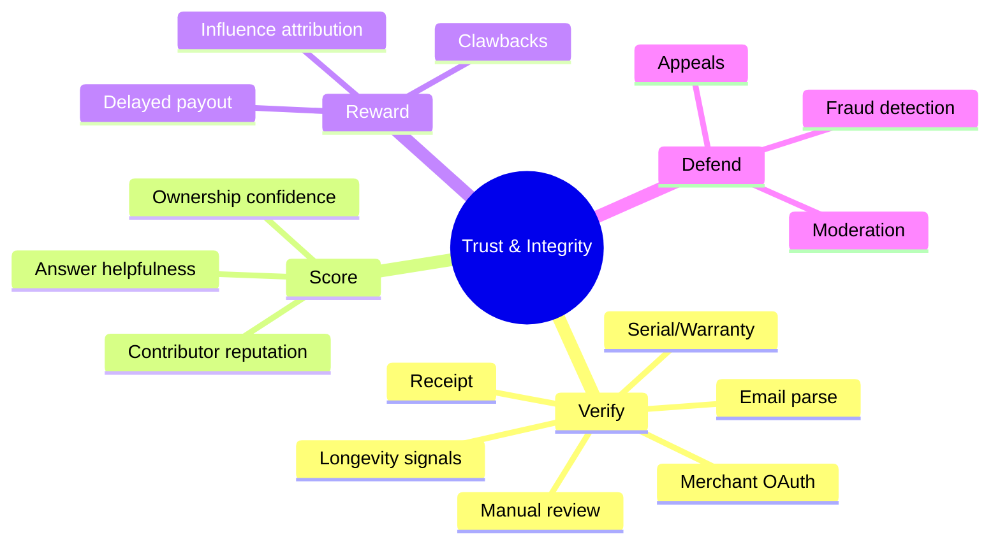
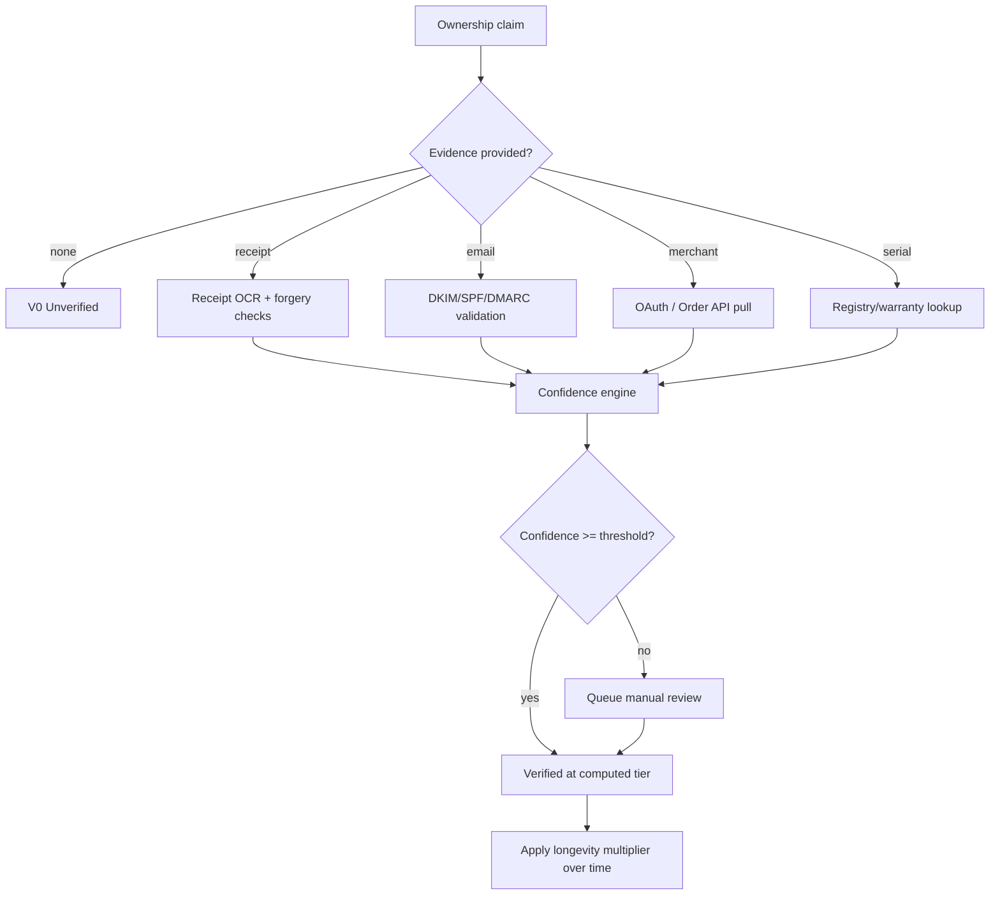
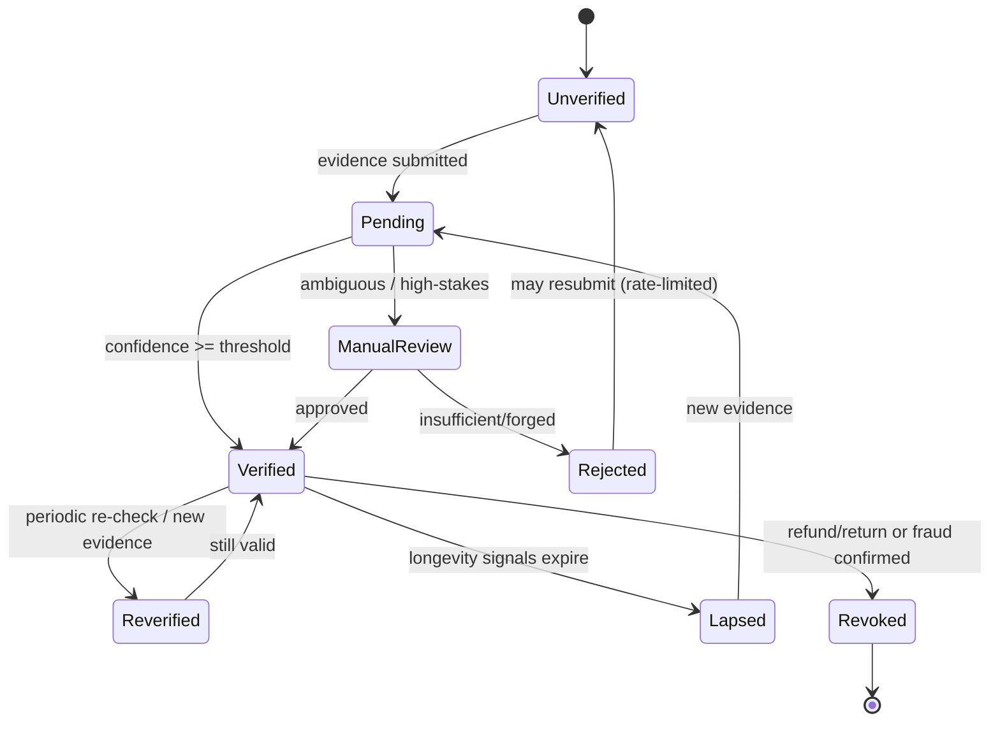
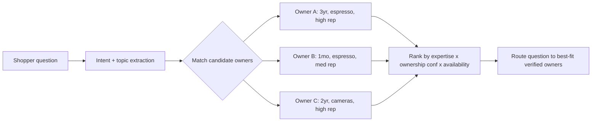
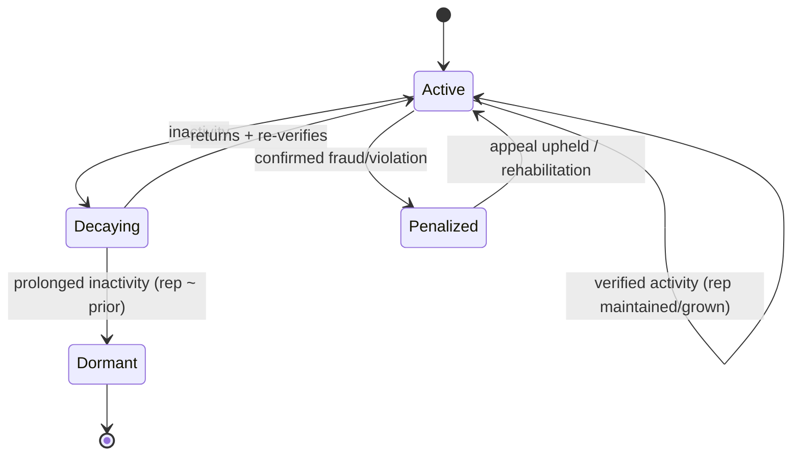
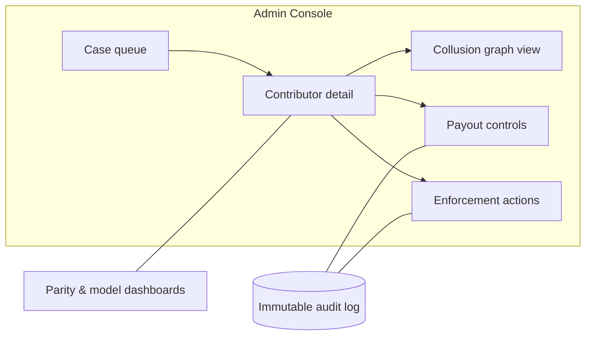
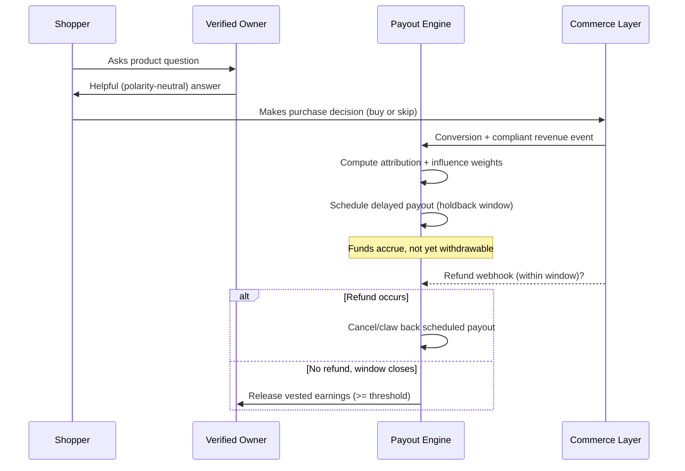
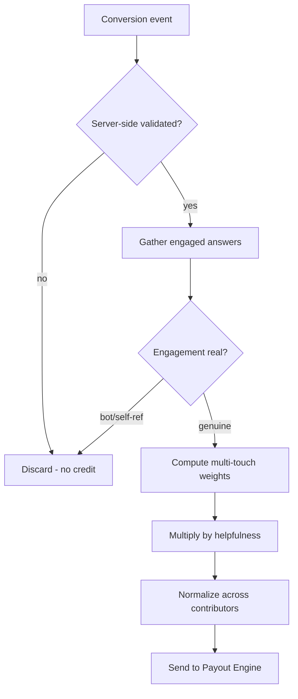
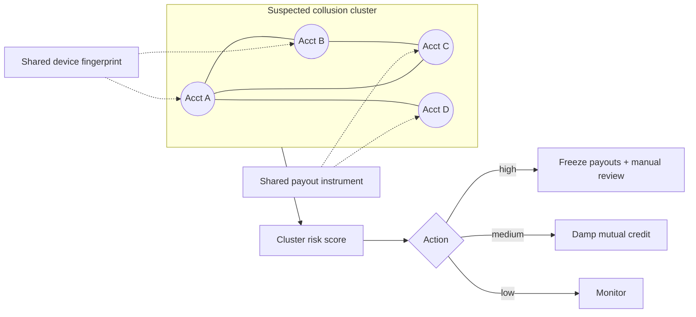
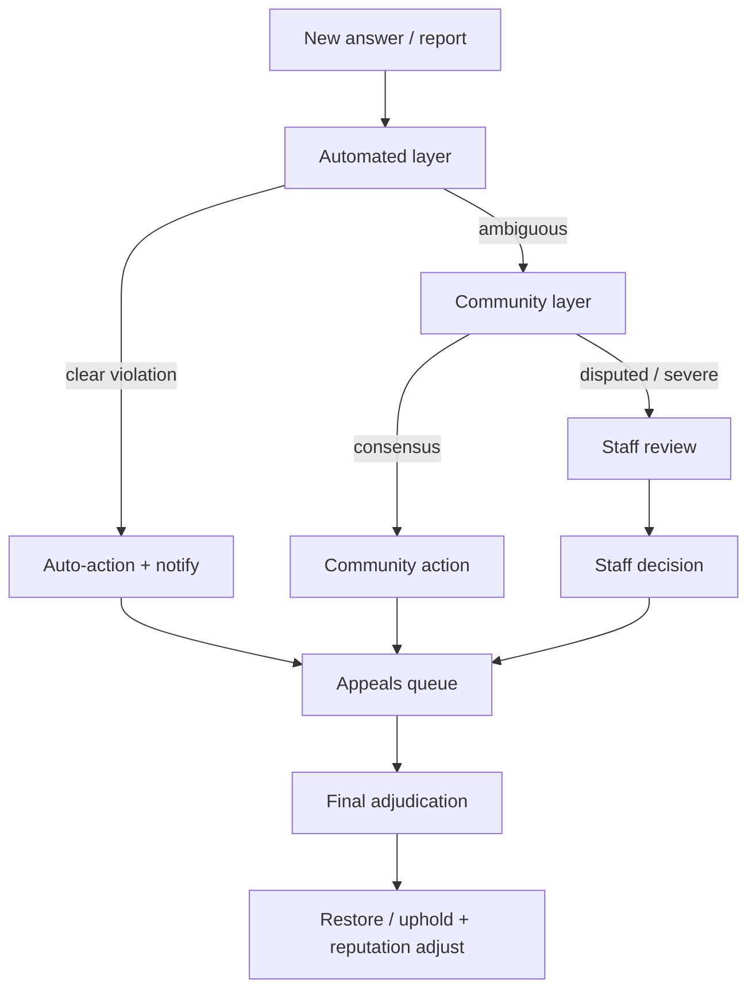

# Trust, Verification, Incentives & Fraud Prevention

> **Part of the Owners.app product & design documentation set.**
> This is the **trust substrate** document. It defines how Owners.app proves that a
> contributor really owns a product, how it scores their trustworthiness and the
> *helpfulness* (never the *positivity*) of their answers, how it rewards them from
> compliant revenue, and how it prevents, detects, and responds to fraud and abuse.

## How this document fits the whole

Owners.app is a two-sided marketplace whose single most valuable asset is **trust**:
shoppers believe answers because they come from **verified owners** with something at
stake, and contributors participate because helpfulness is fairly rewarded. This
document is the connective tissue between the human-facing flows and the commercial,
privacy, and architectural machinery that make those flows safe.

- **Low-friction flows come first.** Every mechanism here is designed to *ride on top of*
  the lightweight shopper and owner journeys, never to gate them behind heavy identity
  checks. See [User Personas & Flows](./01-user-persona-flows.md) for the flows this
  system must stay compatible with (asking a question, becoming a verified owner,
  long-term ownership updates, and contributor payouts).
- **Money, compliance, and legal disclosure** live in
  [Commerce, Privacy, Security & Legal](./07-commerce-privacy-security-and-legal.md). This document
  *consumes* compliant revenue and refund signals from there and *emits* payout,
  clawback, and disclosure requirements back to it.
- **System boundaries, data contracts, and APIs** live in
  [Architecture, Data & APIs](./04-architecture-data-and-apis.md). Confidence scores,
  reputation, and graph edge strengths defined here are persisted and served through
  those boundaries.
- **AI scoring, RAG retrieval, moderation classifiers, and the knowledge graph** live in
  [AI & Knowledge Graph](./06-ai-and-product-knowledge-graph.md). This document specifies *what*
  the models must optimize for (helpfulness, sentiment neutrality, fraud detection); that
  document specifies *how*.
- **Locked MVP implementation decisions** live in
  [MVP Implementation Spec](./09-mvp-implementation-spec.md). For v0, this document's broader tier
  model is narrowed to Amazon.com earbuds and a user-initiated Amazon Orders scan.

> **North-star rule for everything below:** *Reward helpfulness and accuracy, never
> positivity.* A blunt "don't buy this — it fails after six months" that saves a shopper
> money is worth **more** than a glowing upsell. Sentiment polarity is never an input to
> any trust, scoring, or payout function.
>
> **v0 clarification:** verified owners earn recognition only. Cash payouts, wallets, KYC/tax,
> affiliate-funded reward pools, and advanced verification tiers are deferred until commerce approval
> and legal review are complete.

### Trust & integrity at a glance



---

## Ownership Verification

### Goals, Principles & Threat Posture

> **MVP cut-line:** the first implementation verifies **Amazon.com earbud ownership** via an explicit
> Chrome-extension-assisted Amazon Orders scan. The extension must not collect Amazon credentials and
> stores only ASIN/parent ASIN, purchase month/year, hashed order id, and verification timestamp.
> Receipt upload, email parsing, merchant OAuth, serial/warranty proof, and automated payouts are
> target-state options, not v0 requirements.

#### Design goals

- **Verify ownership, not identity theater.** A contributor should be trusted in proportion
  to evidence that they actually own and have used a specific product — with the *least*
  friction that still resists forgery (keeping the
  [become-a-verified-owner flow](./01-user-persona-flows.md) fast and progressive).
- **Reward helpfulness, not positivity.** Payouts and reputation must be neutral to sentiment.
  A blunt "don't buy this" that saves a shopper money is worth more than a glowing upsell.
- **Make manipulation expensive and slow to pay off.** Delayed, clawback-eligible payouts and
  graph-based collusion detection should make fraud net-negative in expectation.
- **Be transparent by default.** Shoppers always see *why* an owner is trusted and *whether*
  any compensation could exist (see: [Transparency & Disclosure Requirements](#transparency--disclosure-requirements)).

#### Core principles

| Principle | Implication |
|-----------|-------------|
| Evidence over assertion | Every trust level maps to verifiable signals, not self-declaration. |
| Defense in depth | No single signal (receipt, email, OAuth) is sufficient on its own at high tiers. |
| Sentiment neutrality | Scoring functions never read positive/negative polarity as a quality input. |
| Adversarial assumption | Assume every reward path will be attacked; design payouts to be reversible. |
| Least privilege for PII | Raw receipts/serials are redacted at rest (see: [Commerce, Privacy, Security & Legal](./07-commerce-privacy-security-and-legal.md)). |
| Graceful degradation | If a verification provider fails, downgrade confidence; never silently upgrade. |
| Low-friction default | Verification is *progressive*: contributors can start answering immediately and raise their tier over time. |

#### Threat actors (summary)

| Actor | Motivation | Primary vectors |
|-------|-----------|-----------------|
| Incentivized shill | Earn payouts via positive answers | Fake receipts, incentivized positivity, Sybil |
| Brand/agency astroturfer | Manipulate product perception | Collusion rings, brigading, review manipulation |
| Competitor saboteur | Suppress a rival product | Coordinated negativity, harassment, brigading |
| Refund abuser | Buy → answer → return, keep payout | Refund abuse, churned ownership |
| Affiliate fraudster | Harvest commissions | Cookie stuffing, self-referral, attribution theft |
| Sybil farmer | Inflate signals at scale | Account farms, bot networks |

Verification is **tiered**. Each tier is a set of evidence types with increasing cost-to-forge.
A contributor's **ownership confidence** for a specific product (see:
[Confidence Scoring & Verification Lifecycle](#confidence-scoring--verification-lifecycle)) is derived
from the strongest *and the combination* of evidence presented.

### Verification tiers

#### V0 — Unverified / Self-declared

- Contributor claims ownership; no evidence.
- Answers allowed but flagged **Unverified**; ineligible for payout; minimal graph weight.
- Keeps the entry flow frictionless: a contributor can help immediately, then upgrade.

#### V1 — Receipt upload

- User uploads a photo/PDF of a purchase receipt or order confirmation.
- AI Layer extracts merchant, product, date, price, order ID (see: [AI & Knowledge Graph](./06-ai-and-product-knowledge-graph.md)).
- Anti-forgery checks: EXIF/coherence analysis, template/font anomaly detection, duplicate-hash
  detection across the corpus, price/date plausibility vs. catalog.
- Raw image redacted (card digits, address) before storage (see: [Commerce, Privacy, Security & Legal](./07-commerce-privacy-security-and-legal.md)).

#### V2 — Email receipt forwarding / parsing

- User forwards an order-confirmation email to a unique ingest address, **or** grants scoped
  read access (e.g., Gmail API with a narrow query) to detect order confirmations.
- Higher trust than V1: harder to forge because it relies on **provenance** — DKIM/SPF/DMARC
  validation of the originating merchant domain.
- Parser extracts structured order data; mismatched DKIM → reject/quarantine.

#### V3 — Merchant OAuth / Order APIs

- User connects a merchant account (Amazon, Best Buy, Shopify stores, etc.) via OAuth or a
  partner order API (see: [Commerce, Privacy, Security & Legal](./07-commerce-privacy-security-and-legal.md)).
- Platform reads order history server-to-server; ownership is **authoritative** and includes
  purchase date, fulfillment status, and (critically) **return/refund status**.
- Strongest automated signal; primary source for refund-abuse defense.

#### V4 — Serial / warranty confirmation

- User provides a serial number or registers warranty; platform validates against
  manufacturer registries / partner endpoints.
- Confirms a *specific unit*, enabling per-unit dedupe (one serial → one verified owner at a time).
- Useful for high-value durable goods where receipts are weak proxies.

#### V5 — Manual review

- Human reviewer adjudicates ambiguous or high-stakes cases (high payout exposure, disputed
  ownership, appeals). Can confirm, downgrade, or reject.
- Sampled audits also run on automatically-approved items.

#### Longevity layer — Long-term ownership signals

- Not a tier but a **multiplier**: evidence accrued *over time* that the contributor still owns
  and uses the product.
- Signals: repeated photo check-ins with consistent unit/wear, firmware/app telemetry opt-in,
  follow-up answers across months, warranty-period span, consistent serial across check-ins.
- Fed by the [long-term ownership update flow](./01-user-persona-flows.md); drives
  **years-owned weighting** in answer scoring (see:
  [Helpful Answer Scoring & Expertise Matching](#helpful-answer-scoring--expertise-matching)).

### Tier comparison

| Tier | Evidence | Forge cost | Payout eligible? | Refund-aware? | PII sensitivity |
|------|----------|-----------|------------------|---------------|-----------------|
| V0 | Self-declared | none | No | No | Low |
| V1 | Receipt image | Low–Med | Conditional | No | Med (redact) |
| V2 | Email + DKIM | Med–High | Yes | Partial | Med (redact) |
| V3 | Merchant OAuth | High | Yes | **Yes** | High (token scope) |
| V4 | Serial/warranty | High | Yes | Partial | Med |
| V5 | Manual review | Very high | Yes | Depends | High |



### Confidence Scoring & Verification Lifecycle

Ownership confidence is a continuous score in `[0, 1]` per `(contributor, product_unit)` pair,
not a binary. It feeds answer weighting, payout eligibility, and graph edge strength
(persisted per the boundaries in [Architecture, Data & APIs](./04-architecture-data-and-apis.md)).

#### Confidence model (design sketch)

```text
# Each evidence item has: base_strength, freshness, independence
# Independence prevents stacking correlated evidence (e.g., two photos of one receipt).

function ownership_confidence(evidence_set):
    combined_doubt = 1.0
    for ev in dedupe_by_provenance(evidence_set):
        s = ev.base_strength                      # V1=0.4, V2=0.6, V3=0.9, V4=0.8, V5=0.95
        s *= freshness_decay(ev.age)              # older receipts slightly weaker
        s *= ev.independence_weight               # correlated evidence discounted
        s *= forgery_penalty(ev.signals)          # anomaly score lowers strength
        combined_doubt *= (1.0 - clamp(s, 0, 0.98))
    base = 1.0 - combined_doubt                   # noisy-OR combination
    base *= longevity_multiplier(contributor, product)   # up to +X for sustained ownership
    return clamp(base, 0, 1)
```

Key properties:

- **Noisy-OR** combination: multiple independent evidences raise confidence with diminishing
  returns, and no single weak signal can reach high confidence alone.
- **Forgery penalty** is multiplicative, so a strong fraud signal collapses confidence fast.
- **Refund status from V3** can force confidence toward an "ex-owner" state (see:
  [Fraud Prevention & Moderation](#fraud-prevention-and-moderation)).

#### Verification lifecycle (state machine)



#### Lifecycle rules

- **Re-verification cadence:** sample-based and event-driven (e.g., a big payout pending, a
  dispute filed, a refund webhook arriving from the Commerce Layer).
- **Revocation propagates:** revoked ownership retroactively flags answers and triggers
  clawback evaluation (see: [Incentive System](#incentive-system)).
- **Lapsed ≠ Revoked:** lapsed means "we no longer have fresh proof of continued ownership,"
  which lowers weighting but does not imply fraud.

---

## Trust and Reputation

Reputation is **multi-dimensional** and **category-scoped**. A contributor can be highly trusted
about espresso machines and untrusted about cameras. Global reputation exists but is weaker than
category reputation for any given query.

### Reputation dimensions

| Dimension | What it measures | Primary inputs |
|-----------|------------------|----------------|
| Ownership credibility | Track record of *real* verified ownership | Verification tiers, longevity, revocations |
| Helpfulness | Whether answers actually help shoppers | Helpful-answer score, accepted answers |
| Reliability | Consistency / accuracy over time | Outcome feedback, contradiction rate |
| Integrity | Absence of manipulation | Fraud flags, disclosure compliance |
| Civility | Behavior in interactions | Moderation actions, harassment reports |

### Reputation aggregation (design sketch)

```text
# Category-scoped reputation with Bayesian shrinkage toward a prior so new
# contributors aren't over- or under-trusted on thin evidence.

function category_reputation(contributor, category):
    n = evidence_count(contributor, category)
    raw = weighted_mean([
        ownership_credibility,
        helpfulness,
        reliability,
        integrity,
        civility
    ])
    # Shrink toward neutral prior when n is small (cold start defense).
    rep = (n / (n + K)) * raw + (K / (n + K)) * PRIOR
    rep *= integrity_gate(contributor)   # hard multiplier; severe fraud -> ~0
    return clamp(rep, 0, 1)
```

- **Shrinkage (`K`)** defeats "one lucky answer → instant authority" and slows Sybil ramp-up.
- **Integrity gate** is a hard multiplier: confirmed serious fraud zeroes out reputation
  regardless of other dimensions.
- **No sentiment term anywhere.** Positivity is never a reputation input.

### Helpful Answer Scoring & Expertise Matching

This is where "reward helpfulness, not positivity" becomes concrete. An answer's quality score
is **polarity-blind** and combines shopper-outcome signals, expertise match, and ownership depth.
The scoring model itself is implemented in [AI & Knowledge Graph](./06-ai-and-product-knowledge-graph.md);
the *requirements* below are binding on that implementation.

#### Helpful answer score (design sketch)

```text
function helpful_answer_score(answer):
    # NONE of these terms read sentiment polarity.
    relevance   = semantic_match(answer, question)          # AI Layer embedding match
    specificity = concreteness(answer)                      # details, conditions, trade-offs
    outcome     = shopper_outcome_signal(answer)            # accepted, "this helped", purchase/return aided
    expertise   = expertise_match(answer.author, question)  # see below
    longevity   = years_owned_weight(answer.author, product)
    corrob      = corroboration(answer)                     # agreement w/ other verified owners
    penalty     = bias_penalty(answer)                      # promo/positivity-farming markers

    score = w1*relevance + w2*specificity + w3*outcome
          + w4*expertise + w5*longevity  + w6*corrob
    return clamp(score * (1 - penalty), 0, 1)
```

#### Years-owned weighting

```text
function years_owned_weight(author, product):
    yrs = continuous_ownership_years(author, product)   # from longevity signals
    # Saturating curve: experience matters, but caps to avoid gatekeeping.
    return min(1.0, log1p(yrs) / log1p(YEARS_CAP))
```

Rationale: someone who has owned a product for three years can speak to durability, failure
modes, and long-term satisfaction in ways a day-one buyer cannot — but the curve **saturates**
so long-tenure owners don't monopolize visibility.

#### Expertise matching



Expertise match = `category_reputation × ownership_confidence × topical_overlap × responsiveness`.
Owner C (cameras) is filtered out despite high global rep — **category scope wins**.

#### Bias controls (anti-positivity)

- **Polarity-blind scoring:** the scoring function never receives sentiment as a feature.
- **Negative-answer parity audit:** periodically verify that negative/cautionary answers earn
  comparable scores and payouts to positive ones at equal helpfulness. Alert on divergence.
- **Promo-language penalty:** detect marketing/affiliate-style phrasing, superlatives, and CTA
  patterns; apply `bias_penalty`.
- **Outcome over applause:** a "this saved me from a bad purchase" outcome is weighted equally
  to a "this confirmed my purchase" outcome.
- **Disclosure gating:** if any compensation pathway exists, it must be disclosed or the answer
  is suppressed (see: [Transparency & Disclosure Requirements](#transparency--disclosure-requirements)).

### Reputation Decay & Long-Term Reliability

Reputation is **not permanent capital**. It decays without continued, verified activity and is
continuously corrected by real-world outcomes.

#### Decay & update rules

- **Inactivity decay:** category reputation decays toward the prior when a contributor stops
  participating, so dormant accounts can't be reactivated as instant authorities (Sybil defense).
- **Outcome-driven correction:** when later evidence shows an answer was wrong (product failed
  as someone warned, or didn't as someone claimed), reliability updates accordingly.
- **Recency-weighted reliability:** recent accuracy weighs more than old accuracy.
- **Longevity offset:** sustained verified ownership *slows* decay for that category.

```text
function update_reputation(contributor, category, t):
    rep = category_reputation(contributor, category)
    rep = rep * decay_factor(time_since_last_activity)      # toward PRIOR
    for outcome in resolved_outcomes(contributor, category, since=last_update):
        rep += learning_rate * (outcome.correct - rep)      # online correction
    rep = apply_longevity_offset(rep, contributor, category)
    persist(contributor, category, clamp(rep, 0, 1), t)
```



### Transparency & Disclosure Requirements

Trust depends on shoppers understanding *why* to believe an owner and *whether* money is involved.

#### What shoppers always see

- **Verification badge** with tier (e.g., "Verified via merchant account," "Receipt-verified")
  and **years owned** when available — without exposing PII.
- **Compensation disclosure:** a clear label whenever an answer's author *could* earn from a
  resulting purchase, with the nature of the relationship (affiliate/partner) (see:
  [Commerce, Privacy, Security & Legal](./07-commerce-privacy-security-and-legal.md)).
- **Confidence, not certainty:** badges communicate evidence level honestly; no false precision.

#### Contributor obligations

- Disclose any external relationship to a brand (employee, sponsored, gifted unit).
- Non-disclosure is an integrity violation → answer suppressed, payout withheld, reputation hit.
- Gifted/sponsored units are flagged distinctly from self-purchased ownership.

#### Platform obligations

- Publish a **trust & methodology page**: how verification, scoring, and payouts work at a level
  that informs shoppers without handing a playbook to fraudsters.
- Honor data-subject rights for receipts/serials (see: [Commerce, Privacy, Security & Legal](./07-commerce-privacy-security-and-legal.md)).
- Regulatory alignment (e.g., disclosure of material connections in endorsements) — legal
  detail lives in [Commerce, Privacy, Security & Legal](./07-commerce-privacy-security-and-legal.md).

### Trust Dashboards & Admin Tools

#### Contributor-facing

- **Trust dashboard:** current tiers per product, reputation by category, helpfulness trends,
  disclosure status, and a plain-language "how to raise your trust" guide.
- **Earnings dashboard:** accrued vs. vested vs. paid, holdbacks, clawbacks, and the reason for
  each adjustment (surfaced in the [contributor payout flow](./01-user-persona-flows.md)).

#### Shopper-facing

- Inline badges and a "why trust this owner" expander on each answer.

#### Admin / staff tooling

- **Case console:** unified view of a contributor's evidence, graph neighborhood, payout
  history, flags, and prior actions.
- **Fraud investigation graph:** interactive Sybil/collusion explorer with cluster risk scores.
- **Payout controls:** freeze, release, claw back, and adjust thresholds with audit logging.
- **Parity & fairness audits:** dashboards verifying negative-vs-positive answer payout parity
  and demographic non-discrimination in routing.
- **Model ops:** monitor classifier precision/recall, false-positive appeal rates, and drift.



All admin actions write to an **immutable audit log** for accountability and incident review.

---

## Incentive System

Contributors may earn from **compliant affiliate/partner revenue** (see:
[Commerce, Privacy, Security & Legal](./07-commerce-privacy-security-and-legal.md)). The payout engine is built
around one rule: **pay for helpfulness, never for sentiment, and make fraud unprofitable through
delay and clawbacks.**

### Reward philosophy

- Reward **influence on a good shopper outcome**, not the *direction* of the recommendation.
- A negative answer that helps a shopper avoid a bad buy is fully rewardable.
- Rewards are **probabilistic and delayed**, so fast-churn fraud rarely realizes value.

### Payout allocation (design sketch)

```text
function allocate_payout(conversion_event):
    pool = compliant_revenue_share(conversion_event)   # from Commerce Layer
    contributors = answers_influencing(conversion_event)  # attribution set

    # Influence-weighted split, gated by eligibility.
    weights = {}
    for c in contributors:
        if not payout_eligible(c):     # verified tier, disclosure ok, not flagged
            continue
        weights[c] = influence_score(c, conversion_event)
                     * helpful_answer_score(c.answer)
                     * integrity_gate(c)
    normalized = normalize(weights)

    for c, w in normalized:
        amount = pool * w
        schedule_delayed_payout(c, amount,
            release_after = HOLDBACK_WINDOW,     # e.g., past refund/return window
            clawback_until = CLAWBACK_WINDOW)
```

### Eligibility, thresholds & holdbacks

| Control | Purpose |
|---------|---------|
| **Verification gate** | Only V2+ tiers earn; V0/V1 ineligible or capped. |
| **Disclosure gate** | Non-disclosed compensable answers are suppressed and unpaid. |
| **Payout threshold** | Minimum accrued balance before withdrawal (reduces micro-fraud ROI). |
| **Holdback window** | Funds held until the refund/return window closes (refund-abuse defense). |
| **Delayed release** | Earnings vest over time; abrupt anomalies pause vesting. |
| **Clawbacks** | Refunds, revoked ownership, or confirmed fraud reverse earnings. |
| **Velocity caps** | Per-account/per-cluster earning rate limits to blunt farms. |

> **Compliance boundary:** eligibility, KYC/tax handling, and the actual money movement are owned
> by [Commerce, Privacy, Security & Legal](./07-commerce-privacy-security-and-legal.md). This document defines the
> *attribution and gating logic*; that document defines *how funds are held and disbursed*.

### Clawback triggers

- Underlying purchase **refunded/returned** (signal from Commerce Layer / V3 OAuth).
- Ownership **revoked** (forged receipt discovered, serial dispute).
- Answer found to be **manipulated** (collusion, incentivized positivity).
- Disclosure violation discovered post-hoc.



### Attribution & Influence Scoring

Attribution answers: *which answers actually influenced this shopper's decision, and how much?*
It must resist **attribution theft** (affiliate fraud) while fairly splitting credit.

#### Influence model

- **Multi-touch, decayed attribution:** credit is distributed across the answers a shopper
  genuinely engaged with (viewed, expanded, replied to), weighted by recency and depth.
- **Engagement-gated:** an answer the shopper never saw earns nothing, regardless of ranking.
- **Helpfulness-weighted:** influence is multiplied by the answer's helpful score, so low-quality
  but high-visibility answers don't dominate the split.

```text
function influence_score(contributor, event):
    touches = engaged_answers(event.shopper, event.product)
    base = 0
    for t in touches_by(contributor):
        base += recency_decay(t.time, event.time)
              * engagement_depth(t)        # view < expand < reply < followed link
    return base * helpful_answer_score(contributor.answer)
```

#### Attribution integrity (vs. affiliate fraud)

- **Server-side conversion validation** with Commerce Layer; ignore client-only claims.
- **Cookie-stuffing / self-referral detection:** same-device buyer==owner, impossible-velocity
  click chains, and last-click hijack patterns are filtered (see:
  [Fraud Prevention & Moderation](#fraud-prevention-and-moderation)).
- **Idempotent conversion keys** prevent double-credit from replayed events.



---

## Fraud Prevention and Moderation

A layered system: **prevention → detection → response**. Many controls are cross-cutting; this
section maps each threat to concrete defenses.

### Threat → defense matrix

| Threat | Detection signals | Primary defenses |
|--------|-------------------|------------------|
| **Fake receipts** | Template/font anomalies, duplicate hashes, EXIF/coherence, price/date mismatch | Forgery scoring, dedupe, prefer V2+ provenance |
| **Sybil accounts** | Device/IP/behavior fingerprints, account-farm clustering | Shrinkage priors, velocity caps, graph clustering |
| **Collusion rings** | Dense mutual-endorsement graphs, synchronized activity | Graph community detection, mutual-credit damping |
| **Incentivized positivity** | Polarity skew vs. peers, promo language, payout-correlated sentiment | Polarity-blind scoring, bias penalty, parity audit |
| **Refund abuse** | Buy→answer→return patterns, V3 refund status | Holdback window, clawbacks, ownership revocation |
| **Affiliate fraud** | Cookie stuffing, self-referral, last-click hijack | Server-side validation, idempotency, self-ref filter |
| **Brigading** | Activity spikes from coordinated cohorts | Rate limits, burst anomaly detection, cohort throttling |
| **Harassment** | Toxicity classifiers, report volume | Moderation, civility reputation, escalation |
| **Review manipulation** | Vote/endorsement anomalies, timing correlation | Weighted votes, anomaly nullification, audit |

### Sybil & collusion detection (graph approach)

Model contributors, devices, payment instruments, IPs, and mutual endorsements as a graph.
Tight communities with abnormal internal density and synchronized timing are candidate rings.



```text
function cluster_risk(cluster):
    density   = internal_edge_density(cluster)
    sync      = timing_synchrony(cluster.activity)
    shared    = shared_identifiers(cluster)        # device, IP, payout instrument
    sentiment = polarity_homogeneity(cluster)      # all-positive farm signal
    velocity  = earning_velocity(cluster)
    return logistic(a*density + b*sync + c*shared + d*sentiment + e*velocity)
```

> The graph store, feature pipelines, and classifier serving for this model are defined in
> [Architecture, Data & APIs](./04-architecture-data-and-apis.md) and
> [AI & Knowledge Graph](./06-ai-and-product-knowledge-graph.md).

### Response ladder

1. **Soft:** lower weights, damp mutual credit, require re-verification.
2. **Medium:** freeze pending payouts, throttle activity, shadow-limit visibility.
3. **Hard:** revoke ownership, claw back earnings, suspend/ban, report to partners.

All automated hard actions are appealable (see: [Moderation Model](#moderation-model)).

### Moderation Model

A four-layer model balancing speed (automation) with fairness (human judgment and appeals).



#### Layers

- **Automated:** classifiers for toxicity, spam, promo/manipulation, PII leakage, fraud signals.
  Acts instantly on high-confidence violations; routes the rest onward.
- **Community:** trusted high-integrity contributors triage and vote on flagged content; votes
  are **reputation-weighted** and themselves auditable for brigading.
- **Staff:** professional moderators handle severe, disputed, legal, or high-exposure cases.
- **Escalation:** severity- and exposure-based routing (e.g., harassment, doxxing, or large
  pending payouts skip straight to staff).

#### Appeals

- Every enforcement action is appealable once (with new-evidence exceptions).
- Appeals are reviewed by a different adjudicator than the original action.
- Overturned actions **restore reputation and earnings** and feed back into classifier tuning.
- Repeated bad-faith appeals lower integrity reputation.

### Edge Cases & Failure Modes

| Scenario | Risk | Handling |
|----------|------|----------|
| Gifted product, no receipt | Valid owner blocked | Allow alt-evidence (serial, photos); flag as gifted; disclose. |
| Shared household ownership | Double-credit / dispute | Allow multiple owners per unit but dedupe payout-influence per conversion. |
| Resold / second-hand unit | Stale serial ownership | Serial re-binds to current owner; prior owner moves to "ex-owner." |
| Legitimate negative answer flagged as sabotage | Suppressed truth | Polarity-blind review; require corroboration before negativity penalties. |
| Verification provider outage | Confidence wrongly inflated/blocked | Fail closed: downgrade confidence, queue manual review, never auto-upgrade. |
| OCR/AI misparse of receipt | Wrong product/owner | Confidence capped on low parser certainty; human review threshold. |
| Refund after payout released | Unrecoverable funds | Holdback past refund window; negative-balance recovery + future-earning offset. |
| Whale contributor monopoly | Few owners dominate visibility | Years-owned saturation, diversity in routing, anti-gatekeeping caps. |
| Coordinated mass-report (brigade) of a good answer | Wrongful takedown | Reputation-weighted reports, burst anomaly detection, staff escalation. |
| Privacy request to delete receipts | Lose evidence basis | Retain minimal derived proof / hashes per policy (see: [Commerce, Privacy, Security & Legal](./07-commerce-privacy-security-and-legal.md)); downgrade tier if needed. |
| Cold-start contributor with one great answer | Over-trust | Bayesian shrinkage limits authority until more evidence accrues. |
| Cross-category authority bleed | Misplaced trust | Category-scoped reputation dominates global in routing. |

#### Systemic failure modes to monitor

- **Over-suppression:** too many false-positive fraud flags silencing real owners → track appeal
  overturn rate; auto-loosen thresholds if it spikes.
- **Positivity drift:** payouts skewing positive over time → parity audit alarms.
- **Attribution leakage:** affiliate fraud inflating conversions → reconciliation with Commerce
  Layer ground truth (see: [Commerce, Privacy, Security & Legal](./07-commerce-privacy-security-and-legal.md)).

### Acceptance Criteria & Anti-Abuse Quality Bar

#### Functional acceptance criteria

- [ ] Each verification tier (V0–V5) is implemented with documented evidence requirements and
      maps to a confidence contribution.
- [ ] Ownership confidence is computed per `(contributor, product_unit)` and exposed to answer
      weighting, payout eligibility, and the knowledge graph (see: [AI & Knowledge Graph](./06-ai-and-product-knowledge-graph.md)).
- [ ] The verification lifecycle state machine is enforced, including revocation propagation and
      re-verification triggers.
- [ ] Reputation is category-scoped, multi-dimensional, and uses shrinkage toward a prior.
- [ ] Helpful-answer scoring is **polarity-blind** and incorporates years-owned weighting and
      expertise matching.
- [ ] Payout allocation is influence-weighted, eligibility-gated, delayed, threshold-limited, and
      clawback-capable, sourced only from compliant revenue (see: [Commerce, Privacy, Security & Legal](./07-commerce-privacy-security-and-legal.md)).
- [ ] Attribution validates conversions server-side and resists self-referral/cookie stuffing.
- [ ] All four moderation layers and a one-appeal process are implemented with audit logging.
- [ ] Disclosure is enforced; non-disclosed compensable answers are suppressed and unpaid.
- [ ] All trust mechanisms remain compatible with the low-friction shopper and owner flows in
      [User Personas & Flows](./01-user-persona-flows.md) (no mechanism blocks a first question
      or a first answer behind heavy identity verification).

#### Anti-abuse quality bar (must hold before launch)

- [ ] **Fraud must be net-negative in expectation** for every modeled attacker (positive
      cost-to-forge × delay × clawback risk > expected reward).
- [ ] **Sentiment neutrality:** measured payout/score parity between equally-helpful positive and
      negative answers within an agreed tolerance; parity audit runs continuously.
- [ ] **No single signal suffices** for a high tier or payout eligibility; high tiers require
      provenance-grade or multi-evidence confirmation.
- [ ] **Fail-closed verification:** provider failures never auto-upgrade confidence.
- [ ] **Refund-safe payouts:** no payout is withdrawable before the refund/return window closes.
- [ ] **Sybil resistance:** simulated account farms cannot reach payout eligibility faster than
      the holdback/velocity caps allow.
- [ ] **Collusion resistance:** synthetic mutual-endorsement rings are detected and damped in red-team tests.
- [ ] **Appeal fairness:** false-positive enforcement is reversible, restores earnings/reputation,
      and overturn rates are monitored as a quality metric.
- [ ] **PII minimization:** raw receipts/serials are redacted at rest and access-logged
      (see: [Commerce, Privacy, Security & Legal](./07-commerce-privacy-security-and-legal.md)).

#### Key metrics to track post-launch

| Metric | Target direction |
|--------|------------------|
| Verified-ownership precision (audit sample) | ↑ high |
| Fraudulent-payout rate (post-clawback) | ↓ minimal |
| Positive/negative payout parity ratio | ≈ 1.0 |
| Appeal overturn rate | low & stable |
| Median time-to-detection for collusion rings | ↓ |
| Disclosure compliance rate | ↑ ~100% |

---

## Related documents

- [User Personas & Flows](./01-user-persona-flows.md) — the low-friction shopper and owner
  journeys this trust system must stay compatible with.
- [AI & Knowledge Graph](./06-ai-and-product-knowledge-graph.md) — scoring models, moderation
  classifiers, RAG, and the graph that stores confidence and reputation.
- [Commerce, Privacy, Security & Legal](./07-commerce-privacy-security-and-legal.md) — compliant revenue, payout
  disbursement, refund signals, PII handling, and regulatory disclosure.
- [Architecture, Data & APIs](./04-architecture-data-and-apis.md) — system boundaries, data
  contracts, and services that persist and serve trust data.

---

_End of document: Trust, Verification, Incentives & Fraud Prevention._
