# AI and Product Knowledge Graph

> **Scope.** This document is the standalone specification for Owners.app's AI layer and the
> product knowledge graph it reads from. It covers the canonical product graph, cross-retailer
> product identity resolution, embeddings/RAG, AI summaries, semantic search, recommendations,
> product reliability intelligence, AI-assisted moderation/fraud detection, the evaluation
> framework, provenance/citations, and the AI quality bar.
>
> **Where this fits.** The knowledge graph is the system's core data asset; the AI layer is the
> primary lens through which shoppers read it. For how the graph is stored and served, see the
> [Architecture, Data & APIs](./04-architecture-data-and-apis.md) document. For how verified
> ownership and reputation weight the evidence AI retrieves, see
> [Trust, Incentives & Fraud](./05-trust-verification-incentives-and-fraud.md). For where these AI moments
> appear in real user journeys, see [User Personas & Flows](./01-user-persona-flows.md).

---

## Table of Contents

- [Overview & Design Principle](#overview--design-principle)
- [Product Knowledge Graph](#product-knowledge-graph)
  - [Canonical products and identifier resolution](#canonical-products-and-identifier-resolution)
  - [Graph relationships](#graph-relationships)
- [AI Layer](#ai-layer)
  - [AI Goals & Non-Goals](#ai-goals--non-goals)
  - [AI as a First-Class Product Interface](#ai-as-a-first-class-product-interface)
  - [RAG Architecture](#rag-architecture)
  - [Embedding & Index Strategy](#embedding--index-strategy)
  - [Semantic Search & Intent Parsing](#semantic-search--intent-parsing)
  - [Product Reliability Intelligence](#product-reliability-intelligence)
  - [Recommendations](#recommendations)
  - [Owner-Matched Q&A Routing](#owner-matched-qa-routing)
  - [AI-Assisted Moderation & Fraud Detection](#ai-assisted-moderation--fraud-detection)
  - [Summaries, Citations & Provenance](#summaries-citations--provenance)
  - [Safety Guardrails & Policy](#safety-guardrails--policy)
  - [Data Contracts & Prompt Templates](#data-contracts--prompt-templates)
  - [Evaluation Framework](#evaluation-framework)
  - [AI Operations](#ai-operations)
  - [Acceptance Criteria & AI Quality Bar](#acceptance-criteria--ai-quality-bar)
- [Cross-References](#cross-references)

---

## Overview & Design Principle

Owners.app turns fragmented, verified-owner conversations into a **structured reliability and
durability knowledge graph** and reads that graph back to shoppers through AI. Two assets compound
over time:

1. **The product knowledge graph** — canonical products (a real-world product, independent of which
   retailer sells it) plus the owner-evidenced relationships shoppers care about: accessories,
   compatibility, known issues, and reliability-over-time.
2. **The AI layer** — a single retrieval-and-grounding backbone that powers Ask AI, product
   summaries, owner-matched Q&A, comparisons, and recommendations.

**One backbone, many faces.** Every AI surface reduces to the same pipeline:
*parse intent → retrieve grounded evidence → generate with citations → pass the safety gate →
render*. This keeps behavior consistent, evaluation centralized, and cost controllable.

**Grounding is non-negotiable.** The model never answers from parametric memory alone. Every
confident claim is traceable to a source node in the graph, verified ownership is the dominant
retrieval signal, and thin or conflicting evidence is disclosed rather than smoothed over.

---

## Product Knowledge Graph

The product graph is the system's core asset. It models **canonical products** (a real-world product
independent of which retailer sells it) and the rich relationships owners care about. Storage,
schema DDL, and serving APIs for these entities live in the
[Architecture, Data & APIs](./04-architecture-data-and-apis.md) document; this section defines the
conceptual model the AI layer consumes.

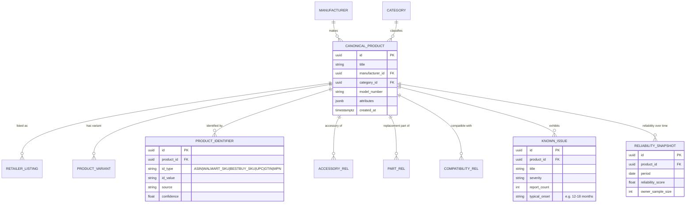

### Canonical products and identifier resolution

A canonical product aggregates every way the same real product is referenced across retailers:

| Identifier type | Example source | Notes |
| --- | --- | --- |
| `ASIN` | Amazon | Marketplace-specific; multiple ASINs may map to one product |
| `WALMART_SKU` | Walmart | Retailer SKU/item id |
| `BESTBUY_SKU` | Best Buy | Retailer SKU |
| `UPC` / `GTIN` | Global barcodes | Strongest cross-retailer join key |
| `MPN` (manufacturer model) | Manufacturer | Disambiguates variants |

The **resolver** maps an incoming `(id_type, id_value)` to a canonical product. Resolution order:
exact identifier match → GTIN/UPC normalization join → manufacturer + model match → fuzzy/embedding
match (flagged low-confidence for human/AI review). New, unmatched identifiers create provisional
canonical products that the merge pipeline later reconciles.

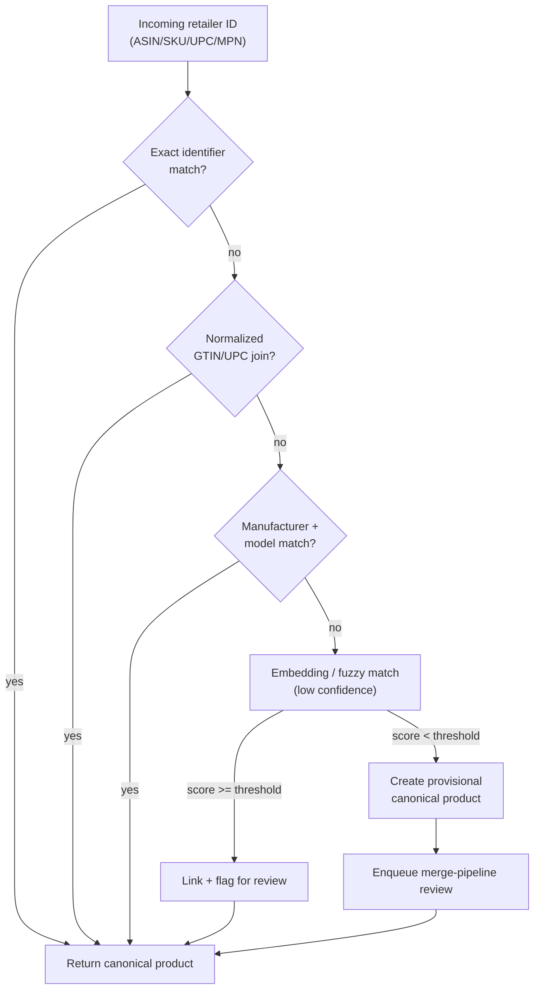

### Graph relationships

- **Accessories** — `(:Product)-[:HAS_ACCESSORY {required, fit_confidence}]->(:Product)`
- **Replacement parts** — `(:Product)-[:HAS_PART {part_type, oem}]->(:Product)`
- **Compatibility** — `(:Product)-[:COMPATIBLE_WITH {direction, verified_by_owners}]->(:Product)`
- **Known issues** — issue nodes attached to products, enriched by owner answers and severity-weighted.
- **Reliability over time** — periodic snapshots derived from owner reports/answers, enabling
  "how does this hold up after a year?" queries — a uniquely ownership-derived signal.

These relationships are **owner-evidenced**: edges carry provenance (which verified owners/answers
support them) so the graph's claims remain traceable, and the AI layer can cite them. The strength
of that evidence is a function of the contributor's verification tier and reputation — see
[Trust, Incentives & Fraud › Confidence Scoring & Verification Lifecycle](./05-trust-verification-incentives-and-fraud.md#confidence-scoring--verification-lifecycle) for how verification weighting is
computed.

---

## AI Layer

### AI Goals & Non-Goals

#### Goals

1. Let any shopper get a **trustworthy, owner-grounded answer** to a product question in seconds — on the retailer page (via the extension) or in the web app.
2. Make **verified-owner experience** the dominant signal in every AI answer, ranking, and summary.
3. Turn fragmented owner conversations and long-term updates into a **structured reliability and durability knowledge graph** that compounds in value over time.
4. Keep AI **provably grounded**: every claim is traceable to a source node, with explicit uncertainty when evidence is thin.
5. Provide moderators and fraud systems with **AI assistance that augments, never replaces, human judgment** for consequential actions.

#### Non-Goals

- AI does **not** invent ownership. It never claims "I own this" or fabricates first-person experience.
- AI does **not** make medical, legal, financial, or safety-critical determinations; it routes to disclaimers and human review.
- AI does **not** auto-execute irreversible moderation actions (bans, payout clawbacks) without human confirmation (see [Trust, Incentives & Fraud](./05-trust-verification-incentives-and-fraud.md)).
- AI ranking does **not** optimize for affiliate revenue. Commercial signals are isolated from relevance and disclosed (see [Commerce, Privacy & Legal](./07-commerce-privacy-security-and-legal.md)).

### AI as a First-Class Product Interface

AI is not a chatbot bolted onto a forum; it is the primary lens through which the ownership graph is read. Five surfaces share one retrieval and grounding backbone. For where each surface appears in a real shopper or owner journey, see [User Personas & Flows](./01-user-persona-flows.md).

| Surface | Entry point | What it does | Primary sources |
|---|---|---|---|
| **Ask AI** | Extension popup, product page, web app | Free-form Q&A grounded in verified owner content | Q&A threads, owner updates, reliability rollups |
| **Product Summary** | Auto-rendered on any product page | "What owners actually say" digest with citations | Owner reviews, long-term updates, issue clusters |
| **Owner-Matched Q&A** | "Ask an owner" CTA | Routes a question to matched verified owners; AI drafts/clarifies, never impersonates | Owner directory, matching service |
| **Comparison** | Multi-product selector | Side-by-side owner-grounded comparison on durability, issues, satisfaction | Reliability rollups across products |
| **Recommendations** | "Owners still recommend…" modules | Intent-driven shortlist with rationale and citations | Semantic search + reliability + recency |

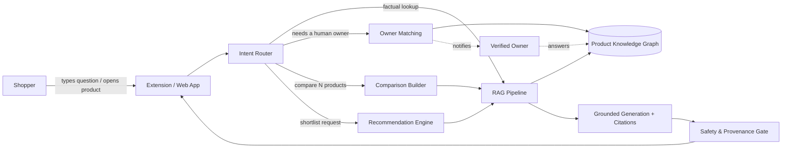

**Design principle — one backbone, many faces.** Every surface reduces to: *parse intent → retrieve grounded evidence → generate with citations → pass safety gate → render*. This keeps behavior consistent, evaluation centralized, and cost controllable.

### RAG Architecture

Retrieval-Augmented Generation is the core. The model never answers from parametric memory alone; it answers from retrieved, verified, time-aware evidence.

#### Retrieval corpus

The RAG corpus is a projection of the [product knowledge graph](#product-knowledge-graph) into retrievable chunks. Source types:

- **Product graph nodes** — canonical product, variant, spec, category, accessory, compatibility edges.
- **Owner Q&A conversations** — questions and verified-owner answers, with thread context.
- **Verified owner updates** — longitudinal "still using it after N months" posts; the highest-value durability signal.
- **Media metadata** — transcriptions/captions and structured tags from owner photos/videos (not raw pixels in retrieval; see [Commerce, Privacy & Legal](./07-commerce-privacy-security-and-legal.md)).
- **Reliability signals** — failure-rate rollups, issue clusters, RMA/repair mentions.
- **Repair tips & maintenance** — owner-authored fixes, part numbers, maintenance cadences.
- **Accessories & compatibility** — "what works with this" edges and owner-confirmed pairings.
- **Retailer metadata** — price history, availability, model/SKU mapping (commercial; segregated from relevance scoring).

#### Pipeline

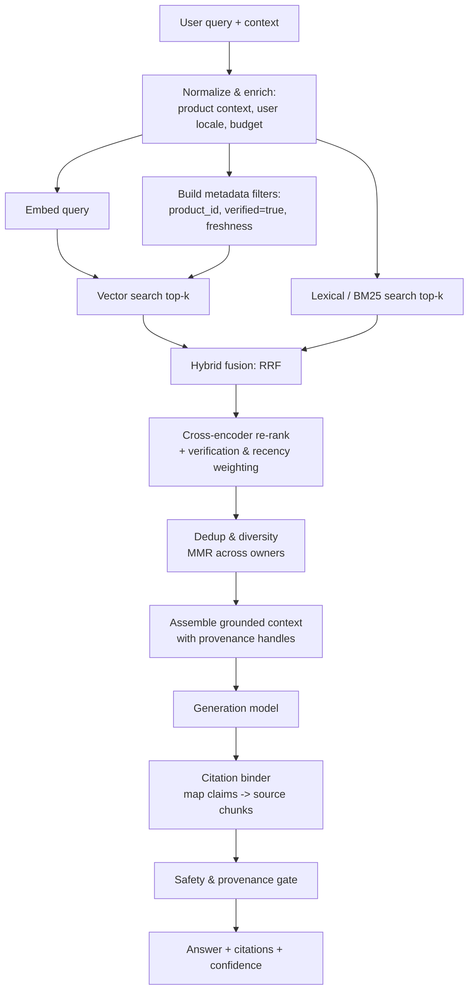

#### Hybrid retrieval

- **Dense** (embeddings) captures semantic intent ("won't hold a charge" ≈ "battery dies fast").
- **Lexical** (BM25) captures exact tokens that embeddings blur — model numbers, part SKUs, error codes.
- **Fusion** via Reciprocal Rank Fusion (RRF), then a **cross-encoder re-ranker** that takes verification weight, recency, and owner reputation as features (see [Trust, Incentives & Fraud › Confidence Scoring & Verification Lifecycle](./05-trust-verification-incentives-and-fraud.md#confidence-scoring--verification-lifecycle)).

#### Context assembly rules

1. **Verification first.** Verified-owner chunks are prioritized; unverified content may appear only as clearly-labeled secondary context and never as the sole basis for a confident claim.
2. **Freshness windows.** For reliability/durability claims, prefer chunks within the relevant ownership horizon; stale price/availability is excluded.
3. **Diversity.** Maximal Marginal Relevance across distinct owners prevents a single loud owner from dominating an answer.
4. **Provenance handles.** Each chunk carries a stable `source_id` so the citation binder can map every generated sentence back to evidence.

### Embedding & Index Strategy

#### Chunking

| Source type | Chunk unit | Rationale |
|---|---|---|
| Owner update / review | Semantic paragraph (200–400 tokens) with thread heading | Preserve a single coherent experience claim |
| Q&A thread | Question + accepted answer as one unit; follow-ups as linked units | Keep question intent attached to its answer |
| Spec / graph node | One attribute group per chunk | Enables precise spec retrieval |
| Repair tip | Whole tip + part references | Fixes are only useful intact |
| Media metadata | Per-asset caption + tags | Keep media grounding atomic |

Chunks overlap by ~15% to avoid severing claims at boundaries. Every chunk stores rich metadata for filtering.

#### Chunk metadata schema

```json
{
  "source_id": "upd_8f21c0",
  "source_type": "owner_update",
  "product_id": "prod_canonical_44192",
  "variant_id": "var_18ah_kit",
  "author_id": "owner_3310",
  "verified_owner": true,
  "verification_method": "receipt+serial",
  "owner_reputation": 0.82,
  "ownership_age_days": 1840,
  "created_at": "2025-11-02T00:00:00Z",
  "last_confirmed_at": "2026-04-12T00:00:00Z",
  "topic_tags": ["battery", "durability", "5-year"],
  "sentiment": -0.1,
  "language": "en",
  "retailer_scope": ["amazon", "homedepot"],
  "pii_scrubbed": true
}
```

#### Index layout

- **Primary vector index**: HNSW (cosine), one logical index partitioned by category for filter performance.
- **Sidecar lexical index**: BM25 over the same chunk text for hybrid retrieval.
- **Metadata store**: columnar filterable store for `verified_owner`, `product_id`, `created_at`, `topic_tags`, enabling pre-filter before ANN search.

The physical vector index, lexical index, and metadata store are provisioned and operated as described in [Architecture, Data & APIs](./04-architecture-data-and-apis.md).

#### Weighting model

Retrieval score is a learned combination, not raw cosine:

```text
final_score =
    w1 * semantic_similarity
  + w2 * verification_weight        (verified > unverified, by method strength)
  + w3 * recency_decay(created_at, topic)   (durability decays slowly; price fast)
  + w4 * owner_reputation
  + w5 * confirmation_bonus(last_confirmed_at)   (re-confirmed long-term updates)
  - w6 * redundancy_penalty(MMR)
```

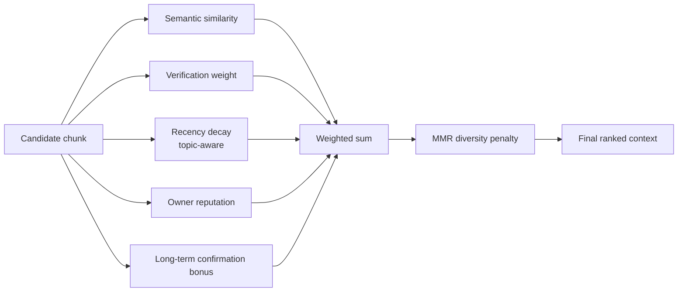

The `verification_weight` and `owner_reputation` inputs are defined in
[Trust, Incentives & Fraud › Confidence Scoring & Verification Lifecycle](./05-trust-verification-incentives-and-fraud.md#confidence-scoring--verification-lifecycle); the AI layer consumes them as
features and never recomputes trust locally.

**Topic-aware recency.** A single `recency_decay` is wrong. Durability claims ("brakes still fine at 60k miles") should decay slowly; availability/price should decay within days. The decay half-life is a function of `topic_tags`.

**Freshness & re-indexing.** New verified updates are embedded and indexed within minutes (near-real-time queue). Long-term ownership updates trigger re-computation of the product's reliability rollup (below) and a `last_confirmed_at` bump on related chunks.

### Semantic Search & Intent Parsing

Search must understand *intent*, *constraints*, and *the implicit "owners still recommend" bar* — not just keywords.

#### Intent parsing

The intent parser converts a natural query into a structured retrieval plan.

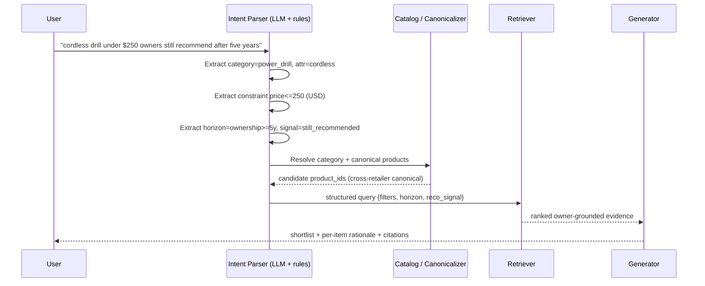

#### Structured query produced

```json
{
  "category": "power_drill",
  "attributes": { "power_source": "cordless" },
  "constraints": { "price_usd_max": 250 },
  "ownership_horizon_days_min": 1825,
  "reliability_signal": "still_recommended",
  "min_verified_owners": 5,
  "sort": "durability_then_satisfaction"
}
```

#### Cross-retailer canonicalization

The same product appears under different titles/SKUs across retailers. The canonicalizer maps retailer listings to one canonical product node so owner evidence aggregates correctly (see [Product Knowledge Graph](#product-knowledge-graph)).

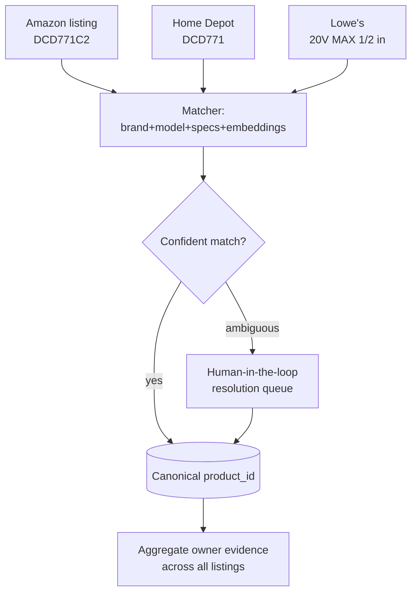

Matching uses a blend of structured keys (brand, model number, GTIN/UPC when present) and embedding similarity over titles/specs. Ambiguous matches go to a resolution queue rather than risk merging two distinct products.

#### Worked query examples

| Query | Parsed intent | Retrieval behavior |
|---|---|---|
| "cordless drill under $250 owners still recommend after 5 years" | category, price ≤ 250, horizon ≥ 5y, still_recommended | Filter to verified owners with `ownership_age_days ≥ 1825`, rank by durability + sustained satisfaction |
| "is the X1 quieter than the X2" | comparison on `noise` attribute | Pull noise-tagged owner chunks for both canonical IDs; comparison builder |
| "why does my model 44 leak after a year" | troubleshooting + reliability | Issue-cluster retrieval for `topic=leak`, surface repair tips |
| "what battery fits this trimmer" | compatibility | Accessory/compatibility edges + owner-confirmed pairings |

### Product Reliability Intelligence

This is the compounding asset: turning longitudinal owner data into durability and failure intelligence no single review can provide.

#### Derived signals

- **Failure rate over time** — proportion of owners reporting a defined failure within ownership-age buckets (0–6m, 6–12m, 1–2y, 2–5y, 5y+).
- **Known issues / issue clusters** — recurring problems detected by clustering owner reports (topic + sentiment), each with prevalence, first-seen, and trend.
- **Durability summaries** — natural-language rollups grounded in long-horizon updates.
- **Maintenance reminders** — owner-derived cadences ("clean the filter quarterly") surfaced as optional reminders.

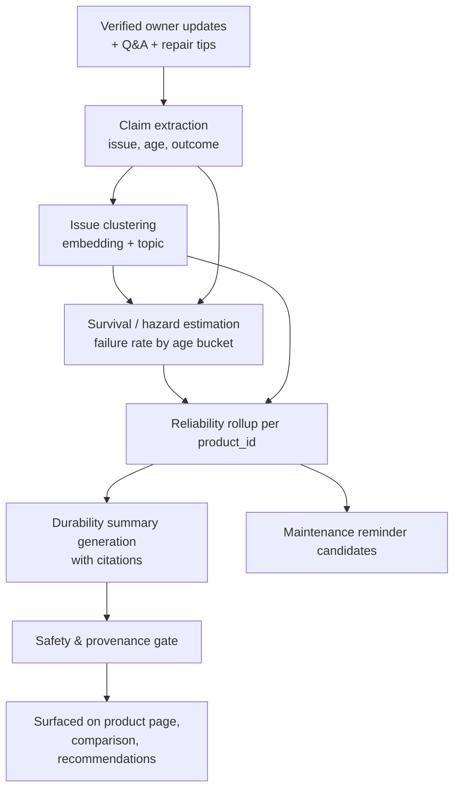

#### Reliability rollup contract

```json
{
  "product_id": "prod_canonical_44192",
  "verified_owner_n": 214,
  "ownership_horizon_coverage": { "1y": 180, "2y": 121, "5y": 38 },
  "failure_rate_by_age": {
    "0-6m": 0.03, "6-12m": 0.05, "1-2y": 0.09, "2-5y": 0.17
  },
  "known_issues": [
    { "issue": "chuck wobble", "prevalence": 0.11, "first_seen": "2024-08",
      "trend": "stable", "evidence_ids": ["upd_8f21c0", "qa_77a"] }
  ],
  "durability_grade": "B+",
  "confidence": 0.74,
  "evidence_window_days": 1825,
  "generated_at": "2026-06-30T00:00:00Z"
}
```

**Statistical honesty.** Failure rates are estimates from self-reported, non-random samples. The platform reports **confidence and sample size**, never bare percentages, and the AI must verbalize the limitation ("based on 38 owners past 5 years"). Survivorship and reporting bias are documented in evaluation.

### Recommendations

Recommendations are the "owners still recommend…" surface: an intent-driven shortlist with a
per-item rationale and citations. They are **not** a separate ranking system — they reuse the same
semantic search, reliability intelligence, and grounding backbone, then apply a shortlist policy.

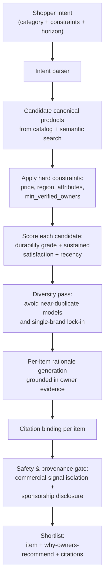

**Ranking rules (non-negotiable).**

- **Reliability and sustained satisfaction drive the shortlist**, not price, margin, or affiliate ties.
- **Commercial signals are isolated.** Ranking is computed in a pipeline that has no access to
  affiliate/monetization features; the bias eval set verifies rankings are invariant to those
  signals (Δ ≈ 0). See [Commerce, Privacy & Legal](./07-commerce-privacy-security-and-legal.md).
- **Every recommended item carries a rationale bound to citations.** An item that cannot be
  grounded in verified-owner evidence is not recommended.
- **Sponsored placements, if any, are labeled inline** and never reorder the substantive shortlist.
- **Sample-size honesty applies.** Items with thin owner coverage are shown with explicit
  low-confidence framing or withheld, never presented as confident picks.

### Owner-Matched Q&A Routing

When a question needs lived experience the graph can't answer, AI routes to a real verified owner — and never pretends to be one.

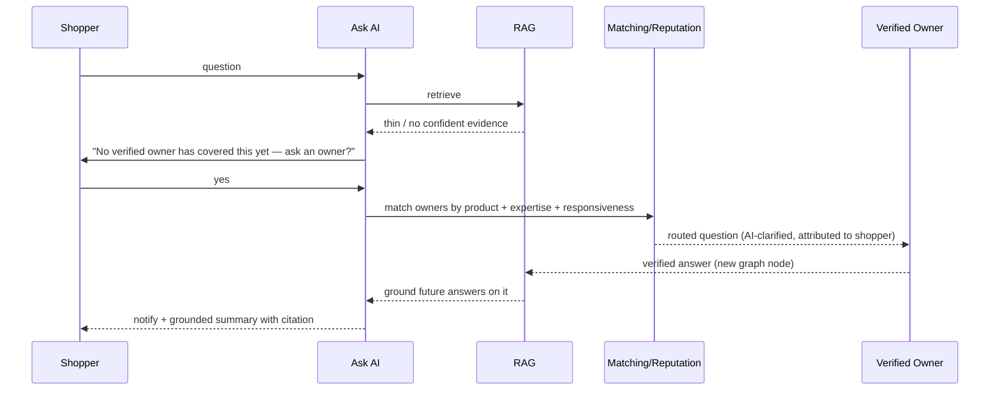

- AI may **clarify and structure** the shopper's question and **draft prompts** for the owner, but the answer is authored by the human owner.
- Matching uses product ownership, topical expertise, reputation, and responsiveness (see [Trust, Incentives & Fraud › Helpful Answer Scoring & Expertise Matching](./05-trust-verification-incentives-and-fraud.md#helpful-answer-scoring--expertise-matching)).
- New answers become first-class, citable graph nodes, improving future RAG coverage.

### AI-Assisted Moderation & Fraud Detection

AI assists human moderators and the fraud/abuse systems with **scored signals and explanations**, never autonomous enforcement on consequential actions. The moderation policy, response ladder, and appeals process live in [Trust, Incentives & Fraud › Fraud Prevention and Moderation](./05-trust-verification-incentives-and-fraud.md#fraud-prevention-and-moderation).

#### Moderation assistance

- **Toxicity / policy classification** with category and confidence.
- **Spam / promotional detection** including covert affiliate stuffing.
- **Quality triage** routing low-effort content down and high-signal content up.
- **Summarize-for-review** so moderators read a 3-line synopsis before the full thread.

#### Fraud / fake-ownership detection signals

AI contributes features to a fraud model that protects payout integrity (see [Commerce, Privacy & Legal](./07-commerce-privacy-security-and-legal.md)):

- **Authenticity scoring** of "ownership" claims — does the content show experience consistent with genuine use vs. generic/marketing language?
- **Duplicate / template detection** across accounts (near-duplicate embeddings).
- **Coordinated-behavior signals** — synchronized posting, mutual upvoting rings.
- **Inconsistency detection** — claims contradicting verified product specs or the owner's own history.

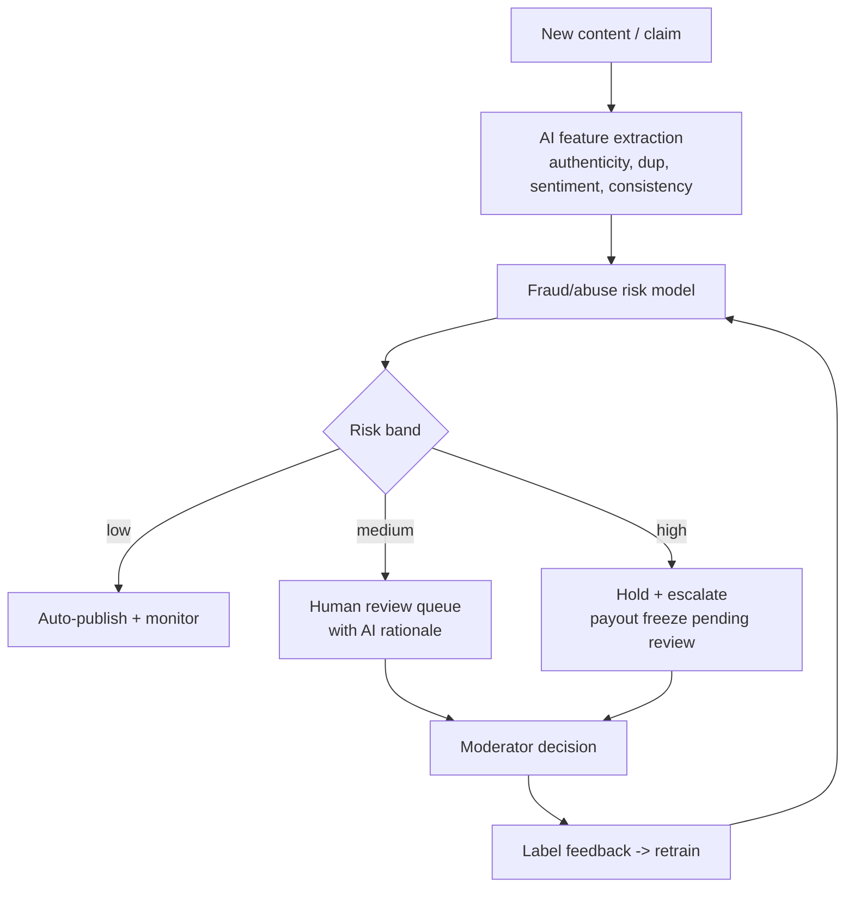

**Hard rule.** Bans, content removal at scale, and payout clawbacks require **human confirmation**. AI provides the rationale and evidence; a person decides. All AI moderation decisions are logged and auditable.

### Summaries, Citations & Provenance

Every AI-generated summary or answer is **grounded and attributable**. No citation, no confident claim.

#### Citation binding

After generation, a binder maps each sentence/claim to the `source_id`(s) that support it. Claims that cannot be bound are either dropped or downgraded to explicit uncertainty.

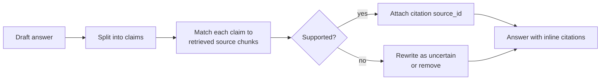

#### Answer output contract

```json
{
  "answer": "Most verified owners still recommend it after five years, citing strong battery life; a minority report chuck wobble around year two.",
  "confidence": 0.71,
  "citations": [
    { "claim_span": [0, 62], "source_ids": ["upd_8f21c0", "upd_5510a"], "verified_owner": true },
    { "claim_span": [64, 120], "source_ids": ["qa_77a"], "verified_owner": true }
  ],
  "uncertainty_notes": "Based on 38 owners past 5 years; self-reported sample.",
  "no_owner_experience_disclaimer": true,
  "commercial_disclosure": null
}
```

- Citations link to the underlying verified owner content so users can verify themselves.
- Provenance includes whether the source is a **verified owner** and the **verification method** (defined in [Trust, Incentives & Fraud › Ownership Verification](./05-trust-verification-incentives-and-fraud.md#ownership-verification)).

### Safety Guardrails & Policy

Guardrails are enforced in a dedicated gate that every AI response passes through before rendering.

#### Non-negotiable guardrails

1. **No fabricated ownership.** The model never claims first-person ownership/experience. First-person framing is reserved for genuine owner content, clearly attributed.
2. **Disclose uncertainty.** Thin or conflicting evidence → explicit hedging plus sample-size context. No false confidence.
3. **No fabricated facts/specs.** Specs come from graph nodes; unknown → "not confirmed by owners/specs."
4. **Recommendation bias controls.** Ranking ignores affiliate/commercial signals; relevance and reliability are computed in a pipeline isolated from monetization (see [Commerce, Privacy & Legal](./07-commerce-privacy-security-and-legal.md)).
5. **Brand & sponsorship disclosure.** Any sponsored placement or partner context is labeled inline; sponsorship can never alter the substantive answer.
6. **Compliance boundaries.** No medical/legal/financial/safety determinations; route to disclaimers and, where needed, human review.
7. **Privacy.** Retrieval operates on PII-scrubbed chunks; the model never surfaces personal data from owner accounts (see [Commerce, Privacy & Legal](./07-commerce-privacy-security-and-legal.md)).

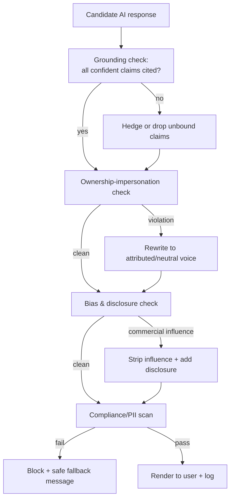

**Safe fallback.** When the gate cannot produce a compliant grounded answer, the user gets an honest "no verified owner has covered this yet" message plus the option to ask an owner — never a fabricated answer.

### Data Contracts & Prompt Templates

#### Generation prompt contract (system)

```text
You are Owners.app's grounding assistant. You answer ONLY from the
PROVIDED EVIDENCE about product {product_id}.

Rules:
- Never claim to own or have used any product. Attribute experience to owners.
- Every factual or evaluative claim MUST be supported by an evidence item;
  cite its source_id. If unsupported, say it is not confirmed.
- Prefer VERIFIED owner evidence. Note sample size for reliability claims.
- If evidence conflicts, present both sides with citations.
- Do not consider price, affiliate, or sponsorship when judging quality.
- If evidence is insufficient, say so and offer to ask a verified owner.
- Output strictly in the Answer Output Contract JSON schema.

EVIDENCE:
{retrieved_chunks_with_source_ids_and_metadata}

USER QUESTION:
{user_query}
```

#### Intent-parse prompt contract

```text
Extract a structured retrieval plan from the user query. Output JSON:
{ category, attributes, constraints (price/region/etc.),
  ownership_horizon_days_min, reliability_signal, comparison_targets,
  min_verified_owners, sort }. Use null where unknown. Do not invent
constraints the user did not state.
```

#### Evidence item contract (into the model)

```json
{
  "source_id": "upd_8f21c0",
  "text": "Still going strong at 5 years, battery holds ~80% of original.",
  "verified_owner": true,
  "ownership_age_days": 1840,
  "owner_reputation": 0.82,
  "created_at": "2025-11-02",
  "topic_tags": ["battery", "durability"]
}
```

#### Moderation classification contract (output)

```json
{
  "content_id": "cmt_991",
  "labels": [{ "category": "spam_affiliate", "confidence": 0.88 }],
  "authenticity_score": 0.21,
  "recommended_action": "human_review",
  "rationale": "Generic promotional language, near-duplicate of 3 other posts.",
  "evidence_ids": ["cmt_991", "cmt_654"]
}
```

### Evaluation Framework

Nothing ships without measurement. Evaluation runs offline (regression gates) and online (production monitoring), with human review in the loop.

#### Evaluation dimensions & metrics

| Dimension | Metric | Bar (target) |
|---|---|---|
| **Groundedness / faithfulness** | % claims supported by cited evidence | ≥ 0.97 |
| **Hallucination rate** | % responses with ≥1 unsupported confident claim | ≤ 1% |
| **Citation correctness** | % citations that actually support the claim | ≥ 0.95 |
| **Answer helpfulness** | Human 1–5 rubric avg | ≥ 4.2 |
| **Retrieval recall@k** | Relevant evidence present in top-k | ≥ 0.90 |
| **Intent-parse accuracy** | Exact-match on constraints | ≥ 0.92 |
| **Moderation precision/recall** | Per category | Precision ≥ 0.90, Recall ≥ 0.85 |
| **Fraud detection** | AUC / precision@high-risk | AUC ≥ 0.90 |
| **Uncertainty calibration** | ECE on confidence vs. correctness | ≤ 0.05 |
| **Bias / commercial neutrality** | Δ ranking with/without commercial signals | ≈ 0 (no measurable shift) |
| **Latency** | p95 end-to-end | ≤ 2.5 s (cached ≤ 600 ms) |

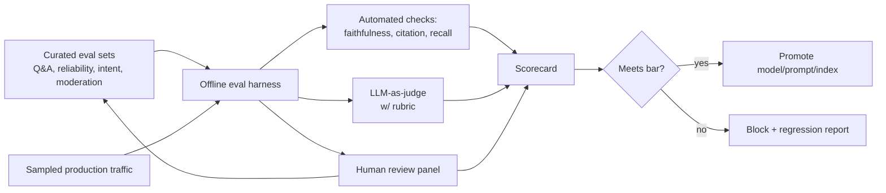

#### Eval set construction

- **Golden Q&A set** — curated questions with known owner-grounded answers and the expected citations; covers durability, troubleshooting, compatibility, comparison.
- **Hallucination traps** — questions about products with *no* owner coverage; correct behavior is to decline / offer owner routing.
- **Adversarial moderation set** — covert affiliate spam, fake-ownership templates, edge-case toxicity.
- **Intent-parse set** — natural queries with labeled structured plans (incl. the "cordless drill under $250 after 5 years" archetype).
- **Bias set** — paired products where one has affiliate ties; rankings must be invariant to the commercial signal.

#### Human review

- Calibrated rubric for helpfulness, faithfulness, and tone.
- Dual annotation with adjudication on disagreements; inter-annotator agreement tracked.
- Human-labeled errors flow back into eval sets and model/prompt tuning.

### AI Operations

#### Model routing & cost controls

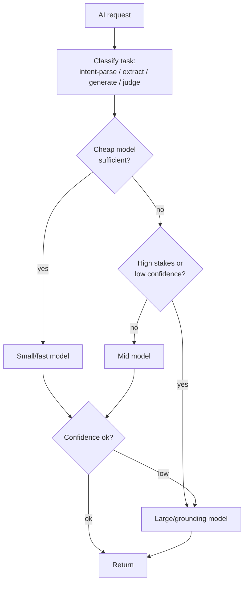

- **Tiered routing**: lightweight models for intent parsing, classification, and extraction; larger models reserved for grounded generation and judging. Escalate only on low confidence or high stakes.
- **Caching**: semantic cache on (canonical product_id + normalized intent) for product summaries and common questions; embedding cache; reliability rollups recomputed on data change, not per request.
- **Budget guards**: per-surface token/cost ceilings, batching for embeddings, async pre-computation of summaries during off-peak.

#### AI Observability

- **Tracing**: every request carries a trace covering retrieval (which `source_id`s), routing decisions, gate outcomes, latency, and cost.
- **Quality telemetry**: live groundedness sampling, citation-coverage rate, fallback rate, user feedback (thumbs + reason).
- **Drift detection**: monitor retrieval recall and intent-parse accuracy on shadow eval sets; alert on regression.

#### Abuse controls

- Rate limiting and anomaly detection on Ask AI (scraping, prompt-injection probing).
- **Prompt-injection defense**: evidence is data, not instructions; the system prompt explicitly forbids following instructions embedded in retrieved content; injection attempts are filtered and logged.
- PII egress checks on every output (see [Commerce, Privacy & Legal](./07-commerce-privacy-security-and-legal.md)).

### Acceptance Criteria & AI Quality Bar

A feature in this section is **Done** only when all of the following hold:

#### Functional

- [ ] Ask AI, product summaries, owner-matched Q&A, comparison, and recommendations all run on the shared RAG backbone and return citations.
- [ ] Intent parser correctly extracts category, constraints (price/region), ownership horizon, and reliability signal for the golden intent set (≥ 0.92 exact-match).
- [ ] Cross-retailer canonicalization merges equivalent listings and aggregates owner evidence; ambiguous matches go to human resolution, never silent merge.
- [ ] Reliability rollups expose failure-rate-by-age, known issues, durability grade, **sample size, and confidence**.
- [ ] Owner-matched routing creates real owner-authored, citable nodes; AI never authors first-person ownership.

#### Grounding & safety

- [ ] Every confident claim in shipped answers is citation-bound to verified-preferred evidence; unbound claims are hedged or removed.
- [ ] Safety gate blocks fabricated ownership, fabricated specs, undisclosed commercial influence, and PII egress — verified against the adversarial set.
- [ ] Sponsorship/brand placements are inline-disclosed and never alter substantive answers; ranking is invariant to commercial signals (bias set Δ ≈ 0).
- [ ] Insufficient-evidence cases produce the safe fallback + ask-an-owner offer, never a fabricated answer.

#### Quality bar (must meet eval targets)

- [ ] Faithfulness ≥ 0.97; hallucination rate ≤ 1%; citation correctness ≥ 0.95.
- [ ] Helpfulness ≥ 4.2/5 (human); retrieval recall@k ≥ 0.90; calibration ECE ≤ 0.05.
- [ ] Moderation precision ≥ 0.90 / recall ≥ 0.85 per category; fraud AUC ≥ 0.90.
- [ ] p95 latency ≤ 2.5 s (≤ 600 ms cached).

#### Operability

- [ ] Full tracing of retrieval sources, routing, gate outcomes, latency, and cost per request.
- [ ] Offline eval harness gates every model/prompt/index change; regressions block promotion.
- [ ] Cost ceilings, semantic caching, and tiered routing in place and monitored.

---

## Cross-References

- **[User Personas & Flows](./01-user-persona-flows.md)** — where Ask AI, product summaries,
  owner-matched Q&A, comparison, and recommendations appear in real shopper and owner journeys
  (including AI-assisted product research).
- **[Trust, Incentives & Fraud](./05-trust-verification-incentives-and-fraud.md)** — verification tiers,
  confidence scoring, and reputation that supply the `verification_weight` and `owner_reputation`
  features the retrieval and reliability pipelines consume; also the moderation policy and appeals
  that AI moderation assistance feeds into.
- **[Architecture, Data & APIs](./04-architecture-data-and-apis.md)** — storage for the product
  graph, vector/lexical/metadata indexes, the AI Service, and the REST/GraphQL contracts that serve
  AI surfaces.
- **[Commerce, Privacy & Legal](./07-commerce-privacy-security-and-legal.md)** — commercial-signal
  isolation and sponsorship disclosure, payout-integrity fraud protection, PII scrubbing, and
  compliance boundaries the safety gate enforces.
