# Commerce, Privacy, Security & Legal

> **Scope of this document.** This is the standalone commerce/privacy/security/legal
> reference for Owners.app. It covers the (deliberately thin) commerce layer,
> affiliate/partner attribution, the legitimacy risks around reloading pages and
> overlaying content, the revenue model, contributor payout operations, privacy,
> security, legal/compliance gates, disclosures, and retailer-partnership strategy.
>
> ⚖️ **Not legal advice.** Every ⚖️-marked item below is a *design risk assessment*,
> not a legal determination. Affiliate-program terms, retailer terms of service,
> extension-store policies, and applicable law differ by program, retailer, and
> jurisdiction and change over time. Behaviors described here — **especially
> reloading pages through affiliate links and overlaying testimonials on retailer
> pages** — are **high-risk and program-specific**, and must be cleared with
> qualified counsel and confirmed program-by-program before any production rollout.

## Related documents

- **UX & Browser Extension:** [`03-ux-extension-and-community.md`](./03-ux-extension-and-community.md) — extension surfaces, safe-behavior boundaries, disclosure UX.
- **Trust, Verification & Incentives:** [`05-trust-verification-incentives-and-fraud.md`](./05-trust-verification-incentives-and-fraud.md) — reputation, incentive rules, anti-gaming, moderation.
- **Architecture, Data & APIs:** [`04-architecture-data-and-apis.md`](./04-architecture-data-and-apis.md) — canonical schema, services, security boundaries.
- **AI & Knowledge Graph:** [`06-ai-and-product-knowledge-graph.md`](./06-ai-and-product-knowledge-graph.md) — the compounding knowledge asset and AI-content labeling.

## Table of Contents

- [Commerce Layer](#commerce-layer)
  - [Guiding principles](#guiding-principles)
  - [Where commerce sits in the system](#where-commerce-sits-in-the-system)
  - [Commerce layer boundaries — why thin wins](#commerce-layer-boundaries--why-thin-wins)
  - [Affiliate & partner attribution approaches](#affiliate--partner-attribution-approaches)
  - [Revenue model](#revenue-model)
  - [Contributor payout model (commerce perspective)](#contributor-payout-model-commerce-perspective)
  - [Contributor payout operations](#contributor-payout-operations)
  - [Commercial partnership & retailer risk mitigation](#commercial-partnership--retailer-risk-mitigation)
- [Privacy and Security](#privacy-and-security)
  - [Core stance: opt-in ownership, minimal data](#core-stance-opt-in-ownership-minimal-data)
  - [Sensitive data: receipts, emails, purchases](#sensitive-data-receipts-emails-purchases)
  - [Consent, deletion, export](#consent-deletion-export)
  - [Privacy ↔ trust tension](#privacy--trust-tension)
  - [Security](#security)
- [Legal and Compliance](#legal-and-compliance)
  - [Legitimacy & compliance: reloading pages and overlaying content](#legitimacy--compliance-reloading-pages-and-overlaying-content)
  - [Endorsement & disclosure](#endorsement--disclosure-ftc-style-and-international-equivalents)
  - [Affiliate program & retailer terms](#affiliate-program--retailer-terms)
  - [Consumer protection & advertising law](#consumer-protection--advertising-law)
  - [Privacy & data-protection law](#privacy--data-protection-law)
  - [Financial/tax/sanctions](#financialtaxsanctions)
  - [Warranty / insurance offers](#warranty--insurance-offers)
  - [Content moderation & intermediary liability](#content-moderation--intermediary-liability)
  - [Platform terms & store policies](#platform-terms--store-policies)
  - [Legal review gates](#legal-review-gates)
  - [Disclosures (design)](#disclosures-design)
- [Acceptance Criteria & Quality Bar](#acceptance-criteria--quality-bar)
- [Open Questions](#open-questions)

---

## Commerce Layer

The commerce layer is the part of the platform that touches money: affiliate and
partner revenue in, contributor payouts out, and the premium/sponsored products
that fund the operation. It is deliberately the **thinnest** layer in the system.
The durable asset is not the checkout flow — it is the **product ownership
knowledge graph** (see: [AI & Knowledge Graph](./06-ai-and-product-knowledge-graph.md))
and the **verified-owner trust network** (see:
[Trust, Verification & Incentives](./05-trust-verification-incentives-and-fraud.md)).
Commerce is a monetization surface bolted to that asset, not the asset itself.

### Guiding principles

| # | Principle | What it means in practice |
|---|-----------|---------------------------|
| P1 | **Thin commerce, fat knowledge** | We never become a store of record, payment processor, or merchant. We hand off to retailers and PSPs. |
| P2 | **Disclosure is a feature, not a footnote** | Affiliate relationships, sponsorships, and AI-generated content are labeled at the point of consumption, not buried in a policy page. |
| P3 | **Permission before money** | We only use affiliate mechanics that the retailer's own program explicitly authorizes. "Technically possible" ≠ "permitted." |
| P4 | **Data minimization by default** | We collect the least data that makes a verified answer trustworthy. Receipts and PII are liabilities, not assets. |
| P5 | **Trust is the moat; never trade it for a commission** | Any feature that improves short-term revenue at the cost of user/partner/retailer trust is rejected. |
| P6 | **Separable money paths** | Revenue-in (affiliate) and money-out (payouts) are decoupled ledgers so a problem in one cannot corrupt the other. |

### Where commerce sits in the system

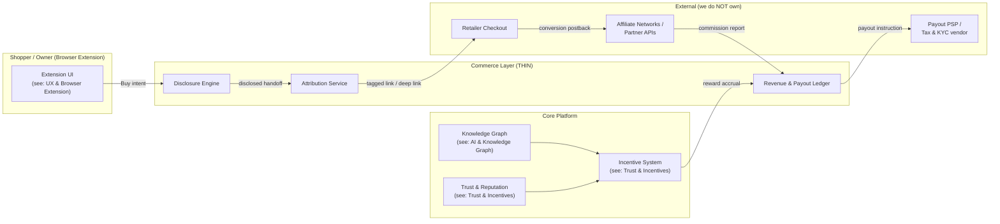

**Acceptance for this section:** a new engineer can read the principles and diagram
above and correctly answer "are we a payment processor?" (no), "who owns the
money-in relationship?" (retailer/affiliate network), and "what is the asset we
are protecting?" (the knowledge graph and trust network).

### Commerce Layer Boundaries — Why Thin Wins

#### What the commerce layer **is**

- A **disclosure engine** that renders required labels before any monetized action.
- An **attribution service** that produces compliant, retailer-approved outbound
  links/handoffs and reconciles conversions reported back to us.
- A **dual-ledger** that records (a) revenue earned and (b) contributor rewards
  owed, with a clean separation between the two (see:
  [Trust & Incentives](./05-trust-verification-incentives-and-fraud.md)).
- A set of **partner adapters** (affiliate networks, partner APIs, payout/KYC
  vendors) behind a stable internal interface.

#### What the commerce layer is **NOT**

- ❌ Not a merchant of record. We never take title to goods.
- ❌ Not a payment processor or money transmitter. PSPs move money; we instruct them.
- ❌ Not a custodian of card data. Card PANs never touch our systems
  (see: [Payment security boundary](#payment-security-boundary)).
- ❌ Not a price/inventory source of truth — retailers are. We cache and label
  staleness.
- ❌ Not the arbiter of warranty/insurance claims — those are the underwriter's.

#### Why thin is the right call

1. **Regulatory surface area scales with what you touch.** Becoming a money
   transmitter or merchant of record triggers licensing (e.g., state MTLs,
   card-network rules, PCI scope). Staying thin keeps us out of those regimes.
2. **Trust transfers from retailers, not to them.** If we behave like a parasitic
   overlay, retailers cut us off (see:
   [Reloading & overlay legitimacy](#legitimacy--compliance-reloading-pages-and-overlaying-content)).
   A thin, cooperative integration is durable.
3. **The knowledge graph is the compounding asset.** Engineering effort spent on
   checkout plumbing is effort not spent on the moat.
4. **Failure isolation.** A thin layer with adapters means a partner outage is a
   degraded-but-safe experience, not a platform-wide incident.

The **thin-layer compliance gate** below is the first filter every money-touching
feature must pass:

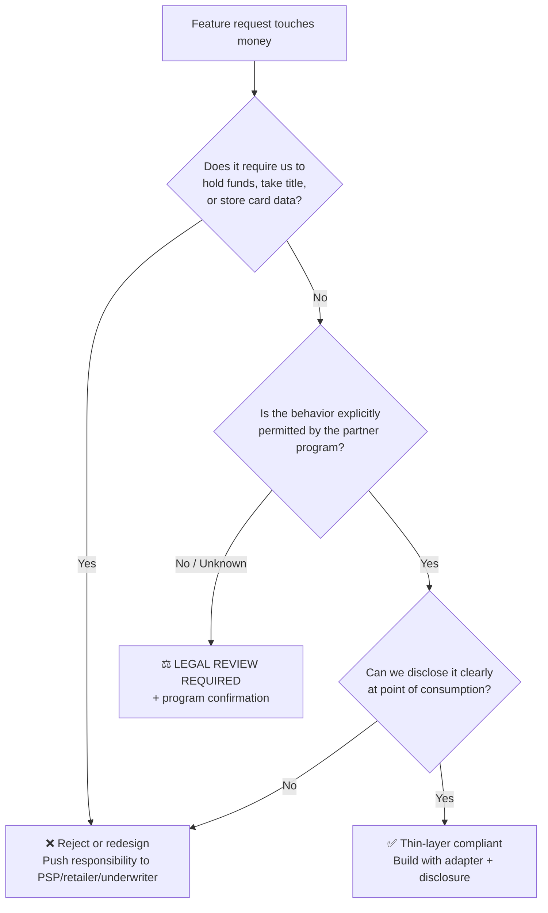

### Affiliate & Partner Attribution Approaches

This is the most legally sensitive design area. Each approach below is rated on
**Revenue potential**, **Retailer acceptance risk**, and **Disclosure burden**.
The recommended posture is to **start with the lowest-risk approaches** (explicit
handoff, partner APIs) and only expand into higher-risk mechanics with explicit
program approval and counsel sign-off.

#### Approach catalog

| Approach | How it works | Revenue | Retailer risk | Disclosure burden | Recommended phase |
|----------|-------------|:------:|:------:|:------:|------|
| **A. Explicit Buy-button handoff** | User clicks "Buy at Retailer," we open a tagged affiliate deep link in a new context | Med | **Low** | Med | **Phase 1 (default)** |
| **B. Retailer-approved extension behavior** | Extension applies affiliate tag only via documented program rules (e.g., on explicit click, never silent rewrite) | Med | Low–Med | Med | Phase 1–2 |
| **C. Partner APIs** | Direct product/commerce APIs (e.g., catalog + commission APIs) with contractual terms | Med–High | **Low** | Med | Phase 1–2 (where available) |
| **D. Cashback / rewards-style** | User gets a share of commission back as cashback/credit | High engagement | Med | **High** | Phase 2–3 |
| **E. Post-purchase attribution** | Attribution derived after purchase (receipt/email/order confirmation, with consent) | Med | Med–High | **High** | Phase 3 (consent-gated) |
| **F. Coupon / deal partnerships** | Curated, partner-supplied codes/deals; commission on redemption | Med | Med | High | Phase 2 |

> ⚖️ **LEGAL REVIEW REQUIRED** for D, E, and F before any production rollout, and
> a **program-by-program** confirmation for A–C (terms differ across networks and
> retailers).

#### Explicit Buy-button handoff (the safe default)

The cleanest mechanic: the user takes an unambiguous action ("Buy at {Retailer}"),
we show a disclosure, then we open a **retailer-sanctioned affiliate deep link**.
No silent rewriting, no injection into the retailer's own page DOM, no page reload.

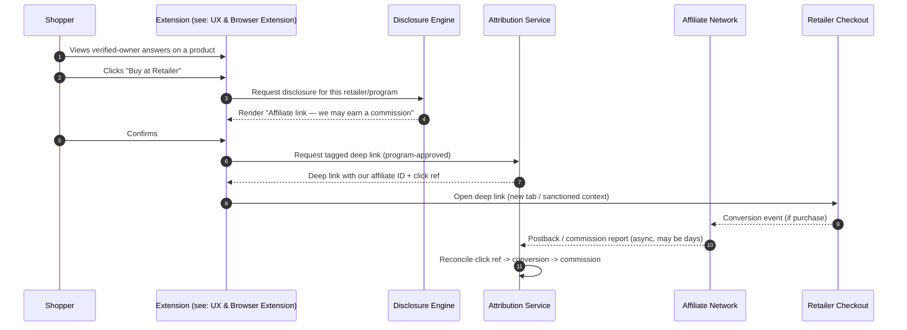

**Key design rules**

- The affiliate tag is applied **only** on explicit user action, never on passive
  browsing, and never by mutating the retailer's checkout page.
- Each program's **link format, cookie/attribution window, and allowed contexts**
  are encoded as adapter config, not hardcoded assumptions.
- We respect "**last click**" and **de-duplication** rules — we do not overwrite a
  more-recent legitimate affiliate click that we did not originate.

#### Retailer-approved extension behavior

Browser-extension affiliate behavior is the single biggest source of program
violations in the industry. The guardrails:

- **No silent link rewriting** of links the user did not click through us.
- **No cookie stuffing** (dropping affiliate cookies without a user click).
- **No "last-touch hijacking"** that overwrites another publisher's legitimate
  attribution.
- **Honor program-specific extension policies** — some programs ban browser
  extensions entirely; those retailers get the non-affiliate experience.
- Behavior is **gated per-retailer** by an allowlist sourced from signed program
  terms, not by what the code is technically able to do.

See [Legitimacy & compliance](#legitimacy--compliance-reloading-pages-and-overlaying-content)
for the detailed risk analysis of the overlay/reload pattern specifically, and
[`03-ux-extension-and-community.md`](./03-ux-extension-and-community.md) for the
extension's safe-behavior boundaries.

#### Partner APIs

Where a retailer offers a first-class commerce/affiliate API, prefer it: terms are
explicit, attribution is server-reported, and there is a contract to point to.
Adapters normalize: product catalog, price (with staleness), availability,
commission rate, attribution window, and postback schema.

#### Cashback / rewards-style

Sharing commission back to users drives engagement but raises:

- **Disclosure complexity** (users must understand the source of the reward).
- **Program compatibility** — many programs prohibit "incentivized traffic" or
  cashback without explicit approval. ⚖️
- **Fraud exposure** — self-referral and wash purchases
  (see: [Fraud holds](#fraud-holds-refunds-and-chargebacks) and
  [Trust & Incentives](./05-trust-verification-incentives-and-fraud.md)).

#### Post-purchase attribution (consent-gated)

Attribution derived from a confirmed purchase (e.g., user-forwarded order email,
connected account, or uploaded receipt) is powerful for **verifying ownership**
(it feeds the trust system) but is **privacy-heavy**:

- Strictly **opt-in**, with granular consent (see:
  [Privacy and Security](#privacy-and-security)).
- Receipt/email parsing must run under **data minimization**: extract the minimum
  fields (merchant, item, date, last-4 of order id) and discard the rest.
- ⚖️ Must be checked against email-provider terms and applicable privacy law.

#### Coupon / deal partnerships

Only **partner-supplied** codes (no scraped/expired codes that erode retailer
trust). Deals are labeled with source, expiry, and any affiliate relationship.

#### Attribution data model (conceptual)

See [Architecture, Data & APIs](./04-architecture-data-and-apis.md) for the
canonical schema; the commerce-relevant entities are:

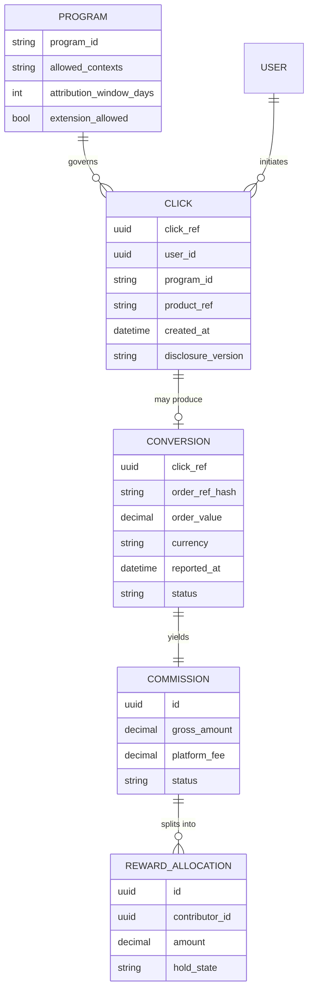

Note that `CLICK` stores the `disclosure_version` shown at handoff — disclosure is
captured as data at the moment of monetization for later audit.

### Revenue Model

#### Revenue streams

| Stream | Description | Margin profile | Trust risk | Disclosure |
|--------|-------------|:---:|:---:|------------|
| **Affiliate commissions** | Commission on retailer-attributed purchases | Variable | Low–Med | Always disclosed at handoff |
| **Premium AI assistant** | Paid tier of the AI shopping/owner assistant (see: [AI & Knowledge Graph](./06-ai-and-product-knowledge-graph.md)) | High | Low | Subscription terms |
| **Brand-sponsored Q&A** | Brands fund verified-owner Q&A sessions, **clearly labeled "Sponsored"** | High | **Med–High** | Prominent "Sponsored" + advertiser identity |
| **Warranty / insurance offers** | Referral/commission from licensed underwriters | Med | Med | Underwriter identity + "offer" labeling |
| **Deal alerts** | Premium price-drop / deal notifications | Med | Low | Affiliate label where applicable |
| **Price tracking** | Premium price-history + tracking | Med | Low | — |
| **Aggregate analytics** | Anonymized/aggregated category insights to brands | High | **High** | No PII; aggregation + k-anonymity bar |
| **Retailer partnerships** | Co-marketing, featured placement (labeled) | High | Med | "Partner" labeling |

#### Principles that protect trust

- **Sponsored content is never disguised as organic owner content.** Sponsored
  Q&A is labeled at the unit level and excluded from "verified owner" trust
  signals unless the owner is independently verified (see:
  [Trust & Incentives](./05-trust-verification-incentives-and-fraud.md)).
- **AI-generated answers are labeled** and never impersonate a human verified
  owner (see: [AI & Knowledge Graph](./06-ai-and-product-knowledge-graph.md)).
- **Analytics products sell aggregates, not people.** Minimum cohort sizes and
  suppression rules prevent re-identification (see:
  [Privacy and Security](#privacy-and-security)).
- **No pay-to-rank in organic trust.** Money can buy a *labeled* placement, never a
  manipulation of the trust/reputation score.

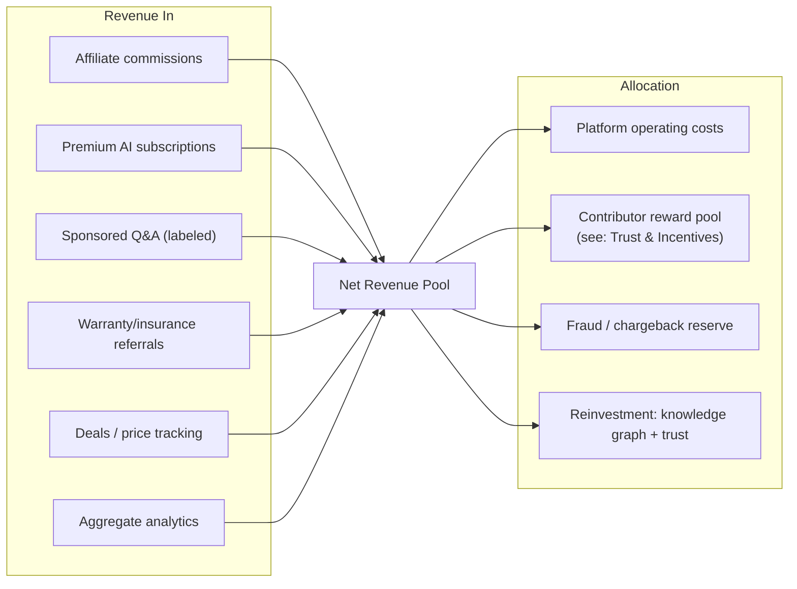

#### Revenue ↔ incentive coupling

The reward pool funded here is consumed by the incentive system (see:
[Trust & Incentives](./05-trust-verification-incentives-and-fraud.md)).
The commerce layer's responsibility ends at producing a **clean, auditable accrual**
into the contributor ledger; the *rules* for who earns what live in the incentive
design. This separation keeps payout policy changes from requiring commerce code
changes.

### Contributor Payout Model (Commerce Perspective)

The *rules* of who earns rewards belong to the incentive system, and anti-gaming
belongs to the trust/reputation model (both in
[`05-trust-verification-incentives-and-fraud.md`](./05-trust-verification-incentives-and-fraud.md)).
This subsection covers only the **commercial/financial plumbing** of paying people.

#### Accounting & ledger

- **Double-entry, append-only ledger.** Every accrual, hold, release, payout,
  reversal, and adjustment is an immutable event.
- **Separation of money-in and money-out** (principle P6): commissions reconcile
  into a revenue ledger; rewards accrue into a payout ledger; the reward pool is
  funded by an explicit transfer event (see the revenue allocation above).
- **Currency & rounding** handled at the ledger boundary; contributors see their
  local currency where supported by the PSP.

#### Fraud holds, refunds, and chargebacks

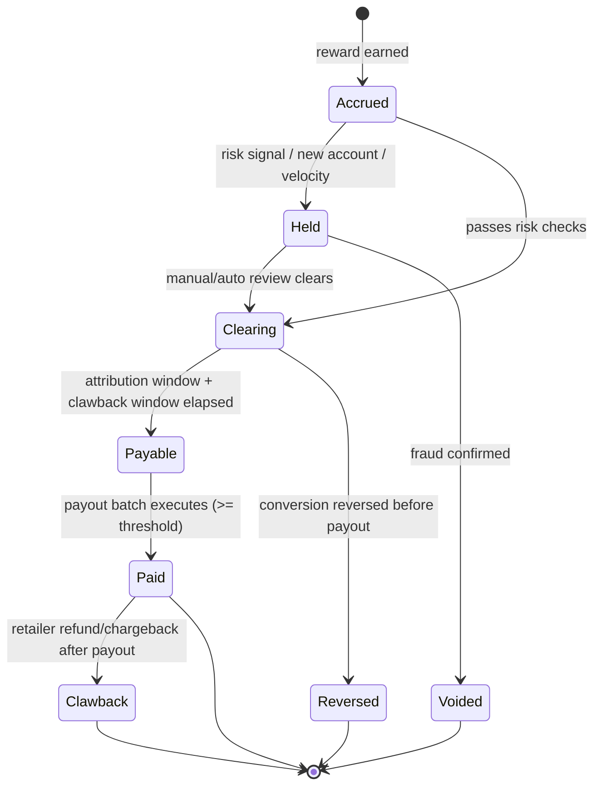

- **Clawback/refund window:** rewards do not become *payable* until the underlying
  commission has cleared the retailer's refund/return window (rewards mirror the
  reversibility of the revenue that funds them).
- **Negative balances** from post-payout chargebacks are netted against future
  earnings per the contributor terms (no surprise debt collection without notice).
- **Fraud reserve** (revenue-allocation bucket O3) absorbs unrecovered clawbacks.

#### Thresholds & batching

- Minimum payout **threshold** to control PSP fees and tax-form overhead.
- **Batch payouts** on a fixed cadence; below-threshold balances roll forward.
- Contributors can see *Accrued / Held / Payable / Paid* states transparently.

#### Tax, KYC, and geographic limits

- **KYC/identity verification via a specialized vendor** (we don't build this).
  Payout is blocked until KYC passes for the contributor's jurisdiction.
- **Tax documentation** (e.g., appropriate forms by jurisdiction) collected before
  the first payout that crosses reporting thresholds; reporting is generated from
  the payout ledger.
- **Sanctions/eligibility screening** before payout (denied-party screening).
- **Geographic limits:** payouts only to supported jurisdictions/currencies; users
  in unsupported regions can still contribute but see clear "payout unavailable in
  your region" status. ⚖️
- ⚖️ **LEGAL REVIEW REQUIRED** for the contributor agreement, tax classification,
  and any region added to the payout allowlist.

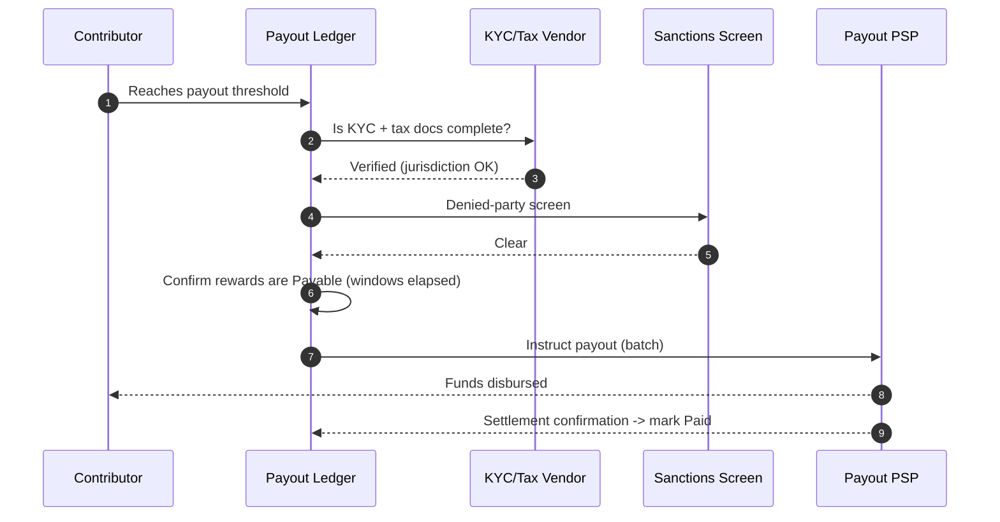

### Contributor Payout Operations

The subsections above describe the *model*; this describes the **operational
process** that runs it. (Introduced in v2; off-platform manual rewards in v0/v1.)

- **Eligibility:** verified + reputation threshold + clean fraud history; rewards
  are funded **only** from realized, compliant affiliate/partner revenue.
- **Flow:** accrue → hold window (clawback for reversed/returned orders & fraud) →
  KYC/tax (W-9/W-8/1099 where applicable) → payout via provider → reconcile.
- **Controls:** maximum velocity caps, manual review above thresholds,
  dual-approval for large payouts, full ledger/audit.
- **Disputes:** clear appeal path; documented reasons for held/denied payouts.

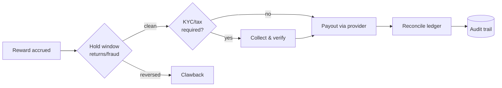

### Commercial Partnership & Retailer Risk Mitigation

#### Strategy: be a partner, not a parasite

The platform's long-term value to retailers is **higher-intent, better-informed
buyers** (owners answering real questions reduce returns and boost conversion).
That's the pitch — and it only holds if we are demonstrably non-adversarial.

#### Retailer risk mitigation playbook

| Risk to retailer | Our mitigation |
|------------------|----------------|
| Attribution hijacking / cookie stuffing | Click-based, disclosed handoff only; honor last legitimate click |
| DOM defacement / brand confusion | Content in our own surface, clearly branded; no retailer-page mutation |
| Fake/incentivized reviews | Verified-owner trust system + moderation (see: [Trust & Incentives](./05-trust-verification-incentives-and-fraud.md)) |
| Margin erosion via unwanted coupons | Only partner-supplied deals; no scraped codes |
| Data misuse | Minimization, no PII resale, aggregate-only analytics |
| Program-term violations | Program Terms Register + fail-closed legal gates (see: [Legal review gates](#legal-review-gates)) |

#### Partnership tiers

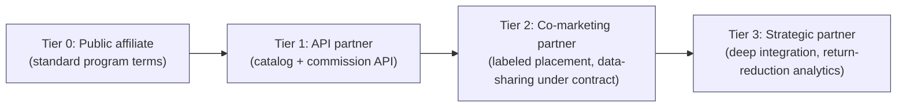

Higher tiers unlock richer integration **only** with contractual terms, mutual
disclosure standards, and data-use limits.

---

## Privacy and Security

> ⚖️ Privacy-law applicability (e.g., GDPR/UK GDPR, CCPA/CPRA, and others) depends
> on user location and data practices. The controls below are **design controls**;
> a DPIA and counsel review are required before launch.

### Core stance: opt-in ownership, minimal data

- **Ownership is opt-in.** A user is only a "verified owner" of a product after an
  explicit, revocable action. We never silently infer-and-publish ownership.
- **Anonymized / pseudonymized profiles** by default. Public owner identity is a
  handle, not a legal name, unless the user chooses otherwise.
- **Data minimization (P4).** Each data element must justify itself against a
  verification or product purpose; if it can't, we don't collect it.

### Sensitive data: receipts, emails, purchases

| Data type | Why we might touch it | Control |
|-----------|----------------------|---------|
| **Receipts** | Verify ownership | Parse → extract minimal fields → **discard raw image/PDF** after extraction (configurable retention); encrypt at rest; never public |
| **Email parsing** | Post-purchase attribution / verification (opt-in) | Granular consent; minimal-field extraction; revocable; never read non-purchase content |
| **Purchase history** | Personalization / verification | Opt-in; user-visible; deletable |
| **Sensitive purchases** | (health, intimate, etc.) | **Excluded from public ownership and recommendations by default**; extra suppression; never used for sponsored targeting |
| **Minors** | Should not be primary users | Age gating; no monetized profiling of minors; ⚖️ children's-privacy review |

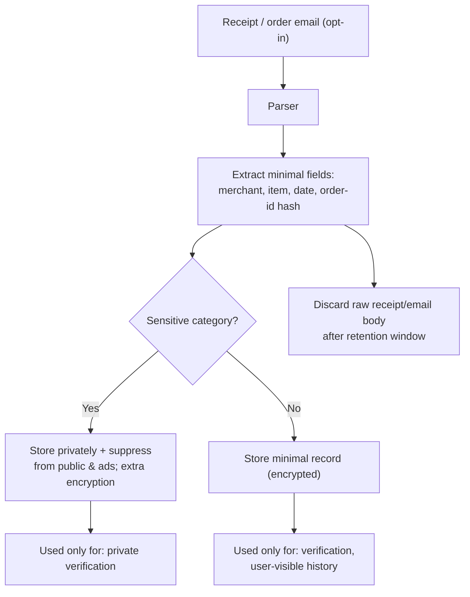

### Consent, deletion, export

- **Granular, layered consent** — separate toggles for verification, attribution,
  personalization, and analytics. Consent is **versioned and logged**.
- **Right to access/export** — user can export their data in a portable format.
- **Right to deletion** — deletion cascades across profile, receipts, parsed
  records, and removes the user from future analytics aggregates; ledger entries
  required for tax/audit are **retained in a minimized, lawful-basis form** and the
  user is told why (see [Retention](#retention-security--legal-overlap)).
- **Withdrawal of consent** disables the dependent feature prospectively.

### Privacy ↔ trust tension

Verification (trust) wants more data; privacy wants less. We resolve this by
**proving ownership without publishing it**: verification artifacts stay private,
only a derived "verified owner" badge is public (see:
[Trust & Incentives](./05-trust-verification-incentives-and-fraud.md)).

### Security

#### Authentication & authorization

- **Strong auth** (passwordless/MFA-capable); session tokens short-lived and
  rotated; refresh tokens revocable.
- **Authorization is least-privilege and role-based.** A contributor cannot read
  another contributor's PII/receipts; only scoped service roles can read raw
  verification artifacts.
- **Server is the source of truth.** The extension is treated as an untrusted
  client; all authorization decisions are server-side (see:
  [Architecture, Data & APIs](./04-architecture-data-and-apis.md)).

#### Secrets, encryption, and receipt storage

- **Secrets** in a managed secrets manager; never in source, extension bundles, or
  logs (see: [Supply chain](#supply-chain--extension-permissions)).
- **Encryption in transit (TLS) and at rest.** Receipts/PII encrypted at rest with
  managed keys; access is logged and minimized.
- **Receipt storage** is private-by-default, short-retention, and segregated from
  public content stores.

#### Supply chain & extension permissions

- **Least-privilege extension permissions.** Request only the host permissions and
  APIs strictly needed; prefer activeTab/explicit-action models over broad
  all-sites access where possible (see:
  [UX & Browser Extension](./03-ux-extension-and-community.md)).
- **Strict Content Security Policy (CSP)** for extension and web surfaces; no
  remote code execution; no `eval`.
- **Dependency hygiene:** pinned/locked dependencies, automated vulnerability
  scanning, signed builds, and review of any third-party script that runs in our
  surfaces.
- **No injection of remote, unreviewed scripts** into pages.

#### Payment security boundary

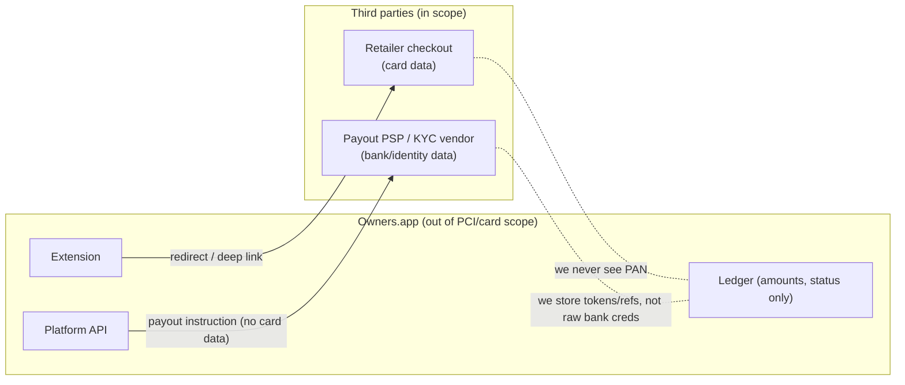

- **Card data never enters our systems** — checkout happens on the retailer.
- **Payout bank/identity data lives with the PSP/KYC vendor**; we store only
  **tokens/references** and payout *status*, keeping us out of the most sensitive
  scope.
- **Admin security:** privileged actions (refund overrides, manual reward release,
  program toggles) require MFA, are role-gated, and are **fully audit-logged** with
  immutable trails.

#### Retention (security + legal overlap)

- Define a **retention schedule** per data class (receipts: short; ledger: long for
  tax/audit; logs: bounded). Deletion requests honor the schedule's lawful-basis
  carve-outs and tell the user what is retained and why (see:
  [Consent, deletion, export](#consent-deletion-export)). ⚖️

---

## Legal and Compliance

### Legitimacy & Compliance: Reloading Pages and Overlaying Content

> ⚖️ **LEGAL REVIEW REQUIRED — this entire subsection.** The analysis below is a
> design risk assessment, **not** a legal determination. Each behavior must be
> cleared against (a) each affiliate program's terms, (b) each retailer's terms of
> service, (c) extension-store policies, and (d) applicable law, with counsel.

#### The pattern in question

A tempting growth hack: when a shopper lands on a product page, the extension
**reloads the page through an affiliate link** and/or **overlays owner testimonials
directly onto the retailer's page**. Both are high-risk and are described here as
patterns to *avoid or heavily constrain*, not as recommended behavior.

#### Risk analysis

| Behavior | Why it's tempting | Why it's risky | Likely classification |
|----------|------------------|----------------|------------------------|
| **Silent reload through affiliate link** | Captures commission without a click | Drops affiliate attribution without user action; overwrites other publishers | **Likely "cookie stuffing" / attribution hijacking — commonly prohibited** ⚠️ |
| **Auto-applying affiliate tag on passive browse** | Higher capture rate | No user intent; violates "click-based" attribution | **Likely program violation** ⚠️ |
| **Overlaying testimonials on retailer DOM** | Rich in-context UX | Modifies retailer property; may imply retailer endorsement; brand/trademark issues | **Retailer ToS + possible IP/passing-off risk** ⚠️ |
| **Injecting our content to look native to retailer** | Trust transfer | Deceptive; consumer-protection exposure | **High risk — avoid** ⛔ |

#### Safer alternatives (recommended)

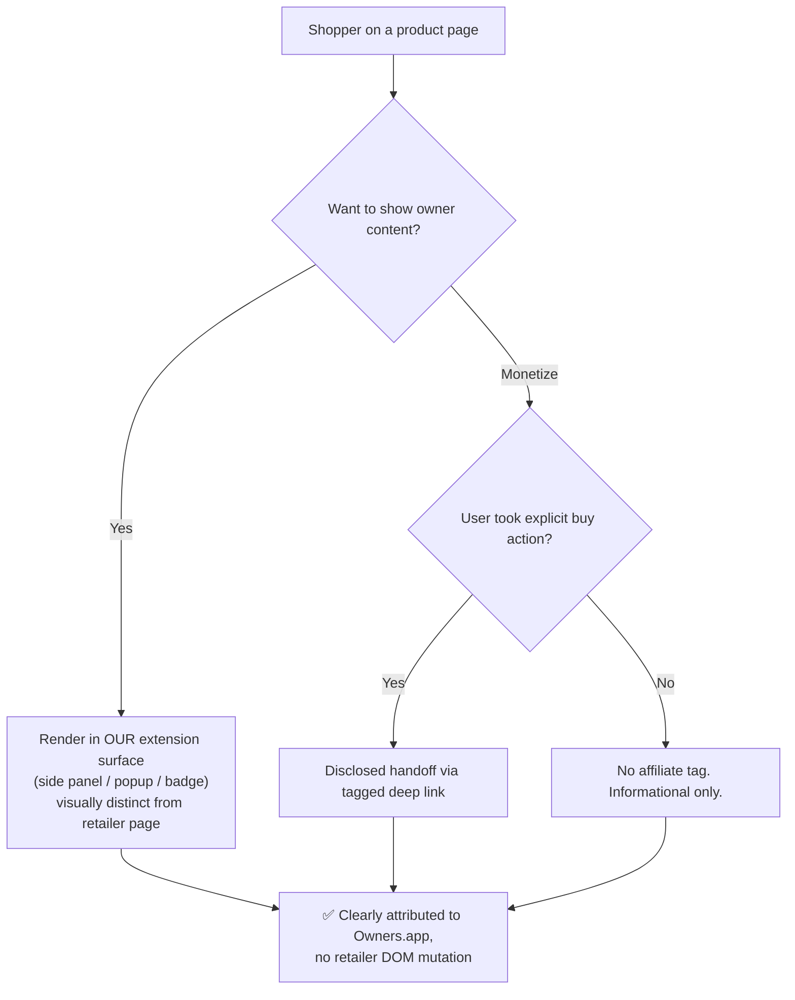

**Design rules that keep us legitimate**

1. **Own surface, not their page.** Owner content lives in *our* extension chrome
   (side panel/popup), clearly branded as Owners.app — never disguised as the
   retailer's own content.
2. **No reload-for-commission.** Affiliate tags require an explicit, disclosed user
   action.
3. **Respect existing attribution.** Never overwrite another publisher's legitimate
   last click.
4. **Per-program/per-retailer allowlist.** Behavior is enabled only where terms
   permit; default is the conservative, non-affiliate experience.
5. **Disclosure at the moment of monetization**, versioned and logged
   (see: [Disclosures](#disclosures-design)).

#### Disclosure requirements (design view)

- Affiliate relationship disclosed **before** the user leaves for the retailer.
- Sponsored content labeled **at the unit level**, not only in a global policy.
- AI content labeled as AI (see:
  [AI & Knowledge Graph](./06-ai-and-product-knowledge-graph.md)).
- Disclosure copy is **versioned**; the version shown is stored with the click for
  audit.

#### The "need for program-specific legal review" gate

There is no single global rule. Amazon's, a network's (e.g., CJ/Impact-style), and
a direct retailer's terms **differ and change**. Therefore:

- Maintain a **Program Terms Register** (per program: extension allowed? reload
  allowed? incentivized traffic allowed? required disclosure language?).
- Each register entry is **reviewed and dated by counsel**; expired reviews disable
  the program in production. See [Legal review gates](#legal-review-gates).

> ⚖️ **This subsection is a checklist of areas requiring qualified legal review.**
> It is **not** legal advice and must not be treated as a determination of
> compliance.

### Endorsement & disclosure (FTC-style and international equivalents)

- **Material connections must be disclosed** clearly and conspicuously: affiliate
  links, sponsorships, free products to owners, and any incentivized content.
- **Testimonials/endorsements must be truthful** and reflect genuine owner
  experience; no fabricated or undisclosed-incentivized reviews.
- **Disclosures are at the point of consumption**, not buried (see:
  [Disclosures](#disclosures-design)).

### Affiliate program & retailer terms

- **Program-by-program compliance** (no global assumption). Extension allowances,
  reload/auto-tag prohibitions, incentivized-traffic rules, and required disclosure
  language vary (see the Program Terms Register in
  [Legitimacy & compliance](#the-need-for-program-specific-legal-review-gate)).

### Consumer protection & advertising law

- No deceptive UI, no dark patterns, no implying retailer/brand endorsement we
  don't have, accurate pricing/availability with staleness labeling.

### Privacy & data-protection law

- Applicability and obligations (notice, lawful basis, DSAR handling, data-transfer
  mechanisms) depend on jurisdiction; **DPIA + counsel required** (see:
  [Privacy and Security](#privacy-and-security)).

### Financial/tax/sanctions

- Contributor payouts implicate **tax reporting, KYC/AML-style screening, and
  sanctions** obligations; structured to keep us out of money-transmission where
  possible by using licensed PSPs (see:
  [Contributor payout model](#contributor-payout-model-commerce-perspective)).

### Warranty / insurance offers

- Insurance is **heavily regulated**; we act only as a referrer to **licensed
  underwriters**, with required disclosures and **no implied underwriting by us**. ⚖️

### Content moderation & intermediary liability

- User-generated Q&A requires a **moderation policy**, notice-and-takedown, and
  handling of defamation/IP claims; intermediary-liability protections vary by
  jurisdiction (see:
  [Trust & Incentives](./05-trust-verification-incentives-and-fraud.md) for
  moderation mechanics).

### Platform terms & store policies

- **Our ToS, Privacy Policy, and Contributor Agreement** must align with actual
  behavior.
- **Extension/app-store policies** (e.g., affiliate-link, data-use, and
  permission-justification rules) are a gating dependency — a store rejection
  blocks distribution (see:
  [UX & Browser Extension](./03-ux-extension-and-community.md)).

### Legal Review Gates

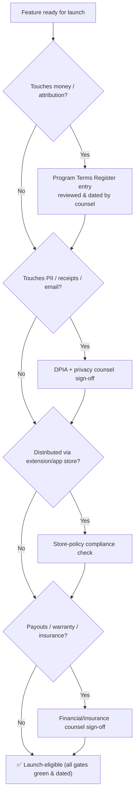

**Gate rule:** any expired or missing review **disables the feature/program in
production automatically** (fail-closed). The four launch gates are: (1) program
terms, (2) privacy/DPIA, (3) store policy, (4) financial/insurance.

### Disclosures (Design)

Disclosures are productized, not an afterthought.

- **Disclosure Engine** renders the correct, **versioned** disclosure for the
  context (affiliate handoff, sponsored unit, AI content, warranty offer).
- **Point-of-consumption placement:** the label appears where the user makes the
  decision, in plain language.
- **Auditability:** the disclosure *version* shown is stored with the related event
  (click/conversion/sponsored impression) for after-the-fact proof.
- **Labels we standardize:**
  - "Affiliate link — we may earn a commission."
  - "Sponsored by {Advertiser}" (unit-level).
  - "AI-generated — not a verified owner" (see:
    [AI & Knowledge Graph](./06-ai-and-product-knowledge-graph.md)).
  - "Offer provided by {Licensed Underwriter}" (warranty/insurance).

---

## Acceptance Criteria & Quality Bar

### Commerce acceptance criteria

- [ ] No affiliate tag is ever applied without an **explicit, disclosed user
      action**.
- [ ] No retailer page is reloaded or DOM-mutated for monetization purposes.
- [ ] Every monetized surface renders a **versioned disclosure** stored with its
      event.
- [ ] Each enabled program has a **current, counsel-dated** Program Terms Register
      entry; expired entries disable the program (fail-closed).
- [ ] Revenue-in and payout ledgers are **separate, append-only, and reconcilable**.
- [ ] Sponsored/AI content is **labeled at the unit level** and excluded from
      organic trust signals.

### Payout acceptance criteria

- [ ] No payout executes before **KYC + tax docs + sanctions screen** pass.
- [ ] Rewards become *Payable* only after the **refund/clawback window** elapses.
- [ ] Post-payout chargebacks are handled via reserve and netted per terms with
      notice.
- [ ] Payouts restricted to **supported jurisdictions**; unsupported regions see
      clear status.

### Privacy quality bar

- [ ] Ownership and all sensitive processing are **opt-in** and revocable.
- [ ] Raw receipts/email bodies are **minimized and discarded** after extraction
      per retention schedule.
- [ ] Sensitive-category purchases are **suppressed** from public surfaces and ads.
- [ ] Access, export, and deletion are implemented; deletion honors lawful-basis
      retention carve-outs with user notice.
- [ ] A **DPIA** exists and is reviewed before launch. ⚖️

### Security quality bar

- [ ] Card data never touches our systems; payout PII lives with PSP/KYC vendor
      (tokens/refs only on our side).
- [ ] Least-privilege extension permissions + strict CSP + no remote code.
- [ ] Secrets in a manager; encryption in transit and at rest; receipts segregated
      and access-logged.
- [ ] Admin/privileged actions are MFA-gated, role-scoped, and immutably audited.
- [ ] Dependencies pinned, scanned, and builds signed.

### Legal/compliance quality bar

- [ ] All four launch gates (program terms, privacy/DPIA, store policy, financial)
      are **green and dated** (see [Legal review gates](#legal-review-gates)).
- [ ] Disclosures meet endorsement-rule expectations and are point-of-consumption.
- [ ] ToS, Privacy Policy, and Contributor Agreement reflect **actual** behavior.
- [ ] Warranty/insurance offers route only to **licensed underwriters** with proper
      labeling.

---

## Open Questions

Hand these to roadmap / open-questions tracking (see
[`08-roadmap-operations-risks-and-backlog.md`](./08-roadmap-operations-risks-and-backlog.md)):

1. Which affiliate programs/retailers are in scope for Phase 1, and which permit
   extension behavior at all? (Needs the Program Terms Register populated.)
2. Build vs. buy for KYC/tax/sanctions and for payout PSP — confirm vendor and
   supported payout geographies.
3. Cashback (Approach D) and post-purchase attribution (Approach E): legal/program
   feasibility per market.
4. Aggregate-analytics product: minimum cohort size / suppression thresholds and
   whether it requires separate consent.
5. Minors policy and age-gating mechanism — needed before any monetized profiling.
6. Sponsored Q&A labeling standard — final copy and placement, validated against
   endorsement rules.
7. Insurance/warranty: which licensed underwriters, in which states/countries.
