# Roadmap, Operations, Risks & Backlog

> **Part of the Owners.app design set.** This is the delivery-and-operations playbook: what we
> build first, in what order, how we run it, what could go wrong, and the epics a future fleet can
> pick up independently. Product surfaces, trust mechanics, commerce rules, and system architecture
> live in the sibling documents linked below — this document **references** them rather than
> restating them.

## Related documents

- **Foundation & strategy** (vision, market wedge, north-star metric, core components): [`02`][foundation]
- **User personas & journeys** (shopper/owner flows): [`01`][personas]
- **UX, browser extension & community surfaces**: [`03`][ux]
- **Architecture, data & APIs** (services, schema, events, deploy topology): [`04`][architecture]
- **Trust, verification, incentives & fraud** (reputation, moderation, payouts policy): [`05`][trust]
- **AI search & product knowledge graph**: [`06`][ai]
- **Commerce, privacy, security & legal** (affiliate, payouts, disclosures, DSR): [`07`][commerce]
- **MVP implementation spec** (locked v0 build decisions): [`09`][mvp]

---

## Table of contents

- [How to use this document](#how-to-use-this-document)
- [North Star & operating principles](#north-star--operating-principles)
- [MVP definition](#mvp-definition)
- [Phased roadmap](#phased-roadmap)
- [Cold-start & go-to-market](#cold-start--go-to-market)
- [Future expansion](#future-expansion)
- [Analytics & KPI instrumentation](#analytics--kpi-instrumentation)
- [Operations](#operations)
- [Support workflows](#support-workflows)
- [Incident response](#incident-response)
- [Launch plan & beta program](#launch-plan--beta-program)
- [Launch readiness acceptance criteria](#launch-readiness-acceptance-criteria)
- [Risk register](#risk-register)
- [Open questions](#open-questions)
- [Implementation backlog (epics)](#implementation-backlog-epics)

---

## How to use this document

- **Product/leadership:** read [North Star](#north-star--operating-principles), [MVP](#mvp-definition),
  [Phased roadmap](#phased-roadmap), and [Risk register](#risk-register).
- **Growth/GTM:** read [Cold-start & GTM](#cold-start--go-to-market) and
  [Launch plan & beta program](#launch-plan--beta-program).
- **Ops/support/on-call:** read [Operations](#operations), [Support](#support-workflows), and
  [Incident response](#incident-response).
- **A future fleet picking up build work:** jump to the
  [Implementation backlog (epics)](#implementation-backlog-epics). Every epic lists intent, stories,
  dependencies, instrumentation, and acceptance so it can be executed independently.

---

## North Star & operating principles

**North Star Metric:** *Verified Answer Throughput* — the number of high-quality answers from
**verified owners** delivered to shoppers at a decision moment per week. This single metric captures
both supply (verified owners answering) and demand (shoppers asking at the point of purchase), and it
feeds the durable asset: the **product ownership knowledge graph** ([AI search & knowledge][ai]).

Operating principles that constrain every roadmap and ops decision:

1. **Trust before scale.** A wrong or fraudulent "verified" answer is worse than no answer.
   Verification integrity ([trust doc][trust]) gates growth, not the reverse.
2. **Liquidity per category, not globally.** We win one product category at a time; breadth without
   depth produces dead questions.
3. **Compliant monetization only.** Revenue derives from compliant affiliate/partner programs and
   disclosed partnerships ([commerce doc][commerce]). We never trade answer integrity for commission.
4. **The graph compounds.** Every answer, verification, and reaction should enrich a reusable,
   queryable knowledge graph — not just a thread.
5. **Instrument first.** No feature ships without its analytics events defined
   (see [Analytics & KPI instrumentation](#analytics--kpi-instrumentation)).

---

## MVP definition

The MVP exists to answer one question: **Will verified owners answer real shopper questions fast
enough and well enough to change a purchase decision?** Everything else (payouts, graph, partner
dashboards) is deferred until that loop is proven.

### What must be validated first

We validate riskiest assumptions in priority order. Each has a falsifiable hypothesis and a
kill/continue threshold.

| # | Riskiest assumption | Hypothesis | Validation method | Continue threshold |
|---|---------------------|------------|-------------------|--------------------|
| A1 | **Owners will answer for free (intrinsic motivation)** | Verified owners answer questions before any cash incentive exists | Manually recruit 50 owners in 1 category; measure response | ≥ 40% of asked owners answer within 24h |
| A2 | **Shoppers will ask at the decision moment** | Shoppers on a product page will post a question to a stranger-owner | Extension/widget on seed pages | ≥ 5% of engaged sessions post or upvote a question |
| A3 | **Answers change behavior** | A verified answer measurably shifts purchase intent | Post-answer survey + (later) affiliate click/convert | ≥ 30% self-report "this changed my decision" |
| A4 | **Verification is trustworthy & low-friction** | Owners can prove ownership without unacceptable drop-off | Test 2–3 verification methods | < 40% verification abandonment |
| A5 | **Answer latency is tolerable** | Median time-to-first-answer is fast enough to matter | Measure TTFA | Median TTFA < 6h; p90 < 24h |
| A6 | **Content is reusable** | Past answers satisfy new shoppers without a new question | Surface prior Q&A; measure deflection | ≥ 25% of intents resolved by existing content |

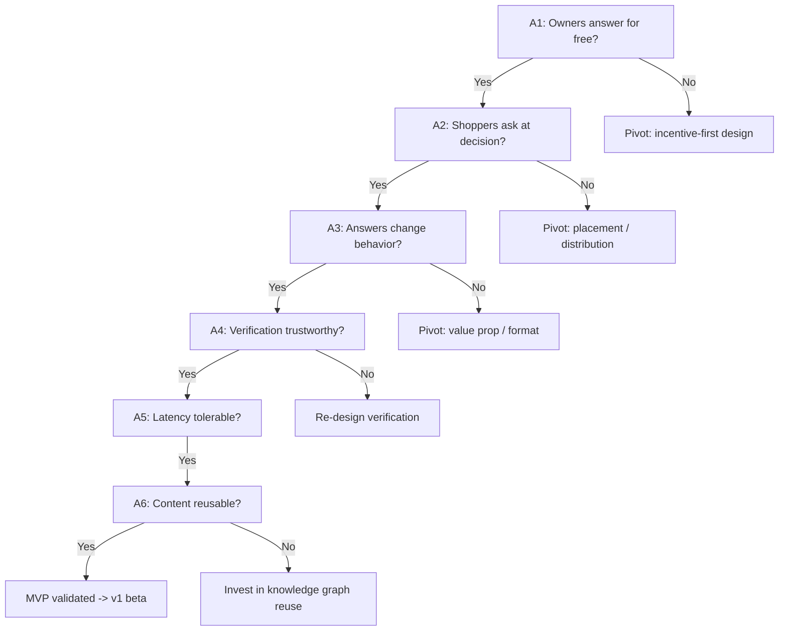

### MVP scope (in / out)

**In scope (v0/v1):**

- Single category wedge: **Amazon.com earbuds** in the United States (see [MVP implementation spec][mvp]).
- Shopper ask flow via **Chrome Manifest V3** extension + lightweight web widget ([UX & extension][ux]).
- Owner answer flow (web + email/push notification).
- MVP ownership verification via explicit, user-initiated Amazon Orders page scan with no Amazon credential collection ([trust doc][trust], [MVP spec][mvp]).
- Basic Q&A threading, upvotes, and "this helped" signal.
- Manual moderation queue, user reporting, and rate limits.
- Core analytics events (see [Event taxonomy](#event-taxonomy)).
- Disclosed normal Amazon handoff/link with **no affiliate tag** while Amazon program approval is unresolved ([commerce doc][commerce]).

**Explicitly out of scope (deferred):**

- Automated cash payouts and contributor wallets (manual, off-platform rewards in MVP).
- Full knowledge graph + AI retrieval (stubbed; searchable prior Q&A and human/admin summaries only).
- Multi-category breadth.
- Brand/manufacturer dashboards.
- Mobile native apps (PWA only).
- Reputation/leveling systems beyond a basic verified badge.
- Non-US Amazon marketplaces and non-Chrome browsers.

### MVP acceptance criteria

The MVP is considered **validated and ready to graduate to v1 beta** when **all** of the following
hold over a rolling 4-week window in the seed category:

- [ ] **AC-MVP-1 (Supply):** ≥ 50 verified owners active; ≥ 40% answer rate on routed questions.
- [ ] **AC-MVP-2 (Latency):** Median time-to-first-answer < 6h; p90 < 24h.
- [ ] **AC-MVP-3 (Demand):** ≥ 200 unique shopper questions asked; ≥ 5% ask/upvote rate on engaged sessions.
- [ ] **AC-MVP-4 (Impact):** ≥ 30% of answered shoppers report the answer influenced their decision.
- [ ] **AC-MVP-5 (Trust):** ≥ 95% of answers from accounts that passed verification; < 1% confirmed fraudulent/verification-spoofing incidents.
- [ ] **AC-MVP-6 (Reuse):** ≥ 25% of new shopper intents resolved by existing Q&A without a new question.
- [ ] **AC-MVP-7 (Quality):** Average answer helpfulness rating ≥ 4.0/5; moderation removal rate < 10%.
- [ ] **AC-MVP-8 (Instrumentation):** 100% of funnel steps emit events; dashboards live and reconciled (see [Dashboards & review cadence](#dashboards--review-cadence)).

---

## Phased roadmap

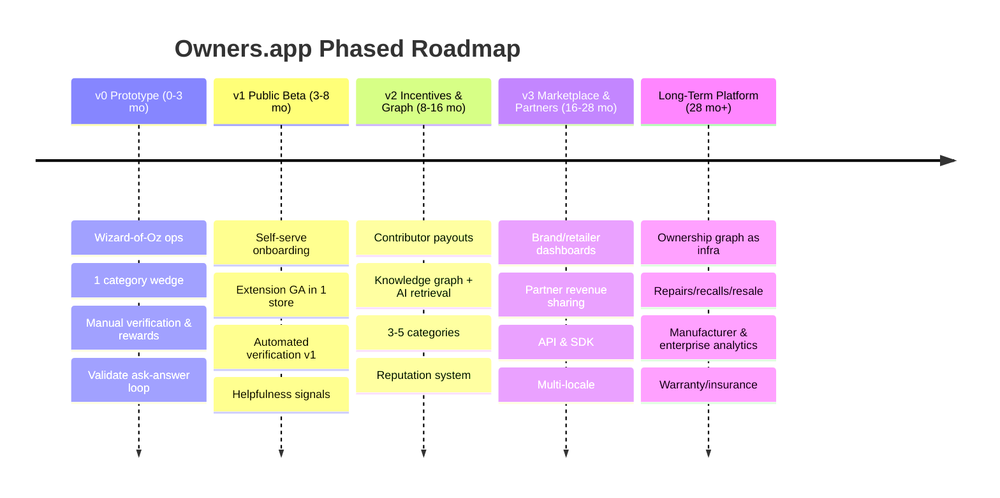

| Phase | Primary goal | Exit criteria → next phase |
|-------|--------------|----------------------------|
| **v0** | Prove the ask→verified-answer→impact loop | [MVP acceptance criteria](#mvp-acceptance-criteria) met |
| **v1** | Make the loop self-serve & repeatable | Retention + liquidity targets met in seed category |
| **v2** | Add durable incentives & the knowledge graph | Payouts compliant & fraud-controlled; graph drives ≥ 40% reuse |
| **v3** | Open to partners & monetize the graph | ≥ 3 paying partners; positive contribution margin per category |
| **Long-term** | Become ownership-knowledge infrastructure | Multiple expansion verticals live (see [Future expansion](#future-expansion)) |

### Phase gates

Each phase promotion is a **gate**, not a date. A phase does not begin until the prior phase's exit
criteria are demonstrably met and reviewed.

```mermaid
flowchart LR
    V0[v0 Prototype] -->|MVP AC met, 4-wk sustained| G1{{Gate 1}}
    G1 --> V1[v1 Public Beta]
    V1 -->|Retention + liquidity hold| G2{{Gate 2}}
    G2 --> V2[v2 Incentives & Graph]
    V2 -->|Compliant payouts + 40% reuse| G3{{Gate 3}}
    G3 --> V3[v3 Marketplace & Partners]
    V3 -->|3+ partners, positive margin| G4{{Gate 4}}
    G4 --> LT[Long-Term Platform]
```

### v0 — Prototype & Wizard-of-Oz

**Theme:** Do things that don't scale. Humans simulate automation.

- **Verification:** Manual review of receipts/photos by ops team (see [Verification operations](#verification-operations)).
- **Routing:** Ops manually route shopper questions to relevant owners (Slack/email/SMS concierge).
- **Rewards:** Manual gift cards / off-platform thank-yous to high-value contributors; **no automated payouts**.
- **Surface:** Browser extension (unlisted/dev mode) + embeddable widget on a handful of seed product pages.
- **Goal:** Hit the [MVP acceptance criteria](#mvp-acceptance-criteria).

### v1 — Public Beta

**Theme:** Remove humans from the critical path; ship to a public store.

- Self-serve owner onboarding + automated verification v1 ([trust doc][trust]).
- Extension published in at least one browser store (Chrome/Edge).
- Notification system (push/email) for question routing.
- Helpfulness ratings, basic owner profiles, verified badges.
- Trust & safety baseline: report flow, automated spam filters ([trust doc][trust]).
- Affiliate attribution wired end-to-end (disclosed) ([commerce doc][commerce]).

### v2 — Incentives & Knowledge Graph

**Theme:** Make contribution rewarding and answers reusable.

- **Contributor payouts** from compliant affiliate/partner revenue: wallets, KYC where required, tax handling (see [Payout operations](#payout-operations)).
- **Reputation & leveling** to gate rewards and reduce fraud ([trust doc][trust]).
- **Knowledge graph** construction: entity resolution (products, models, owners, attributes), Q&A linking, structured attributes ([AI doc][ai]).
- **AI retrieval** to deflect repeat questions and pre-answer with cited owner sources.
- Expand to 3–5 adjacent categories.

### v3 — Marketplace & Partner Platform

**Theme:** Monetize the graph; open to partners.

- **Brand/retailer dashboards:** sentiment, FAQ gaps, objection insights.
- **Partner revenue sharing** & sponsored verified-owner programs (clearly disclosed).
- **Public API & SDK** for embedding verified Q&A on retailer PDPs and brand sites ([architecture doc][architecture]).
- Internationalization & multi-locale moderation.

### Long-Term Platform

**Theme:** The ownership knowledge graph becomes infrastructure.

- Expansion verticals: repairs, predictive reliability, recalls, maintenance, resale, warranty/insurance, accessory compatibility (see [Future expansion](#future-expansion)).
- Enterprise analytics & manufacturer reliability feedback loops.

---

## Cold-start & go-to-market

The chicken-and-egg problem: shoppers won't ask where no owners answer; owners won't hang around where
no one asks. We solve it **per category** by manufacturing initial liquidity.

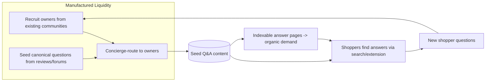

### Category wedge selection

Pick categories where owner expertise materially de-risks a purchase. Scoring rubric (1–5 each; pick
highest total):

| Criterion | Why it matters |
|-----------|----------------|
| **Decision anxiety** | High consideration, fear of buyer's remorse → demand for owner truth |
| **Owner passion** | Enthusiast owners answer for free (validates A1) |
| **Question longevity** | Answers stay valid → graph reuse compounds |
| **Affiliate economics** | Healthy commissions / partner budgets → monetization |
| **Fragmented info** | No single trusted source today → we fill a gap |
| **SKU stability** | Models don't churn weekly → content doesn't rot |

**Strong wedge examples:** robot vacuums & home appliances; e-bikes & mobility; espresso machines &
prosumer kitchen; 3D printers; baby gear (car seats, strollers); power tools; standing
desks/ergonomic; mechanical keyboards; cameras/lenses; smart-home ecosystems; mattresses; pet tech.

### Seed communities

- Subreddits, Discords, Facebook groups, and enthusiast forums in the wedge category.
- Manufacturer/owner clubs and warranty-registration communities.
- Existing review ecosystems (we recruit prolific reviewers as charter owners).

### Owner acquisition

- **Charter Owner program:** hand-pick 50–200 credible owners; offer status, early features, and recognition.
- **Verification fast-lane** for charter owners to minimize friction (see [Verification operations](#verification-operations)).
- **Recognition over cash** early (badges, leaderboards, "Top Owner"); cash rewards introduced in v2 (see [Payout operations](#payout-operations)).
- Outreach via warranty registrations, review imports (with consent), and community partnerships.

### Shopper acquisition

- **Browser extension** that activates on retailer PDPs in the wedge category ([UX & extension][ux]).
- **SEO answer pages:** every verified Q&A produces an indexable, structured page → durable organic demand.
- **Creator embeds & referral links** (see below).
- Targeted paid acquisition only after organic loops show retention (avoid buying into a leaky funnel).

### Creator & expert partnerships

- Recruit category YouTubers/TikTokers/bloggers as **anchor verified owners**; their audience seeds both supply and demand.
- Co-branded "Ask the Owner" embeds on creator content.
- Revenue share from compliant affiliate links on their referred purchases (disclosed) ([commerce doc][commerce]).

### Retailer & brand partnerships

- Pilot embedding verified Q&A on retailer PDPs (improves conversion, reduces returns) ([architecture doc][architecture]).
- Brands sponsor *access to honest owners* (not paid answers) — strict disclosure & no answer-editing ([trust doc][trust]).
- Returns-reduction and CSAT case studies become the enterprise sales narrative.

---

## Future expansion

The ownership knowledge graph is the durable asset; each expansion is a new query/use-case over the
same owner relationships and product entities ([AI doc][ai]).

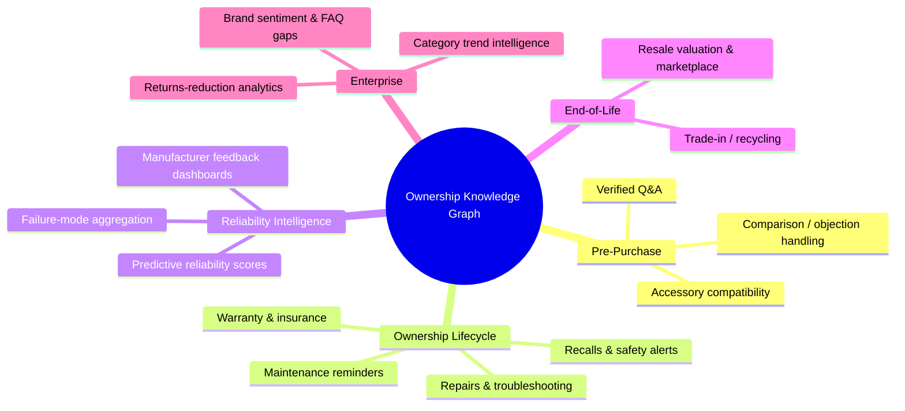

| Expansion | Value unlocked | Graph leverage |
|-----------|----------------|----------------|
| **Repairs & troubleshooting** | Owners help owners fix issues | Failure-mode + solution links |
| **Predictive reliability** | Reliability scores from real ownership signals | Longitudinal owner reports |
| **Recalls & safety alerts** | Reach verified owners of affected SKUs directly | Owner↔product registry |
| **Maintenance reminders** | Lifecycle engagement & retention | Product attributes + ownership date |
| **Resale / trade-in** | Trusted secondary marketplace | Ownership provenance & condition |
| **Manufacturer dashboards** | Honest reliability/feedback loop to makers | Aggregated owner sentiment |
| **Enterprise analytics** | Returns reduction, FAQ gaps, objections | Question/intent aggregation |
| **Warranty / insurance** | Verified ownership powers claims/pricing | Verified ownership records |
| **Accessory compatibility** | "Will X work with my Y?" answered with authority | Product compatibility edges |

**Sequencing principle:** expand only after a category proves liquidity and unit economics; reuse the
same verification and graph infrastructure to keep marginal cost low.

---

## Analytics & KPI instrumentation

> Principle: **No feature ships without its events.** Each roadmap epic (see
> [Implementation backlog](#implementation-backlog-epics)) must define the events it emits before
> merge. The event pipeline and store are described in the [architecture doc][architecture].

### Metric tree

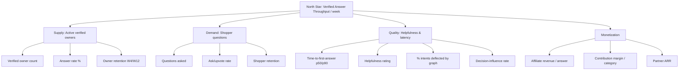

**Tier-1 KPIs (weekly review):** Verified Answer Throughput, answer rate, TTFA p50/p90, helpfulness,
ask rate, category liquidity ratio (answered/asked), decision-influence rate.

**Tier-2 KPIs (monthly):** owner & shopper retention cohorts, % intents deflected, organic
sessions/answer, verification abandonment, moderation removal rate, fraud rate, affiliate
revenue/answer, contribution margin/category.

### Event taxonomy

Naming: `object_action`, `snake_case`, past-tense semantics; every event carries `user_id` (or anon
id), `session_id`, `category_id`, `product_id?`, `timestamp`, `platform`, `app_version`.

| Event | Trigger | Key properties |
|-------|---------|----------------|
| `extension_activated` | Extension fires on PDP | `retailer`, `pdp_url_hash` |
| `question_viewed` | Shopper sees existing Q&A | `question_id`, `source` (search/extension/embed) |
| `question_asked` | Shopper posts question | `question_id`, `has_existing_match` |
| `question_routed` | System routes to owner(s) | `question_id`, `owner_ids`, `route_method` |
| `answer_submitted` | Owner answers | `answer_id`, `owner_id`, `ttfa_seconds`, `verified` |
| `answer_rated` | Shopper rates answer | `answer_id`, `rating`, `helpful_bool` |
| `decision_influenced` | Post-answer survey | `answer_id`, `influence_bool` |
| `verification_started` / `verification_completed` / `verification_failed` | Owner verification | `method`, `duration_seconds`, `failure_reason?` |
| `intent_deflected` | Existing content satisfies intent | `question_id?`, `match_source` |
| `affiliate_click` / `affiliate_conversion` | Commerce | `merchant`, `order_value?`, `commission?` |
| `payout_requested` / `payout_completed` | Rewards | `amount`, `currency`, `provider` |
| `content_flagged` / `content_removed` | Moderation | `reason`, `actor` |

### Dashboards & review cadence

- **Daily ops dashboard:** open question queue, unrouted questions, verification backlog, moderation backlog, incident status.
- **Weekly growth review:** Tier-1 KPIs vs. targets; per-category liquidity.
- **Monthly business review:** retention cohorts, unit economics, fraud & quality, monetization.
- **Data integrity:** event-volume anomaly alerts; monthly reconciliation of analytics vs. source-of-truth DB ([architecture doc][architecture]).

---

## Operations

Ops is a first-class product surface. The same loop that delights users can be abused, so each ops
function pairs a **workflow** with **SLAs** and **abuse controls** (trust mechanics in the
[trust doc][trust]).

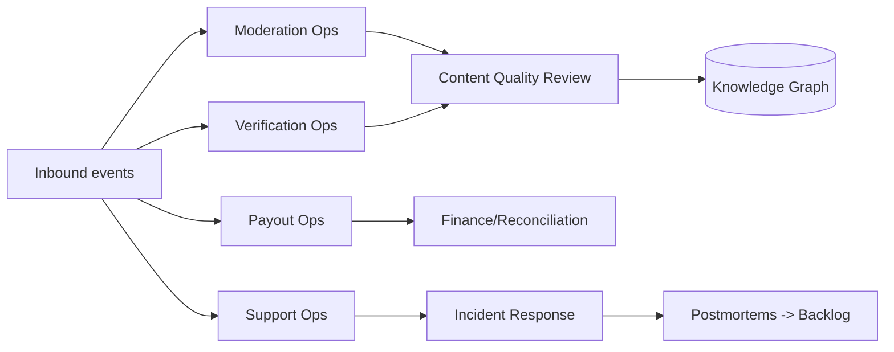

### Observability

Three pillars plus domain KPIs, correlated by a `trace_id` propagated from the extension through the
gateway, services, and events (full topology in the [architecture doc][architecture]).

- **Tracing** — OpenTelemetry distributed traces across gateway → services → event consumers.
- **Metrics** — RED (Rate, Errors, Duration) per service; realtime fan-out latency; resolver hit/miss ratio; AI cost-per-product; queue depths/lag (consumer lag is a primary health signal).
- **Logging** — structured JSON logs with `request_id`/`trace_id`; PII-scrubbed; centralized.
- **Domain dashboards** — verified-answer rate, ownership-verification funnel, question→answer time, AI-summary freshness, moderation queue latency, contributor reward accrual.
- **Alerting & SLOs** — error-budget-based alerts on the architecture SLOs; paged on read-path p95, realtime fan-out p95, event-consumer lag, and verification pipeline backlog.

### Moderation operations

- **Pipeline:** automated filters (spam, PII, profanity, links) → risk scoring → human queue for borderline/flagged → action.
- **Queue SLAs:** flagged content triaged < 4h; high-severity (safety, doxxing, illegal) < 1h.
- **Actions:** approve, edit-request, hide, remove, warn, suspend, ban; all logged with reason codes (audit trail).
- **Policy:** owners may not be paid to alter answers; conflicts-of-interest must be disclosed ([commerce doc][commerce]).
- **Tooling:** moderator console with bulk actions, reason codes, appeal handling, and reviewer double-blind for high-stakes removals. Design details in the [trust doc][trust].

### Verification operations

Verification is the trust backbone (full method design in the [trust doc][trust]). Ops
responsibilities:

- **Method ladder:** receipt/order upload, serial/IMEI check, photo-with-token, retailer purchase-history OAuth, manufacturer warranty registration — escalate strength by reward tier.
- **Review SLA:** automated checks instant; manual review < 24h (charter fast-lane < 4h).
- **Re-verification:** periodic or risk-triggered re-checks; expire stale verifications.
- **Fraud signals:** duplicate receipts, image reuse/EXIF anomalies, velocity spikes, device/IP clustering → route to Trust & Safety ([trust doc][trust]).
- **Privacy:** verification artifacts stored encrypted, minimized, and auto-purged after decision ([commerce doc][commerce]).

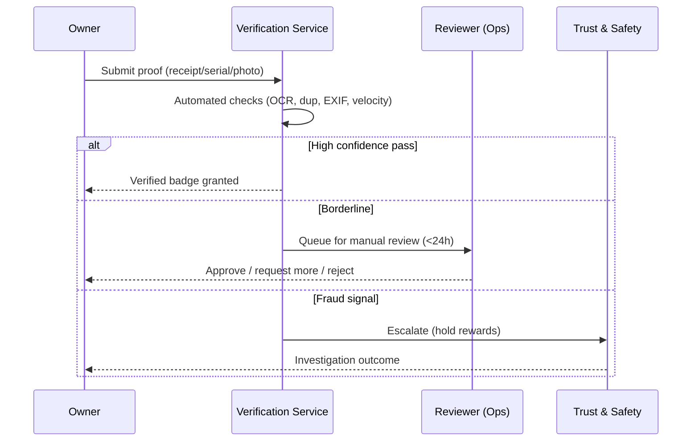

### Payout operations

(Introduced in v2; off-platform manual rewards in v0/v1.)

- **Eligibility:** verified + reputation threshold + clean fraud history; rewards funded **only** from realized, compliant affiliate/partner revenue ([commerce doc][commerce]).
- **Flow:** accrue → hold window (clawback for reversed/returned orders & fraud) → KYC/tax (W-9/W-8/1099 where applicable) → payout via provider → reconcile.
- **Controls:** maximum velocity caps, manual review above thresholds, dual-approval for large payouts, full ledger/audit.
- **Disputes:** clear appeal path; documented reasons for held/denied payouts.

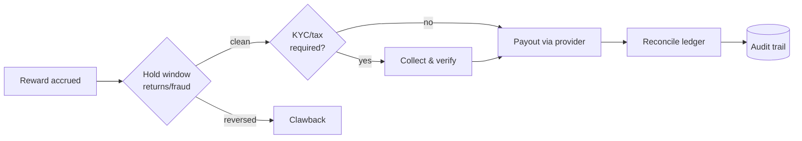

### Content quality review

- Sampling-based audits of answers for accuracy, helpfulness, and policy.
- Expert spot-checks for safety-critical categories (e.g., baby gear, e-bikes).
- Stale-content detection: flag answers tied to discontinued/changed SKUs for refresh; feed corrections into the knowledge graph ([AI doc][ai]).
- Quality scores feed owner reputation ([trust doc][trust]).

---

## Support workflows

- **Channels:** in-app help, email, help center; community for non-account issues.
- **Tiers:** T1 self-serve/macros → T2 specialist (verification, payouts) → T3 engineering/trust escalation.
- **SLAs:** first response < 24h (T1); payout/verification disputes < 48h; safety issues immediate.
- **Knowledge base** kept in sync with shipped features; deflection tracked as a KPI.

---

## Incident response

- **Severity levels:** SEV1 (outage, data breach, mass fraud, payout error at scale) → SEV3 (minor/cosmetic).
- **On-call rotation** with paging for SEV1/SEV2; defined RACI.
- **Lifecycle:** detect → declare → mitigate → communicate (status page) → resolve → blameless postmortem → action items into backlog (see [Implementation backlog](#implementation-backlog-epics)).
- **Security/privacy incidents** follow breach-notification obligations ([commerce doc][commerce]).

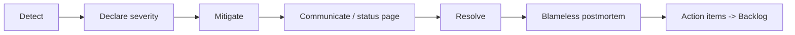

---

## Launch plan & beta program

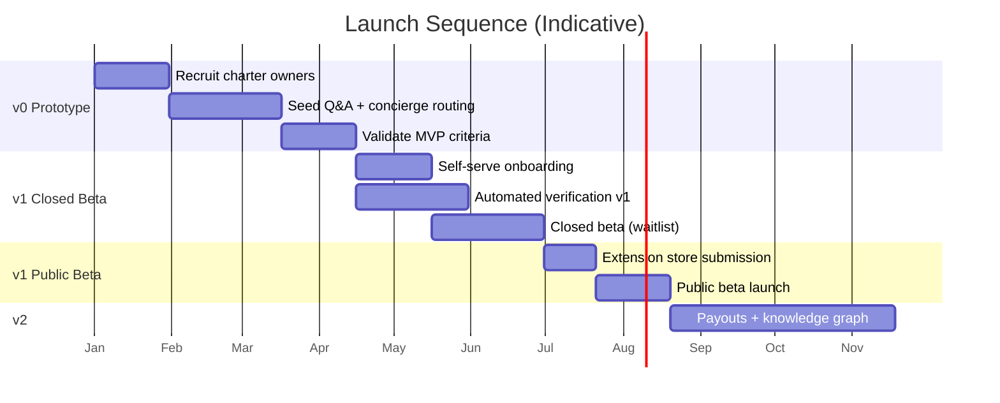

**Beta program structure:**

1. **Charter Owners (v0):** ~50–200 hand-picked, fast-lane verified, recognition-driven; tight feedback loop.
2. **Closed Beta (v1):** waitlisted shoppers + owners in the wedge category; weekly cohort reviews against [MVP acceptance criteria](#mvp-acceptance-criteria).
3. **Public Beta (v1):** extension live in one store; controlled category expansion only after liquidity holds.
4. **Feedback channels:** in-app NPS, owner & shopper interviews, support-ticket themes → backlog (see [Implementation backlog](#implementation-backlog-epics)).

**Category wedge launch examples:** lead with one (e.g., **robot vacuums** or **e-bikes**), prove the
loop, then expand to adjacent enthusiast categories that share owner communities and SEO surface area
(see [Category wedge selection](#category-wedge-selection)).

---

## Launch readiness acceptance criteria

Public launch (v1 → GA) is approved when **all** are satisfied:

**Product & quality**

- [ ] **LR-1:** All [MVP acceptance criteria](#mvp-acceptance-criteria) sustained ≥ 4 weeks.
- [ ] **LR-2:** TTFA p50 < 6h and p90 < 24h under live load.
- [ ] **LR-3:** Existing-content reuse ≥ 30%; helpfulness ≥ 4.0/5.

**Trust & safety**

- [ ] **LR-4:** Verification automated path live; manual SLA < 24h; fraud rate < 1% ([trust doc][trust]).
- [ ] **LR-5:** Moderation queues meet SLA; appeals path live; reason-code audit trail (see [Moderation operations](#moderation-operations)).

**Compliance & legal**

- [ ] **LR-6:** Affiliate disclosures present and audited; no paid answer-editing ([commerce doc][commerce]).
- [ ] **LR-7:** Privacy: verification artifacts encrypted, minimized, auto-purged; DSR process live.
- [ ] **LR-8:** Safety-critical category guardrails (disclaimers, expert review) in place where applicable.

**Operations & reliability**

- [ ] **LR-9:** Analytics 100% funnel coverage; dashboards reconciled (see [Analytics & KPI instrumentation](#analytics--kpi-instrumentation)).
- [ ] **LR-10:** On-call, status page, SEV runbooks, and one rehearsed incident drill complete (see [Incident response](#incident-response)).
- [ ] **LR-11:** Extension passes target browser store policy review; minimal-permission posture ([UX & extension][ux]).
- [ ] **LR-12:** Support channels staffed; KB synced; first-response SLA < 24h (see [Support workflows](#support-workflows)).

**Business**

- [ ] **LR-13:** Per-category liquidity ratio (answered/asked) ≥ 0.7.
- [ ] **LR-14:** Positive or clear path to positive contribution margin in seed category modeled ([foundation doc][foundation]).

---

## Risk register

Severity (S) and Likelihood (L): **H/M/L**. Priority = function of both. Owners are roles, not
individuals.

| ID | Risk | Category | S | L | Mitigations | Owner |
|----|------|----------|---|---|-------------|-------|
| R1 | **Fake "verified" owners / verification spoofing** | Trust | H | M | Layered verification, EXIF/dup detection, velocity & device clustering, re-verification, reward holds ([trust doc][trust]) | Trust & Safety |
| R2 | **Incentive farming / low-quality answer spam** | Trust | H | H | Reputation gating, quality-weighted rewards, clawbacks, rate limits ([trust doc][trust]) | Trust & Safety |
| R3 | **Cold-start failure (no liquidity)** | Growth | H | M | Per-category wedge, charter owners, concierge routing, seeded Q&A (see [Cold-start & GTM](#cold-start--go-to-market)) | Growth |
| R4 | **Owners won't answer without cash** | Growth | H | M | Recognition systems, fast feedback, expert status; introduce rewards v2 | Growth |
| R5 | **Affiliate compliance / FTC disclosure failures** | Legal | H | M | Mandatory disclosures, no paid answer-editing, audited ([commerce doc][commerce]) | Legal |
| R6 | **Privacy/data breach of verification artifacts** | Security | H | L | Encryption, data minimization, auto-purge, access controls, pen tests | Security |
| R7 | **Affiliate program ToS bans / link breakage** | Monetization | M | M | Diversify merchants, direct partnerships, monitor link health | BizDev |
| R8 | **Browser store policy rejection/removal** | Distribution | H | M | Strict policy compliance, minimal permissions, web-widget fallback ([UX & extension][ux]) | Eng |
| R9 | **Liability from harmful/wrong answers (safety categories)** | Legal | H | M | Disclaimers, expert review, safety-category policies, no medical/legal advice | Legal |
| R10 | **Brand/manufacturer pressure to suppress negative answers** | Trust | M | M | Editorial firewall, transparent policy, no answer suppression for pay | Policy |
| R11 | **Defamation / off-platform abuse via answers** | Legal | M | M | Reporting, moderation, takedown process, identity protections | Trust & Safety |
| R12 | **Scaling moderation cost** | Ops | M | H | Automation-first triage, community flagging, reputation auto-actions | Ops |
| R13 | **SEO/algorithm dependence for demand** | Growth | M | M | Diversify channels (extension, creators, embeds, partners) | Growth |
| R14 | **Payout fraud / clawback failure** | Finance | H | M | Hold windows, dual approval, KYC, ledger audit (see [Payout operations](#payout-operations)) | Finance |
| R15 | **Knowledge-graph data quality decay** | Product | M | M | Stale detection, audits, entity-resolution QA ([AI doc][ai]) | Data |
| R16 | **Key-person / single-category concentration** | Strategy | M | M | Document playbooks, sequence multi-category expansion | Leadership |

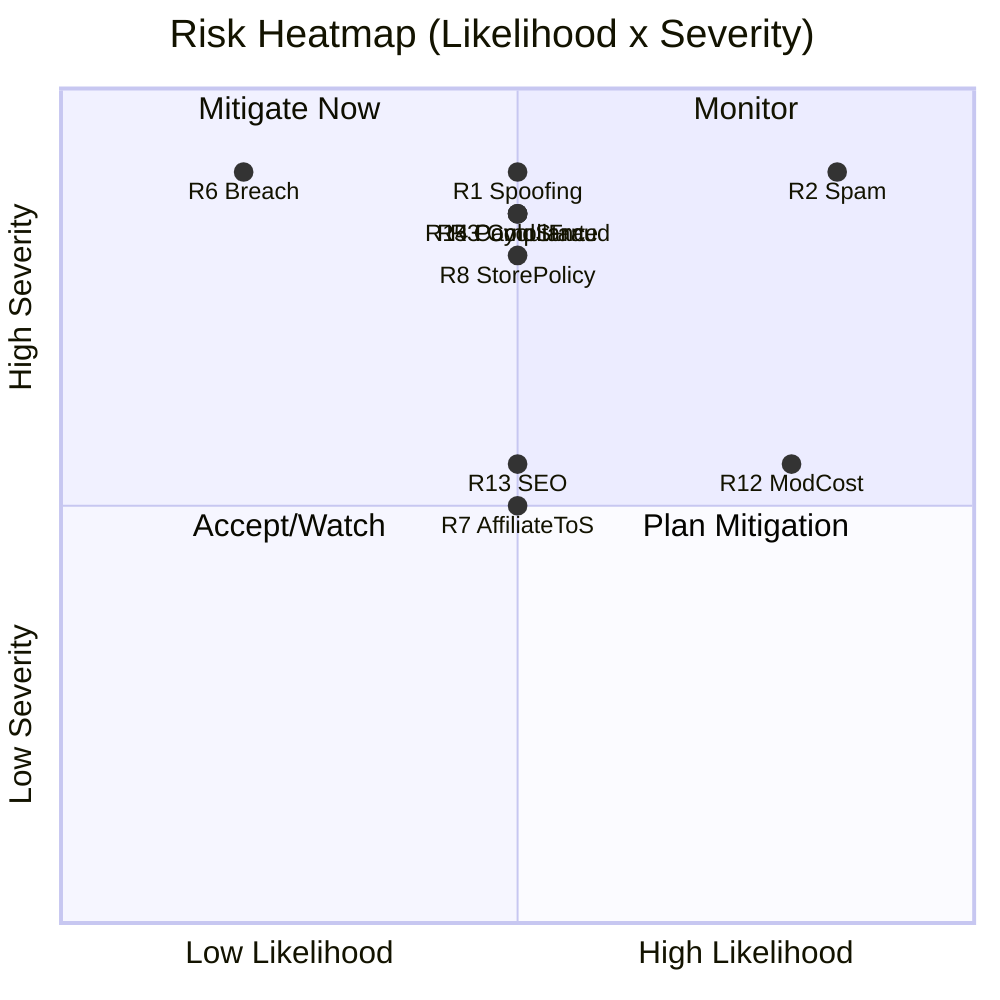

---

## Open questions

> These require explicit decisions before or during the indicated phase. Track resolution in the
> weekly/monthly review cadence (see [Dashboards & review cadence](#dashboards--review-cadence)).

| # | Open question | Phase needed | Owner | Default / leaning |
|---|---------------|--------------|-------|-------------------|
| Q1 | Which **single category** is the launch wedge? | v0 | Growth | **Resolved:** Amazon.com earbuds / US |
| Q2 | **Recognition-only vs. cash** rewards at launch? | v0 | Product | **Resolved:** recognition only; cash deferred |
| Q3 | Minimum-viable **verification method(s)** for MVP? | v0 | Trust | **Resolved:** user-initiated Amazon Orders scan; no credentials stored |
| Q4 | **Anonymity model** for owners (handle vs. real name)? | v1 | Policy | **Resolved for v0:** pseudonymous handle + verified badge |
| Q5 | How are **conflicts of interest / sponsorship** disclosed without eroding trust? | v1 | Legal/Policy | Explicit labels; no answer editing |
| Q6 | **Payout funding rule** — only realized affiliate revenue, or subsidized to bootstrap? | v2 | Finance | Realized revenue only |
| Q7 | **KYC threshold** and tax handling jurisdictions? | v2 | Finance/Legal | KYC above payout threshold; 1099/W-8 |
| Q8 | **Graph ownership & data rights** — who owns contributed Q&A; licensing to partners? | v2/v3 | Legal | Platform license; contributor attribution |
| Q9 | **Brand dashboard** boundaries — what insights are sellable vs. privacy-sensitive? | v3 | Legal/Product | Aggregated, anonymized only |
| Q10 | **Safety-critical categories** — do we allow them, with what guardrails? | v1 | Legal | Allow with disclaimers + expert review |
| Q11 | **Extension vs. embed vs. PWA** primary surface long-term? | v1/v3 | Product | **Resolved for v0:** Chrome MV3 extension; embeds later |
| Q12 | **Moderation: in-house vs. outsourced** as volume scales? | v2 | Ops | Hybrid: automation + in-house core |
| Q13 | **Pricing model** for partners (rev-share, SaaS, hybrid)? | v3 | BizDev | Hybrid |
| Q14 | How do we prevent **AI-generated fake "owner" answers**? | v1+ | Trust | Verification + behavioral signals |

### AI open questions

1. **Failure-rate disclosure** — how prominently to surface self-report bias caveats without undermining the (genuine) signal value? Coordinate with the [trust doc][trust].
2. **Owner update cadence incentives** — how do longitudinal-update incentives interact with payout compliance ([commerce doc][commerce]) without encouraging low-quality "still good" spam?
3. **Canonicalization authority** — who owns final merge decisions for ambiguous cross-retailer products, and what SLA does the human queue need?
4. **Model/provider portability** — abstraction layer so routing, caching, and eval stay provider-agnostic as models change ([AI doc][ai]).
5. **Multilingual grounding** — strategy for owner content and answers across languages while preserving citation fidelity.

### Commerce, privacy & legal open questions

These are owned by the [commerce doc][commerce]; tracked here for roadmap sequencing:

1. Which affiliate programs/retailers are in scope for Phase 1, and which permit extension behavior at all? (Needs the Program Terms Register populated.)
2. Build vs. buy for KYC/tax/sanctions and for payout PSP — confirm vendor and supported payout geographies.
3. Cashback and post-purchase attribution: legal/program feasibility per market.
4. Aggregate-analytics product: minimum cohort size / suppression thresholds and whether it requires separate consent.
5. Minors policy and age-gating mechanism — needed before any monetized profiling.
6. Sponsored Q&A labeling standard — final copy and placement, validated against endorsement rules.
7. Insurance/warranty: which licensed underwriters, in which states/countries.

---

## Implementation backlog (epics)

> Structured so a future fleet (e.g., a Claude Opus fleet-mode run) can pick up epics independently.
> Each epic lists intent, key stories, dependencies, instrumentation, and acceptance. IDs are stable
> references. Design details live in the linked sibling docs; this backlog is the **build order**.

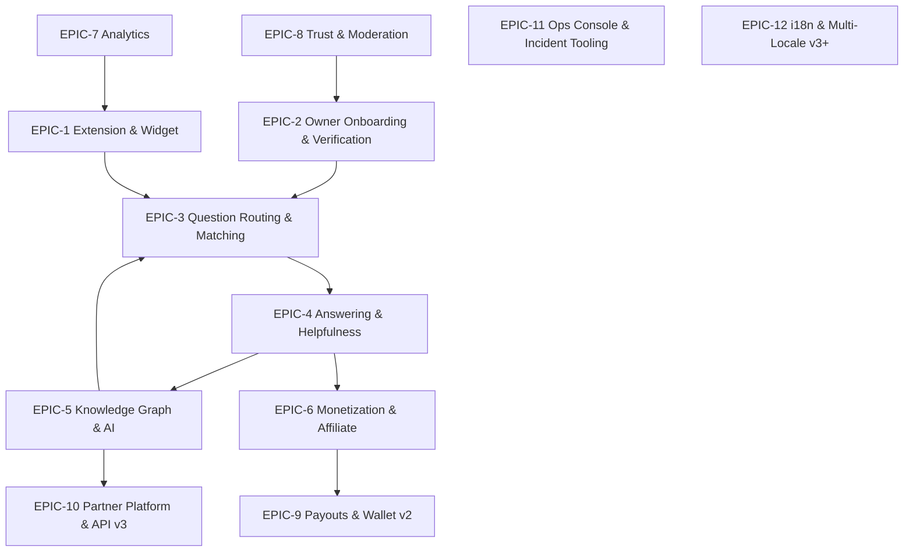

### EPIC-1 — Browser Extension & Web Widget (Shopper Ask Surface)

- **Intent:** Let shoppers see/ask owner questions on retailer PDPs.
- **Stories:** PDP detection & product matching; ask composer; existing-Q&A surfacing; auth-lite; minimal permissions.
- **Depends on:** EPIC-3 (matching), EPIC-7 (analytics).
- **Events:** `extension_activated`, `question_viewed`, `question_asked`, `intent_deflected`.
- **Acceptance:** Activates on seed retailers; ask flow < 30s; passes store policy review ([UX & extension][ux]).

### EPIC-2 — Owner Onboarding & Verification

- **Intent:** Recruit and verify owners with low friction, high trust.
- **Stories:** signup; method ladder (receipt/serial/photo-token/OAuth); reviewer console; re-verification; fraud signals.
- **Depends on:** EPIC-8 (trust signals), Security.
- **Events:** `verification_started/completed/failed`.
- **Acceptance:** < 40% abandonment; automated pass for high-confidence; < 24h manual SLA ([trust doc][trust]).

### EPIC-3 — Question Routing & Matching

- **Intent:** Route a question to the best available verified owners; surface existing answers first.
- **Stories:** product/entity resolution; owner-question matching; notification fan-out; dedup/merge of similar questions.
- **Depends on:** EPIC-2, EPIC-5.
- **Events:** `question_routed`, `intent_deflected`.
- **Acceptance:** ≥ 80% of questions routed to ≥ 1 relevant owner; median route < 5 min.

### EPIC-4 — Answering, Threading & Helpfulness Signals

- **Intent:** Owners answer; shoppers rate; quality is captured.
- **Stories:** answer composer; threads; upvotes/"this helped"; decision-influence survey; owner profiles & verified badge.
- **Events:** `answer_submitted`, `answer_rated`, `decision_influenced`.
- **Acceptance:** TTFA p50 < 6h; helpfulness ≥ 4.0/5 (see [MVP acceptance criteria](#mvp-acceptance-criteria)).

### EPIC-5 — Knowledge Graph & AI Retrieval

- **Intent:** Turn answers into a reusable, queryable graph; pre-answer repeat intents.
- **Stories:** entity resolution (product/model/owner/attribute); Q&A linking; structured attributes; retrieval + citation; stale detection.
- **Depends on:** EPIC-4 data.
- **Events:** `intent_deflected`, graph-quality metrics.
- **Acceptance:** ≥ 40% reuse at v2; cited owner sources ([AI doc][ai]).

### EPIC-6 — Monetization & Affiliate Attribution

- **Intent:** Compliant revenue from affiliate/partner programs.
- **Stories:** link attachment + disclosure; click/conversion attribution; merchant diversification; partner deal plumbing.
- **Depends on:** Legal (disclosures).
- **Events:** `affiliate_click`, `affiliate_conversion`.
- **Acceptance:** End-to-end attribution; disclosures present ([commerce doc][commerce]).

### EPIC-7 — Analytics & Experimentation

- **Intent:** Instrument the funnel; enable A/B.
- **Stories:** event SDK; metric tree dashboards; cohort retention; experiment framework; data reconciliation.
- **Acceptance:** 100% funnel coverage; dashboards live (see [Analytics & KPI instrumentation](#analytics--kpi-instrumentation)).

### EPIC-8 — Trust, Safety & Moderation Tooling

- **Intent:** Keep content trustworthy and abuse-controlled.
- **Stories:** automated filters; moderator console; reason codes; appeals; reputation system; reward clawbacks.
- **Events:** `content_flagged`, `content_removed`.
- **Acceptance:** SLA queues met; removal rate < 10% ([trust doc][trust]).

### EPIC-9 — Payouts, Wallet & Compliance (v2)

- **Intent:** Pay contributors safely and lawfully.
- **Stories:** wallet/ledger; hold windows & clawbacks; KYC/tax; payout provider integration; dual approval; audit.
- **Events:** `payout_requested`, `payout_completed`.
- **Acceptance:** Reconciled ledger; fraud controls; tax compliance (see [Payout operations](#payout-operations)).

### EPIC-10 — Partner Platform, Dashboards & API (v3)

- **Intent:** Monetize the graph; enable embeds.
- **Stories:** brand/retailer dashboards (aggregated, anonymized); public API/SDK; rev-share; rate limits & auth.
- **Acceptance:** ≥ 3 partners live; privacy boundaries enforced ([architecture doc][architecture]).

### EPIC-11 — Operations Console & Incident Tooling

- **Intent:** Run daily ops and incidents reliably.
- **Stories:** ops dashboard (queues/backlogs); on-call & paging; status page; postmortem workflow.
- **Acceptance:** SLAs visible; SEV process exercised (see [Incident response](#incident-response)).

### EPIC-12 — Internationalization & Multi-Locale (v3+)

- **Intent:** Expand beyond initial locale.
- **Stories:** i18n; locale-aware moderation; regional compliance; currency for payouts.
- **Acceptance:** ≥ 1 additional locale live with localized moderation.

---

<!--
  Sibling document link references. If the split doc filenames change, update these targets only.
  All in-document cross-links above use these labels so there is a single source of truth.
-->
[foundation]: ./02-foundation-and-components.md
[personas]: ./01-user-persona-flows.md
[ux]: ./03-ux-extension-and-community.md
[trust]: ./05-trust-verification-incentives-and-fraud.md
[ai]: ./06-ai-and-product-knowledge-graph.md
[commerce]: ./07-commerce-privacy-security-and-legal.md
[mvp]: ./09-mvp-implementation-spec.md
[architecture]: ./04-architecture-data-and-apis.md
