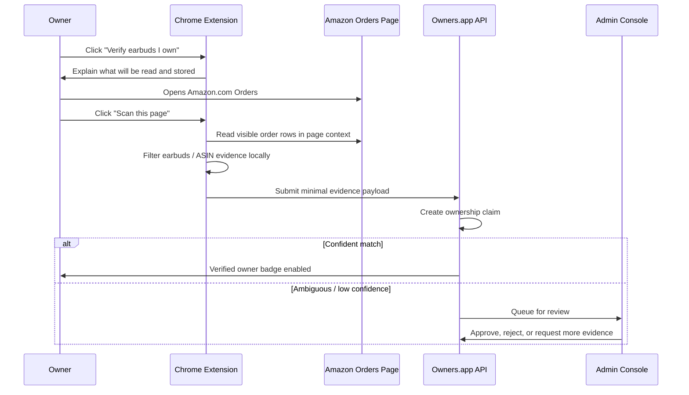
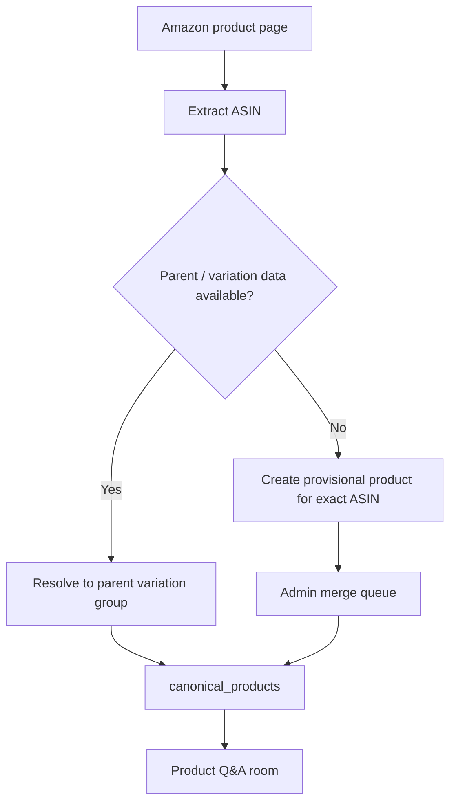
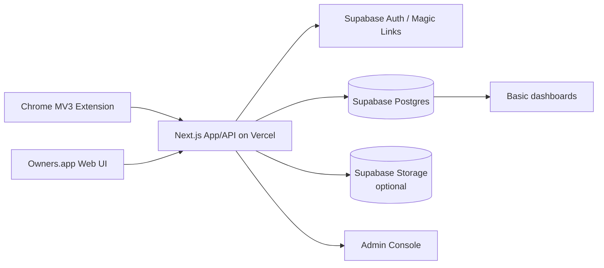
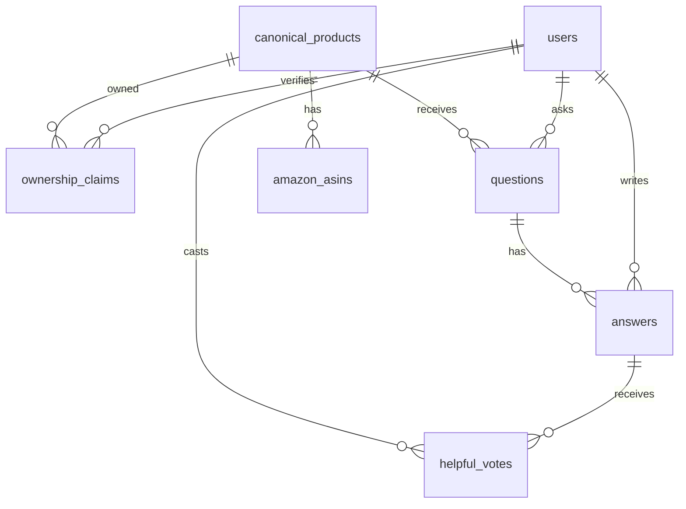

# 09 — MVP Implementation Spec

> **Purpose.** This document converts the product/design set into an explicit v0 build contract. It
> locks the first retailer, category, stack, verification approach, commerce posture, and deferred
> systems so implementation agents can build end-to-end without re-litigating scope.

## Related documents

- [01 — User Persona Flows](./01-user-persona-flows.md) — shopper and verified-owner experience.
- [02 — Foundation & Components](./02-foundation-and-components.md) — strategy, principles, and component map.
- [03 — UX, Extension & Community](./03-ux-extension-and-community.md) — screen-level UX and extension behavior.
- [04 — Architecture, Data & APIs](./04-architecture-data-and-apis.md) — target architecture and contracts.
- [05 — Trust, Verification, Incentives & Fraud](./05-trust-verification-incentives-and-fraud.md) — verification and abuse controls.
- [06 — AI & Product Knowledge Graph](./06-ai-and-product-knowledge-graph.md) — target AI/graph design, deferred for v0.
- [07 — Commerce, Privacy, Security & Legal](./07-commerce-privacy-security-and-legal.md) — commerce, privacy, and legal gates.
- [08 — Roadmap, Operations, Risks & Backlog](./08-roadmap-operations-risks-and-backlog.md) — sequencing, risks, and epics.

---

## 1. Locked MVP decisions

| Area | v0 decision | Notes |
|---|---|---|
| Retailer | **Amazon.com / United States** | Single marketplace only. No international Amazon domains in v0. |
| Product category | **Earbuds** | Start with wireless earbuds / in-ear audio products sold on Amazon.com. |
| Browser | **Chrome Manifest V3 only** | Other Chromium browsers and Firefox are deferred. |
| Shopper surface | **Chrome extension on Amazon product pages** | Extension runs only where needed and stays calm by default. |
| Verification surface | **User-initiated scan on Amazon Orders pages** | User opens Amazon purchase history and clicks Verify; no credential collection. |
| Commerce | **No live affiliate tag in v0** | Use a disclosed normal Amazon handoff/link and measure intent only. |
| Interaction model | **Async Q&A first** | Realtime presence/notifications where available; true live chat rooms deferred. |
| AI | **Stubbed/deferred** | Searchable prior Q&A and human-written/admin summaries only. No AI answer generation. |
| Rewards | **Recognition only** | Verified badge, helpfulness, and status/leaderboard. No cash payouts. |
| Identity | **Email magic link** | Same auth for shoppers and owners. |
| Public owner identity | **Pseudonymous handle + verified badge** | Never show real name, order id, or purchase details publicly. |
| Data model | **Relational first** | `canonical_products`, `amazon_asins`, `ownership_claims`, `questions`, `answers`; graph/vector deferred. |
| Stack | **TypeScript full-stack** | Chrome MV3 extension + Next.js app/API + PostgreSQL. |
| Hosting/services | **Vercel + Supabase** | Vercel for Next.js; Supabase for Postgres/Auth/storage where useful. |
| Moderation | **Manual admin queue + reports + rate limits** | No automated enforcement beyond rate limits in v0. |
| Admin | **Minimal admin console** | Product merges, verification review, moderation queue, and metrics. |
| Owner acquisition | **Manual beta recruitment** | Recruit earbud owners from personal networks/forums; verify via Amazon Orders scan. |

---

## 2. MVP product cut-line

### In scope

1. Chrome MV3 extension detects Amazon.com earbud product detail pages.
2. Extension extracts Amazon identifiers needed for product lookup, including ASIN and parent/variation data when available.
3. Product pages resolve to canonical earbud products, grouping color/storage/model variants using Amazon parent/variation data.
4. Shoppers can open a sidebar, see existing verified-owner Q&A, ask a question, and receive async notifications.
5. Owners sign in with email magic link, open Amazon Orders, and trigger an explicit verification scan.
6. Owners who pass verification can answer questions for products they own.
7. Public owner identity is pseudonymous and includes a verified-owner badge.
8. Users can upvote, mark an answer helpful, report content, and see basic answer status.
9. Admins can review ambiguous product merges, verification exceptions, reported content, and core metrics.
10. Commerce is limited to a normal disclosed Amazon handoff/link with no affiliate tag.
11. Analytics capture the full ask -> verify -> answer -> helpfulness -> handoff funnel.

### Out of scope

1. Live affiliate monetization or automated affiliate tag injection.
2. Reloading Amazon pages with affiliate links.
3. DOM overlays that obscure or modify Amazon checkout, reviews, ratings, prices, or cart.
4. Automated contributor payouts, wallets, KYC, tax, or sanctions workflows.
5. Full AI/RAG, embeddings, vector search, model routing, AI answer generation, or AI moderation decisions.
6. Dedicated graph database or graph/vector production infrastructure.
7. Multi-retailer support, non-US Amazon marketplaces, and non-earbud categories.
8. Native mobile apps.
9. Manufacturer/brand dashboards.
10. Advanced reputation/levels beyond basic verified badge and helpfulness/status.

---

## 3. Safe Amazon verification flow

The MVP verification model is **user-initiated, scoped, minimal, and revocable**.



### Extension constraints

- The extension runs on Amazon Orders pages **only after explicit user action**.
- The extension must not collect, request, store, or transmit Amazon credentials.
- The extension must not scrape unrelated order categories once the user chooses earbuds verification.
- The extension must provide a clear preview or explanation of what evidence will be submitted.
- The user can delete ownership claims and revoke extension permissions.

### Evidence stored

Store only the minimum normalized evidence needed for a trustworthy ownership claim:

| Field | Store? | Reason |
|---|---:|---|
| Amazon ASIN | Yes | Product ownership matching. |
| Amazon parent ASIN / variation group | Yes, when available | Canonical product grouping. |
| Product title snippet | Optional/minimized | Human admin review if ASIN lookup fails. |
| Purchase month/year | Yes | Longevity signal without exact date exposure. |
| Hashed order id | Yes | Duplicate/fraud detection without storing raw order id. |
| Verification timestamp | Yes | Claim lifecycle and revocation. |
| Full order id | No | Avoid unnecessary sensitive data. |
| Price | No | Not needed for v0 verification. |
| Shipping address | No | Prohibited in v0 evidence payload. |
| Payment method | No | Prohibited in v0 evidence payload. |
| Full order page screenshot | No by default | Manual exception only if explicitly requested later. |

### Evidence payload sketch

```json
{
  "retailer": "amazon",
  "marketplace": "US",
  "asin": "B0EXAMPLE",
  "parentAsin": "B0PARENT",
  "purchaseMonth": "2025-11",
  "hashedOrderId": "sha256:...",
  "verificationMethod": "amazon_orders_user_initiated_scan",
  "capturedAt": "2026-06-30T00:00:00Z",
  "extensionVersion": "0.1.0"
}
```

---

## 4. Amazon earbuds product resolution

The MVP should treat **canonical product grouping** as important from day one, but keep implementation
simple.



### Resolution rules

1. If Amazon exposes parent/variation data, group variants under one `canonical_product`.
2. If only an ASIN is available, create or resolve an exact-ASIN provisional product.
3. Admins can merge provisional products into a canonical product.
4. Questions and answers should attach to the canonical product, while preserving source ASIN metadata.
5. The UI may show variant context, but Q&A should default to the canonical earbud model when safe.

---

## 5. v0 system architecture



### Repository shape

The initial implementation can be a TypeScript monorepo:

```text
apps/
  extension/        Chrome MV3 extension
  web/              Next.js app, API routes, admin console
packages/
  shared/           Shared types, validation schemas, product utilities
  db/               SQL migrations, typed DB helpers
docs/
  01-...09-...      Product/design docs
```

### Core routes

| Route | Purpose |
|---|---|
| `/` | Product overview / waitlist / sign-in entry. |
| `/products/[canonicalProductId]` | Public product Q&A page. |
| `/products/[canonicalProductId]/ask` | Ask flow entry point. |
| `/owner/verify` | Owner verification instructions and status. |
| `/owner/dashboard` | Owner questions, answers, helpfulness, verified products. |
| `/admin` | Minimal admin home. |
| `/admin/products` | Product merge / canonicalization queue. |
| `/admin/verifications` | Ambiguous verification review queue. |
| `/admin/moderation` | Reports and moderation queue. |
| `/admin/metrics` | Funnel and quality metrics. |

### API endpoints

| Endpoint | Method | Purpose |
|---|---|---|
| `/api/products/resolve` | `POST` | Resolve Amazon ASIN / parent ASIN into a canonical product. |
| `/api/questions` | `POST` | Create a shopper question. |
| `/api/products/:id/questions` | `GET` | List Q&A for a canonical product. |
| `/api/answers` | `POST` | Post an owner answer; requires verified ownership claim. |
| `/api/ownership/claims` | `POST` | Submit minimal Amazon Orders verification evidence. |
| `/api/ownership/claims/:id` | `GET` | Check claim status. |
| `/api/feedback/helpful` | `POST` | Mark answer helpful / not helpful. |
| `/api/reports` | `POST` | Report question, answer, or profile. |
| `/api/events` | `POST` | Analytics event ingestion. |

---

## 6. v0 relational data model

The MVP uses PostgreSQL as the system of record. A graph database, vector index, and AI retrieval
pipeline remain target-state concepts, not v0 dependencies.



### Tables

| Table | Purpose |
|---|---|
| `users` | Supabase-authenticated user profiles, pseudonymous handles, role flags. |
| `canonical_products` | Earbud product records grouped across Amazon variants. |
| `amazon_asins` | ASIN and parent-ASIN mapping to canonical products. |
| `ownership_claims` | Minimal verification claims from user-initiated Amazon Orders scan. |
| `questions` | Shopper questions attached to canonical products. |
| `answers` | Verified-owner answers attached to questions and ownership claims. |
| `helpful_votes` | Shopper/reader feedback on answer helpfulness. |
| `reports` | User reports for moderation. |
| `admin_actions` | Audit log for merges, verification decisions, moderation decisions. |
| `analytics_events` | Funnel events for MVP validation. |

### Enforcement rules

1. `answers.user_id` must have an approved `ownership_claim` for the question's `canonical_product_id`.
2. Public views must never expose raw `hashed_order_id`, raw order evidence, or private admin notes.
3. Product merges must preserve all source ASINs and Q&A references.
4. Deleting or revoking an ownership claim prevents new verified answers, but does not silently rewrite historical answers; historical display should show the claim status accurately.

---

## 7. Extension behavior

### Product page behavior

1. Run only on Amazon.com product detail pages.
2. Extract ASIN and variation/parent ASIN data when available.
3. Ask the API whether Owners.app has a canonical product and Q&A for the product.
4. Display a calm badge only when there is useful content or an explicit ask action.
5. Open the sidebar on user click.
6. Never alter Amazon price, rating, review, cart, checkout, or buy box UI.
7. Never reload the page to attach an affiliate tag.

### Orders page verification behavior

1. Run only on Amazon.com Orders pages after the owner starts verification.
2. Explain the evidence model before scanning.
3. Extract only visible order rows needed to identify earbud ownership.
4. Filter locally, submit minimal normalized evidence, and show claim status.
5. Provide a cancel path before submission and a deletion path after submission.

---

## 8. Commerce and rewards

### v0 commerce posture

The MVP uses the safest commerce model:

- No affiliate tag in v0.
- No link replacement.
- No page reload for attribution.
- No cashback.
- No conversion-based owner payouts.
- No claims that a purchase will generate owner revenue.

The product may still show a disclosed **"Continue to Amazon"** handoff button that opens the normal
Amazon product page and records an internal `commerce_handoff_clicked` analytics event.

### v0 rewards

Owners receive recognition only:

- Verified owner badge.
- Helpfulness count/rating.
- "Top helper" status in the beta category.
- Owner dashboard showing questions answered and helpful feedback.

Cash payouts, KYC, tax handling, wallets, and affiliate-funded reward pools are deferred until the
commerce model is legally/programmatically cleared.

---

## 9. AI and knowledge graph deferral

The target product remains a verified ownership knowledge graph with AI summaries and semantic search,
but v0 should not depend on those systems.

### v0 substitutes

| Target capability | v0 substitute |
|---|---|
| AI product summary | Admin-written or simple templated summary from Q&A counts. |
| RAG search | Basic keyword search over questions/answers. |
| Semantic recommendations | Not shipped. |
| AI moderation | Manual reports + admin queue + rate limits. |
| Graph database | Relational canonical product tables. |
| Vector index | Deferred. |

### Guardrail

No UI should imply that an answer was generated by an owner unless it was written by a verified owner.

---

## 10. Admin console minimum

The minimal admin console exists to keep the MVP trustworthy without overbuilding automation.

| Admin area | Required actions |
|---|---|
| Product merges | Review provisional products, merge ASINs, undo merge with audit trail. |
| Verification review | Approve/reject ambiguous claims; request more evidence if a future fallback exists. |
| Moderation | Review reports, hide content, restore content, suspend accounts, rate-limit abusers. |
| Metrics | Track funnel, answer latency, verification pass rate, helpfulness, reports, handoffs. |

Every admin action must write to `admin_actions` with actor, target, action, reason, and timestamp.

---

## 11. Analytics events

| Event | Trigger |
|---|---|
| `extension_installed` | User installs Chrome extension. |
| `amazon_product_detected` | Extension detects Amazon.com product page. |
| `sidebar_opened` | Shopper opens Owners.app sidebar. |
| `question_started` | Shopper begins ask flow. |
| `question_submitted` | Shopper submits question. |
| `owner_verification_started` | Owner starts Amazon Orders verification. |
| `amazon_orders_scan_started` | Owner clicks scan on Orders page. |
| `ownership_claim_submitted` | Minimal evidence sent to server. |
| `ownership_claim_approved` | Claim approved automatically or manually. |
| `answer_submitted` | Verified owner posts answer. |
| `answer_marked_helpful` | Shopper marks answer helpful. |
| `content_reported` | User reports content. |
| `commerce_handoff_clicked` | Shopper clicks disclosed Amazon handoff. |

---

## 12. MVP acceptance criteria

The clarified MVP is ready for a closed beta when:

1. Chrome MV3 extension detects supported Amazon.com earbud product pages and opens the sidebar.
2. Amazon Orders verification is explicit, user-initiated, credential-free, and stores only the approved minimal evidence.
3. Verified owners can answer only for canonical earbud products they own.
4. Shoppers can ask async questions and receive answers on the web/extension surface.
5. Admins can review product merges, verification exceptions, reports, and core funnel metrics.
6. Commerce handoff uses no affiliate tag and never reloads/replaces Amazon links.
7. AI, payouts, vector search, graph DB, and multi-retailer support are absent or clearly stubbed.
8. All MVP funnel events are emitted and queryable.
9. Public owner identity is pseudonymous and never exposes Amazon order details.
10. The product can be run end-to-end locally and deployed to the chosen Vercel/Supabase environment.

---

## 13. Remaining decisions before implementation starts

These are narrower than the original design open questions and should be resolved during initial
scaffolding:

1. Exact Supabase schema/migration convention.
2. Whether Supabase Auth magic links are used directly or wrapped by Next.js auth helpers.
3. Initial seed list of Amazon earbud ASINs and parent ASINs.
4. Copy for the Amazon Orders verification consent screen.
5. Extension store privacy disclosure wording.
6. Whether owner beta recruitment is invite-code only or open waitlist.
7. Admin role bootstrap process for the first operator account.
